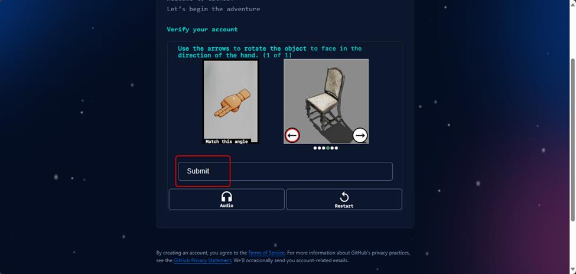
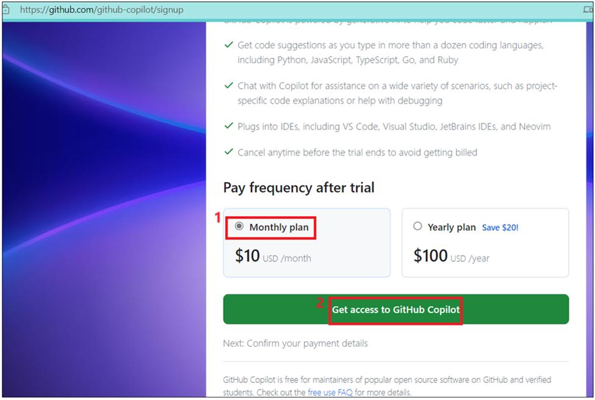
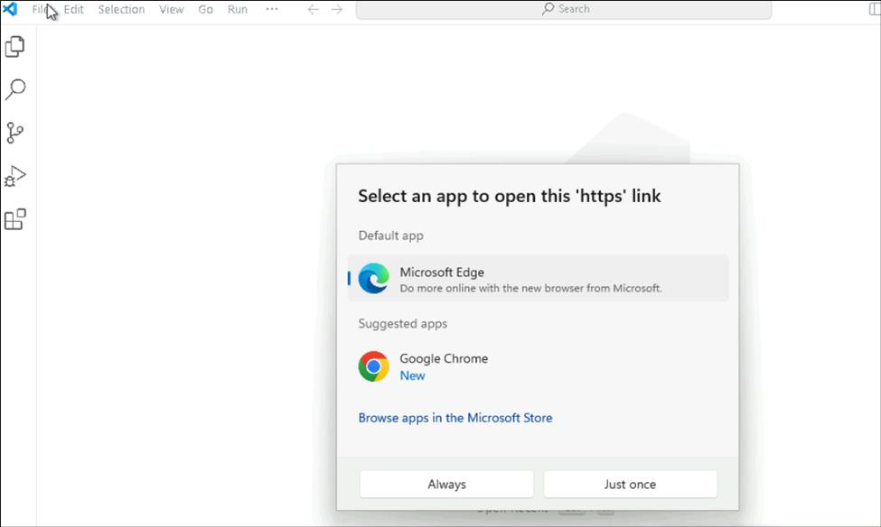

**실습 0: 실습 실행을 준비하기**

작업 1: GitHub 계정으로 로그인하기

참고: 이미 GitHub 계정을 생성한 경우 작업 1을 건너뛰고 작업 2로 시작할
수 있습니다.

1.  새 브라우저를 열고 <https://github.com/>로 이동하세요

2.  GitHub 홈페이지에 있는 sign up을 클릭하세요.

3.  이메일, 비밀번호 및 고유한 사용자 이름을 입력하고 continue를
    클릭하세요.

4.  다음 화면에서 계정을 확인하고 (퍼즐 풀기) Submit를 클릭하세요.

5.  퍼즐이 확인되면 이메일 확인 페이지로 이동합니다.

6.  사서함에서 받은 코드를 복사하여 확인 페이지에 붙여넣으세요.

7.  나이, 학생 같은 필요한 세부 정보를 선택하고 **Continue**를
    클릭하세요

8.  GitHub 계정에 성공적으로 로그인했습니다.

작업 2: GitHub Copilot Pro 체험판 라이선스에 등록하기 – 체험판 구독은
월별 무료 티어 한도를 소진할 때 필요합니다.

**참고:** GitHub는 기본적으로 Github.com 및 Visual Studio Code IDE의
모든 GitHub 사용자에게 GitHub Copilot 무료 계층을 제공하기 시작했습니다
(2024년 마지막 분기부터). 무료 계층에는 코드 완성 횟수 및 Copilot 채팅
상호 작용 측면에서 월별 사용 제한이 있습니다. 한도를 소진하면 Copilot
Pro 평가판에 등록하라는 메시지가 표시됩니다(평가판 제안을 아직 이용하지
않은 경우 아래 단계에 따라 가입할 수 있는 30일 평가판 구독). 청구되지
않도록 평가판이 종료되기 전에 라이선스를 취소해야 합니다.

1.  브라우저에 새 탭을 열고Signup to GitHub Copilot
    - [**https://github.com/github-copilot/signup**](https://github.com/github-copilot/signup)로
    이동하세요

2.  **Get access to GitHub Copilot** 버튼을 클릭하세요.

3.  개인 신용 카드로 청구 정보를 입력한 후 Save를 클릭하세요.

4.  개인 신용 카드로 청구 정보를 입력한 후**Save payment
    information** 버튼을 클릭하세요.

**중요:** 사용량에 대한 청구를 피하기 위해 실습을 완료한 후 계정을
비활성화해야 합니다.

작업 3: Visual Studio Code에서 필요한 확장 설치

1.  Windows Start 메뉴에서 Visual Studio Code를 여세요. **Accounts -\>
    Backup and Sync Settings**를 클릭하고 **Sign in**을 선택하세요**.**

2.  **Sign in with Github** 옵션을 선택하세요

3.  브라우저를 선택하고 Copilot 사용 Github 계정으로 로그인하세요.

4.  코드로 인증 및 확인하여 2단계 인증을 완료하세요.

5.  Visual Studio Code를 클릭하세요.

6.  Click on왼쪽 탐색 메뉴에서 Extension을 클릭하고 [**Github
    Copilot**](urn:gd:lg%F0%9F%85%B0%EF%B8%8Fsend-vm-keys)를
    검색하고 **Install**를 클릭하세요.

7.  **Docker**를 검색하고 Microsoft에서 설치하세요.

8.  **Extension Pack for JAVA**를 검색하고 선택하여 **install**하세요.

9.  **Jupyter**를 검색하고 선택하여 **install**하세요.

10. Python을 검색하고 Microsoft에서 선택하고 **install**하세요.

