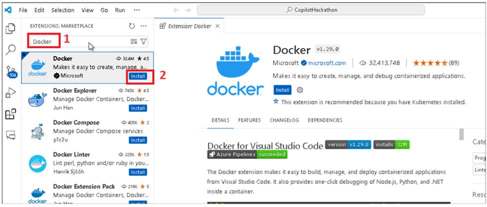

**实验室 0：准备实验室执行**

任务 1：注册 GitHub 帐户

注意：如果您已经创建了 GitHub 帐户，则可以跳过任务 1 并从任务 2 开始。

1.  打开新的浏览器选项卡并导航到 https://github.com/

2.  单击 GitHub 主页上的注册。

3.  输入您的电子邮件、密码和唯一的用户名，然后单击继续。

4.  在下一个屏幕上，验证您的帐户（解决难题）并单击提交。

5.  一旦拼图得到验证，您将被带到电子邮件验证页面。

6.  复制邮箱中收到的验证码并将其粘贴到验证页面中。

7.  选择所需的详细信息，如年龄、学生，然后单击 **Continue**

8.  您已成功注册 GitHub 帐户。

任务 2：注册 GitHub Copilot Pro 试用许可证 -
用尽每月免费层限制时，需要试用订阅。

**注意：**默认情况下，GitHub 开始向 Github.com 和 Visual Studio Code IDE
中的所有 GitHub 用户提供（从 2024 年最后一个季度开始）GitHub Copilot
免费层。免费套餐在代码完成次数和 Copilot
聊天交互方面有一些每月使用限制。用尽限制后，系统将提示您注册 Copilot Pro
试用版（如果您尚未使用试用优惠，则可以按照下面给出的步骤注册 30
天试用订阅）。请务必在试用期结束前取消许可证，以避免被计费。

1.  在浏览器中打开一个新选项卡，然后转到注册 GitHub Copilot -
    **https://github.com/github-copilot/signup**

2.  单击“**Get access to GitHub Copilot**”按钮。

3.  使用您的个人信用卡输入账单信息，然后单击 **Save**。

4.  输入您的账单信息，然后单击 **Save payment information** 按钮。 

**重要提示：**请务必在完成实验室后停用该帐户，以避免按使用量计费。

任务 3：在 Visual Studio Code 中安装所需的扩展

1.  从 Windows 的“Start”菜单 打开 Visual Studio Code 。**Accounts -\>
    Backup and Sync Settings**，然后选择 **Sign in**。

2.  选择“**Sign in with Github** ”选项

3.  选择浏览器并使用启用了 Copilot 的 Github 帐户登录。

4.  使用代码进行身份验证和验证以完成双因素身份验证。

5.  单击 Visual Studio Code。

6.  单击左侧导航菜单中的扩展，搜索 [**Github
    Copilot**](urn:gd:lg%F0%9F%85%B0%EF%B8%8Fsend-vm-keys)，选择它并单击
    **Install**。

7.  搜索 **Docker** 并从 Microsoft 安装它。

8.  搜索 **Extension Pack for JAVA**，选择它并**install **它。

9.  搜索 **Jupyter**，选择它并**install**它。

10. 搜索 Python，从 Microsoft 中选择一个并 **install** 它。

