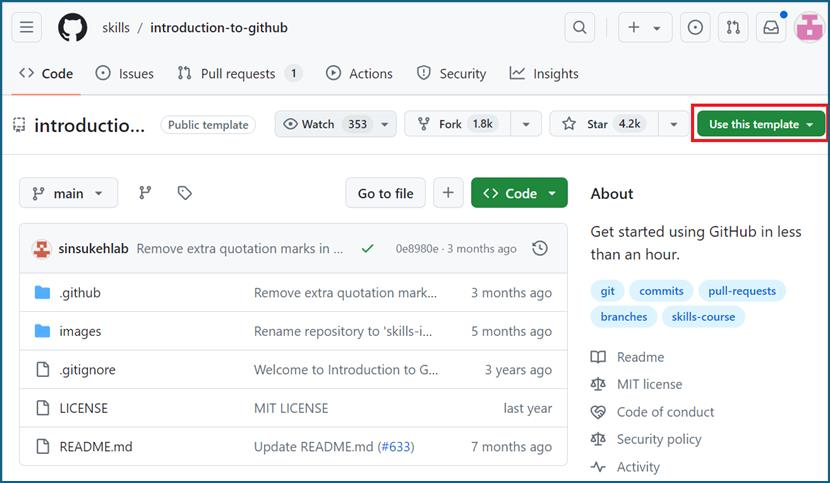
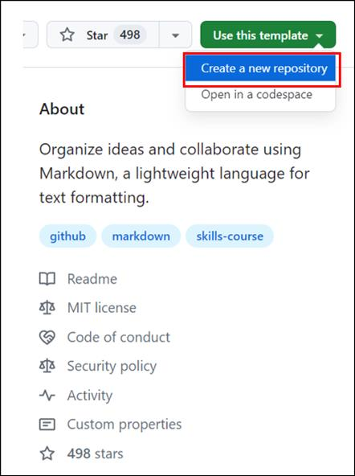
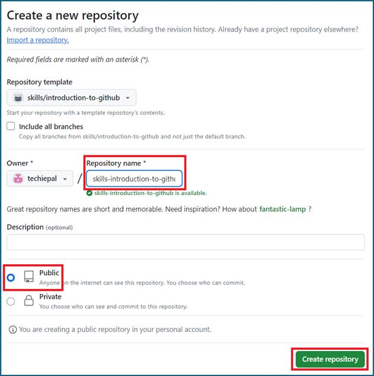
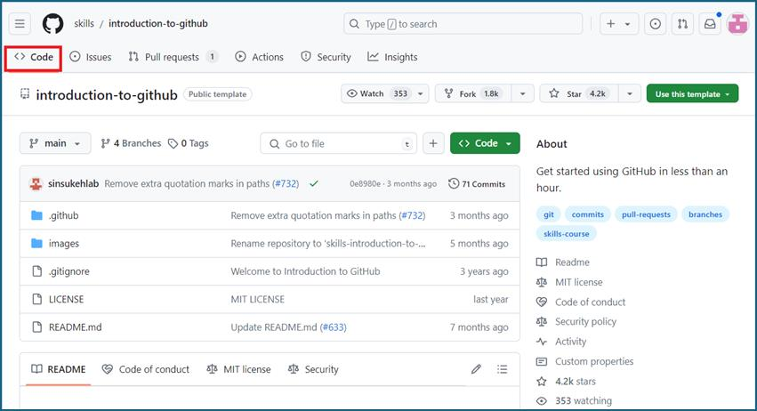
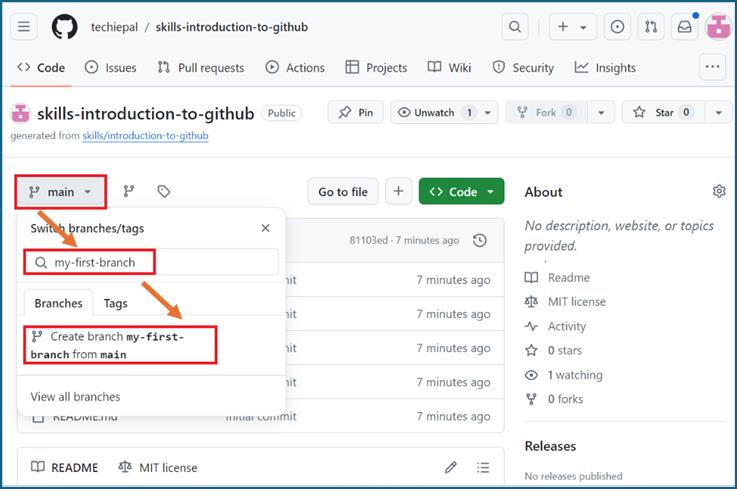
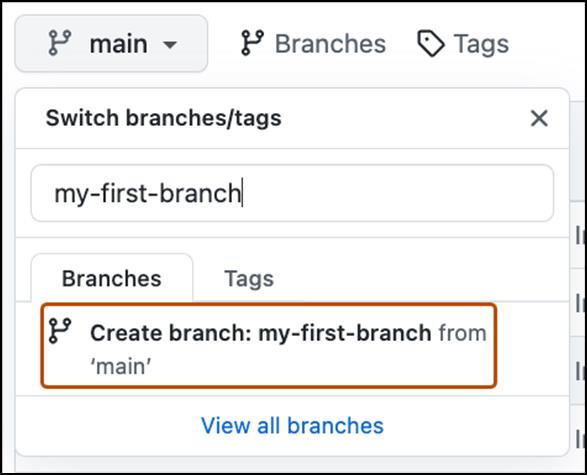
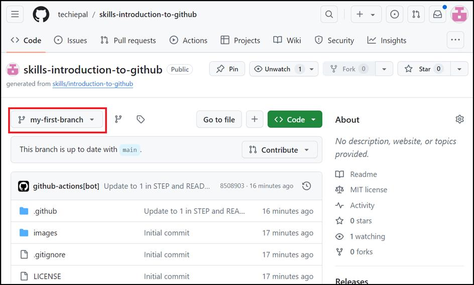

**실습 01: GitHub 리포지토리 및 분기 생성하기**

목표:

소프트웨어 개발이 처음이고 버전 제어 및 협업을 위해 GitHub를 사용하는
팀에 합류했습니다. 프로젝트에 효과적으로 기여하고 오픈 소스 커뮤니티에
참여하려면 GitHub의 핵심 개념과 기능에 대한 확실한 이해가 필요합니다.

이 실습에서 다음을 수행할 것입니다:

- 템플릿에서 리포지토리 생성하기

- 분기를 생성히기: 리포지토리에서 새 분기를 생성하여 병렬 개발과 분기가
  독립적인 작업을 촉진하는 방법을 살펴

연습 \#1: 템플릿 및 리포지토리 내의 분기에서 리포지토리 생성하기

1.  GitHub 계정에 로그인하세요.

2.  다음 링크로 이동하세요.
    https://github.com/skills/introduction-to-github

이 실습에서는 공개 템플릿 "**skills-introduction-to-github**"를 사용하여
리포지토리를 생성할 것입니다.

3.  **Use this template** 메뉴에서 **Create a new repository**를
    선택하세요.

4.  다음 세부 정보를 입력하고 **Create Repository**를 선택하세요.

    - 리포지토리 이름: **skills-introduction-to-github**

    - 리포지토리 유형: **Public**

5.  리포지토리의 헤더 메뉴에서 **Code **탭으로 이동하세요.

6.  기본 분기 드롭다운을 클릭하세요.

7.  **Find a branch** 필드에 **my-first-branch** 이름을 입력하고 "Create
    branch **my-first-branch** from main"를 선택하세요

8.  분기가 방금 만든 분기로 자동으로 전환됩니다. 기본 분기 드롭다운
    막대는 새 분기를 반영하고 새 분기 이름을 표시합니다.

요약:

이 실습에서는

- 프로젝트 추적을 시작하기 위해 새 Git 리포지토리를 초기화했습니다.

- 코드의 다양한 기능 또는 버전을 관리하기 위해 분기를 생성하는
  프로세스를 이해했습니다.
