**实验 02：使用 Markdown 进行通信**

目的：

想象一下，您正在与开发团队一起开展一个协作项目。沟通和组织是确保项目成功的关键。对于像您这样的开发人员来说，Markdown
是一个重要的工具，可以增强沟通的清晰度和组织性，特别是在处理**问题**和**拉取请求时**。

在本实验中，您将:

- 使用公共模板创建存储库以快速入门。

- 生成拉取请求以提出更改建议并有效地进行比较。

<!-- -->

- 编辑文件以包含标头并提交这些更改，使您的文档更加结构化和可读性。

任务 \#1：使用公共模板创建存储库

1.  登录到你的 GitHub 帐户。

2.  浏览到以下链接：
    https://github.com/skills/communicate-using-markdown

在本实验中，你将使用公共模板“**skills-communicate-using-markdown**”创建存储库。

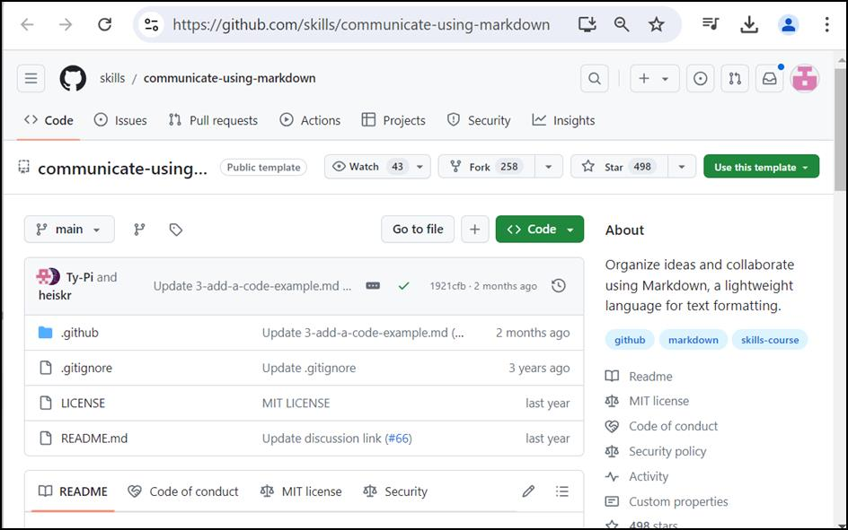

3.  选择“**Use this template**”菜单下的“**Create a new repository** ”。

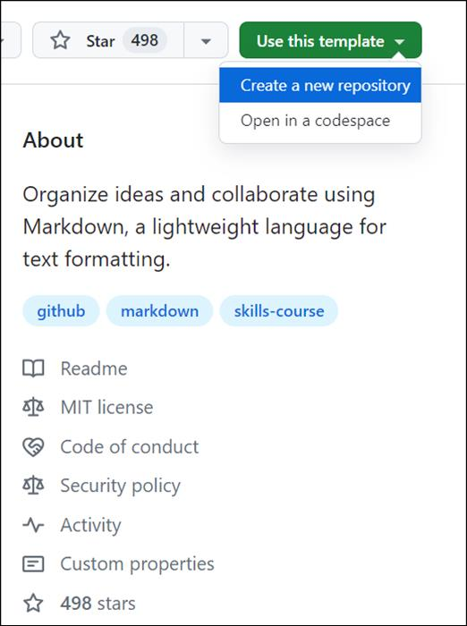

4.  输入以下详细信息，然后选择 **Create Repository**。

    1.  存储库名称: **skills-communicate-using-markdown**

    2.  存储库类型: **Public**

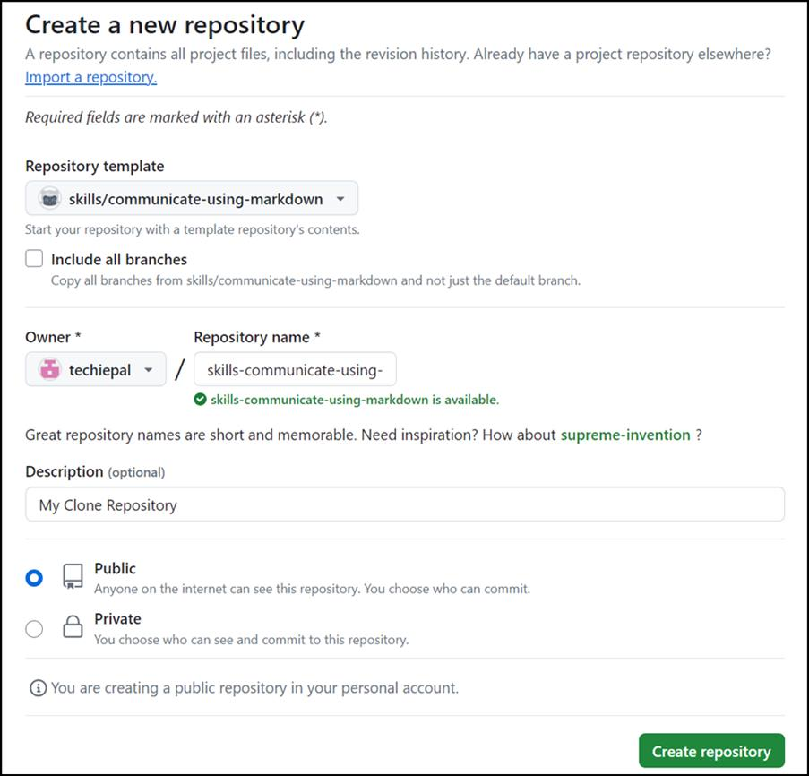

任务 \#2：创建拉取请求并比较更改

1.  在 **skills-communicate-using-markdown** 页上，选择
    顶部导航窗格中的“**Pull requests** ”选项卡。

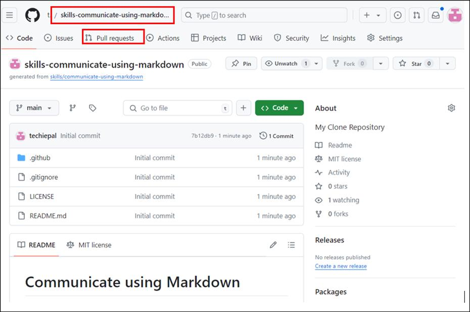

2.  在下一页上，选择“**New pull request ”**按钮。

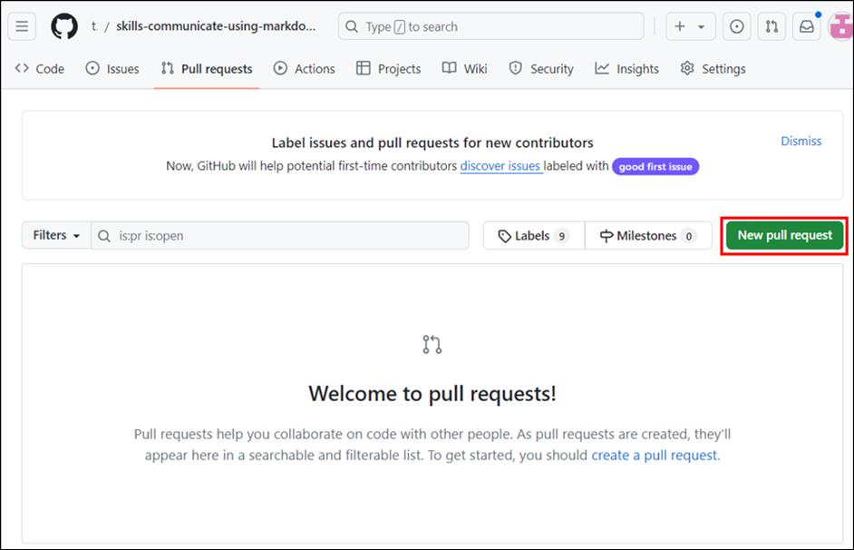

3.  在**“Compare changes”**页上，选择“**base： main”**和**“compare：
    start-markdown”**

**注意：**通常需要等待几秒钟并刷新页面才能查看分支。

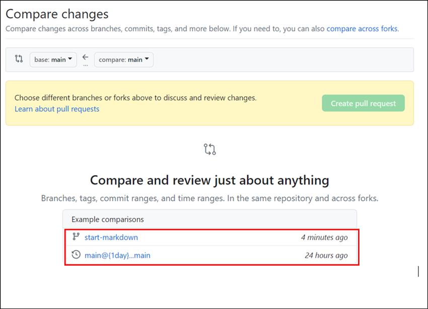

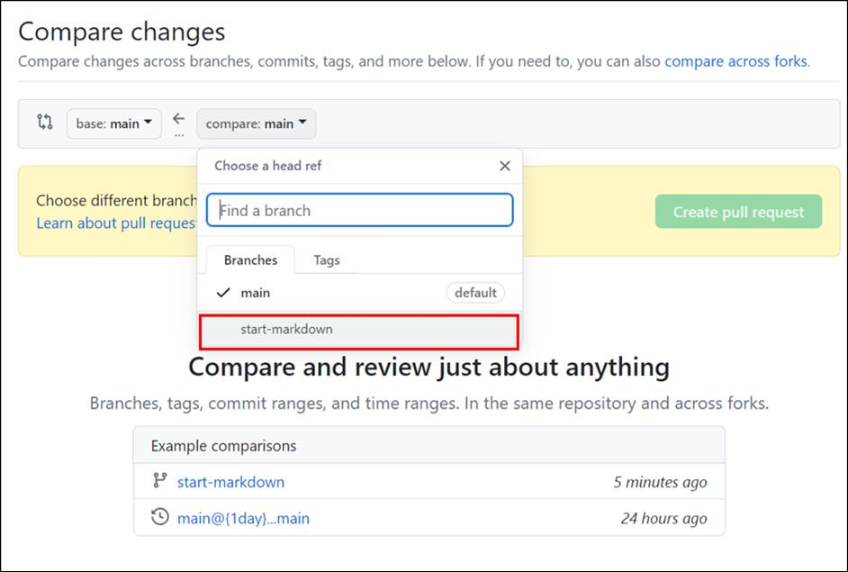

4.  在**“ Comparing changes”**页上，单击“**Create pull request”**按钮。

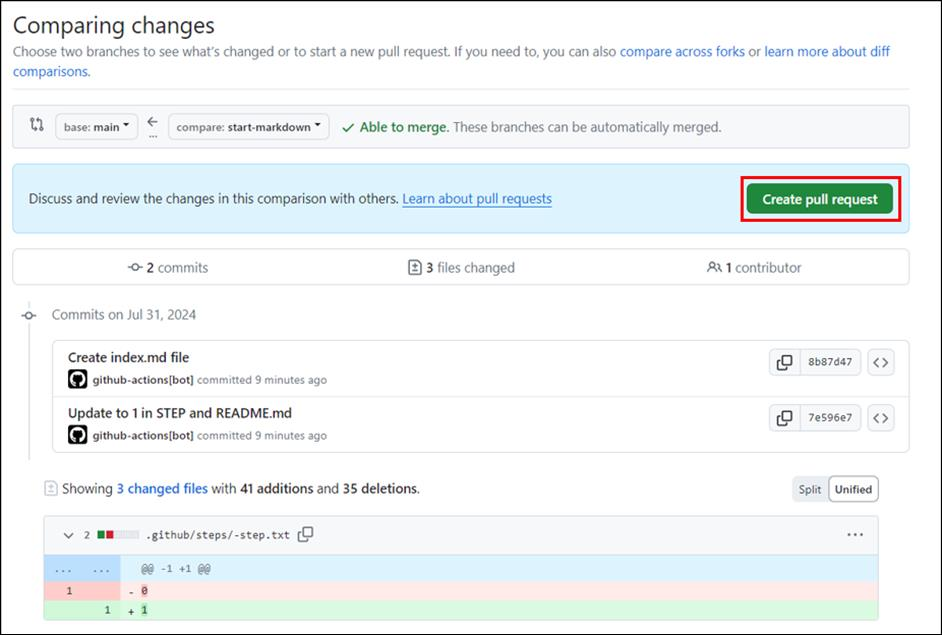

5.  在“**Open a pull request** ”页上，输入标题，然后单击“**Create pull
    request**”按钮。**Add a title**: Start Markdown

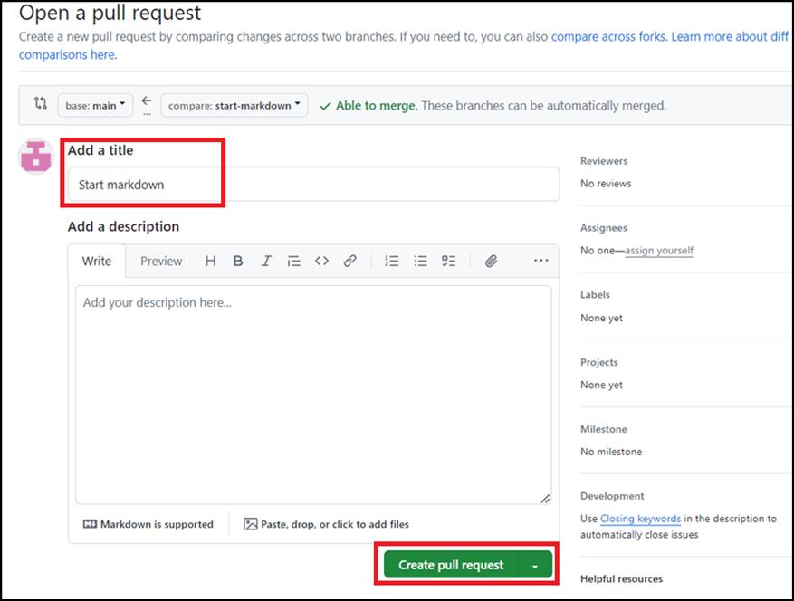

6.  在“**Comparing changes**”页上，单击“**View pull
    request** ”按钮以查看详细信息。 

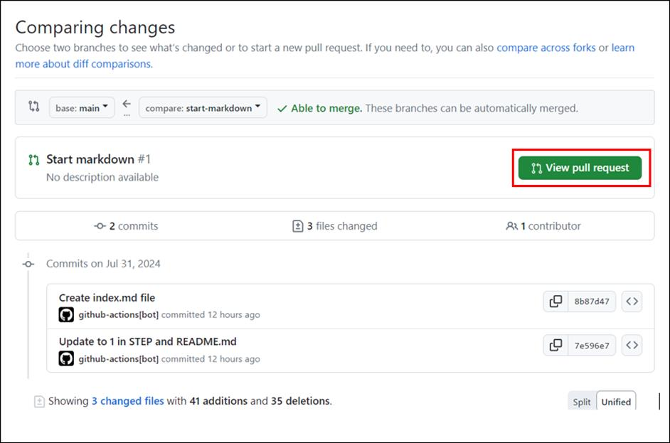

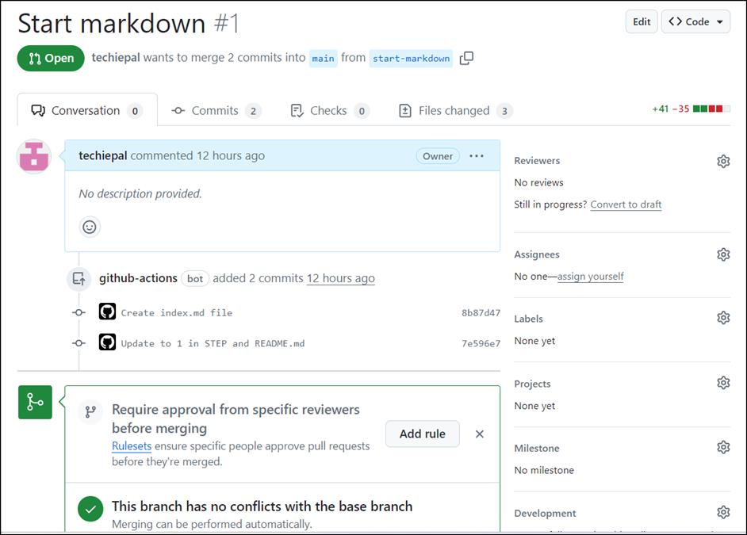

7.  在“**Start markdown \#1** ”页上，转到“**Files changed** ”选项卡。

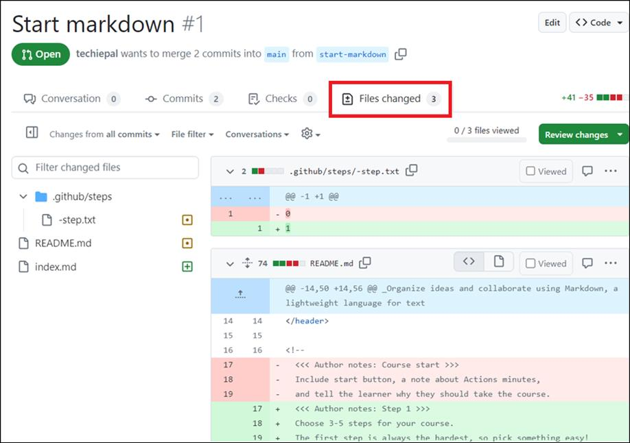

8.  向下滚动到页面底部以查找 **index.md** 文件

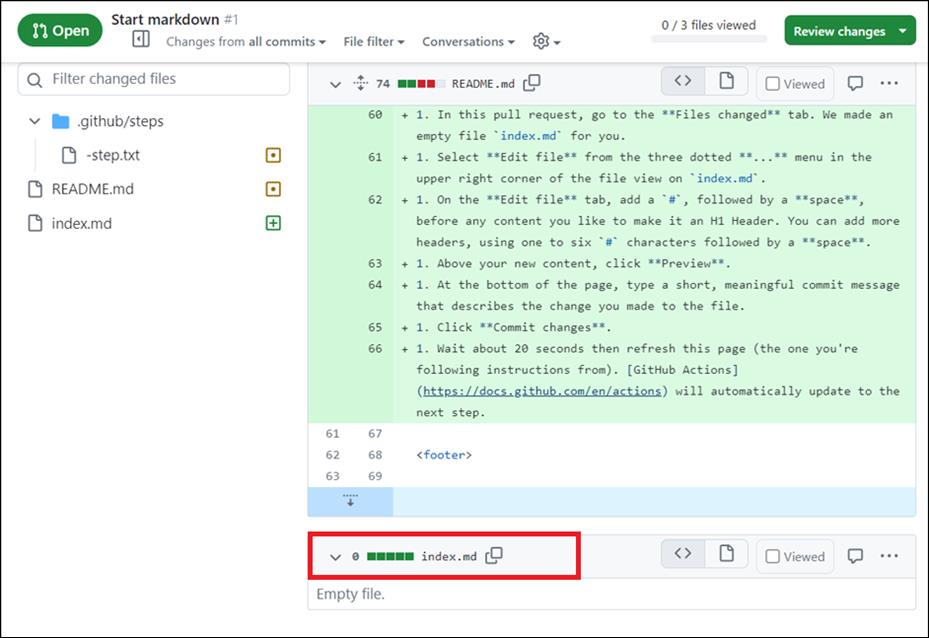

9.  单击省略号 ...（三个均匀间隔的句点）图标，选择 **Edit file**
    从下拉菜单中。

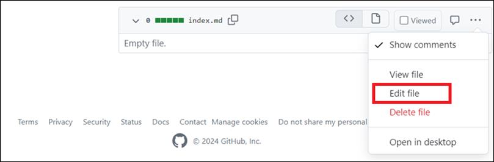

10. 在“Edit file”页上，输入以下文本

11. \# Hello World

12. \## This is an \`\<h1\>\` header, which is the largest

13. \### This is an \`\<h2\>\` header

\#### This is an \`\<h6\>\` header, which is the smallest

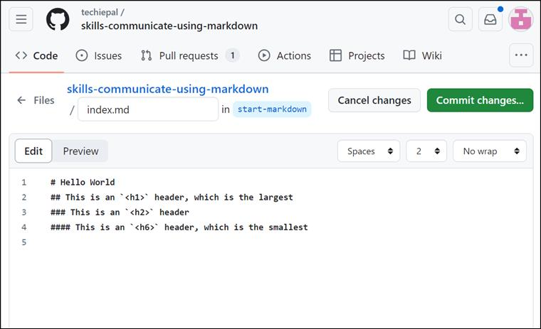

14. 点击 **Preview** 按钮，查看粘贴在编辑器中的内容。

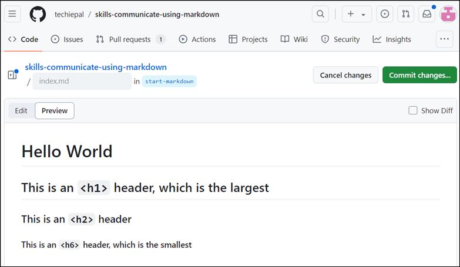

15. 单击“**Commit changes** ”按钮并确认提交所做的更改。

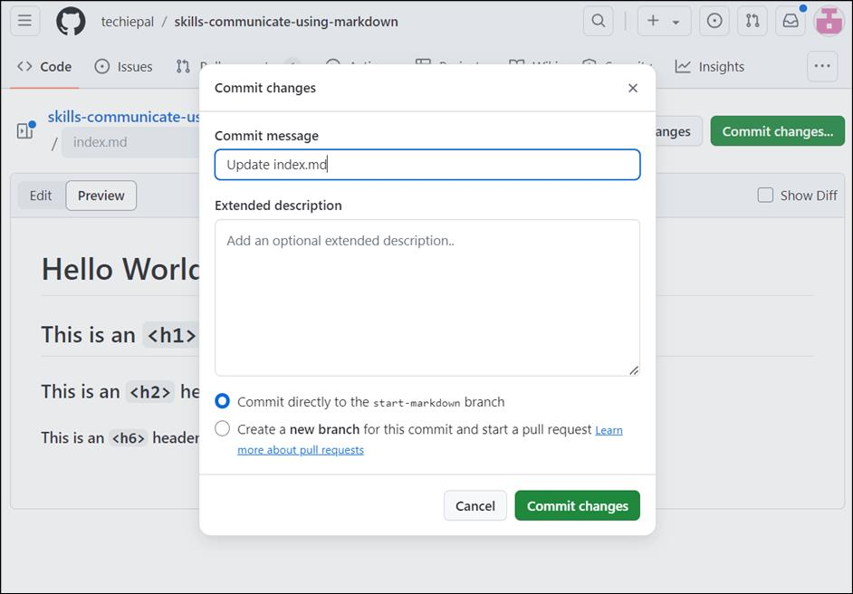

16. 等待大约 20 秒，然后刷新页面以查看包含更新
    **index.md** file\*\*.\*\*的页面。

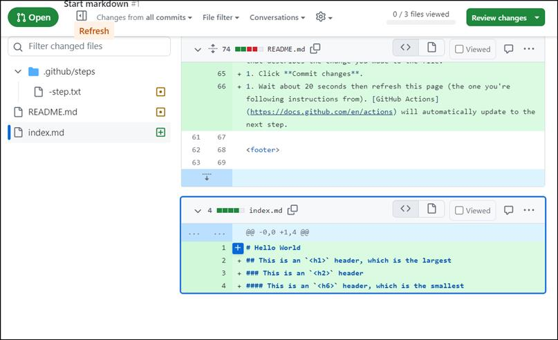

总结：

现在，你已经创建了一个存储库，生成了拉取请求，并使用标头构建了 Markdown
文档。此工作流程将极大地增强您与团队有效沟通和协调的能力。

