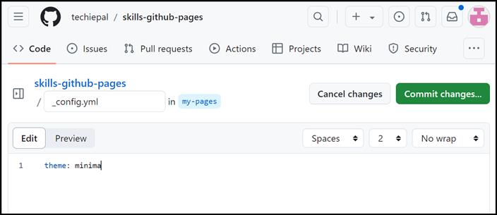

**실습 03: GitHub Pages 및 Jekyll을 사용하여 온라인 포트폴리오를
생성하기**

목표:

당신이 온라인 포트폴리오를 통해 프로젝트, 기술 및 경험을 선보이고
싶어하는 기술 스타트업의 신진 소프트웨어 개발자입니다. 전문적인
플랫폼에서 작업을 표시하기를 원하므로 GitHub Pages를 사용하여 개인
웹사이트나 블로그를 생성하기로 결정했습니다. 이 플랫폼을 사용하면 GitHub
리포지토리를 활용하여 웹사이트를 쉽게 게시하고 유지할 수 있습니다.

이 실습에서는 다음을 수행할 것입니다:

- GitHub Repository를 생성: 개인 사이트의 기초 역할을 할 새 조장소를
  설정하기

- GitHub Pages를 활성화: 리포지토리에서 직접 웹 사이트를 호스팅하도록
  GitHub Pages를 구성하기

- Jekyll을 사용하여 첫번째 사이트를 배포: 인기 있는 정적 사이트 생성기인
  Jekyll을 활용하여 최소한의 노력으로 전문가 수준의 웹사이트를 구축하고
  배포하기

연습 \#1: 템플릿에서 리포지토리를 생성하기

1.  GitHub 계정을 로그인하세요.

2.  다음 링크로 이동하세요: https://github.com/skills/github-pages

이 실습에서는 공개 템플릿 "**skills-github-pages**"를 사용하여
리포지토리를 생성할 것입니다.

3.  **Use this template** 메뉴에서 **Create a new repository**를
    선택하세요.

4.  다음 세부 정보를 입력하고 **Create Repository**를 선택하세요.

    - 리포지토리 이름: **skills-github-pages**

    - 리포지토리 유형: **Public**

연습 \#2: GitHub Pages를 활성화하기

1.  리포지토리가 생성되면 홈 페이지로 이동하세요. 기본 탐색 창에서
    **Settings **아이콘을 클릭하세요.

2.  설정 페이지에서 코드 및 자동화까지 아래로 스크롤하고 **Pages**를
    클릭하세요.

3.  GitHub pages 페이지에서 **Source** 드롭다운 메뉴에서 "**Deploy from
    a branch**"가 선택되어는지 확인하고 **Branch** 드롭다운 메뉴에서
    **main**을 선택하세요.

4.  계속하려면 **Save** 버튼을 클릭하세요.

5.  GitHub Pages 원본이 저장됩니다. 약 1분 정도 기다린 후 이 페이지를
    새로 고치세요. GitHub Actions는 다음 단계로 자동으로 업데이트됩니다.

6.  이제 사이트가 활성화되었습니다.

7.  Visit Site 버튼을 클릭하여 사이트를 확인하세요. GitHub pages를
    켰습니다.

연습 \#3: Jekyll을 사용하여 사이트를 배포하기

이 사이트를 멋지게 보이게 하기 위해 분기인 **my-pages**에서 작업하게
됩니다. 이 실습에서는 블로그용 테마 "minima"를 사용합니다.

Jekyll 은 **\_config.yml**라는 파일을 사용하여 사이트, 테마 및 사이트
제목 및 GitHub 핸들과 같은 재사용 가능한 콘텐츠에 대한 설정을
저장합니다.

1.  리포지토리에서 **Code**를 선택하세요.

2.  **main** 분기를 확장하고 **my-pages**를 선택하세요.

**my-pages** 분기에서 **\_config.yml** 파일을 찾으세요.

3.  오른쪽 상단 모서리에 있는 파일 편집기를 여세요.

4.  테마 추가하기: 아래 와 같이 \_config.yml 파일에 표시되도록
    **minima**로 설정하세요

5.  변경을 저장하려면 **Commit Changes**를 클릭하세요.

**참고:** 약 1분 정도 기다린 후 이 페이지를 새로 고치세요. GitHub
Actions는 자동으로 다음 단계로 업데이트됩니다.

6.  업데이트된 사이트를 확인하려면 GitHub 페이지 아래의 **Visit
    site**버튼을 클릭하세요.

7.  선택한 테마가 적용됩니다. title:, author: 및 description:과 같은
    다른 구성 변수를 계속 수정하여 사이트를 추가로 사용자 지정할 수
    있습니다.

요약:

이제 GitHub pages가 있는 웹 사이트를 생성하고 테마를 적용했습니다. 이
경험을 활용하여 소프트웨어 개발 여정을 지속적으로 업데이트하고 선보일 수
있는 라이브 웹사이트를 생성하여 고용주, 공동 작업자 및 기술 커뮤니티가
귀하의 작업과 기술을 더 쉽게 볼 수 있도록 할 수 있습니다.
