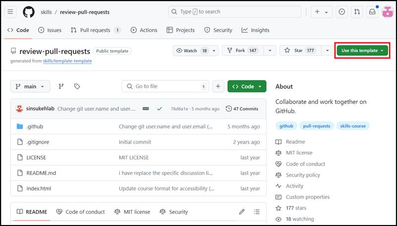

**실습 04: 풀 리퀘스트 검토 및 병합 충돌 해결하기**

목표:

여러 기여자가 있는 프로젝트를 진행하는 개발 팀의 일원입니다. 변경 사항이
적용되면 이러한 변경 사항을 검토하고 모든 사람의 작업이 원활하게
통합되도록 하는 것이 중요합니다. 풀 리퀘스트를 관리하고 병합 충돌을
해결하여 프로젝트의 무결성을 유지하고 중단을 방지하여 효과적으로
협업해야 합니다.

이 실에서는 GitHub에서 협업의 두 가지 주요 측면에 집중합니다:

- 풀 리퀘스트를 생성하기: 적절한 분기를 선택하고, 제목과 설명을
  제공하고, 끌어오기 요청을 제출하여 변경 사항을 제안

- 풀 리퀘스트를 검토하기: 풀 리퀘스트에서 제안된 변경 사항을 검토하여
  프로젝트 표준을 충족하고 통합할 준비가 되었는지 확인

- 병합 충돌 해결하기: 서로 다른 분기의 변경 사항이 파일의 동일한 부분에
  영향을 미칠 때 발생하는 충돌을 해결하여 원활한 통합과 협업을 보장하는
  연습

연습 \#1: 템플릿에서 리포지토리를 생성하고 풀 리퀘스트를 생성하기

풀 리퀘스트는 분기의 변경 내용을 다른 사용자에게 표시합니다. 이 풀
리퀘스트는 분기에서 방금 변경한 내용을 유지하고 기본 분기에 적용할 것을
제안합니다.

1.  GitHub 계정을 로그인하세요.

2.  다음 링크로
    이동하세요: https://github.com/skills/review-pull-requests

이 실습에서는 공개 템플릿 "**skills-review-pull-requests**"를 사용하여
리포지토리를 생성할 것입니다.

3.  **Use this template** 메뉴에서 **Create a new repository**를
    선택하세요.

4.  다음 세부 정보를 입력하고 **Create Repository**를 선택하세요.

    - 리포지토리 이름: **skills-review-pull-requests**

    - 리포지토리 유형: **Public**

5.  기본 탐색 페이지에서 **Pull requests** 탭을 선택하세요

6.  다음 페이지에서 **New pull request**를 선택하세요.

7.  **Compare changes** 페이지에서:

    - **Base:** 드롭다운에서, **main**을 선택하세요 (기본적으로 이
      옵션이 선택되어 있습니다.)

    - **Compare:** 드롭다운에서, **update-game**를 선택하세요,

일반적으로 몇 초를 기다렸다가 분기를 보려면 페이지를 새로 고쳐야 합니다.

8.  **update-game**가 선택되면 **compare:** 드롭다운에서, **Comparing
    changes** 창이 엽니다. **Create pull request**를 클릭하세요.

9.  **Open a pull request page**에서 다음을 입력하세요:

    - 풀 리퀘스트에 대한 **Add a title**: Update the game over message

    - 풀 리퀘스트에 대한**Add a description**: Update the game over
      message so people know how to play again

10. **Create pull request**를 클릭하세요.

11. 약 20초 동안 기다린 후 이 페이지를 새로 고치세요. GitHub Actions는
    자동으로 다음 단계로 업데이트됩니다.

연습 \#2: 풀 리퀘스트를 업데이트 및 병합 충돌 해결하기

1.  다음 링크로
    이동하세요: https://github.com/skills/resolve-merge-conflicts

이 실습에서는 공개 템플릿 "**skills-resolve-merge-conflicts**"를
사용하여 리포지토리를 생성할 것입니다.

2.  **Use this template** 메뉴에서 **Create a new repository**를
    선택하세요.

3.  다음 세부 정보를 입력하고 **Create Repository**를 선택하세요.

    - 리포지토리 이름: **skills-resolve-merge-conflicts**

    - 리포지토리 유형: **Public**

4.  리포지토리가 생성되묜 기본 탐색 바에서 **Pull request** 탭을
    선택하세요.

5.  **New pull request** 버튼을 클릭하세요.

6.  다음을 선택하고 풀 리퀘스트를 생성하세요:

    - **my-resume**을 헤드 분기로 사용

    - **main**을 비교 분기로 사용

7.  **Create pull request** 버튼을 클릭하세요

8.  **Open a pull request** 페이지에서 타이틀을 Resolving merge
    conflicts로 입력하고 **Create pull request**를 클릭하세요**.**

9.  GitHub Actions가 자동으로 업데이트되고 페이지에 충돌 세부 정보(있는
    경우)가 표시되는 동안 20초 동안 기다리세요.

10. 계속하려면 **Resolve conflicts**를 클릭하세요.

11. Review the conflicts and resolve them.

12. 이 연습에서, 광고 항목 충돌을 삭제하고 **Mark as resolved** 버튼을
    클릭하세요.

13. **Commit merge** 버튼을 클릭하고 주의 사항 메시지 상자를 선택하세요.

14. **I understand, continue updating main**을 클릭하세요**.** 최종 확인
    결과를 볼 수 있습니다.\*\*.\*\*

**요약:**

이제 GitHub에서 효과적인 팀워크 및 프로젝트 관리를 위한 필수 기술인
충돌에 대한 풀 리퀘스트 생성 및 검토 및 충돌 해결을 완료했습니다.
