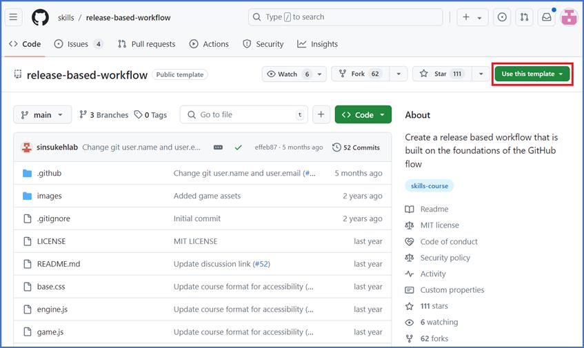
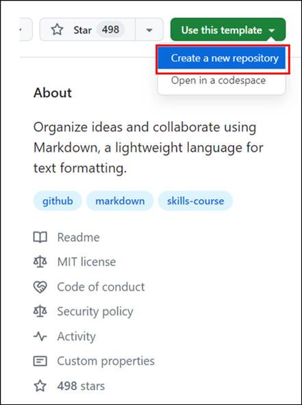
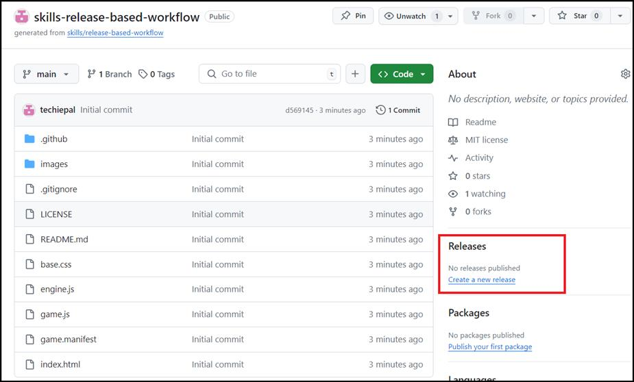
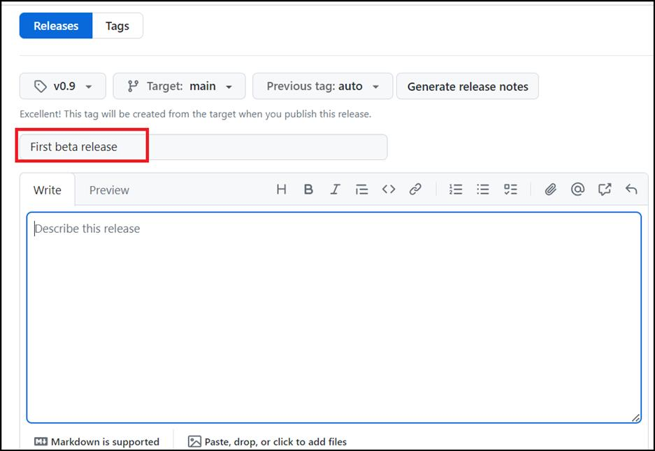
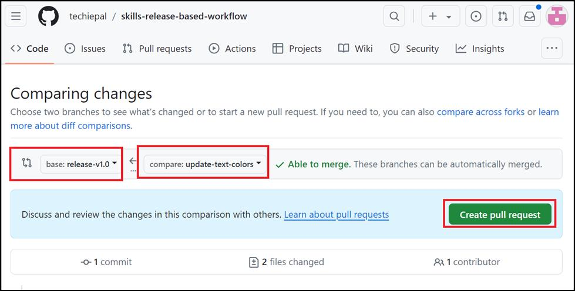
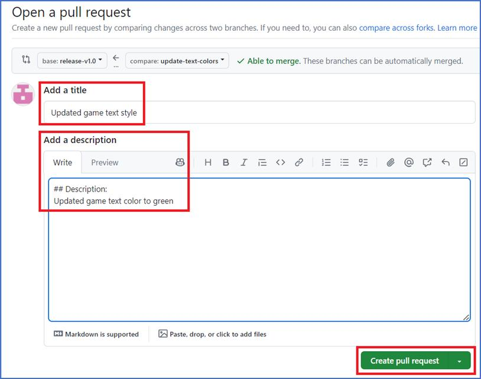
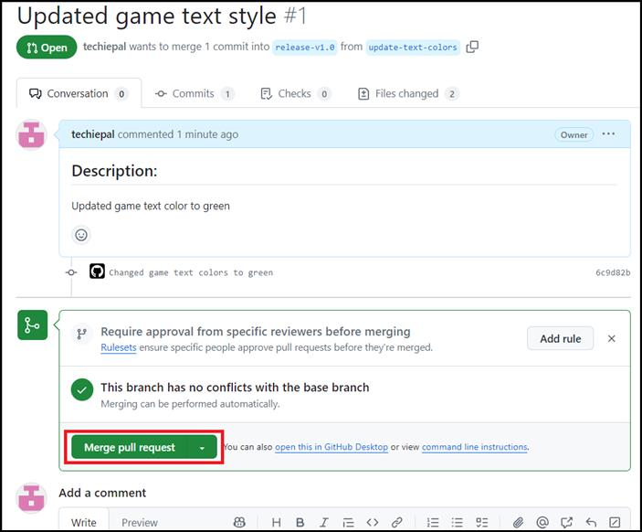
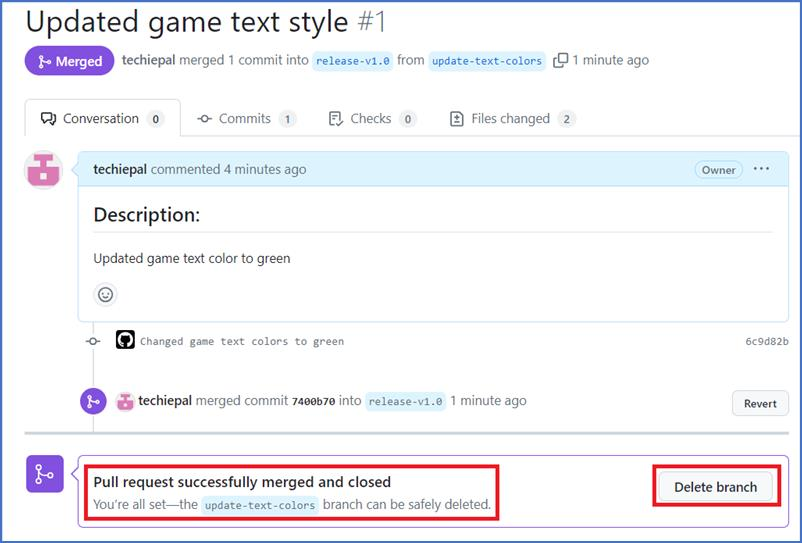
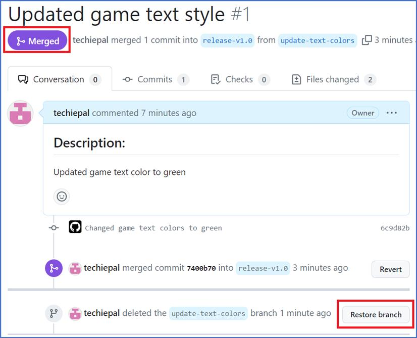

**Laboratoire 05 : Gérer les versions logicielles à l'aide d'un flux de
travail basé sur les versions GitHub**

Objectif:

Imaginez que vous faites partie d'une équipe de développement de
logiciels travaillant sur un projet qui nécessite des mises à jour et
des versions régulières. Pour gérer efficacement votre logiciel, vous
décidez d'implémenter un flux de travail basé sur les versions à l'aide
de GitHub. Ce flux de travail vous permet de gérer efficacement la
gestion des versions et les itérations logicielles, en veillant à ce que
chaque version soit suivie et que les problèmes soient résolus de
manière contrôlée.

Dans cet atelier pratique, vous allez

- Créer un référentiel : configurez un référentiel nommé
  skills-release-based-workflow pour servir de base à votre flux de
  travail basé sur les versions.

- Mettre en œuvre la gestion des versions : explorez les concepts de
  gestion des versions et l'importance du suivi des itérations
  logicielles.

- Créer une version bêta : suivez les étapes pour créer une version bêta
  pour la base de code actuelle, y compris le balisage et la publication
  sur GitHub.

- Simuler un scénario réel : introduisez un bogue dans la base de code,
  en simulant un scénario courant d'identification et de résolution des
  problèmes dans le flux de travail de publication.

Exercice \#1 : Mettre en place un nouveau dépôt (pour servir de base au
flux de travail basé sur les versions)

1.  Connectez-vous à votre compte GitHub.

2.  Naviguez jusqu'au lien suivant :
    https://github.com/skills/release-based-workflow

Dans cet atelier, vous allez créer le référentiel à l'aide d'un modèle
public « **skills-release-based-workflow** ».

3.  Sélectionnez **Create a new repository** dans le menu **Use this
    template**.

4.  Entrez les détails suivants et sélectionnez **Create Repository**.

    - Nom du référentiel : **skills-release-based-workflow**

    - Type de référentiel : **Public**

Exercice \#2 : Créer une version pour la base de code actuelle

Dans cet exercice, nous allons créer une version pour ce dépôt sur
GitHub.

- Les versions GitHub pointent vers un commit spécifique.

- Les versions peuvent inclure des notes de version dans des fichiers
  Markdown et des fichiers binaires joints.

Remarque : Avant d'utiliser un flux de travail basé sur une version plus
importante, nous allons créer une balise et une version.

1.  Une fois le référentiel créé (dans l'exercice \#1), accédez à
    **Releases** dans la barre latérale droite de la page et cliquez sur
    **Create a new release.**

Astuce : Pour accéder à cette page, cliquez sur l'onglet **Code** en
haut de votre dépôt. Ensuite, recherchez la section **Releases** dans la
barre latérale de droite.

1.  Sur la page **Releases/Tags,** entrez ce qui suit :

    - Garder la **Target** comme principale

    - Dans le champ **Choose a Tag**, spécifiez un numéro.

Dans ce cas, utilisez la version 0.9 et sélectionnez **Create new tag
v0.9 on publish** 

2.  Donnez un titre à la version, par exemple Première version bêta

**Remarque :** Vous pouvez également donner une brève description du
communiqué.

3.  Faites défiler la page vers le bas pour cocher la case en regard de
    **Set as a pre-release**, car il s'agit d'une version bêta, puis
    cliquez sur **Publish release**.

Exercice \#3 : Introduire un bug (à corriger plus tard)

Pour préparer le terrain pour plus tard, ajoutons maintenant un bogue
que nous corrigerons dans le cadre du flux de travail de mise en
production dans les étapes ultérieures. Une branche
« update-text-colors » est déjà créée dans le référentiel (créée dans
l'exercice \#1) pour vous, alors créons et fusionnons une demande de
tirage avec cette branche.

1.  Dans la barre de navigation principale, cliquez sur l'onglet **Pull
    requests**.

2.  Sur la page suivante, cliquez sur **New pull request.**

3.  Sur la page **Compare changes**, sélectionnez les éléments suivants
    et cliquez sur **Create pull request,**

    - base : **release-v1.0** et

    - compare : **update-text-colors**.

4.  Sur la page **Open a pull request,** entrez ce qui suit, puis
    cliquez sur **Create pull request.**

    - Ajouter un titre : définissez le titre de la demande de tirage sur
      Style de texte de jeu mis à jour

    - Ajouter une description : \## Description : Mise à jour de la
      couleur du texte du jeu en vert

5.  Sur la page **Updated game text style \#1**, cliquez sur **Merge
    pull request**, puis sur **la page Confirm.**

6.  Sur la page suivante, supprimez la branche nouvellement créée en
    cliquant sur le bouton **Delete branch**.

7.  Attendez environ 20 secondes pendant que GitHub Actions met
    automatiquement à jour la page.

**Résumé:**

Vous avez maintenant acquis une expérience pratique dans l'établissement
et la gestion d'un flux de travail basé sur les versions, améliorant
ainsi votre capacité à suivre les versions, à gérer les versions et à
résoudre efficacement les bogues.
