**实验 05：使用基于 GitHub 发布的工作流管理软件版本**

目的：

想象一下，您是软件开发团队的一员，从事一个需要定期更新和发布的项目。为了有效地管理您的软件，您决定使用
GitHub
实现基于发布的工作流。此工作流程可帮助您有效地处理版本控制和管理软件迭代，确保跟踪每个版本，并以受控方式解决问题。

在这个动手实验室中，您将

- 创建存储库：设置名为 skills-release-based-workflow
  的存储库，作为基于发布的工作流的基础。

- 实施版本控制：探索版本控制的概念以及跟踪软件迭代的重要性。

- 创建测试版：按照步骤为当前代码库创建测试版，包括在 GitHub
  上标记和发布。

- 模拟真实场景：向代码库引入错误，模拟在发布工作流程中识别和解决问题的常见场景。

练习 \#1：设置新的存储库（作为基于发布的工作流的基础)

1.  登录到你的 GitHub 帐户。

2.  浏览到以下链接：https://github.com/skills/release-based-workflow

在本练习中，你将使用公共模板“**skills-release-based-workflow**”创建存储库。

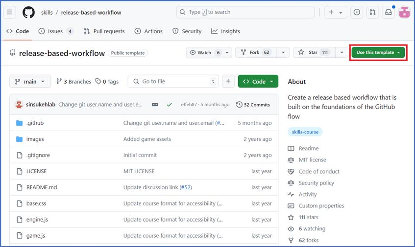

3.  选择“**Use this template** ”菜单下的“**Create a new repository** ”。

4.  输入以下详细信息，然后选择**Create Repository**。

    1.  存储库名称: **skills-release-based-workflow**

    2.  存储库类型: **Public**

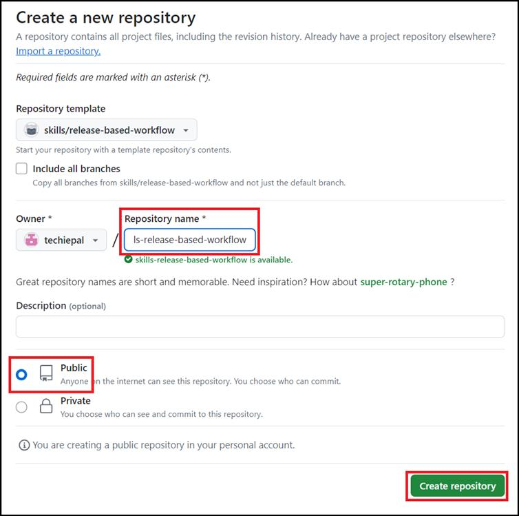

练习 \#2：为当前代码库创建版本

在本练习中，我们将在 GitHub 上为此存储库创建一个版本。

- GitHub Releases 指向特定的提交。

- 版本可以包括 Markdown 文件和附加二进制文件中的发行说明。

注意：在将基于版本的工作流用于较大的版本之前，让我们先创建一个标记和一个版本。

1.  创建存储库后（在练习 \#1
    中），导航到页面右侧边栏上的“**Releases**”，然后单击“**Create a new
    release**”。 

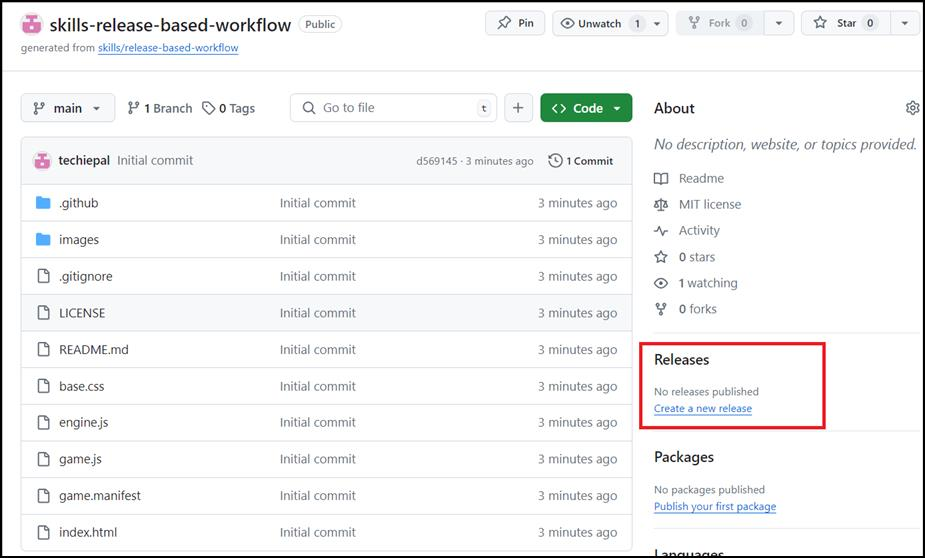

提示：要访问此页面，请单击 存储库顶部的代码选项卡。然后，在
右侧边栏中找到“**Releases**”部分。

1.  在“**Releases/Tags**”页面上，输入以下内容:

    - 将 **Target** 保持为主目标

    - 在“ **Choose a Tag**”字段中，指定一个数字。

在这种情况下，请使用 v0.9 并选择 **Create new tag v0.9 on publish**

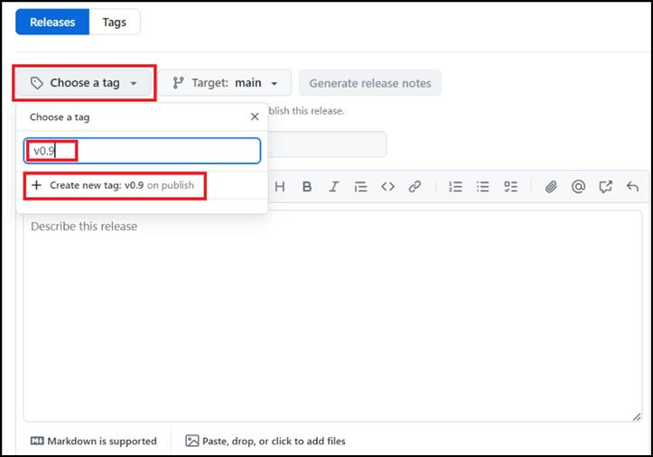

1.  为版本指定一个标题，例如“第一个测试版”版本

**注意：**您也可以为版本提供简短说明。

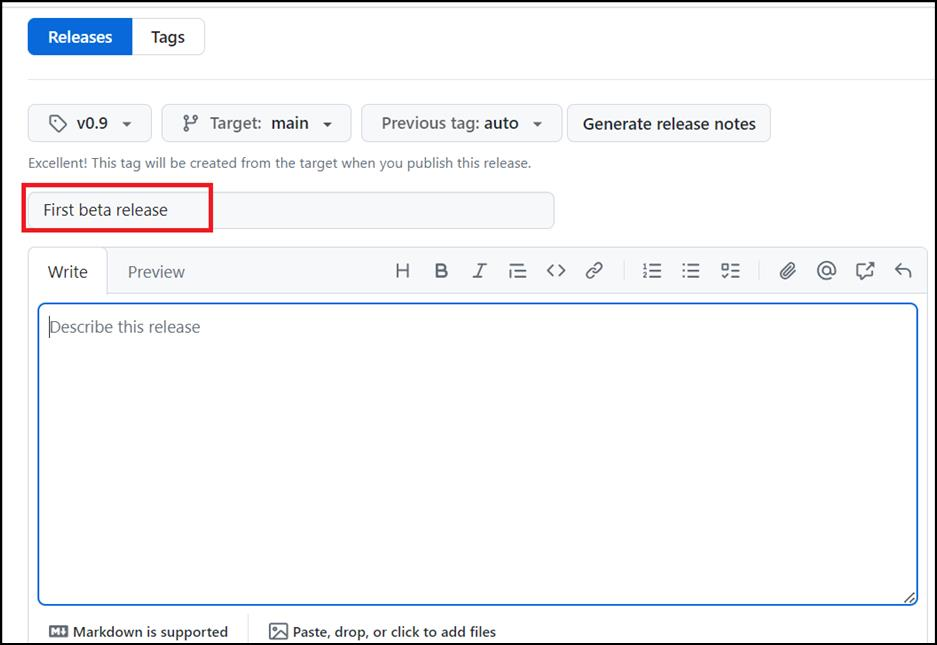

2.  向下滚动页面以选中 **Set as a pre-release**
    旁边的复选框，因为它代表测试版，然后单击 **Publish** **release**。

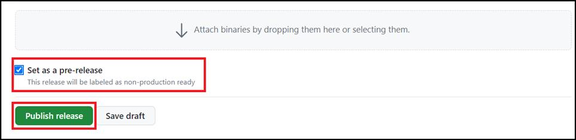

alt="A screenshot of a computer AI-generated content may be incorrect." />

练习 \#3：引入 bug（稍后修复）

为了为以后奠定基础，现在让我们添加一个
bug，我们将在以后的步骤中作为发布工作流的一部分修复该
bug。已经在存储库中为你创建了一个分支“update-text-colors”（在练习 \#1
中创建），所以让我们创建一个拉取请求并将其与此分支合并。

1.  在主导航栏上，单击**“Pull requests”**选项卡。

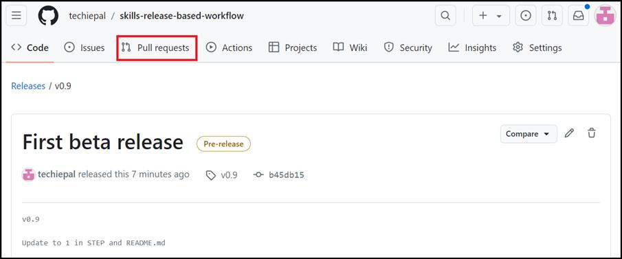

2.  在下一页上，单击“**New pull request**”。

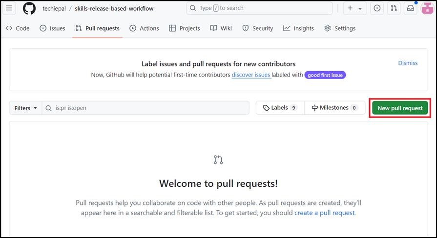

3.  在“**Compare changes**”页上，选择以下内容，然后单击“**Create pull
    request**”， 

    1.  base: **release-v1.0** 和

    2.  compare: **update-text-colors**.

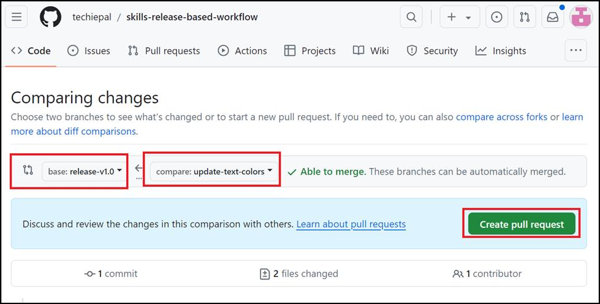

4.  在“**Open a pull request**”页上，输入以下内容，然后单击“**Create
    pull request**”。

    1.  添加标题：将拉取请求标题设置为“更新的游戏文本样式”

    2.  添加描述：## Description：将游戏文本颜色更新为绿色

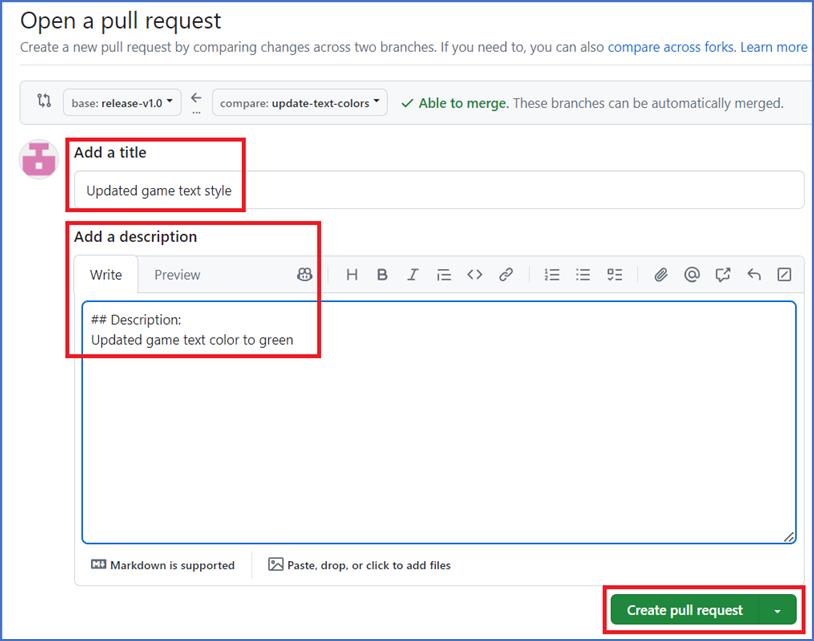

5.  在“**Updated game text style \#1** ”页上，单击“**Merge pull
    request**”，然后单击“**Confirm**”页。

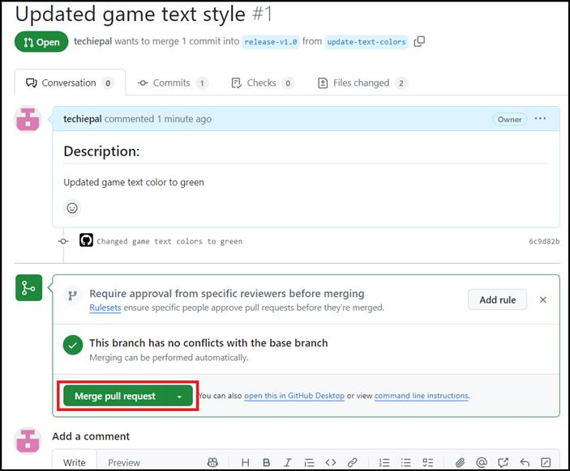

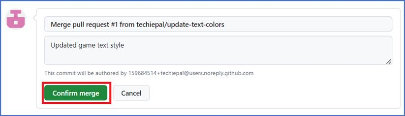

6.  在下一页上，单击删除分支按钮 **Delete branch** 新创建。

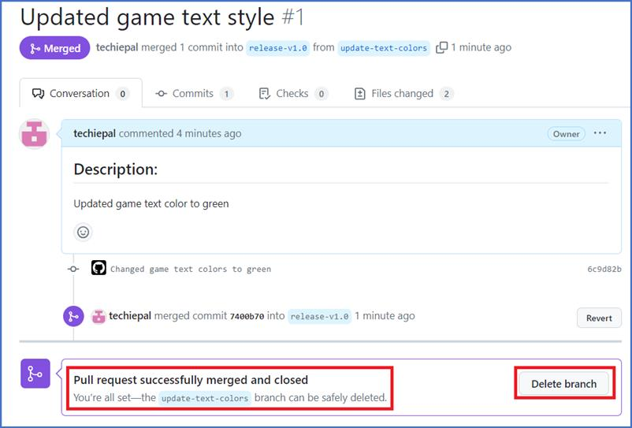

7.  等待大约 20 秒，让 GitHub Actions 自动更新页面。

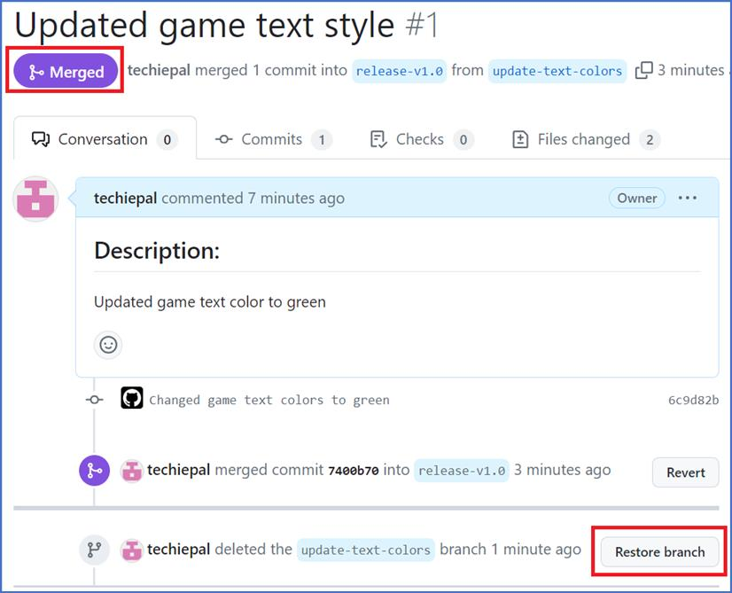

**总结：**

您现在已经获得了建立和管理基于发布的工作流程的实践经验，增强了跟踪版本、处理发布和有效解决错误的能力。

