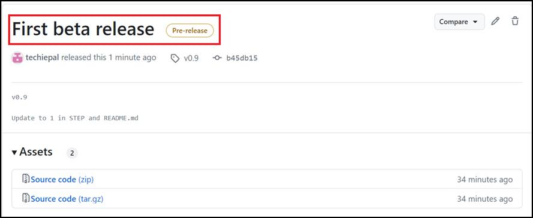

**실습 05: GitHub 릴리스 기반 워크플로를 사용하여 소프트웨어 릴리스
관리하기**

목표:

정기적인 업데이트와 릴리스가 필요한 프로젝트를 진행하는 소프트웨어 개발
팀의 일원입니다. 소프트웨어를 효율적으로 관리하려면 GitHub를 사용하여
릴리스 기반 워크플로를 구현하기로 결정합니다. 이 워크플로는 버전 관리를
처리하고 소프트웨어 반복을 효과적으로 관리하여 각 릴리스를 추적하고
제어된 방식으로 문제를 해결하는 데 도움이 됩니다.

이 실습에서는 다음을 수행할 것입니다.

- 리포지토리를 생성하기: 릴리스 기반 워크플로의 기초가 될 수 있는
  skills-release-based-workflow라는 리포지토리를 설정하기

- 버전 관리 구현하기: 버전 관리의 개념과 소프트웨어 반복 추적의 중요성을
  살펴보기

- 베타 릴리스 생성하기: 단계에 따라 GitHub에서 태그 지정 및 릴리스를
  포함하여 현재 코드베이스에 대한 베타 릴리스를 생성하기

- 실제 시나리오 시뮬레이션: 코드베이스에 버그를 도입하여 릴리스 워크플로
  내에서 문제를 식별하고 해결하는 일반적인 시나리오를 시뮬레이션

연습 \#1: 새 리포지토리를 설정하기 (릴리스 기반 워크플로의 기초 역할)

1.  GitHub 계정에 로그인하세요.

2.  다음 링크로
    이동하세요: https://github.com/skills/release-based-workflow

이 실습에서는 공개 템플릿 "**skills-release-based-workflow**"를 사용하여
리포지토리를 생성합니다.

3.  **Use this template** 메뉴에서 **Create a new repository**를
    선택하세요.

4.  다음 세부 정보를 입력하고 **Create Repository**를 선택하세요.

    - 리포지토리 이름: **skills-release-based-workflow**

    - 리포지토리 유형: **Public**

연습 \#2: 현재 코드베이스에 대한 릴리스를 생성하기

이 연습에서는 GitHub에서 이 리포지토리에 대한 릴리스를 생성할 것입니다.

- GitHub 릴리스는 특정 커밋을 가리킵니다.

- 릴리스에는 Markdown 파일 및 첨부된 이진 파일의 릴리스 정보가 포함될 수
  있습니다.

참고: 더 큰 릴리스에 릴리스 기반 워크플로를 사용하기 전에 태그와
릴리스를 생성해 보겠습니다.

1.  리포지토리가 생성되면 (연습 \#1에서) 페이지의 오른쪽 사이드바에서
    **Releases**로 이동하고  **Create a new release**를 클릭하세요**.**

팁: 이 페이지에 접근하려면 리포지토리 맨 위에 있는 **Code** 탭을
클릭하세요. 오른쪽 사이드바에서 **Releases** 섹션을 찾으세요.

1.  **Releases/Tags** 페이지에서 다음을 입력하세요:

    - **Target** 을 기본으로 유지

    - **Choose a Tag**의 필드에서, 숫자를 지정.

이 사례에서는 v0.9를 사용하여 **Create new tag v0.9 on publish**를
선택하세요

2.  릴리스에 첫 번째 베타 릴리스와 같은 제목을 지정하세요.

**참고:** 릴리스에 간단한 설명을 제공할 수도 있습니다.

3.  페이지를 아래로 스크롤하여 베타 버전을 나타내므로 **Set as a
    pre-release**로 설정 옆의 확인한을 선택하고
    **Publish** **release**를 클릭하세요.

연습 \#3: 버그를 소개하기 (나중에 수정 예정)

나중을 위한 단계를 설정하기 위해 이제 이후 단계에서 릴리스 워크플로의
일부로 수정할 버그를 추가해 보겠습니다. "update-text-colors" 분기가 이미
리포지토리에 생성되어 있으므로 (연습 \#1에서 생성됨) 풀 리퀘스트를
생성하고 이 분기와 병합해 보겠습니다.

1.  기본 탐색 바에서 **Pull requests** 탭을 클릭하세요.

2.  다음 페이지에서 **New pull request**를 클릭하세요**.**

3.  **Compare changes** 페이지에서 다음을 선택하고 **Create pull
    request**를 클릭하세요**,**

    - base: **release-v1.0** 및

    - compare: **update-text-colors**.

4.  **Open a pull request page**에서 다음을 입력하고 **Create pull
    request**를 클릭하세요.

    - Add a title: Set the pull request title to Updated game text style

    - Add a description: ## Description: Updated game text color to
      green

5.  **Updated game text style \#1** 페이지에서 **Merge pull request**를
    클릭하고 **Confirm page**를 클릭하세요.

6.  다음 페이지에서 **Delete branch** 버튼을 클릭하고 새로 생성된 분기를
    삭제하세요.

7.  GitHub Actions에서 페이지를 자동으로 업데이트하는 동안 약 20초 동안
    기다리세요.

**요약:**

이제 릴리스 기반 워크플로를 구축 및 관리하여 버전을 추적하고, 릴리스를
처리하고, 버그를 효율적으로 해결하는 능력을 향상시키는 실무 경험을
쌓았습니다.
