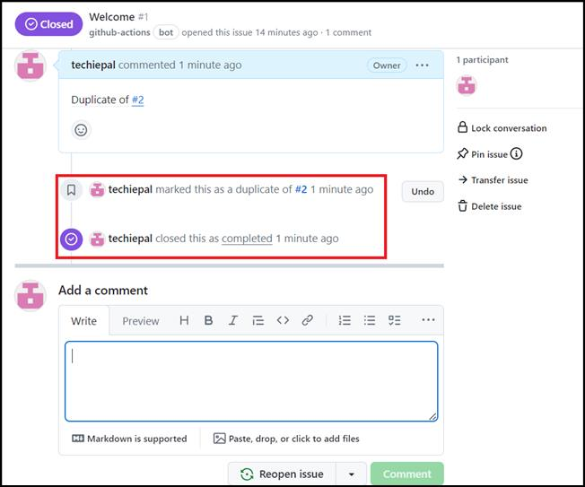

**실습 06: GitHub를 사용하여 공동 작업 향상: 교차 연결된 문제 찾기 및
닫기**

목표:

개발 팀과 공동 프로젝트를 진행하고 있으며 원활한 프로젝트 진행을
위해서는 문제와 풀 요청을 효율적으로 관리하는 것이 중요합니다. GitHub
리포지토리 내에서 협업 및 구성을 강화하려면 GitHub의 연결 및 참조 기능을
활용하기로 결정합니다. 이렇게 하면 중복 문제를 해결하고 팀 구성원 간의
커뮤니케이션을 간소화하는 데 도움이 됩니다.

이 실습에서는 GitHub 리포지토리 내의 다양한 요소를 효과적으로 연결하고
관리하여 협업 워크플로를 최적화하는 방법을 살펴봅니다.

- 리포지토리 생성: skills-connect-the-dots라는 리포지토리를 설정하여
  GitHub의 연결 및 참조 기능 사용을 연습하기

- 중복 문제 해결: 리포지토리 내에서 중복 문제를 식별하고 해결하기

- 교차 연결된 문제 찾기 및 닫기: 교차 연결된 문제를 찾아 닫는 연습을
  통해 저장소 내에서 문제를 효과적으로 관리하는 경험을 쌓기

연습 \#1: 새 리포지토리를 설정하기 (GitHub의 연결 및 참조 기능 사용을
연습하기 위해)

1.  GitHub 계정에 로그인하세요.

2.  다음을 링크로 이동하세요: https://github.com/skills/connect-the-dots

이 실습에서는 공개 템플릿 "**skills-connect-the-dots**"를 사용하여
리포지토리를 생성할 것입니다.

3.  **Use this template** 메뉴에서 **Create a new repository** 를
    선택하세요.

4.  다음 세부 정보를 입려하고 **Create Repository**를 선택하세요.

    - 리포지토리 이름: **skills-connect-the-dots**

    - 리포지토리 유형: **Public**

연습 \#2: 교차 연결된 문제 찾기 및 닫기

1.  홈 페이지에서 리포지토리가 생성되면 **Issues **탭으로 이동하세요.

2.  다음 페이지에서 **Welcome** 문제를 클릭하세요.

3.  **Welcome \#1** 페이지에서 **Add a comment** 까지 아래로
    스크롤하세요.

4.  댓글로 \#2의 중복을 입력하고 문제 \#1을 닫으세요.

5.  GitHub Actions가 닫기 상태로 페이지를 자동으로 업데이트하는 동안 약
    20시간 기다리세요.

요약:

이제 GitHub 리포지토리 탐색 기술을 향상하고, 문제 관리 능력을
향상시키고, 팀의 협업 워크플로를 최적화했습니다.
