**실습 07: GitHub Codespaces 및 Visual Studio Code를 사용하여 코딩하기**

목표:

협업을 촉진하고 작업 흐름을 간소화하기 위해 클라우드 호스팅 개발 환경이
필요한 프로젝트를 진행하는 개발자입니다. 생산성을 향상하고 개발 설정을
더 효과적으로 관리하기 위해 Visual Studio Code와 함께 GitHub
Codespaces를 사용하기로 결정했습니다. 이 설정을 사용하면 클라우드에서
직접 개발 환경을 생성하고 사용자 정의할 수 있으므로 팀과 더 쉽게
협업하고 프로젝트 구성을 효율적으로 관리할 수 있습니다.

이 실습에서는 다음을 수행할 것입니다:

- Codespace를 시작: 미리 정의된 템플릿을 사용하여 GitHub Codespace를
  생성하고 시작하기

- 구성 사용자 지정: 개발 요구 사항에 맞게 codespace 내에서 프로젝트
  구성을 사용자 지정하기

- Codespaces 관리: Codespace를 효율적으로 관리하고 탐색하여 원활하고
  체계적인 개발 프로세스를 보장하기

- 리포지토리에 코드 푸시: 코드 변경 내용을 Codespace에서 GitHub
  리포지토리로 푸시하여 개발 작업을 버전 제어와 통합하는 기능을 강화하는
  연습하기

연습 \#1: 새 리포지토리를 설정하고 GitHub Codespace 스핀업하기

1.  GitHub 계정에 로그인하세요.

2.  다음 링크로
    이동하세요: https://github.com/skills/code-with-codespaces

이 실습에서는 공개 템플릿 "**skills-code-with-codespaces"**를 사용하여
리포지토리를 생성할 것입니다.

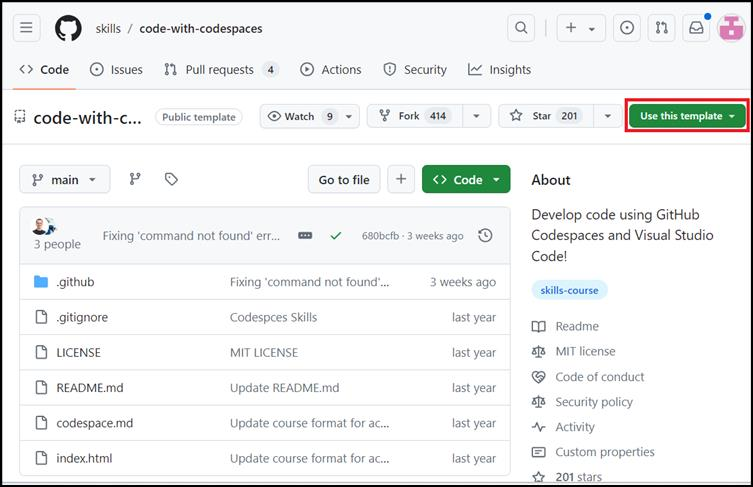

3.  **Use this template** 메뉴에서 **Create a new repository**를
    선택하세요.

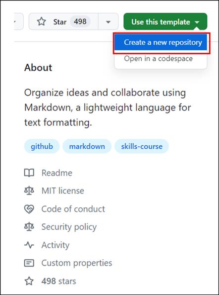

4.  다음 세부 정보를 입력하고 **Create Repository**를 선택하세요.

    - 리포지토리 이름: **skills-code-with-codespaces**

    - 리포지토리 유형: **Public**

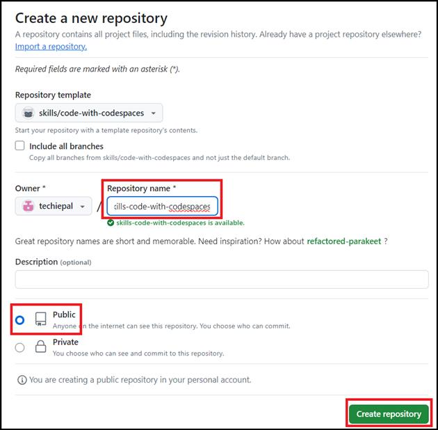

5.  리포지토리가 생성돠면 **Code** 버튼을 클릭하세요.

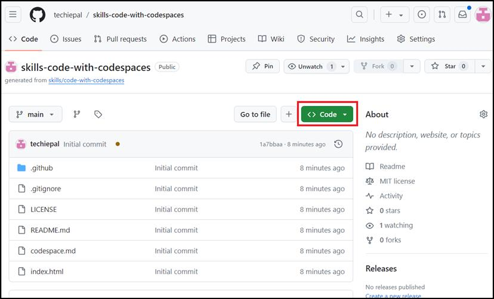

6.  팝업 창에서 **Codespaces** 탭을 선택하고 **the Create codespace on
    main** 버튼을 클릭하세요.

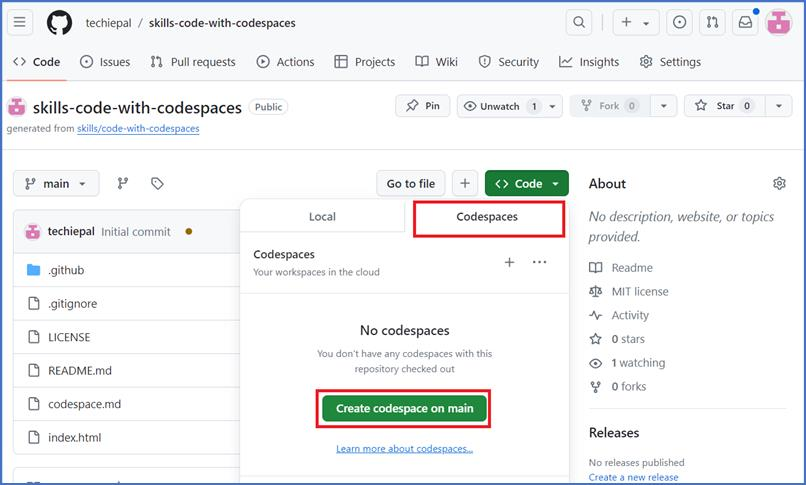

**참고:** codespace가 새 브라우저 탭에서 열립니다.

7.  브라우저에 VS Code 웹 기반 편집기가 표시되고 아래와 같이 터미널이
    있어야 합니다.

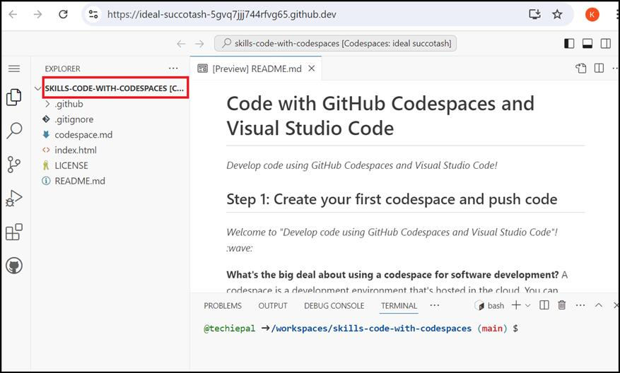

8.  Codespace (가상 머신)가 자체적으로 가동될 때까지 2분 동안
    기다리세요.

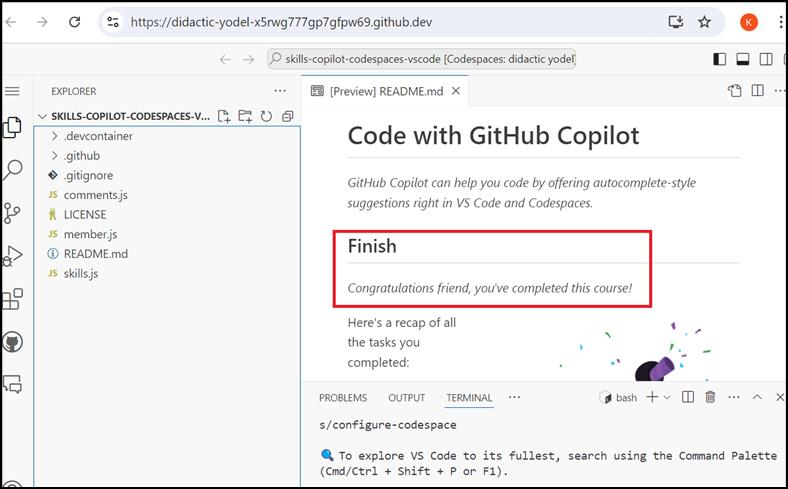

9.  **skills-code-with-codespaces** 리포지토리로 다시
    이동하고 **Code** 버튼을 클릭하세요.

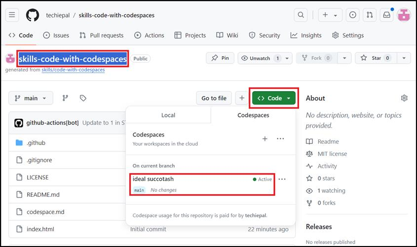

**참고:** 새로 만든 codespace가 로드되지 않으면 페이지를 새로 고치세요.

10. 활성codespace에서 줄임표**…** 를 클릭하세요\*\*.\*\*

**참고**: The codespace이름은 경우에 따라 다를 수 있습니다.

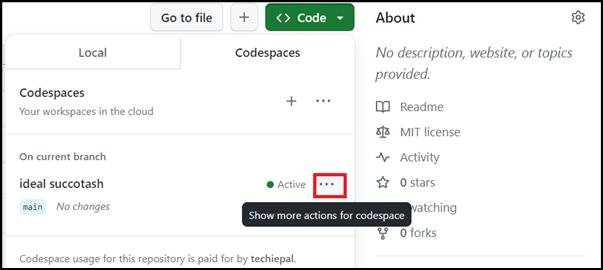

11. 팝업 메뉴에서 **Open in Visual Studio Code**를 선택하세요.

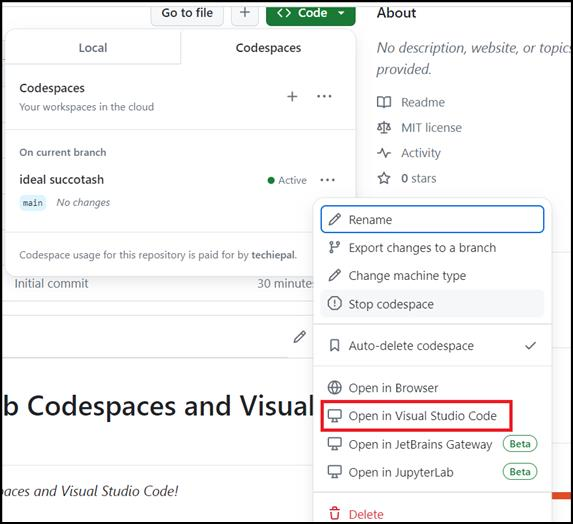

12. VS code 애플리케이션에서 codespace를 열 수 있도록 확인하는 팝업이
    표시됩니다. Codespace를 열려면 **Open Visual Studio Code**를
    선택하세요.

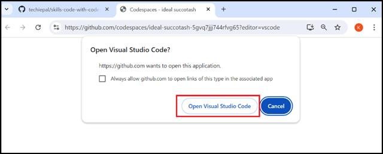

13. GitHub Codespaces의 확장을 설치하라는 메시지가 표시됩니다, **Install
    extension and open URI**를 클릭하세요.

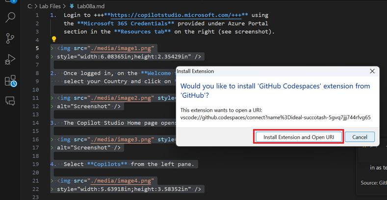

14. 설치가 완료되면 추가 권한을 요청하는 팝업이 표시됩니다. **Click
    Authorize** **Visual Studio code**

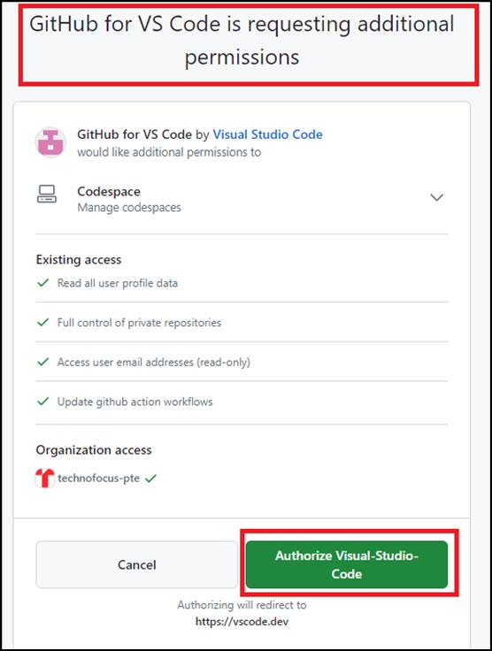

15. GitHub 계정 암호를 입력하여 액세스 확인하세요.

**참고:** Allow Windows Firewall 팝업이 표시되면 계속 진행하도록
허용하세요.

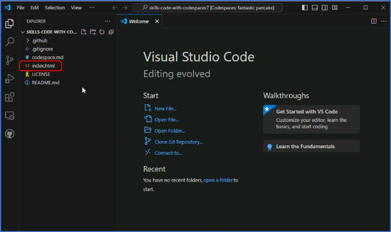연습
\#2: codespace에서 리포지토리로 코드 푸시하기

1.  VS Code 탐색기 창의 codespace 내에서 index.html 파일을 선택하세요.

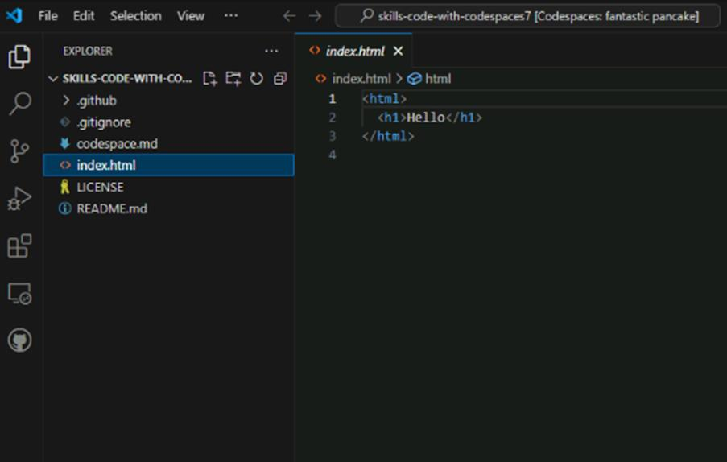

2.  h1 헤더를 아래와 같이 바꾸세요:

\<h1\>Hello from the codespace!\</h1\>

3.  파일을 저장하세요.

**참고:** 파일이 자동 저장되어야 합니다.

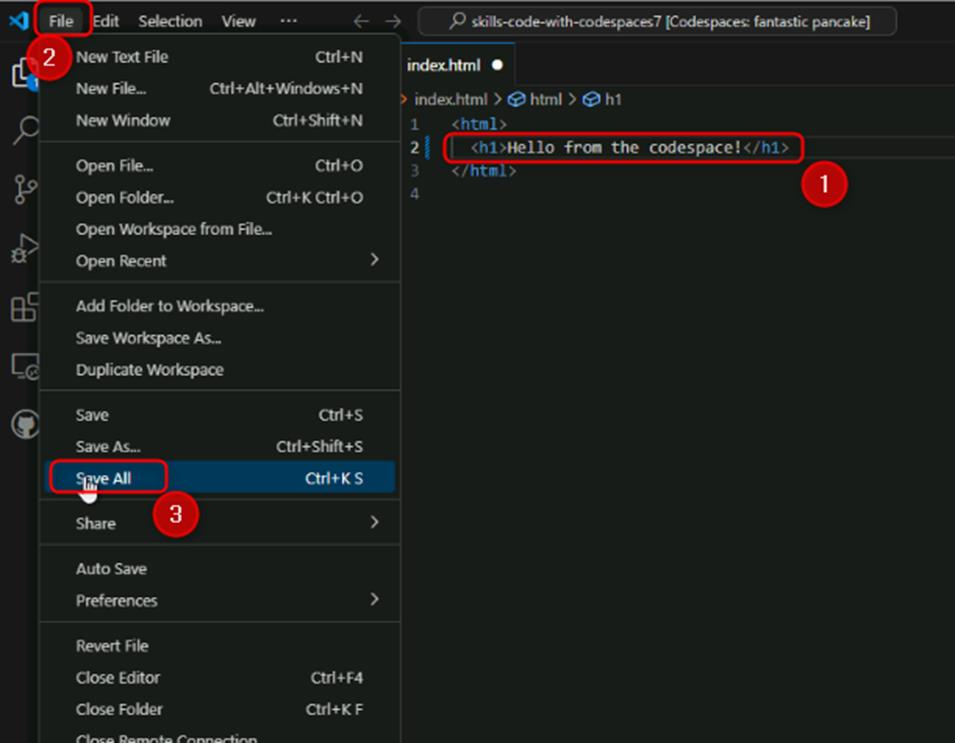

4.  VS Code 터미널을 사용하여 다음 커미트 메시지를 입력하여 파일
    변경사항을 커미트하세요:

git commit -a -m "Adding hello from the codespace!"

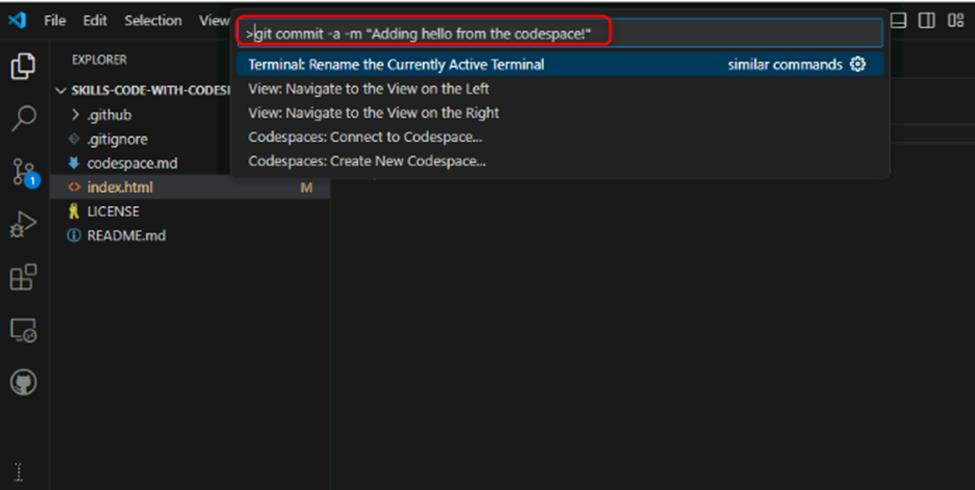

5.  변경 내용을 리포지토리로 다시 푸시하세요. VS Code 터미널에서
    입력하세요:

git push

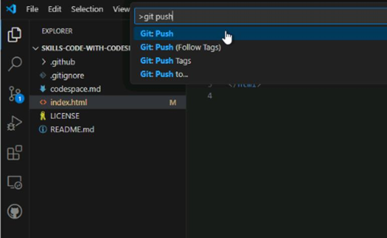

6.  VS의 새 코드가 리포지토리로 푸시되었습니다.!

7.  리포지토리의 홈페이지로 다시 전환하고 index.html를 보고 새 코드가
    리포지토리에 푸시되었는지 확인하세요.

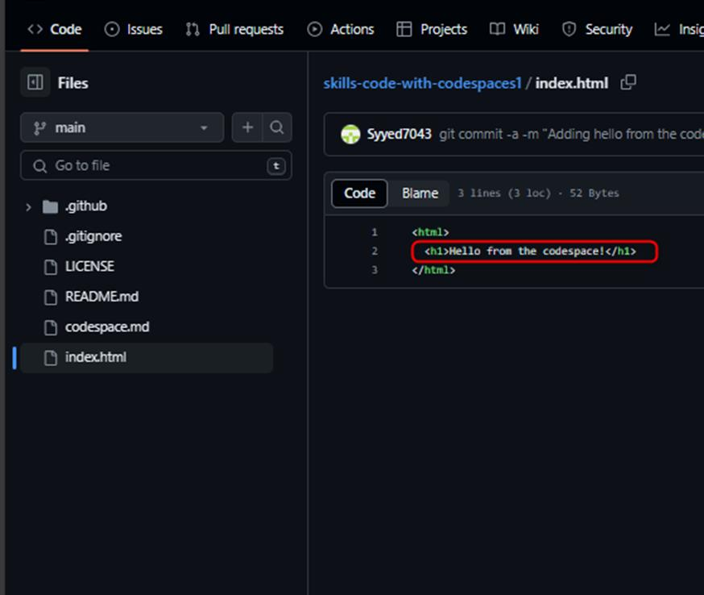

8.  약 20초 동안 기다린 후 이 GitHub Actions를 새로 고치면 다음 단계로
    자동으로 업데이트됩니다.

요약:

이제 GitHub Codespaces 및 Visual Studio Code를 사용하여

- 미리 정의된 템플릿을 사용하여 GitHub Codespace 생성하고 시작했습니다.

- 리포지토리에 코드 푸시: 코드 변경 내용을 codespace에서 GitHub
  리포지토리로 푸시하여 개발 작업을 버전 제어와 통합하는 기능을 강화하는
  연습했습니다.
