**실습 08: GitHub Action을 생성하고 워크플로우를 사용하기**

목표:

반복적인 작업을 자동화하여 소프트웨어 개발 프로세스를 간소화하려는 개발
팀의 일원입니다. 효율성을 높이기 위해 GitHub 리포지토리 내에서 직접
테스트, 배포 및 코드 검토와 같은 작업을 자동화할 수 있는 GitHub
Actions를 활용하기로 결정했습니다. GitHub Action을 설정하고 이를
워크플로에 통합하면 필수 작업이 자동으로 수행되도록 하여 시간을 절약하고
수동 작업을 줄일 수 있습니다.

이 실습에서는 다음을 수행할 것입니다:

- .github/workflows 디렉터리에 워크플로 파일을 설정하고, 콘텐츠를
  정의하고, 워크플로를 트리거하는 이벤트를 지정하세요.

- 리포지토리에 워크플로 파일을 추가하고 커밋하여 GitHub Actions를 개발
  프로세스에 통합하는 연습하세요.

연습 \#1: 공개 템플릿에서 새 리포지토리를 생성하기

1.  다음 링크로
    이동하세요: https://github.com/skills/hello-github-actions

이 실습에서는 공개 템플릿 "**skills-hello-github-actions**"를 사용하여
리포지토리를 생성할 것입니다.

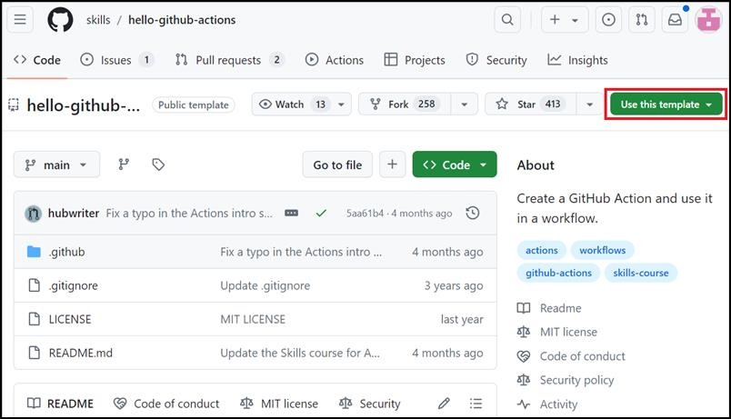

2.  **Use this template** 메뉴에서 **Create a new repository**를
    선택하세요.

3.  다음 세부 정보를 입력하고 **Create Repository**를 선택하세요.

    - 리포지토리 이름: **skills-hello-github-actions**

    - 리포지토리 유형: **Public**

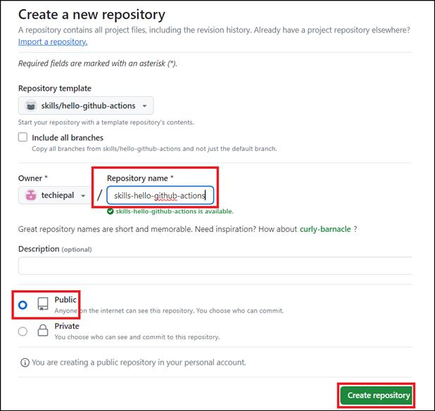

연습 \#2: 워크플로우 파일을 생성하기

1.  새로 생성한 리포지토리의 랜딩 페이지에서 **Pull requests** 탭으로
    이동하세요.

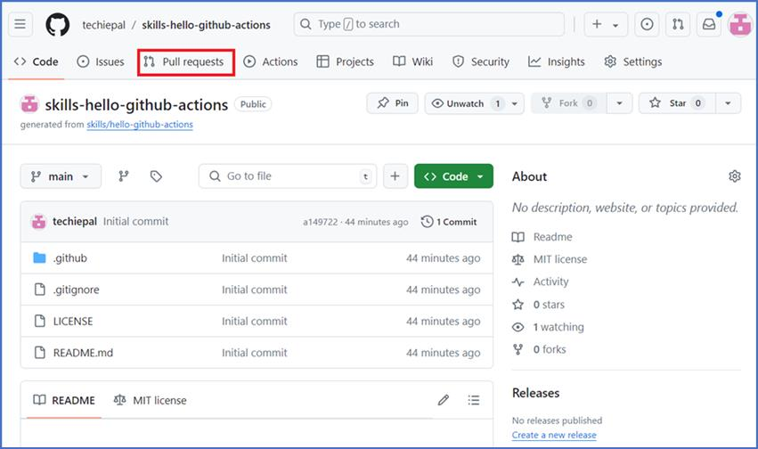

2.  다음 페이지에서 **New pull request** 버튼을 클릭하세요.

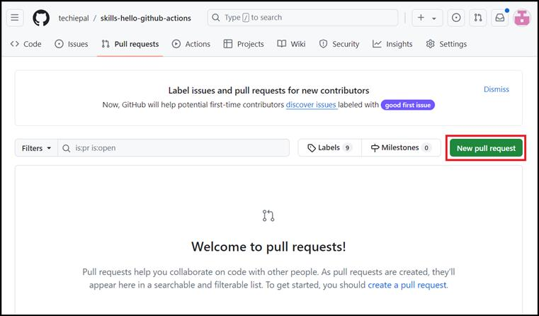

3.  **Compare changes** 페이지에서 **base: main** 및 **compare:
    welcome-workflow**를 선택하고 **Create pull request**를 클릭하세요.

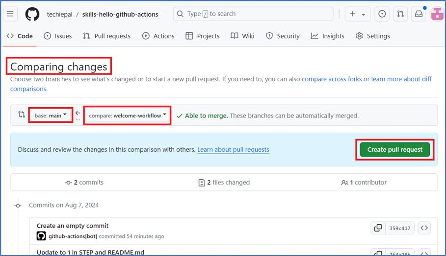

4.  **Open a pull request** 패이지에서 **Create pull request**를
    클릭하세요.

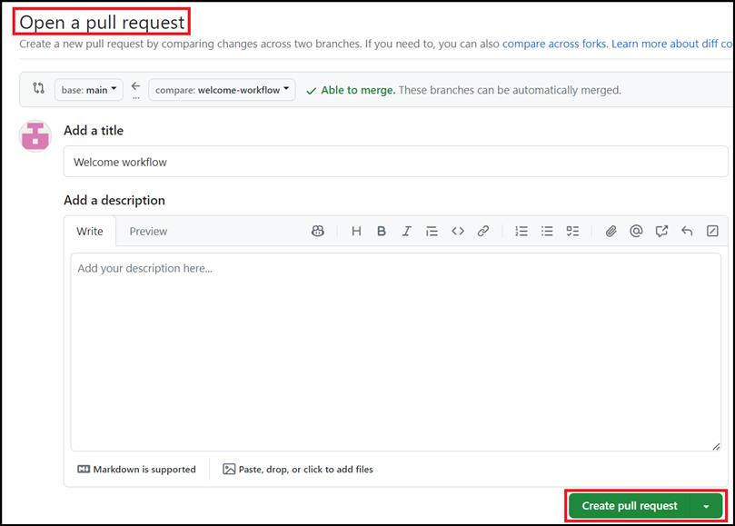

5.  **Code** 탭으로 이동하세요.

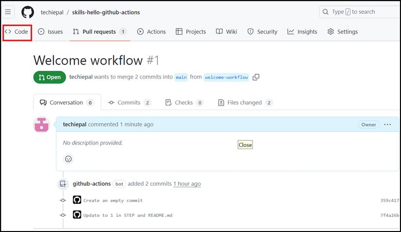

6.  다음 페이지의 **main branch dropdown**에서
    **welcome-workflow** 분기를 클릭하세요.

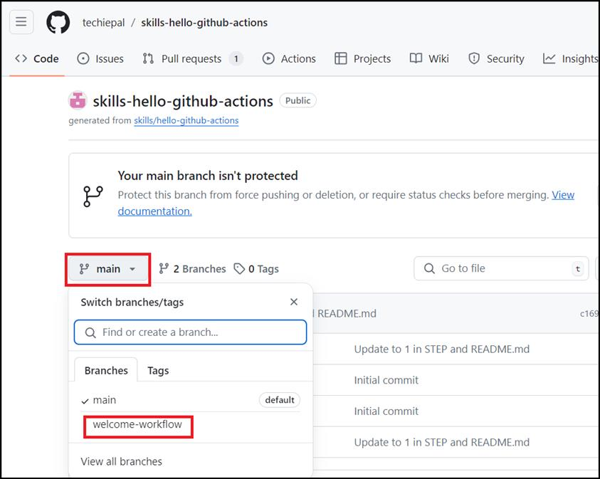

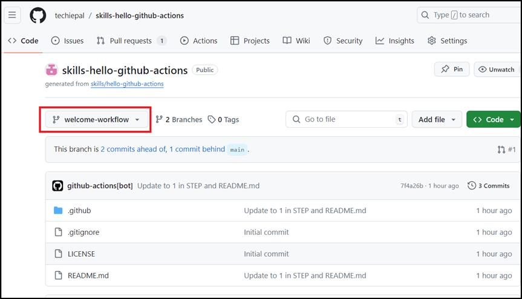

7.  기본 분기가 **welcome-workflow**로 변경되면 **.github/workflows**
    폴더로 이동하고 **Add file**을 선택하고 **Create new file**를
    클릭하세요.

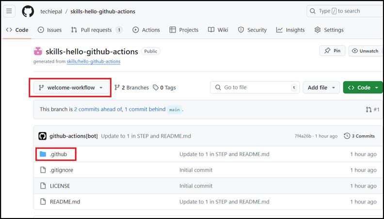

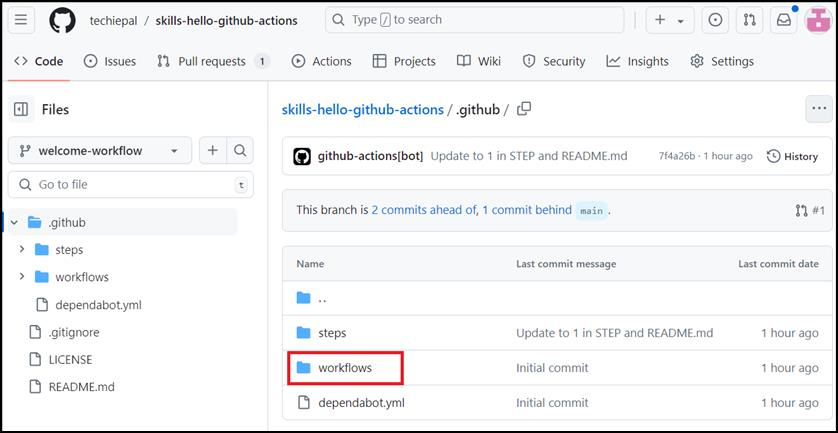

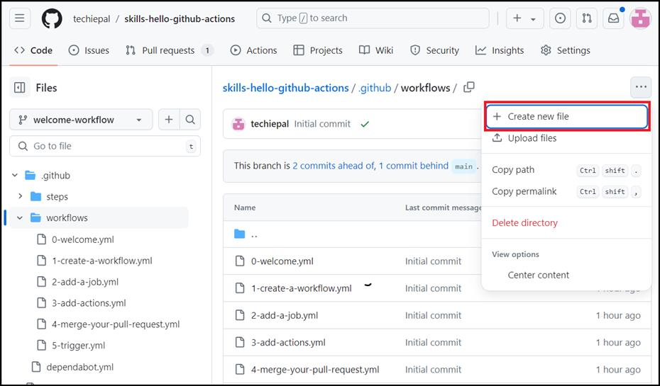

8.  파일 생성 페이지에서 파일 이름을 welcome.yml로 입력하세요.

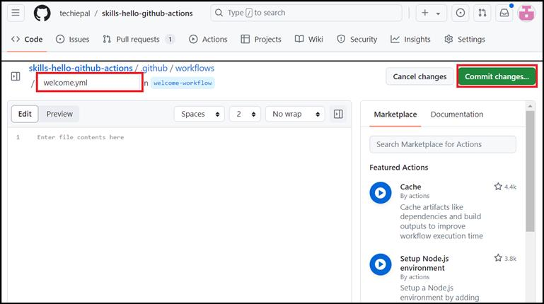

9.  편집기 페이지에서 welcome.yml 파일에 다음 콘텐츠를 추가하고 **Commit
    changes**를 클릭하세요.

10. name: Post welcome comment

11. on:

12. pull_request:

13. types: \[opened\]

14. permissions:

pull-requests: write

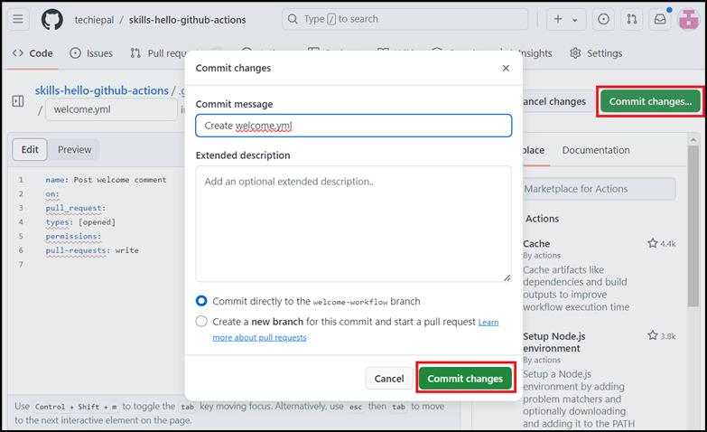

15. **Commit changes** 페이지에서 **commit changes**를 클릭하세요.

16. 작업이 실행될 때까지 20초 동안 기다린 후 새로 고치면 작업이 자동으로
    이 단계를 닫습니다.

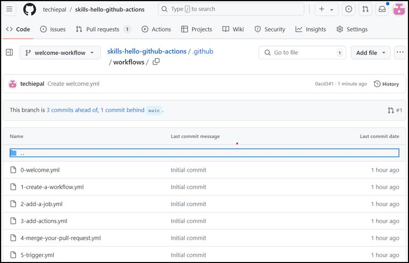

요약:

이제 GitHub Actions 설정 및 관리에 대한 실무 경험을 쌓아 소프트웨어 개발
워크플로를 자동화하고 최적화하는 능력을 향상시켰습니다.
