**실습 09: 프로젝트에 Continuous Integration (CI)를 사용하기 위한
워크플로 생성하기**

목표:

고품질 표준을 유지하는 것이 중요한 소프트웨어 프로젝트를 진행하고
있습니다. 코드가 강력하고 오류가 없도록 하려면 GitHub Actions를 사용하여
Continuous Integration (CI)를 구현하기로 결정합니다. CI는 코드베이스가
변경될 때마다 테스트를 실행하고 코드 품질을 확인하는 프로세스를
자동화하는 데 도움이 됩니다. CI 워크플로를 생성하면 Markdown 파일을
자동으로 린트하고, 테스트를 실행하고, 코드 품질에 대한 즉각적인 피드백을
받아 프로젝트가 품질 표준을 일관되게 충족하도록 할 수 있습니다.

이 실습에서는 다음을 수행할 것입니다:

- 테스트 워크플로 생성: Markdown 파일을 린트하고 서식 문제를 확인하도록
  특별히 설계된 GitHub Actions 워크플로 설정하기

- 워크플로우를 구성 및 업데이터: 자동화된 린팅에 필요한 작업과 단계를
  정의하도록 워크플로 파일을 구성하고 필요에 따라 업데이트하여 기능을
  향상시키는 연습하기

- 풀 리퀘스트 생성: 끌어오기 요청을 생성하여 변경 사항을 통합하여 CI
  워크플로를 테스트하고 품질 검사를 자동화하는 방법을 관찰하기

- CI 워크플로의 결과를 분석하여 문제를 보고하고 코드 품질을 보장하는
  방법을 이해하기

연습 \#1: 공개 템플릿에서 새 리포지토리를 생성하기

1.  다음 링크로 이동하세요: https://github.com/skills/test-with-actions

이 실습에서는 공개 템플릿 "**skills-test-with-actions**"를 사용하여
리포지토리를 생성할 것입니다.

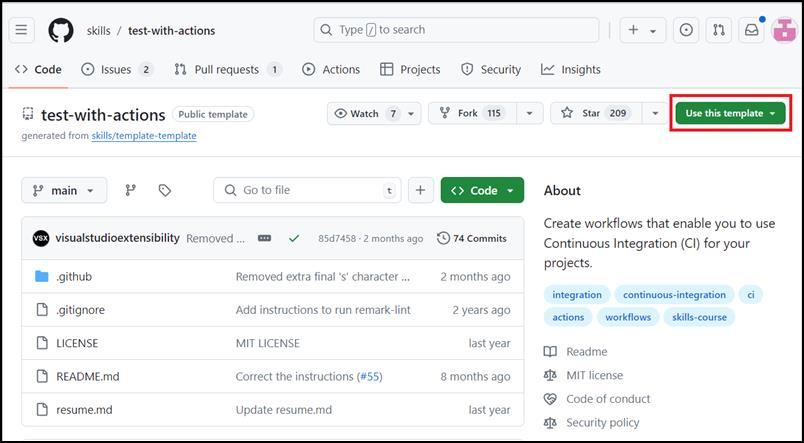

2.  **Use this template** 메뉴에서 **Create a new repository**를
    선택하세요.

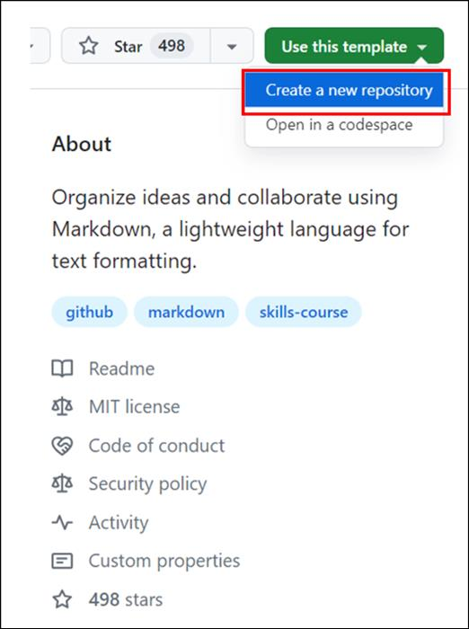

3.  다음 세부 정보를 입력하고 **Create Repository**를 선택하세요.

    - 리포지토리 이름: **skills-test-with-actions**

    - 리포지토리 유형: **Public**

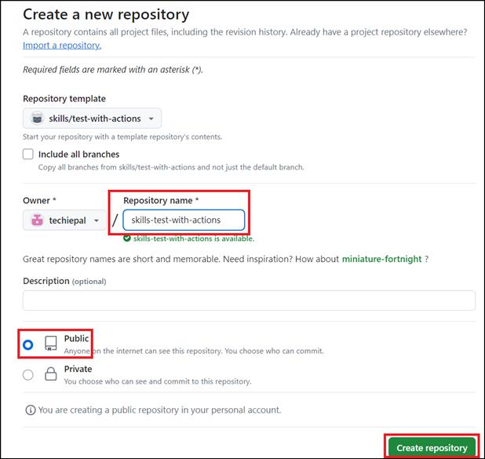

연습 \#2: 테스트 워크플로우를 추가하기

1.  얼마 전에 생성한 리포지토리의 Actions 탭으로 이동하세요.

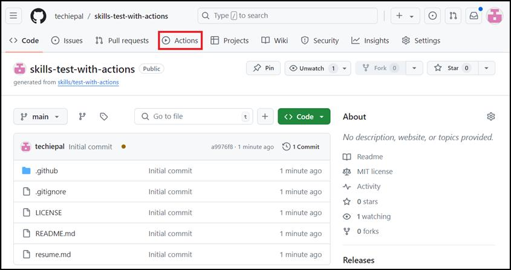

2.  왼쪽 사이드바의 Actions에서 **New workflow**를 선택하세요.

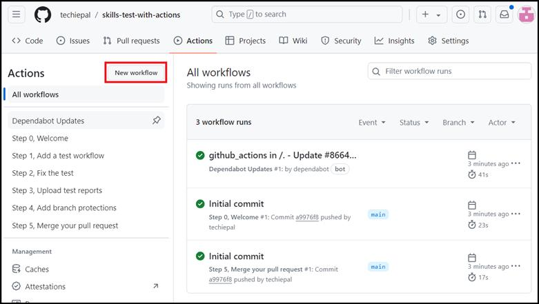

3.  **Choose a workflow** 페이지에서 "**Simple workflow**"로 이동하고
    **Configure**를 클릭하세요.

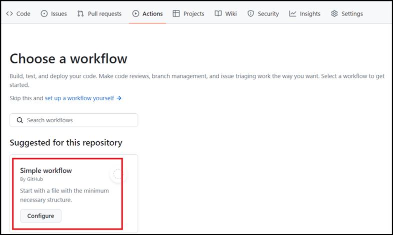

4.  다음 페이지에서 워크플로우의 이름을 ci.yml로 변경하고 다음 두개의
    단계를 삭제하고 워크플로우를 업데이트하세요.

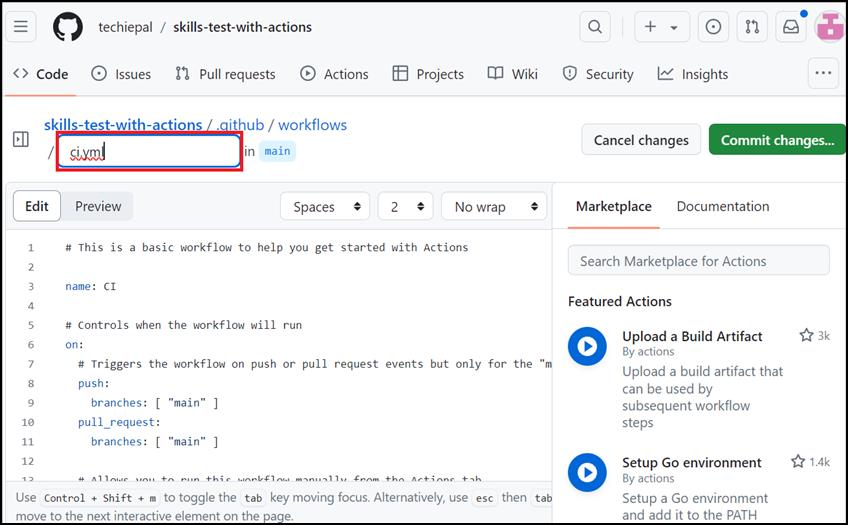

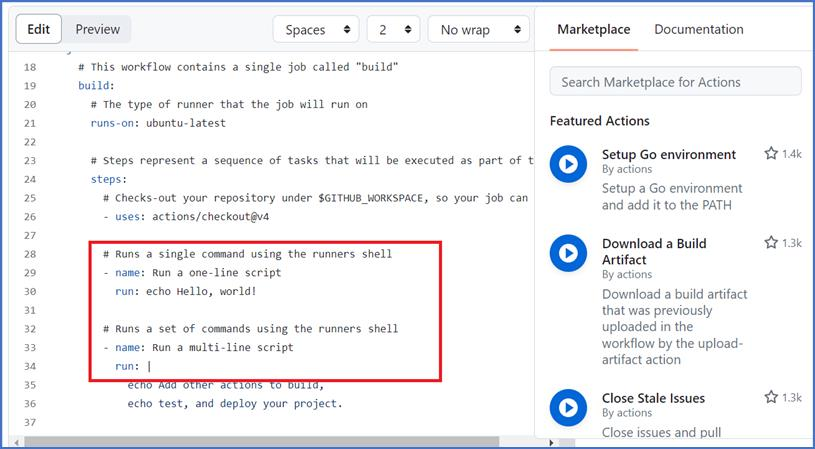

5.  워크플로 끝에 다음 코드를 추가하고 오른쪽 상단의 **Commit
    changes**를 클릭하세요.

6.  \- name: Run markdown lint

7.  run: \|

8.  npm install remark-cli remark-preset-lint-consistent

npx remark . --use remark-preset-lint-consistent

**참고:** 워크플로에 추가된 코드 조각이 제대로 들여쓰기되었는지
확인하세요

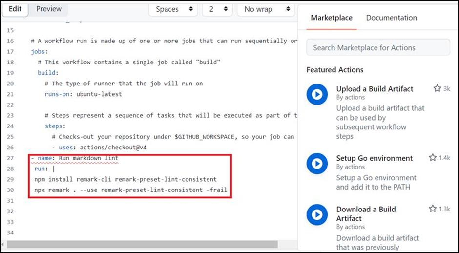

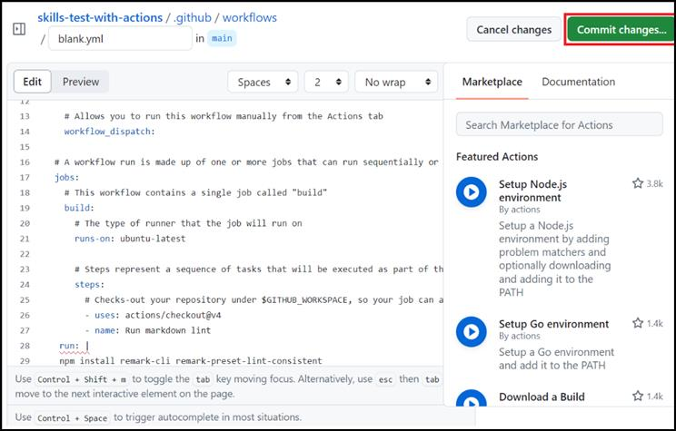

9.  **Commit changes** 창에서 **Create a new branch for this commit and
    start a pull request**를 선택하세요.

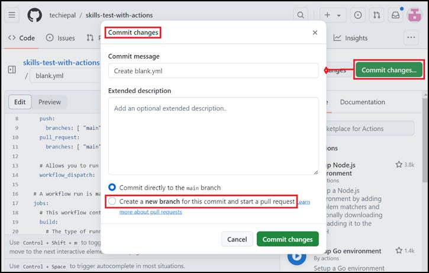

10. Once **Create a new branch for this commit and start a pull
    request**가 선택되면 **Commit changes** 창이 **Propose
    Changes** 창으로 바꿉니다. 지금 **Propose changes**를 클릭하세요.

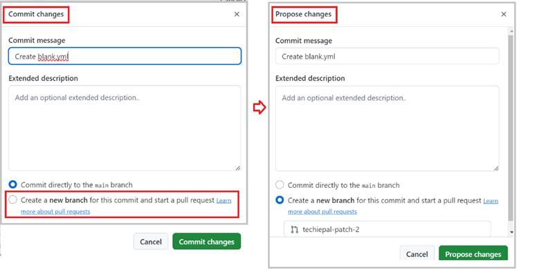

11. **Open a pull request**의 다음 페이지에서 **Create pull request**를
    클릭하세요.

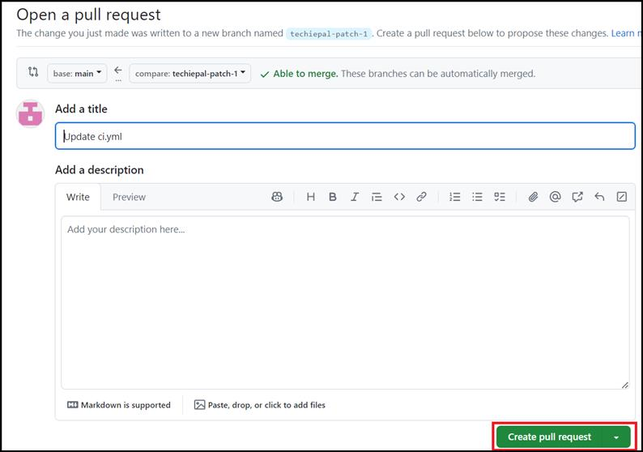

12. 20초 동안 기다린 후 이 페이지를 새로 고쳐 결과를 분석하세요.

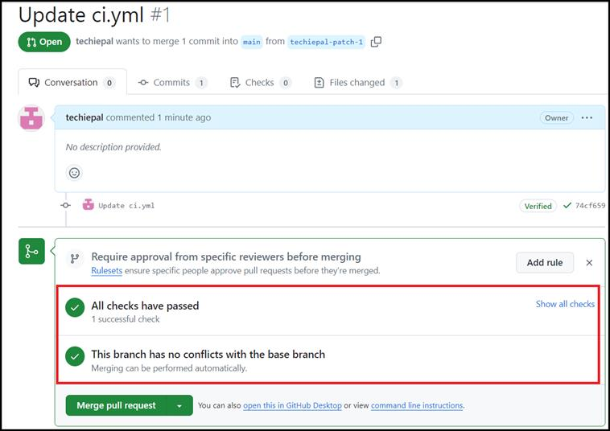

요약:

이제 GitHub Actions을 사용하여 CI 관행에 대한 실무 경험을 쌓아
스프트웨어 프로젝트에서 고품질 표준을 자동화하고 유지하는 능력을
향상시켰습니다.
