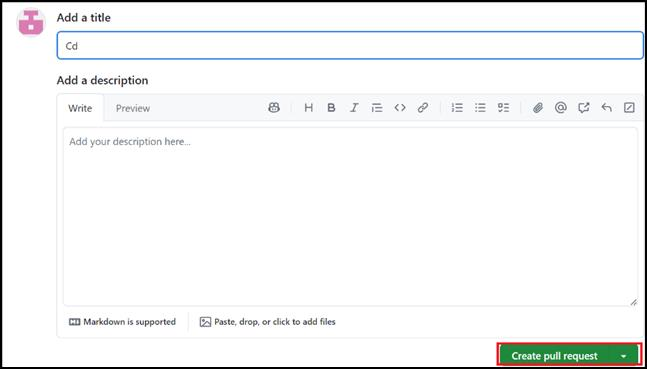

**실습 10: GitHub Actions을 사용하여 Docker 이미지에 프로젝트 게시하기**

목표:

Docker 이미지로 패키징하고 배포하려는 소프트웨어 프로젝트를 개발하고
있습니다. 배포 프로세스를 간소화하고 Docker 이미지가 GitHub Packages에
일관되게 게시되도록 하려면 자동화를 위해 GitHub Actions를 사용하기로
결정합니다. 이를 통해 변경 사항이 있을 때마다 Docker 이미지 게시를
자동화하는 워크플로를 설정하여 프로젝트가 항상 최신 상태로 유지되고
배포에 사용할 수 있도록 할 수 있습니다.

이 실습에서는 다음을 수행할 것입니다:

- Docker 이미지를 빌드하고 게시하고 프로세스를 자동화하는 GitHub Actions
  워크플로우 파일을 설정하기

- Docker 이미지를 빌드하고 GitHub Packages에 푸시하도록 워크플로우를
  구성하여 이미지가 올바르게 게시되었는지 확인하기

- 풀 리퀘스트를 생성하고 변경한 내용을 모두 확인하기

연습 \#1: 공개 템플릿에서 새 리포지토리를 생성하기

1.  다음 링크로 이동하세요: https://github.com/skills/publish-packages

이 실습에서는 공개 템플릿 "**skills-publish-packages**"를 사용하여
리포지토리를 생성할 것입니다.

2.  **Use this template** 메뉴에서 **Create a new repository**를
    선택하세요.

3.  다음 세부 정보를 입력하고 **Create Repository**를 선택하세요.

    - 리포지토리 이름: **skills-publish-packages**

    - 리포지토리 유형: **Public**

연습 2: 워크플로우 파일을 생성하고 워크플로우를 구성하기

1.  방금 생성한 리포지토리의 기본 탐색 모음에서 **Code** 버튼을
    클릭하세요.

2.  **main** 분기 드롭다운에서 **cd** 분기를 선택하세요.

3.  다음 페이지에서 **.github/workflows/** 플더로 이동하고 **Add
    file**을 선택하고 **Create new file**을 클릭하세요.

4.  **Name your file** 필드에서 publish.yml을 입력하세요.

5.  다음 코드를 **publish.yml** 파일에 추가하세요.

6.  name: Publish to Docker

7.  on:

8.  push:

9.  branches:

10. \- main

11. permissions:

12. packages: write

13. contents: read

14. jobs:

15. publish:

16. runs-on: ubuntu-latest

17. steps:

18. \- name: Checkout

19. uses: actions/checkout@v4

20. \# Add your test steps here if needed...

21. \- name: Docker meta

22. id: meta

23. uses: docker/metadata-action@v5

24. with:

25. images: ghcr.io/YOURNAME/publish-packages/game

26. tags: type=sha

27. \- name: Login to GHCR

28. uses: docker/login-action@v3

29. with:

30. registry: ghcr.io

31. username: \${{ github.repository_owner }}

32. password: \${{ secrets.GITHUB_TOKEN }}

33. \- name: Build container

34. uses: docker/build-push-action@v5

35. with:

36. context: .

37. push: true

tags: \${{ steps.meta.outputs.tags }}

38. YOURNAME을 사용자 이름으로 바꾸세요.

39. 이미지 이름이 고유한지 확인하고 **Commit changes**를 클릭하세요.

40. **Commit change를** 다시 클릭하세요.

41. 이제 끌어오기 요청을 만들어 위의 연습에서 변경한 모든 내용을
    확인합니다.

42. 탐색 바에서 **Pull Requests** 탭을 클릭하세요.

43. **New pull request**를 클릭하세요.

44. **Comparing changes** 페이지에서 **base**: main 및 **compare**:cd를
    설정하고 **Create pull request**를 클릭하세요**.**

45. **Add a title** 페이지에서 **Create pull request**를 클릭하세요**.**

46. 작업이 실행될 때까지 20초 동안 기다렸다가 결과를 검토하세요.

요약:

이제 GitHub Actions을 사용하여 Docker 이미지 게시를 자동화하고 배포
프로세스를 간소화하고 최신 프로젝트 배포를 유지하는 능력을 향상시키는
실무 경험을 쌓았습니다.
