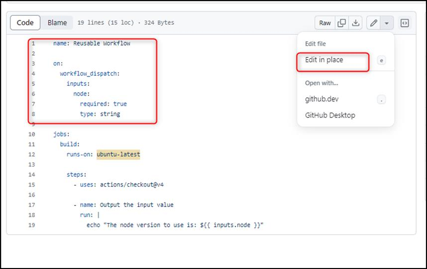

**实验 11：使工作流可重用并使用矩阵策略运行多个版本的节点**

目标：

想象一下，您正在管理一个项目中的多个存储库，这些存储库共享构建、测试和部署等任务的通用工作流。为了避免冗余并在这些存储库之间保持一致性，您决定使用
GitHub Actions
实现可重用的工作流。通过利用工作流调用触发器，您可以集中工作流配置，确保在一个地方进行更改并自动应用于所有相关存储库。此外，您将利用矩阵策略来测试具有多个版本的Node.js的工作流程，从而提高兼容性和可扩展性。

在这个动手实验室中，你将：

- 使用 workflow_call
  触发器使您的工作流可在多个存储库中重用，从而减少配置冗余。

- 导航到存储库，更新工作流文件以包含workflow_call触发器，然后提交更改。

- 创建拉取请求以比较更改和异常。

练习 \#1：创建一个新存储库。

1.  浏览到以下链接：https://github.com/skills/reusable-workflows

在本练习中，你将使用公共模板“**skills-reusable-workflows**”创建存储库。

2.  选择“**Use this template** ”菜单下的“**Create a new
    repository** ”。 

3.  输入以下详细信息，然后选择 **Create Repository**。

    1.  存储库名称：**skills-reusable-workflows**

<!-- -->

1.  存储库类型: **Public**

练习 \#2：将workflow_call触发器添加到工作流

1.  在新创建的存储库的登录页上，导航到“**Code**”选项卡\*\*。

2.  从 main 分支下拉列表中，选择 “**reusable-workflow**”分支。

3.  更改分支后，导航到 **.github/workflows/** 文件夹，然后选择
    **reusable-workflow.yml** 文件。

4.  在 **reusable-workflow.yml** 文件编辑器上，选择 **Edit in place**。

5.  将 **workflow_dispatch** 事件触发器替换为 **workflow_call**
    事件触发器，然后单击“**Commit changes**”。

**注意：**将 **Line \#3** 到 **Line \# 8** 的代码块替换为下面的代码块

on:

workflow_call:

inputs:

node:

required: true

type: string

6.  在“**Commit changes** ”窗口中，单击“**Commit changes**”。

练习 \#3：创建拉取请求以查看上一个练习中所做的更改

1.  选择“**Pull requests** ”选项卡，然后单击“**New pull request**”。 

2.  在“**Comparing changes page**”页上，将 **base** 设置为 **main**，将
    **compare** 设置为 **reusable-workflow**。 

3.  在“**Open a pull request** ”页上，单击“**Create pull request**”。

4.  等待 20 秒，让作运行并查看结果。

总结：

现在，你已经获得了创建高效、可重用的工作流并使用 GitHub Actions
针对各种环境进行优化的实践经验。

