**실습 12: GitHub Actions 및 Microsoft Azure를 사용하여 배포
워크플로우를 생성하기**

목표:

스테이징 및 프로덕션을 포함한 여러 환경을 포함하는 복잡한 배포 요구
사항이 있는 소프트웨어 프로젝트를 관리하고 있습니다. 배포 프로세스를
간소화하고 일관성을 보장하기 위해 GitHub Actions 및 Microsoft Azure를
사용하여 자동화하기로 결정합니다. 배포 워크플로우를 구성하면 풀
리퀘스트에 적용된 레이블을 기반으로 트리거는 환경 스핀업, 스테이징에
배포 및 환경 해체를 자동으로 처리합니다. 이 접근 방식은 효율성을
유지하고 배포 파이프라인에서 수동 개입을 줄이는 데 도움이 됩니다.

이 실습에서는 다음을 수행할 것입니다:

- 풀 리퀘스트에 특정 레이이 적용될 때 Azure 리소스를 사용하여 환경을
  자동으로 생성하고 설정하도록 워크플로우를 구성하기

- 적절한 레이블을 받으면 프로젝트를 스테이징 환경에 자동으로 배포하도록
  워크플로우 내에서 배포 작업을 설정하기

연습 1: 새 리포지토리를 생성하기

1.  다음 링크로 이동하세요: <https://github.com/skills/deploy-to-azure>

이 실습에서는 공개 템플릿 **skills-deploy-to-azure**를 사용하여
리포지토리를 생성할 것입니다.

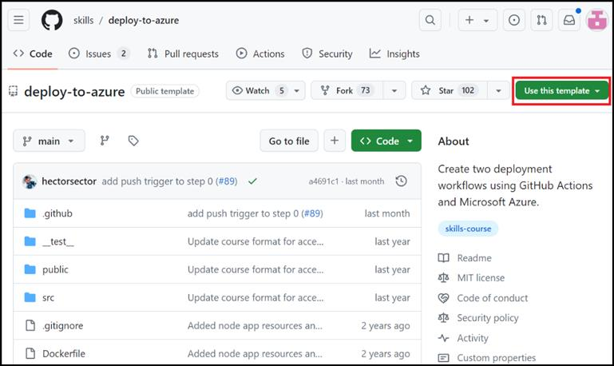

2.  **Use this template** 메뉴에서 **Create a new repository**를
    선택하세요.

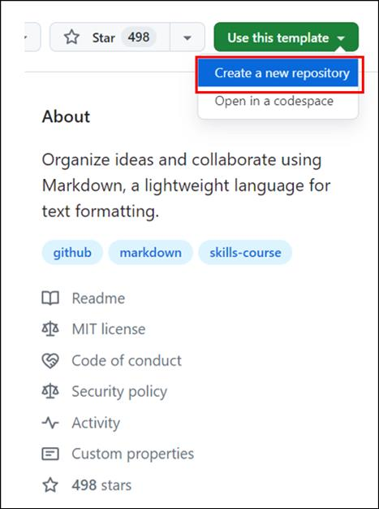

3.  다음 세부 정보를 입력하고 **Create Repository**를 선택하세요.

    - 리포지토리 이름: **skills-deploy-to-azure**

    - 리포지토리 유형: **Public**

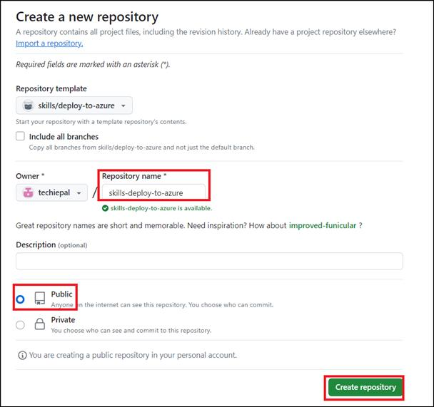

연습 2: GITHUB_TOKEN 권한 구성하기

각 워크플로우 실행이 시작될 때 GitHub는 워크플로우에서 사용할 고유한
GITHUB_TOKEN 비밀을 자동으로 생성합니다. 이 토큰에 필요한 권한이 있는지
확인해야 합니다.

1.  새로 생성된 리포지토리의 랜딩
    페이지에서 **Settings** \> **Actions** \> **General**로 이동하세요.

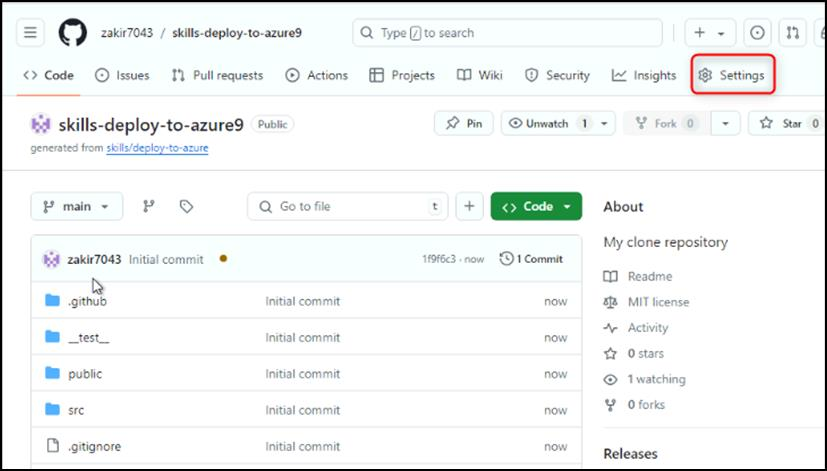

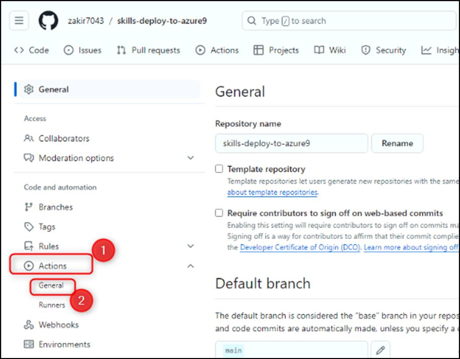

2.  **Workflow permissions**까지 아래로 스크롤하여 **Read and write
    permissions**을 활성화하고 **Save**를 클릭하세요.

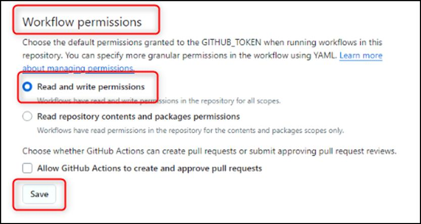

**참고:** 이는 워크플로우가 이미지를 컨테이너 레지스트리에 업로드하는 데
필요합니다.

연습 3: 레이블을 기반으로 트리거 구성하기

1.  탐색 바에서 **Actions** 탭으로 이동하세요.

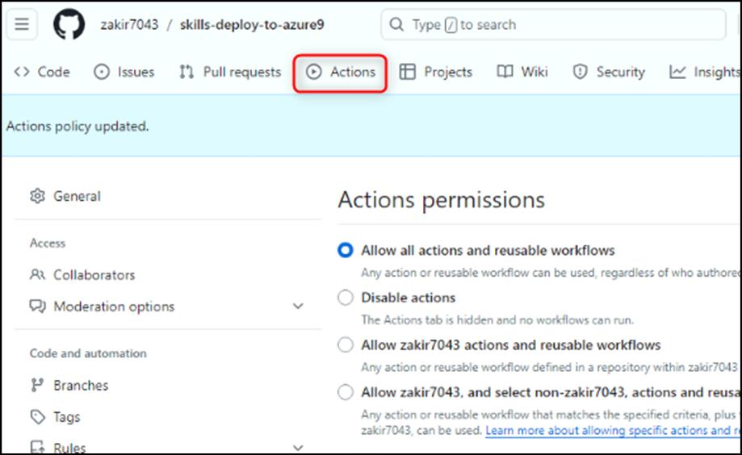

2.  **Actions** 페이지에서 왼쪽의 탐색 창에서 **New workflow**를
    클릭하세요.

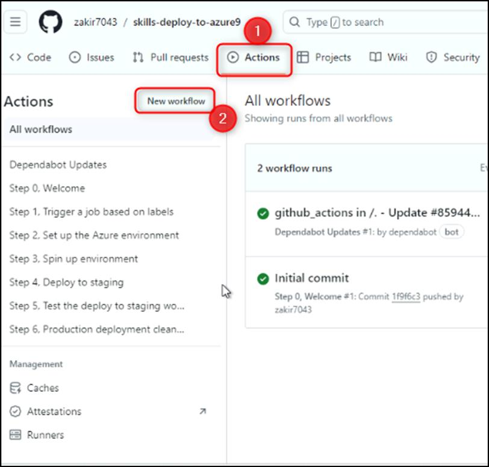

3.  **Choose a workflow** 페이지에서 \\**simple workflow**\\를
    검색하고 **Configure**를 클릭하세요.

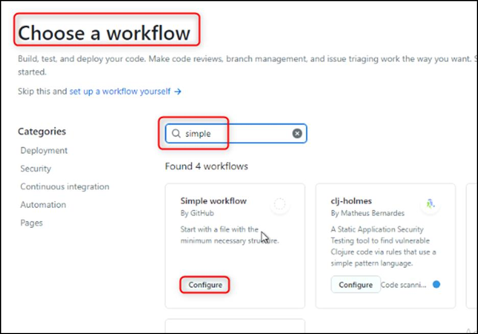

4.  워크플로우 이름을 deploy-staging.yml로 입력하세요

5.  편집기 페이지에서 파일의 내용을 편집하고 모든 트리거 및 작업을
    제거하세요. 결과 파일을 아래와 같이 표시됩니다.

6.  name: Stage the app

7.  on:

8.  pull_request:

9.  types: \[labeled\]

10. jobs:

11. build:

12. runs-on: ubuntu-latest

if: contains(github.event.pull_request.labels.\*.name, 'stage')

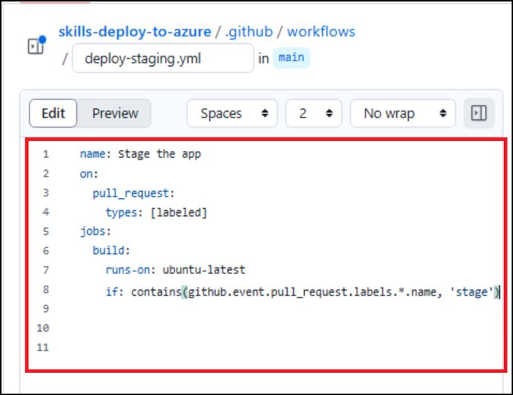

**참고:** 추가된 코드 조각이 스크린샷과 같이 제대로 들여쓰기되었는지
확인하세요.

13. 페이지 오른쪽 상단의 **Commit changes** 버튼을 클릭하세요.

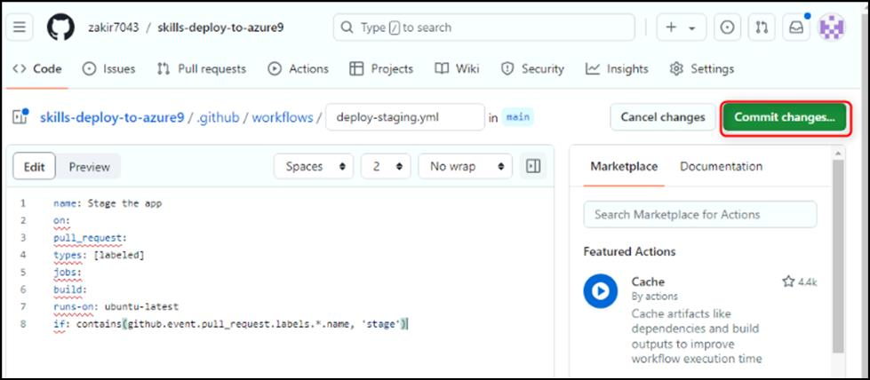

14. **Commit Changes** 창에서 **Create a new branch for this commit and
    start a pull request**를 선택하세요.

**참고:** **Commit changes** 창이 **Propose Changes**로 변경합니다.

**new branch**를 **staging-workflow**로 입력하고 **Propose changes**를
클릭하세요.

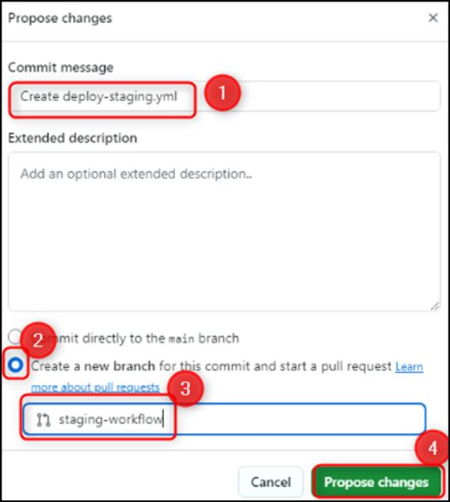

15. **Open a pull request**의 다음 페이지에서 **Create pull request**를
    클릭하세요.

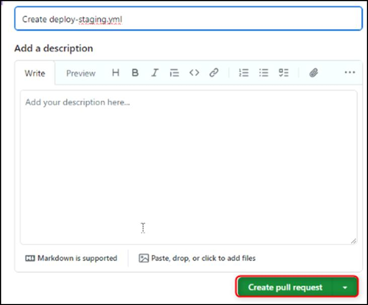

16. 작업이 실행될 때까지 20초 동안 기다렸다가 결과를 검토하세요.

요약:

이제 GitHub Actions를 사용하여 배포 워크플로우를 자동화하여 배포
프로세스의 효율성과 안정성을 향상시키는 실무 경험을 쌓았습니다.
