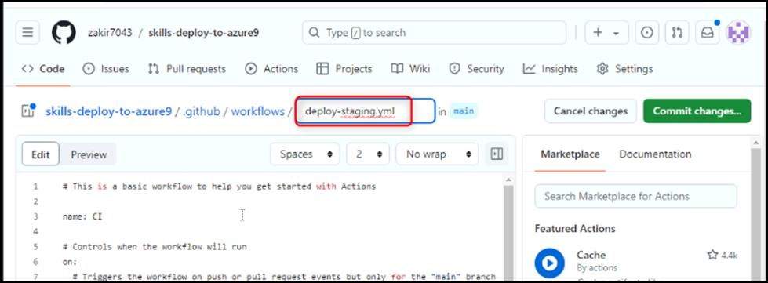

**实验室 12：使用 GitHub Actions 和 Microsoft Azure 创建部署工作流**

目标：

想象一下，您正在管理一个具有复杂部署要求的软件项目，该项目涉及多个环境，包括暂存和生产。为了简化部署过程并确保一致性，您决定使用
GitHub Actions 和 Microsoft Azure
自动执行部署过程。通过配置部署工作流，可以根据应用于拉取请求的标签设置触发器，这些触发器将自动处理启动环境、部署到暂存和拆除环境。这种方法有助于保持效率并减少部署管道中的手动干预。

在这个动手实验室中，您将:

- 将工作流配置为在将特定标签应用于拉取请求时使用 Azure
  资源自动创建和设置环境。

- 在工作流中设置部署任务，以便在收到相应的标签后自动将项目部署到暂存环境。

练习 1：创建新存储库

1.  浏览到以下链接：https://github.com/skills/deploy-to-azure

在本实验室中，你将使用公共模板 **skills-deploy-to-azure** 创建存储库

2.  选择“**Use this template** ”菜单下的“**Create a new repository**”。 

3.  输入以下详细信息，然后选择**Create Repository**。

    - 存储库名称：**skills-deploy-to-azure**

    <!-- -->

    - 存储库类型：**Public**

练习 2：配置GITHUB_TOKEN权限

在每次工作流运行开始时，GitHub
会自动创建一个唯一的GITHUB_TOKEN机密以在工作流中使用。我们需要确保此令牌具有所需的权限。

1.  在新创建的存储库的登录页面上，转到**“Settings \> Actions \> General**”。

2.  向下滚动到 **Workflow permissions** 并启用 **Read and write
    permissions** ，然后单击 **Save**。

**注意：**这是工作流将映像上传到容器注册表所必需的。

练习 3：根据标签配置触发器

1.  在导航栏上，转到“**Actions ”**选项卡

2.  在 **Actions** 页面上，单击左侧导航窗格中的 **New workflow**。 

3.  在“**Choose a workflow**”页上，搜索 \\**simple
    workflow**\\，然后单击“**Configure**” 

4.  将工作流命名为 deploy-staging.yml

5.  在编辑器页面中，编辑文件的内容并删除所有触发器和作业。生成的文件如下所示。

6.  name: Stage the app

7.  on:

8.  pull_request:

9.  types: \[labeled\]

10. jobs:

11. build:

12. runs-on: ubuntu-latest

if: contains(github.event.pull_request.labels.\*.name, 'stage')

**注意：**请确保添加的代码片段已正确缩进，如屏幕截图所示

13. 单击页面右上角的“**Commit changes** ”按钮。 

14. 在“**Commit Changes**”窗口中，选择“**Create a new branch for this
    commit and start a pull request**”。 

**注意：Commit changes**  窗口更改为“**Propose Changes**”。

将 **new branch** 命名为 **staging-workflow**，然后单击“**Propose
changes**”。

15. 在“**Open a pull request** ”的下一页上，单击“**Create pull
    request**”。

16. 等待 20 秒，让作运行并查看结果。

总结：

现在，您已经获得了使用 GitHub Actions
自动化部署工作流程的实践经验，从而提高了部署过程的效率和可靠性。

