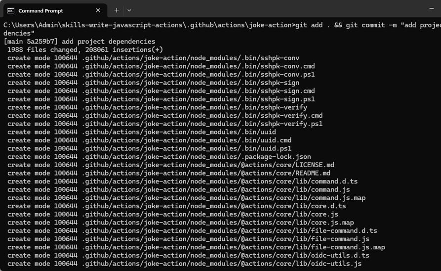

**실습 13: GitHub JavaScript Action을 작성하고 워크플로우에 고유한
사용자 지종 작업을 자동화하기**

목표:

워크플로 내에서 특정 작업을 자동화하기 위해 사용자 지정 GitHub Action을
생성하는 임무를 맡고 있습니다. 시작하려면 JavaScript Action을 작성하고
테스트하기 위한 개발 환경을 설정해야 합니다. 여기에는 새 JavaScript
프로젝트 초기화, 프로젝트 구조 구성, 필요한 종속성 설치가 포함됩니다. 이
실습의 단계를 따르면 GitHub Action 개발을 위한 견고한 기반을 구축하여
프로젝트 요구 사항에 맞는 자동화를 구축할 수 있습니다.

이 실습에서는 다음을 수행할 것입니다:

- 리포지토리 복제: 제공된 리포지토리를 로컬 컴퓨터에 복제하여 개발
  프로세스를 시작하기

- 프로젝트 폴더로 이동: 작업을 설정할 복제된 리포지토리 폴더로 이동하기

- 작업 폴더 생성: 리포지토리 내에 작업 파일을 위한 새 폴더를 설정하기

- npm 프로젝트 구현: 작업 폴더에서 새 npm 프로젝트를 초가화하여 종속성
  및 구성 관리하기

- 종속성 설치: npm을 사용하여 GitHub JavaScript Action을 개발하는 데
  필요한 종속성을 설치하기

- 작업 개발 준비: 사용자 지정 GitHub JavaScript Action 작성 및 테스트를
  시작하도록 프로젝트 환경을 구성하기

연습 1: 새 리포지토리를 생성하기0

1.  다음 링크로
    이동하세요: https://github.com/skills/write-javascript-actions

이 실습에서는 공개 템플릿 **skills-write-javascript-actions**를 사용하여
리포지토리를 생성할 것입니다.

2.  **Use this template** 메뉴에서 **Create a new repository**를
    선택하세요.

3.  다음 세부 정보를 입력하고 **Create Repository**를 선택하세요.

    - 리포지토리 이름: **skills-write-javascript-actions**

    - 리포지토리 유형: **Public**

연습 \#2: 새 JavaScript 프로젝트를 구현하기

필요한 도구를 로컬에 설지했으면 다음 단계에 따라 첫 번째 작업 생성을
시작하세요.

1.  **write-javascript-actions** 리포지토리의 랜딩
    페이지에서 **Code** (녹색) 버튼을 클릭하고 **Local** 탭에 있는 HTTPS
    URL을 복사하세요.

2.  이제 **Command prompt**를 열고 기술 리포지토리를 로컬 컴퓨터에
    복제하세요:

git clone \<this repository URL\>.git

**참고:** 일반적으로 다음 경로로 복제됩니다
"**C:\Users\Admin\skills-write-javascript-actions**"

3.  방금 복제한 폴더로 이동하세요:

cd C:\Users\Admin\skills-write-javascript-actions

4.  main이라는 분기를 사용할 것입니다.

git switch main

5.  작업 파일을 위한 새 폴더를 생성하세요:

mkdir -p .github\actions\joke-action

6.  방금 생성한 joke-action 폴더로 이동하세요:

cd .github/actions/joke-action

7.  새 프로젝트를 초기화하세요:

npm init -y

8.  GitHub ToolKit(https://github.com/actions/toolkit)에서 npm을
    사용하여 request, request-promise 및 \\actions/core 종속성을
    설치하세요:

Npm install -save request request-promise @actions/core

9.  새로 추가된 파일을 커밋하면 이후 단계에서 node_modules 업로드할
    필요가 없습니다.:

git add . && git commit -m "add project dependencies"

**참고:** 사용자 이메일과 사용자 이름을 입력하라는 메시지가 표시되면
아래 명령을 입력하여 세부 정보를 대체하세요.

git config --global user.email "your_email@example.com"

git config --global user.name "Your Name"

**참고**: 세부 정보로 바꾸세요.

10. 변경 사항을 리포지토리에 푸시: 아래 명령을 입력하고 로그인하세요.

git push

**참고:** 승인하라는 메시지가 표시되면 GitHub 계정에 로그인하고
프로세스를 계속 진행하세요.

11. GitHub Actions가 추가 처리를 위해 페이지를 자동으로 새로 고치는 동안
    약 20초 동안 기다리세요.

요약:

이제 GitHub JavaScript Action을 생성하고 관리하기 위한 강력한 개발
환경을 구축하여 워크플로우를 자동화하고 향상시키기 위한 기반을
마련했습니다.
