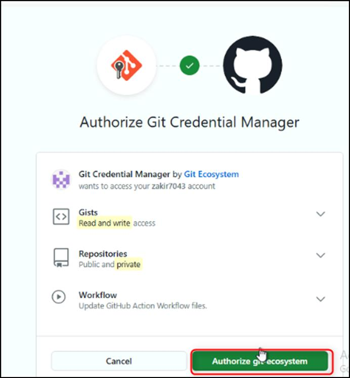

**实验 13：编写 GitHub JavaScript Action
并自动执行工作流特有的自定义任务**

目标：

想象一下，您的任务是创建一个自定义 GitHub
Action，以自动执行工作流程中的特定任务。首先，您需要设置一个开发环境来编写和测试您的
JavaScript Action。这涉及初始化一个新的 JavaScript
项目、配置项目结构以及安装必要的依赖项。通过执行本练习中的步骤，您将为开发
GitHub Action 奠定坚实的基础，从而允许您构建适合项目需求的自动化。

在这个动手实验室中，你将：

- 克隆存储库：将提供的存储库克隆到本地计算机以开始开发过程。

- 导航到项目文件夹：移动到克隆的存储库文件夹，您将在其中设置作。

- 创建作文件夹：在存储库中专门为您的作文件设置一个新文件夹。

- 初始化 npm 项目：在作文件夹中初始化一个新的 npm
  项目，以管理依赖关系和配置。

- 安装依赖项：使用 npm 安装开发 GitHub JavaScript作所需的必要依赖项。

- 准备作开发：配置您的项目环境以开始编写和测试您的自定义 GitHub
  JavaScript Action。

练习：1 创建新存储库

1.  浏览到以下链接：https://github.com/skills/write-javascript-actions

在本实验中，您将使用公共模板 **skills-write-javascript-actions**
创建存储库

2.  选择“**Use this template**”菜单下的“**Create a new repository** ”。 

3.  输入以下详细信息，然后选择 **Create Repository**。

    1.  存储库名称：**skills-write-javascript-actions**

<!-- -->

1.  存储库类型: **Public**

练习 \#2：初始化新的 JavaScript 项目

在本地安装必要的工具后，请按照以下步骤开始创建您的第一个作。

1.  在 **write-javascript-actions** 存储库的登录页面上，单击
    **Code**（绿色的）按钮，然后复制 **Local** 选项卡下的 HTTPS URL。 

2.  现在打开**Command prompt** 并将您的技能存储库克隆到本地计算机：

git clone \<this repository URL\>.git

**注意：**通常它会克隆到以下路径“**C：\Users\Admin\skills-write-javascript-actions**”

3.  导航到您刚刚克隆的文件夹：

cd C:\Users\Admin\skills-write-javascript-actions

4.  我们将使用名为 main 的分支。

git switch main

5.  为我们的作文件创建一个新文件夹:

mkdir -p .github\actions\joke-action

6.  导航到您刚刚创建的 joke-action 文件夹:

cd .github/actions/joke-action

7.  初始化新项目:

npm init -y

8.  使用 GitHub ToolKit （https://github.com/actions/toolkit） 中的 npm
    安装 request、request-promise 和 \\actions/core 依赖项：

Npm install -save request request-promise @actions/core

9.  提交这些新添加的文件，我们将在后面的步骤中消除上传node_modules的需要:

git add . && git commit -m "add project dependencies"

**注意：**如果系统提示输入用户电子邮件和用户名，请输入以下命令并替换详细信息。

git config --global user.email "your_email@example.com"

git config --global user.name "Your Name"

**注意**：替换为您的详细信息。

10. 将更改推送到存储库：输入以下命令并登录

git push

**注意：**当提示授权时，登录 GitHub 帐户并继续该过程。

11. 等待大约 20 秒，让 GitHub Actions 自动刷新页面以进行进一步处理。

总结：

您现在已经建立了一个强大的开发环境来创建和管理 GitHub JavaScript
Action，为自动化和增强工作流程奠定了基础。

