**实验室 14：保护存储库的供应链**

目标：

想象一下，您负责维护依赖于各种第三方依赖项的软件项目的安全性。为了确保项目供应链的完整性和安全性，有效了解和管理这些依赖关系至关重要。这涉及识别依赖项中的潜在漏洞并应用必要的补丁来保护您的项目。在本实验中，您将学习如何使用
GitHub
的依赖关系图功能来监控和查看依赖关系，确保您的项目保持安全和最新。

在这个动手实验室中，你将：

- 启用依赖关系图：在存储库设置中启用并验证依赖关系图功能，以可视化项目的依赖关系。

- 添加新的依赖项：向您的项目添加新的依赖项并确保其正确集成。

- 查看依赖关系图：使用依赖关系图查看并确认新依赖关系是否正确反映和监控。

练习 01：创建新存储库

1.  浏览到以下链接：https://github.com/skills/secure-repository-supply-chain

在本练习中，您将使用公共模板创建存储库
**skills-secure-repository-supply-chain**

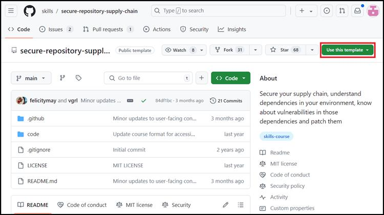

2.  选择“**Use this template** ”菜单下的“**Create a new
    repository**”。  

3.  输入以下详细信息，然后选择 **Create Repository**。

    1.  存储库名称：**skills-secure-repository-supply-chain**

<!-- -->

1.  存储库类型：**Public**

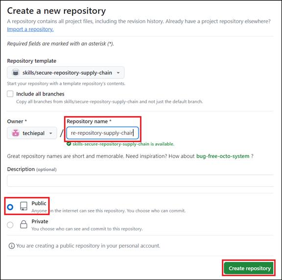

练习 02：验证是否启用了依赖关系图

1.  在新创建的存储库的登录页上，导航到“**Settings”**选项卡。

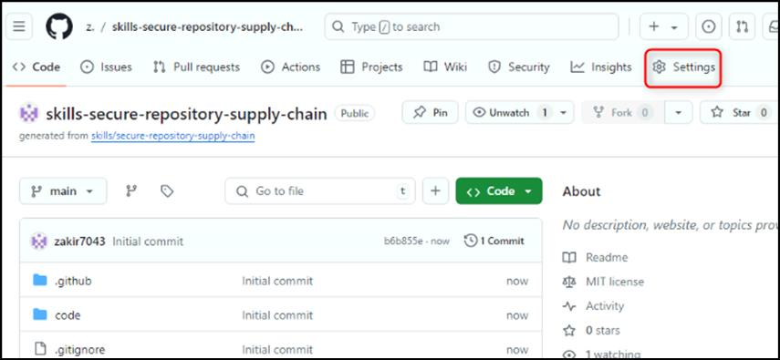

2.  在“**Settings**”页上，选择“**Security**”下可用的 **Code security and
    analysis** 。 

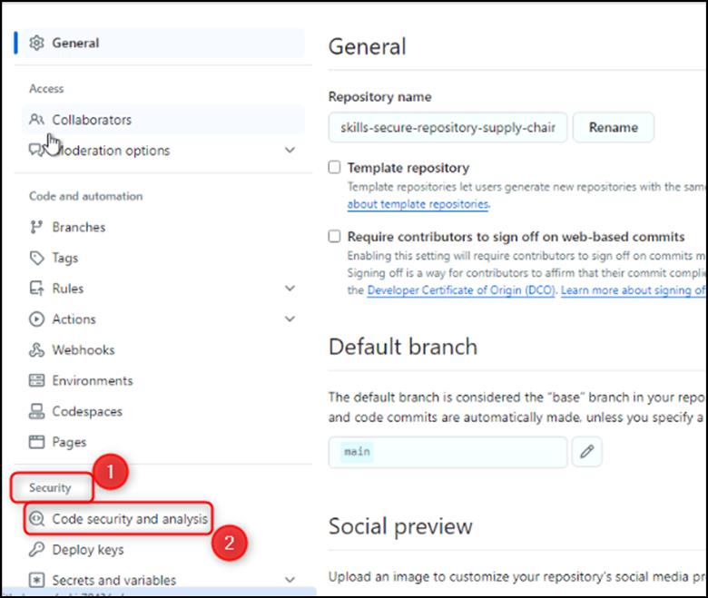

3.  验证/启用依赖关系图。（如果存储库是私有的，您将在此处启用它。如果存储库是公共的，则默认情况下将启用它）

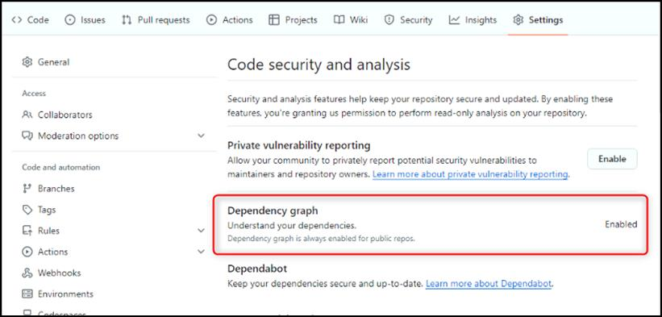

练习 03：添加新的依赖项并查看依赖关系图

1.  导航到“**Code**”选项卡并找到 **code/src/AttendeeSite** 文件夹。

**注意：**您可以浏览到该文件夹或使用 **Go to file** 搜索
code/src/AttendeeSite

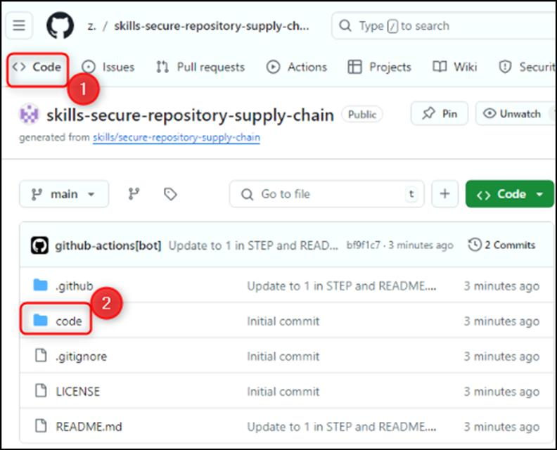

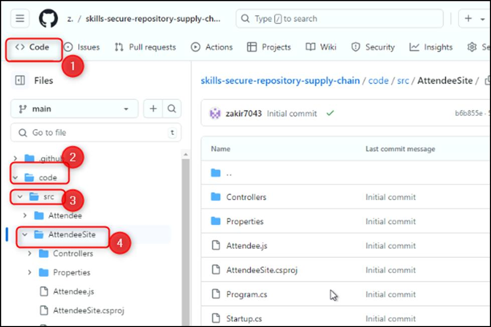

2.  打开**package-lock.json**文件。

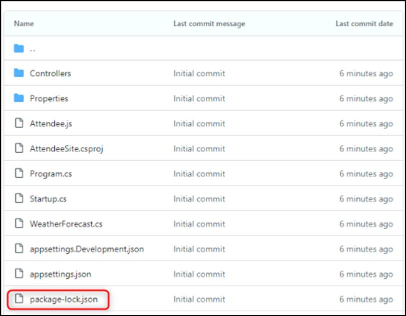

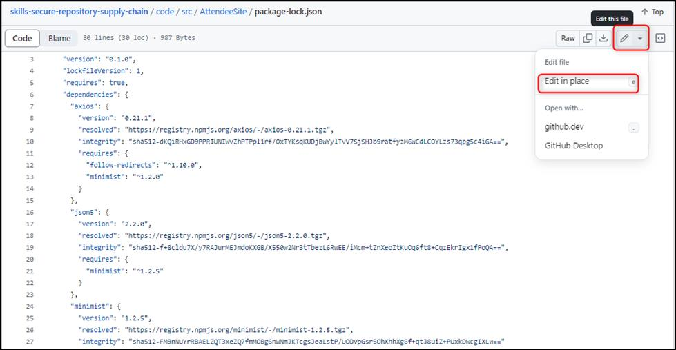

3.  在第 \# 14 行和第 \#15 行之间插入以下代码片段

4.  "follow-redirects": {

5.  "version": "1.14.1",

6.  "resolved":

7.  "https://registry.npmjs.org/follow-redirects/-/follow-redirects-1.14.1.tgz",

8.  "integrity":

9.  "sha512-HWqDgT7ZEkqRzBvc2s64vSZ/hfOceEol3ac/7tKwzuvEyWx3/4UegXh5oBOIotkGsObyk3xznnSRVADBgWSQVg=="

},

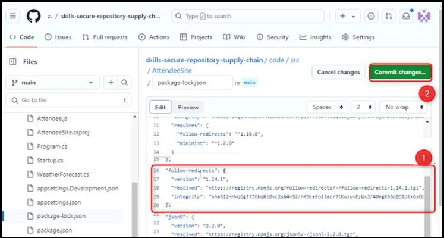

**注意：**请确保添加的代码片段已正确缩进，如屏幕截图所示

10. 点击右上角的 **Commit changes**。

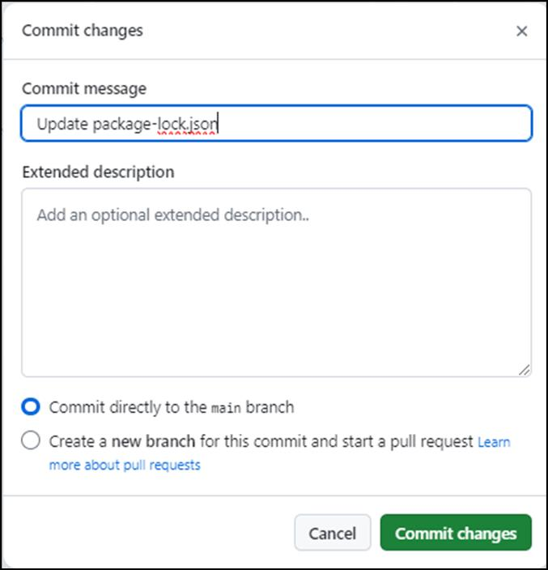

11. 在主导航栏上，单击“** Insights”选项卡**。

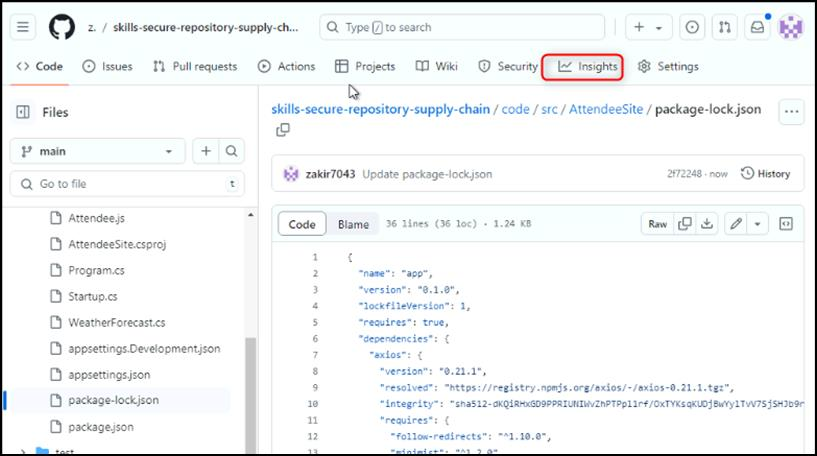

12. 在左侧导航窗格中，单击“**Dependency graph**”。

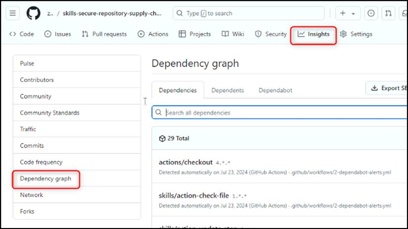

13. 查看依赖项中心上的所有新依赖项。

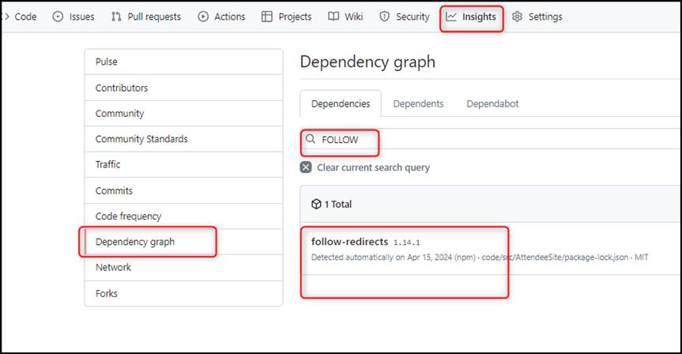

14. 搜索 follow-redirects 并查看您刚刚添加的新依赖项。

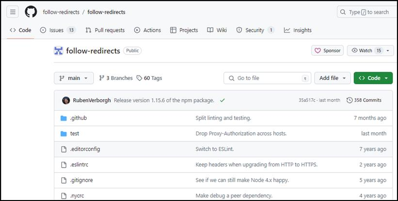

总结：

您现在已经获得了有关管理项目依赖项和保护存储库供应链的宝贵见解，从而使您能够主动解决和减轻安全风险。

