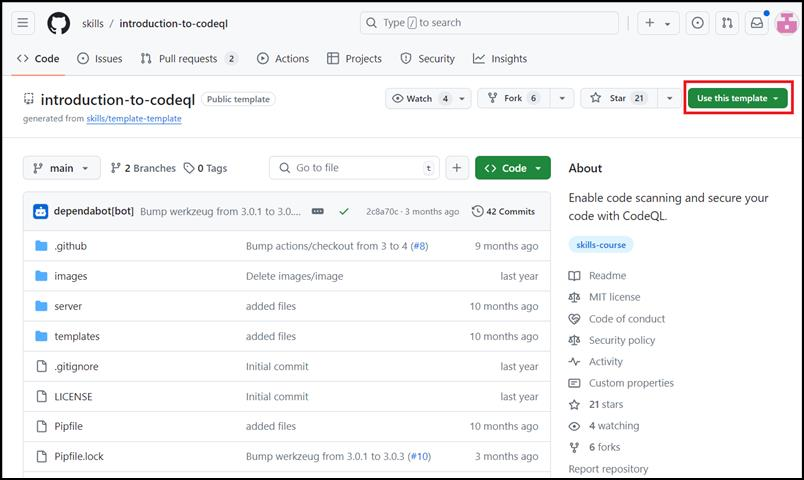
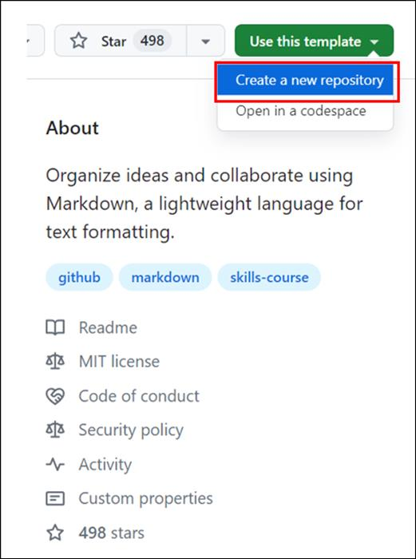
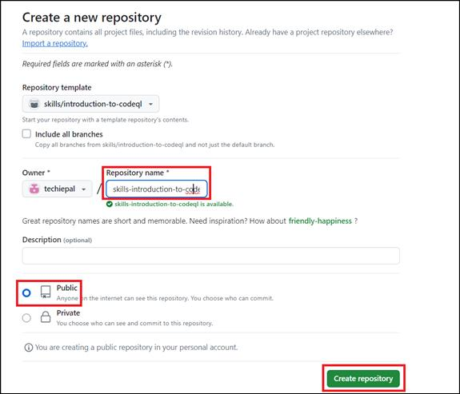
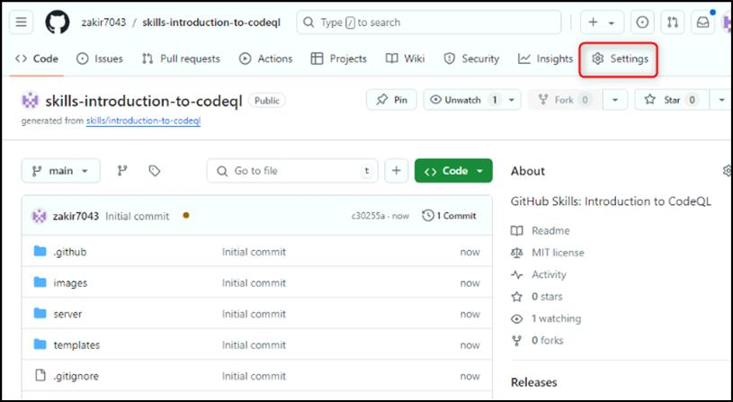
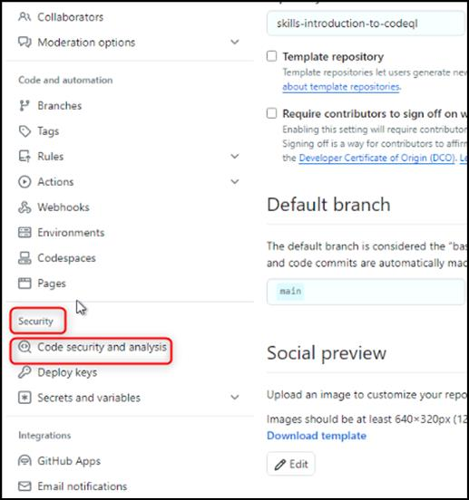
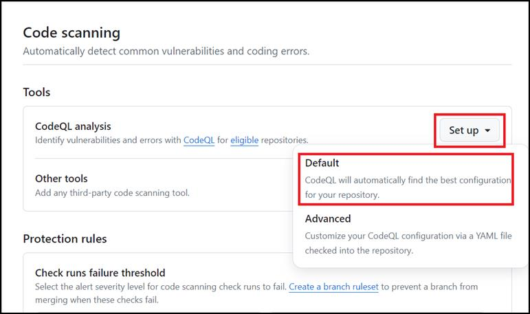
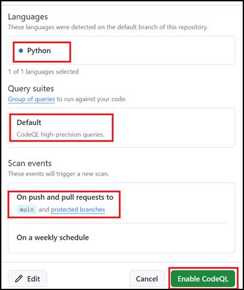
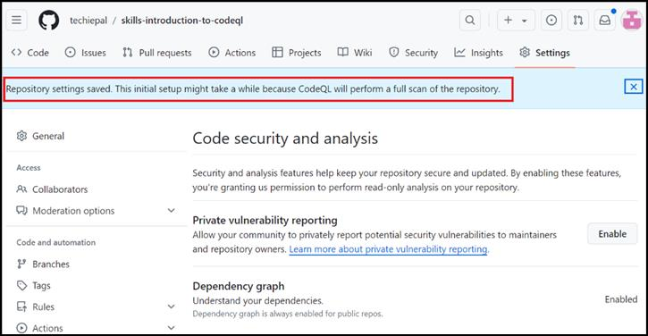

**Lab 15: Abilitare CodeQL per proteggere il codice sorgente**

Obiettivo:

Immaginare di essere uno sviluppatore di software che lavora a un
progetto critico per la vostra azienda, in cui garantire la sicurezza
della vostra applicazione è una priorità assoluta. Con le crescenti
preoccupazioni per le minacce informatiche e le violazioni dei dati, è
essenziale assicurarsi che il codice sia privo di vulnerabilità e
pratiche di codifica non sicure. In questo lab pratico, abiliterai la
scansione del codice GitHub per esaminare automaticamente il vostro
codice sorgente alla ricerca di potenziali problemi di sicurezza.

In questo lab pratico, abiliterai la scansione del codice GitHub per
esaminare automaticamente il vostro codice sorgente alla ricerca di
potenziali problemi di sicurezza.

Esercizio \#1: Creare un nuovo repository da un modello pubblico

1.  Accedere al vostro account GitHub.

2.  Navigare al seguente link:
    https://github.com/skills/introduction-to-codeql

In questo laboratorio creerai il repository utilizzando un modello
pubblico "**skills-introduction-to-codeql**".

3.  Selezionare **Create a new repository **nel menu **Use this
    template**.

4.  Immettere i dettagli seguenti e selezionare **Create Repository**.

    - Repository name:**skills-introduction-to-codeql**

    - Repository type: **Public**

Esercizio \#2: Abilitare la scansione del codice con CodeQL

1.  Nella pagina di destinazione del repository appena creato, passare
    alla scheda **Settings**.

2.  Nella sezione **Security **nella barra laterale sinistra,
    selezionare **Code security and analysis**.

3.  Scorrere verso il basso fino alla sezione intitolata **Code
    scanning**, fare clic sul menu a discesa **Set-up** e scegliere
    **Default**.

4.  Selezionare le seguenti opzioni e fare clic su **Enable CodeQL**

    - Lingue da analizzare: Queste sono le lingue che verranno
      scansionate da CodeQL. In questo caso, eseguiremo la scansione in
      Python.

    - Suite di query: Le query CodeQL sono raggruppate in pacchetti
      denominati "suite". Questa sezione consente di scegliere la suite
      di query da utilizzare. Lasceremo questa impostazione come Default
      per questo esercizio.

    - Eventi: Questa sezione indica a CodeQL quando eseguire la
      scansione. In questo caso, è impostato per l'analisi di qualsiasi
      richiesta pull al ramo principale.

5.  Attendere circa 20 secondi, quindi aggiorna questa pagina per
    procedere ulteriormente.

Sommario:

Ora avete abilitato GitHub Code Scanning per esaminare automaticamente
il vostro codice sorgente alla ricerca di potenziali problemi di
sicurezza.
