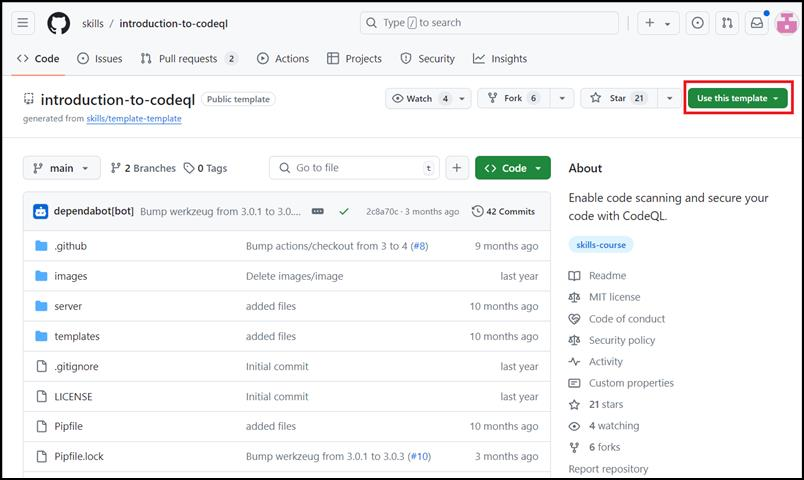
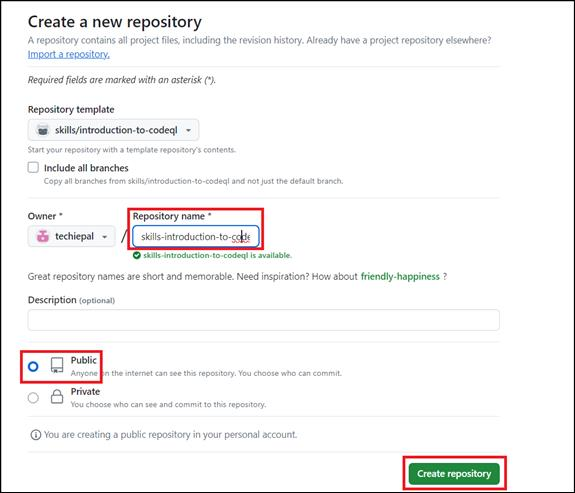
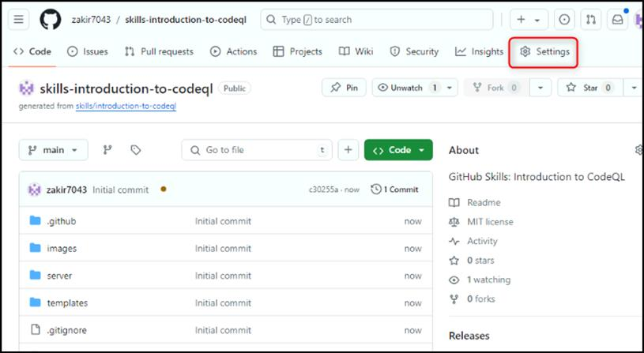
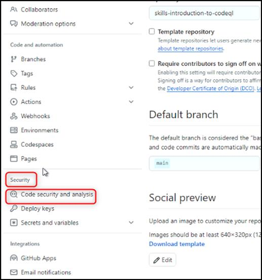
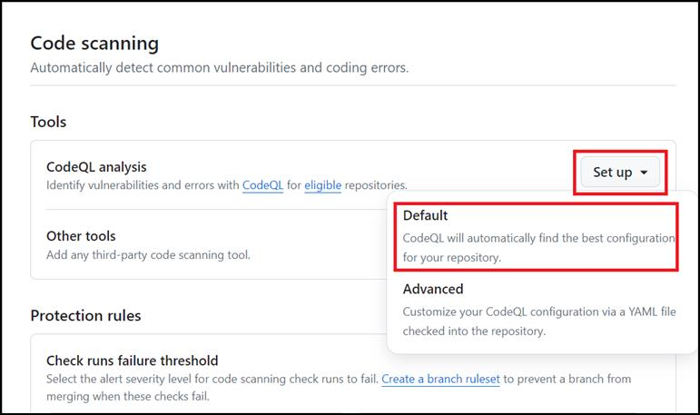
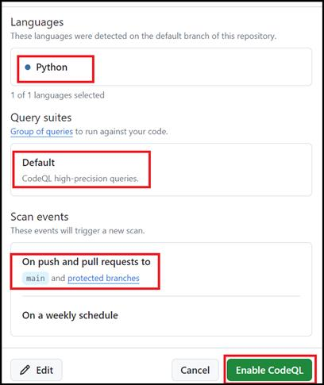
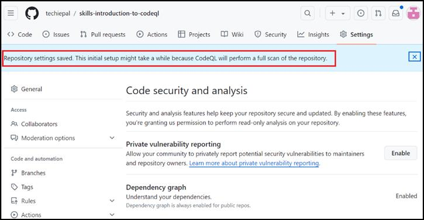

**实验室 15：启用 CodeQL 以保护源代码**

目的：

想象一下，您是一名软件开发人员，正在为公司处理一个关键项目，其中确保应用程序的安全是重中之重。随着人们对网络威胁和数据泄露的担忧日益增加，必须确保您的代码不存在漏洞和不安全的编码实践。在此动手实验室中，你将启用
GitHub Code Scanning 以自动查看源代码是否存在潜在的安全问题。

在此动手实验室中，你将启用 GitHub Code Scanning
以自动查看源代码是否存在潜在的安全问题。

练习 \#1：从公共模板创建新存储库

1.  登录到你的 GitHub 帐户。

2.  浏览到以下链接：https://github.com/skills/introduction-to-codeql

在本实验室中，你将使用公共模板“**skills-introduction-to-codeql**”创建存储库。

3.  选择“**Use this template** ”菜单下的“**Create a new repository** ”。

4.  输入以下详细信息，然后选择**Create Repository**。

    1.  存储库名称：**skills-introduction-to-codeql**

<!-- -->

1.  存储库类型：**Public**

练习 \#2：使用 CodeQL 启用代码扫描

1.  在新创建的存储库的登录页上，导航到“**Settings”**选项卡。

2.  在左侧边栏的“**Security**”部分下，选择“**Code security and
    analysis**”。 

3.  向下滚动到标题为“Code
    scanning”的部分，单击“**Set-up** ”下拉菜单，然后选择“**Default**”。

4.  选择以下选项，然后单击**“Enable CodeQL”**

    1.  要分析的语言：这些是 CodeQL
        将扫描的语言。在这种情况下，我们将使用 Python 进行扫描。

    2.  查询套件：CodeQL
        查询打包在称为“套件”的捆绑包中。此部分允许您选择要使用的查询套件。在本练习中，我们将此集保留为默认值。

    3.  事件：本部分告知 CodeQL
        何时扫描。在这种情况下，它设置为扫描对主分支的任何拉取请求。

5.  等待大约 20 秒，然后刷新此页面以继续。

总结：

现在，你已启用 GitHub Code Scanning
来自动查看源代码是否存在潜在的安全问题。

