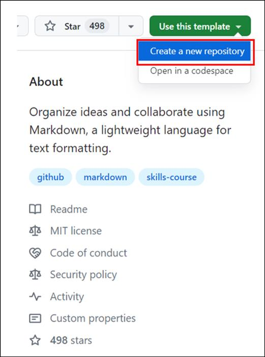

**실습 15: 소스 코드를 보안하기 위해 CodeQL 활성화하기**

목표:

Imagine you're a software developer working on a critical project for
your company, where ensuring the security of your application is a top
priority. With growing concerns about cyber threats and data breaches,
it's essential to make sure that your code is free from vulnerabilities
and insecure coding practices. In this hands-on lab, you will enable
GitHub Code Scanning to automatically review your source code for
potential security issues.

In this hands-on lab, you will enable GitHub Code Scanning to
automatically review your source code for potential security issues.

Exercise \#1: Create a new repository from a public template

1.  Sign in to your GitHub account.

2.  Browse to the following
    link: https://github.com/skills/introduction-to-codeql

In this lab you will create the repository using a public template
"**skills-introduction-to-codeql**".

3.  Select **Create a new repository** under **Use this template** menu.

4.  Enter the following details and select **Create Repository**.

    - Repository name:**skills-introduction-to-codeql**

    - Repository type: **Public**

Exercise \#2: Enable code scanning with CodeQL

1.  On the landing page of the newly created repository navigate to
    the **Settings** tab.

2.  Under the **Security** section on the left sidebar, select **Code
    security and analysis**.

3.  Scroll down to the section titled Code scanning, click
    the **Set-up** dropdown menu and choose **Default**.

4.  Select the following options and click **Enable CodeQL**

    - Languages to analyze: These are the languages that will be scanned
      by CodeQL. In this case, we will be scanning in Python.

    - Query suites: CodeQL queries are packaged in bundles called
      "suites". This section allows you to choose which query suite to
      use. We'll leave this set as Default for this exercise.

    - Events: This section tells CodeQL when to scan. In this case, it's
      set to scan on any pull request to the main branch.

5.  Wait about 20 seconds then refresh this page to proceed further.

Summary:

Now you have enabled GitHub Code Scanning to automatically review your
source code for potential security issues.
