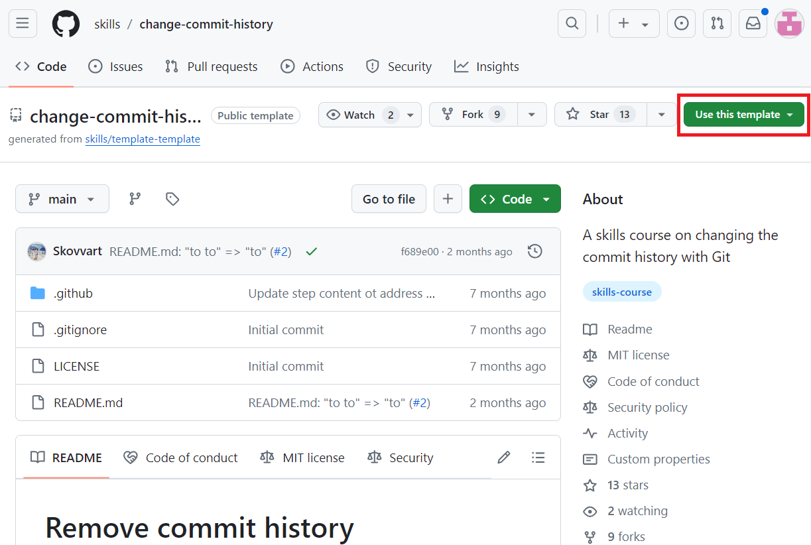
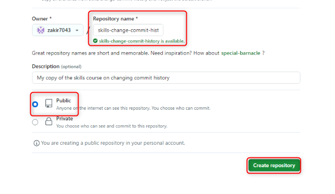
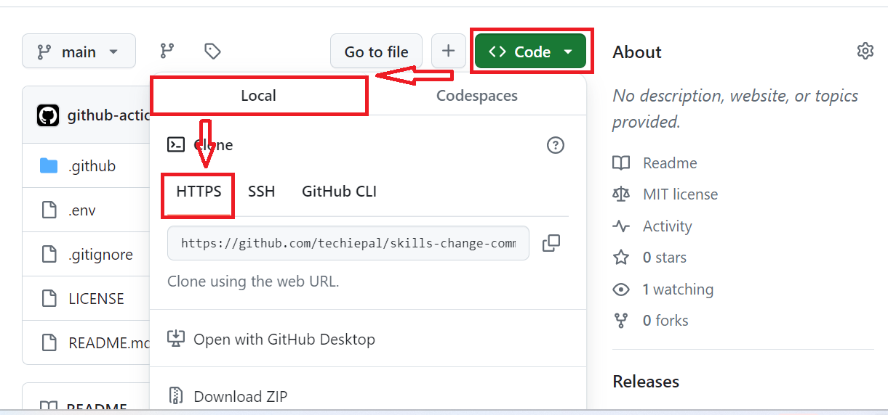
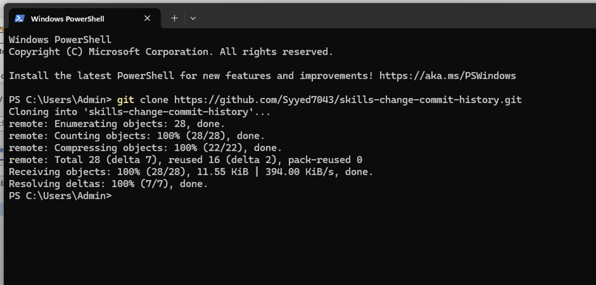
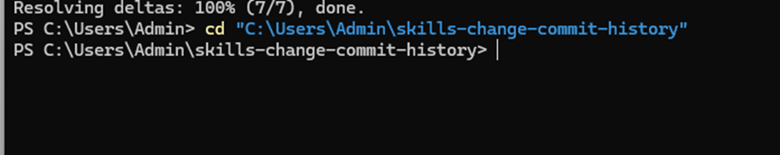

Objetivo:

Imagine que forma parte de un equipo de desarrollo que trabaja en un
proyecto donde se han cometido por error datos sensibles, como claves de
API o credenciales de bases de datos, en su repositorio de Git. Los
commits accidentales pueden ser difíciles de eliminar con Git.

En este laboratorio, usted:

- Clonará el repositorio con datos confidenciales que se comprometieron
  por error.

- Eliminará el archivo que contiene datos confidenciales del repositorio
  clonado y confirmará (commit) la eliminación.

- Enviará cambios a GitHub: Cargue el repositorio actualizado en GitHub
  para reflejar los cambios.

### Ejercicio \#1: Crear el repositorio con el historial de confirmaciones accidental (datos confidenciales)

1.  Inicie sesión en su cuenta de GitHub.

2.  Vaya al siguiente enlace:
    <https://github.com/skills/change-commit-history>

> En este laboratorio, creará el repositorio usando una plantilla
> pública “**skills-change-commit-history**”.
>
> 

3.  Seleccione **Create a new repository** en el menú **Use this
    template**.

> 

4.  Ingrese los siguientes detalles y seleccione **Create Repository**.

- Repository name: **skills-change-commit-history**

- Repository type: **Public**

### Ejercicio \# 2: Eliminar el archivo (.env en el directorio raíz del proyecto) que contiene datos confidenciales

1.  En la página principal del repositorio clonado, navegue a
    **Code**\>**Local**\>**HTTPS** y copie la URL.

2.  Abra PowerShell en Windows y escriba el siguiente comando.

**git clone \<your-repository-url\>**

**Nota**: Reemplace con la URL que copió en el paso 1.

> 

3.  Cambie al directorio de su repositorio local. Ingrese el siguiente
    comando.

**+++cd “C:\Users\Admin\skills-change-commit-history”+++**

**Nota**: Reemplace con el nombre del repositorio

> 

4.  Ejecute el siguiente comando para eliminar .env del directorio raíz,

**+++git rm .env**+++

> 

5.  Confirme la eliminación del archivo .env

**+++git commit -m "remove .env file”+++**

> 
>
> **Sugerencia:** ¿Cómo eliminar por completo el archivo .env del
> historial de Git y reescribir todo el historial con nuevos hashes de
> commit?
>
> Utilice los siguientes comandos para:

- Eliminar por completo el archivo .env del historial de Git y
  reescribir todo el historial

> **git filter-branch --force --index-filter 'git rm --cached
> --ignore-unmatch.env' --prune-empty --tag-name-filter cat -- --all**

- Enviar la eliminación a GitHub

> **git push origin --force –all**

6.  Enviar la eliminación a GitHub:

**git push**

> 

Resumen:

Ahora ha completado la limpieza de su repositorio de Git, garantizando
que el contenido confidencial no esté expuesto en el historial del
repositorio.
