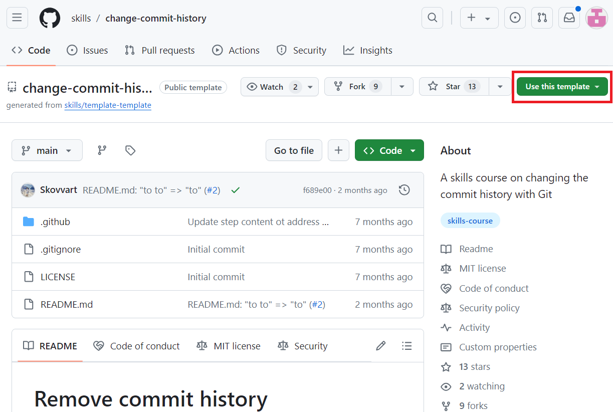
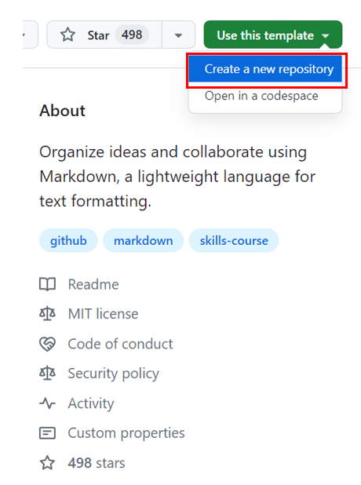
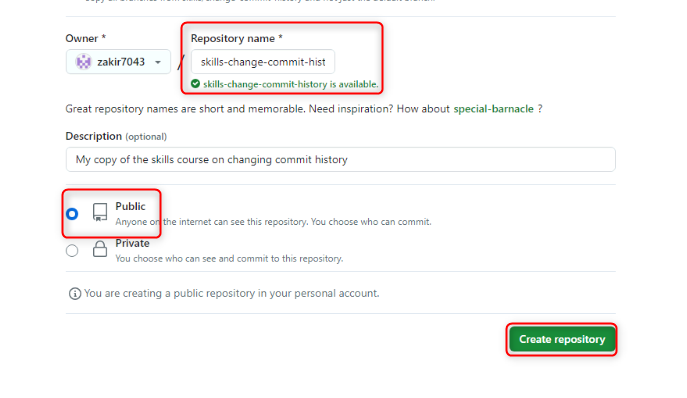
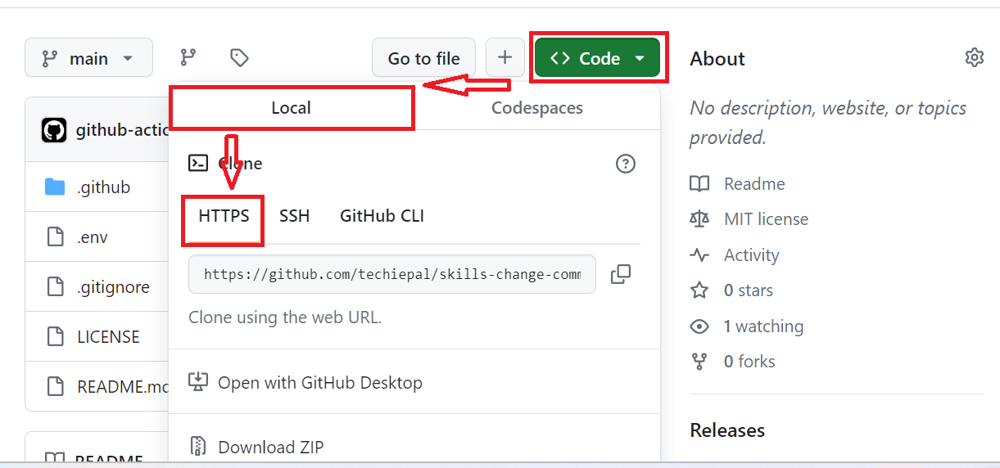
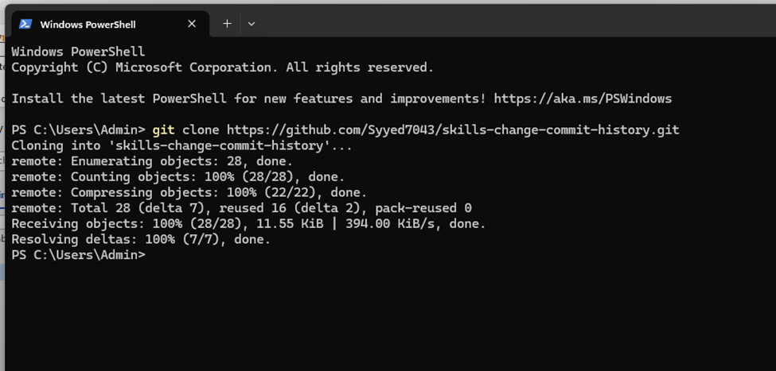
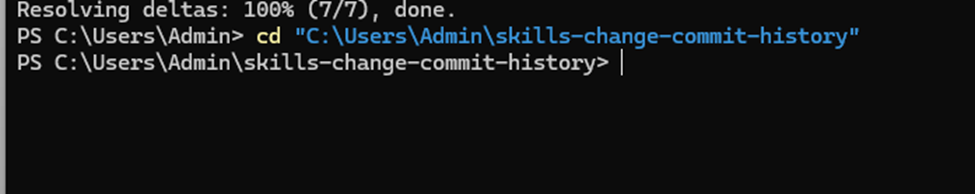
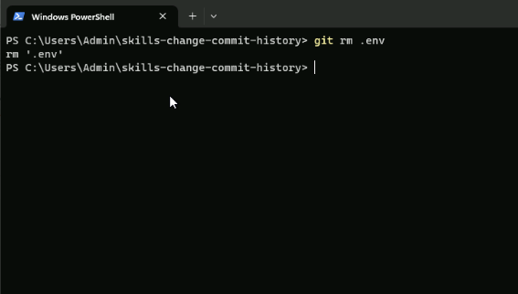
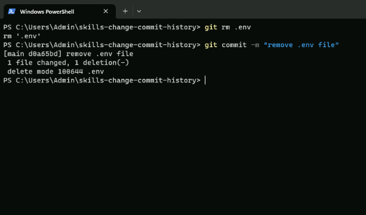
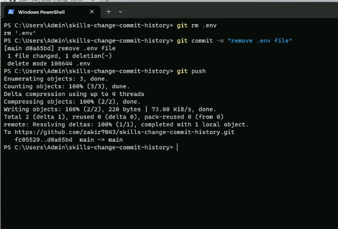

실습 16: Git 리포지토리에서 커밋 기록 제거하기

목표:

API 키나 데이터베이스 자격 증명과 같은 민감한 정보가 실수로 Git
리포지토리에 커밋된 프로젝트를 진행하는 개발 팀의 일원입니다. 우발적인
커밋은 Git으로 제거하기가 까다라울 수 있습니다.

이 실습에서는 다음을 수행할 것입니다:

- 실수로 커밋된 중요한 데이터로 리포지토리 복제하기

- 복제된 리포지토리에서 민감한 데이터가 포함된 파일을 제거/삭제하고
  제거를 커밋하기

- GitHub에 변경 푸시: 업데이트된 리포지토리를 GitHub에 업로드하여 변경
  사항을 반영하기

### 연습 \#1: 우발적인 커밋 기록 (중요한 데이터)이 있는 리포지토리 생성하기

1.  GitHub 계정으로 로그인하세요.

2.  다음 링크로 이동하세요:
    <https://github.com/skills/change-commit-history>

> 이 실습에서는 공개 템플릿 “**skills-change-commit-history**”를
> 사용하여 리포지토리를 생성할 것입니다.
>
> 

3.  **Use this template** 메뉴에서 **Create a new repository**를
    선택하세요.

> 

4.  다음 세부 정보를 입력하고 **Create Repository**를 선택하세요.

- 리포지토리 이름: **skills-change-commit-history**

- 리포지토리 유형: **Public**

### 연습 \#2: 중요한 데이터가 포함된 파일 (프로젝트 루트 디렉토리의 .env)을 제거/삭제하기

1.  복제된 리포지토리의 랜딩 페이지에서 **Code**\>**Local**\>**HTTPS**로
    이동하여 URL을 복사하세요.

2.  Windows Powershell을 열고 다음 명령을 입력하세요.

**git clone \<your-repository-url\>**

**참고**: 1단계에서 복사한 URL로 바꾸세요.

> 

3.  리포지토리 디렉터리로 전환하고 다음 명령을 입력하세요.

**+++cd “C:\Users\Admin\skills-change-commit-history”+++**

**참고**: 리포지토리 이름으로 바꾸세요

> 

4.  .env를 삭제하려면 루트 디렉터리에서 다음 명령을 실행하세요,

**+++git rm .env**+++

> 

5.  .env 파일의 제거를 커밋하세요

**+++git commit -m "remove .env file”+++**

> 
>
> **팁**: Git 기록에서 .env 파일을 완전히 제거하고 새 커밋 해시로 전체
> 기록을 다시 작성하는 방법은 무엇입니까?
>
> 다음 명령을 사용하세요:

- Git 기록에서 .env 파일을 완전히 제거하고 전체 기록을 다시 작성하세요

> **git filter-branch --force --index-filter 'git rm --cached
> --ignore-unmatch.env' --prune-empty --tag-name-filter cat -- --all**

- GitHub에 제거 푸시하세요

> **git push origin --force –all**

6.  GitHub에 제거 푸시하세요:

**git push**

> 

요약:

이제 Git 리포지리 정리를 완료하여 민감한 콘텐츠가 리포지토리 기록에
노출되지 않도록 했습니다.
