**Laboratorio 18 - Cree una API REST usando Spring Boot con la ayuda de
GitHub Copilot**

**Objetivo**

El objetivo de este laboratorio es aprender a usar GitHub Copilot,
mediante un ejercicio que consiste en crear una API REST usando Spring
Boot.

Se creó un proyecto de Spring Boot con algunos archivos ya preparados;
ubique el proyecto en la carpeta
**C:\CopilotHackathon\exercisefiles\springboot**.

Antes de ejecutar este laboratorio, primero instale el software
necesario y configure el entorno.

Tarea 0: Instalación y configuración del entorno

Necesita descargar e instalar los siguientes paquetes de software para
preparar el entorno y poder ejecutar este laboratorio.

a\. Microsoft JDK 17

b\. apache maven

1.  Abra el navegador Microsoft Edge.

2.  En el campo de URL del navegador, copie y pegue el vínculo para
    descargar los paquetes de software en su VM del laboratorio.

a\. Microsoft JDK 17
◊ https://aka.ms/download-jdk/microsoft-jdk-17.0.12-windows-x64.msi

b\. apache maven
◊https://dlcdn.apache.org/maven/maven-3/3.9.9/binaries/apache-maven-3.9.9-bin.zip

**Nota:** Repita los mismos pasos para descargar los demás paquetes. De
forma predeterminada, los paquetes se guardarán en la carpeta Downloads.

a. **Instale Microsoft JDK 17**

1.  En la carpeta **Downloads** (**C:\Users\Admin\Downloads**) haga
    doble clic en **Microsoft JDK**

2.  Haga clic en **Next**.

3.  Acepte el EULA y haga clic en **Next**.

4.  Seleccione **Install just for you (Admin)** y haga clic en **Next**.

5.  En la pantalla **Custom setup**, configure la variable
    **JAVA_HOME**. Seleccione la flecha hacia abajo y seleccione
    **Entire feature will be installed on local hard drive**.

6.  Haga clic en **Next**.

7.  Haga clic en **Install**.

**b. Install apache- maven**

8.  Vaya a la carpeta **Downloads** (**C:\Users\Admin\Downloads**)

9.  Haga clic derecho en la carpeta **apache-maven-3.9.9-bin.zip** y
    seleccione **Extract All**.

10. En la página "**Select a destination**" ingrese el destino
    **C:\Users\Admin\Downloads** y haga clic en **Extract**.

11. Los archivos extraídos quedarán como se muestra en la captura de
    pantalla.

**Nota:** Asegúrese de que la carpeta se llame **apache-maven-3.9.9**;
si aparece otro nombre, renómbrela a apache-maven-3.9.9.

**Configure las variables de entorno**

12. Haga clic en el logotipo de **Windows** y seleccione **Settings**

13. Busque Edit system en la página de **Windows settings** y seleccione
    **Edit System Environment variable**.

14. Haga clic en el botón **Environment Variable**.

15. Haga clic en **New** debajo de la sección **User variable for
    Admin**.

16. Configure ahora las variables de entorno y la variable Path para
    Maven.

Seleccione **New** debajo de la sección **User variable for Admin**.

17. En la ventana **New User Variable**, ingrese lo siguiente y
    seleccione **OK**

Variable name: MAVEN_HOME

Variable value: C:\Users\Admin\Downloads\apache-maven-3.9.9

18. Ahora seleccione **Path** y haga clic en **Edit**

19. En la ventana **Edit environment variable**, haga clic en **New**.

20. En el campo vacío, ingrese lo siguiente: %MAVEN_HOME%\bin y
    seleccione **OK**.

21. Seleccione **OK** para finalizar la configuración de las variables
    de entorno de usuario y de la variable Path para Maven.

22. Ahora configure las **System variables** para Maven. Seleccione
    **New** debajo de la sección **System variables**.

23. En la ventana New System Variable, ingrese lo siguiente y seleccione
    **OK.**

Variable name: MAVEN_HOME

Variable value: C:\Users\Admin\Downloads\apache-maven-3.9.9

Tarea 1: Cree el código para manejar una solicitud GET simple

Vaya al archivo DemoController.java y comience a escribir el código para
manejar una solicitud GET simple. En este primer ejercicio, se
proporciona un comentario que describe el código que deberá generar.
Presione Enter y espere unos segundos, Copilot generará el código por
usted.

Ya existe una prueba unitaria implementada para este ejercicio; puede
ejecutarla utilizando el comando mvn test antes y después para validar
que el código generado por Copilot sea correcto.

Luego, cree una nueva prueba unitaria para el caso en que no se
proporcione ninguna key en la solicitud.

Después de cada ejercicio, empaquete y ejecute su aplicación para
probarla.

Empaquetar: mvn package

Ejecutar: mvn spring-boot:run

Probar: curl -v http://localhost:8080/hello?key=world

1.  Abra File Explorer, expanda Local Disk (C:) y expanda la
    carpeta **CopilotHackathon-\>exercisefiles \> Springboot \>
    copilot-demo \>
    src\>main\>java\>com\>Microsoft\>hackathon\>copilotdemo\>controller** para
    ver el archivo **'DemoController.java**.

Haga doble clic en el archivo **DemoController.java**. En este primer
ejercicio, solo se proporciona un comentario que describe el código que
debe generar.

2.  Lleve el cursor al final del comentario (línea 12), presione
    **Enter** y espere unos segundos; **Copilot** generará el código por
    usted. Presione la pestaña hasta que muestre el código completo.

También presione Ctrl + Enter para elegir opciones de código.

3.  Expanda la carpeta **test** y seleccione
    **CopilotDemoApplicationTests.java**. La prueba unitaria ya está
    incluida.

4.  Intente ejecutar el código sin actualizer pom.xml y solicite a
    Copilot una solución para explorar el producto.

5.  Abra **Pom.xml**, agregue el plugin siguiente y guarde el archivo

6.  \<plugin\>

7.  \<groupId\>org.apache.maven.plugins\</groupId\>

8.  \<artifactId\>maven-compiler-plugin\</artifactId\>

9.  \<version\>3.8.1\</version\>

10. \<configuration\>

11. \<source\>17\</source\>

12. \<target\>17\</target\>

13. \</configuration\>

\</plugin\>

14. En la barra de herramientas, seleccione **Terminal -\> New
    Terminal**.

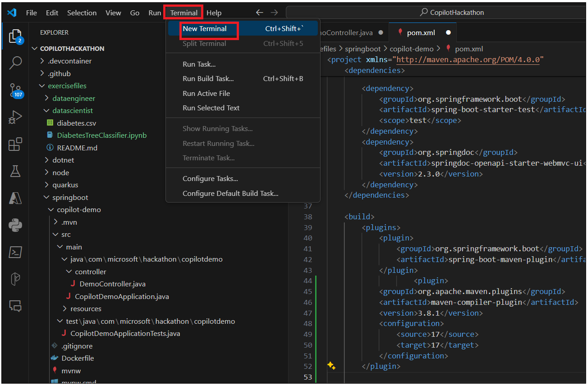

15. Seleccione **Gitbash** y ejecute el siguiente comando.

cd exercisefiles/springboot/copilot-demo/

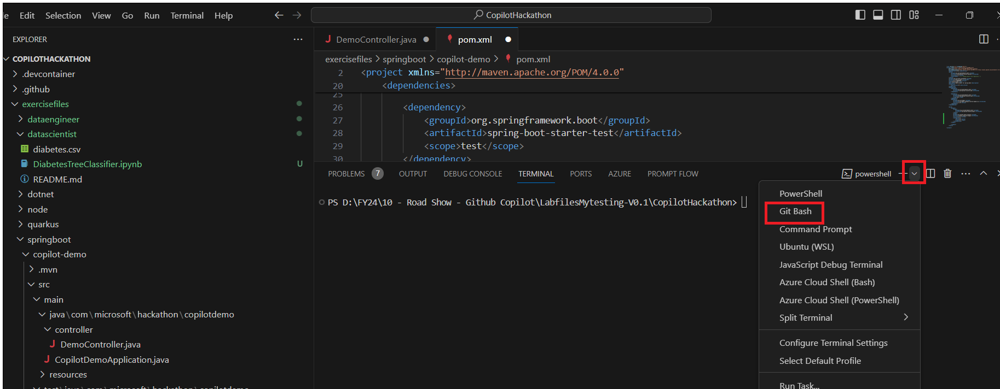

16. Ejecute el comando mvn clean install -DskipTests

17. Ejecute el commando mvn test . Si su compilación falla con error.

18. Seleccione el icono de **Copilot** en la esquina inferior derecha y
    seleccione **GitHub Copilot Chat**.

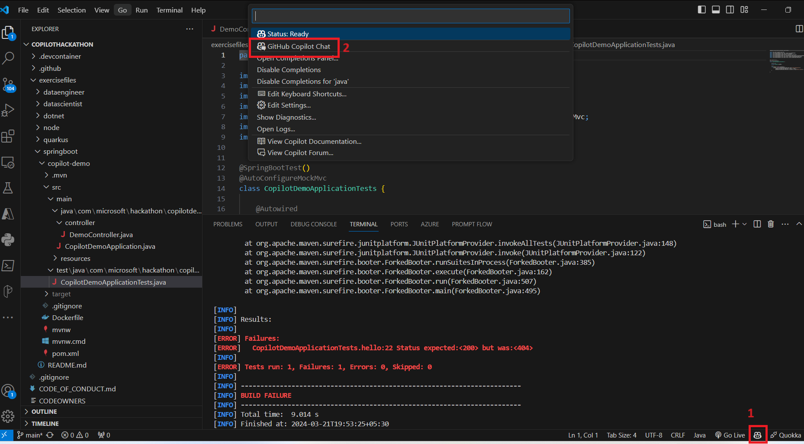

19. Pregunte a **GitHub Copilot Chat** que le proporcione una solución
    para su error.

20. Revise en en el chat de Copilot la explicación sobre el problema y
    la solución correspondiente. Si aún no tiene claro el arreglo,
    continúe preguntando sus dudas y Copilot le responderá. Lea y
    comprenda el error y la solución para implementarla.

21. Proporcione el método /hello a Copilot y observe qué sugiere.

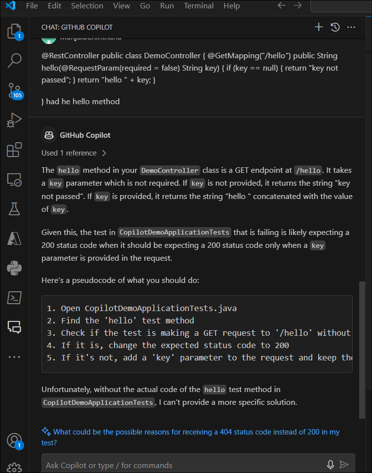

22. Regrese a **CopilotDemoApplicationTests.java**, lleve el cursor al
    final de la prueba (línea 24) y presione Enter. Copilot generará
    otra prueba para usted. Presione la pestaña para aceptarla.

23. Proporcione el método /hello de la prueba a Copilot y observe qué
    sugiere.

24. Vuelva a ejecutar el comando mvn test. Su código puede verse como el
    que aparece a continuación. También puede escribir su propio código
    y pedir a Copilot que lo valide.

25. @RestController

26. public class DemoController {

27. @GetMapping("/hello")

28. public String hello(@RequestParam(name = "key", required = false)
    String key) {

29. if (key == null) {

30. return "key not passed";

31. }

32. return "hello " + key;

33. }

34. 

}

35. Ejecute el commando mvn package

36. Ejecute el comando mvn spring-boot:run

37. Seleccione la opción de dividir el terminal e ingrese -v
    http://localhost:8080/hello?key=world en el segundo terminal.
    También puede pedir a Copilot que le proporcione el comando curl
    para probar su código.

38. Seleccione la opción de dividir el terminal e ingrese curl -v
    http://localhost:8080/hello en el segundo terminal.

39. Presione Ctrl + C para detener el servicio en ejecución.

Tarea 2: Comparación de fechas

Nueva operación en /diffdates que calcula la diferencia entre dos
fechas. La operación debe recibir dos fechas como parámetros en el
formato dd-MM-yyyy y devolver la diferencia en días.

Además, cree una prueba unitaria que valide la operación.

A partir de ahora, tendrá que crear pruebas unitarias para cada nueva
operación. ¿Verdad que fue sencillo con Copilot?

1.  Vaya a **DemoController.java** e ingrese el prompt //create a New
    operation under /diffdates that calculates the difference between
    two dates. The operation should receive two dates as parameter in
    format dd-MM-yyyy and return the difference in days y presione
    Enter. Espere un momento y, una vez que Copilot prediga el código,
    presione la pestaña para aceptarlo.

2.  2\. También puede usar el siguiente código.

3.  @GetMapping("/diffdates")

4.  public String diffdates(@RequestParam(name = "date1", required =
    false) String date1, @RequestParam(name = "date2", required = false)
    String date2) throws ParseException {

5.  if (date1 == null || date2 == null) {

6.  return "date not passed";

7.  }

8.  SimpleDateFormat sdf = new SimpleDateFormat("dd-MM-yyyy");

9.  Date date1Obj = sdf.parse(date1);

10. Date date2Obj = sdf.parse(date2);

11. long diffInMillies = Math.abs(date2Obj.getTime() -
    date1Obj.getTime());

12. long diff = TimeUnit.DAYS.convert(diffInMillies,
    TimeUnit.MILLISECONDS);

13. return "difference in days: " + diff;

}

14. A partir de ahora, tendrá que crear las pruebas unitarias para cada
    nueva operación. Use Copilot para crearlas.

15. Abra **CopilotDemoApplicationTests.java** en la carpeta **test** e
    ingrese el prompt // create unit test to /diffdates that calculates
    the difference between two dates. The operation should receive two
    dates as parameter in format dd-MM-yyyy and return the difference in
    days. Luego presione Enter. Espere un momento a que Copilot prediga
    el código y presione Tab para aceptar el código sugerido.

16. Puede presionar Enter y luego Tab para crear múltiples pruebas
    unitarias.

17. Solicite ayuda a Copilot Chat para corregir problemas o para que le
    explique la prueba unitaria, y actualice el código si es necesario
    en función de las indicaciones de Copilot.

18. @Test

19. void diffdates() throws Exception {

20. mockMvc.perform(MockMvcRequestBuilders.get("/diffdates?date1=01-01-2021&date2=01-02-2021"))

21. .andExpect(MockMvcResultMatchers.status().isOk())

22. .andExpect(MockMvcResultMatchers.content().string("difference in
    days: 31"));

23. }

24. @Test

25. void diffdatesNoDate1() throws Exception {

26. mockMvc.perform(MockMvcRequestBuilders.get("/diffdates?date2=01-02-2021"))

27. .andExpect(MockMvcResultMatchers.status().isOk())

28. .andExpect(MockMvcResultMatchers.content().string("date not
    passed"));

29. }

30. @Test

31. void diffdatesNoDate2() throws Exception {

32. mockMvc.perform(MockMvcRequestBuilders.get("/diffdates?date1=01-01-2021"))

33. .andExpect(MockMvcResultMatchers.status().isOk())

34. .andExpect(MockMvcResultMatchers.content().string("date not
    passed"));

}

35. Abra **Terminal -\>Gitbash** y ejecute los siguientes comandos

cd "exercisefiles\springboot\copilot-demo"

mvn test

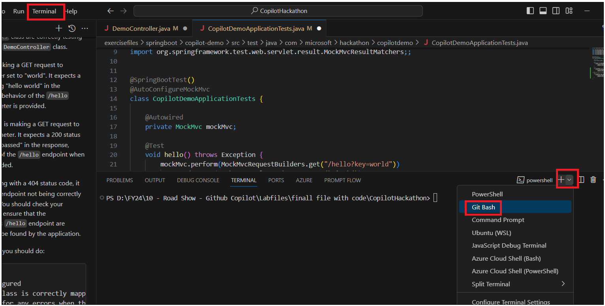

36. Si observa errores de compilación, copie el mensaje de error y pida
    a Copilot que proporcione la solución.

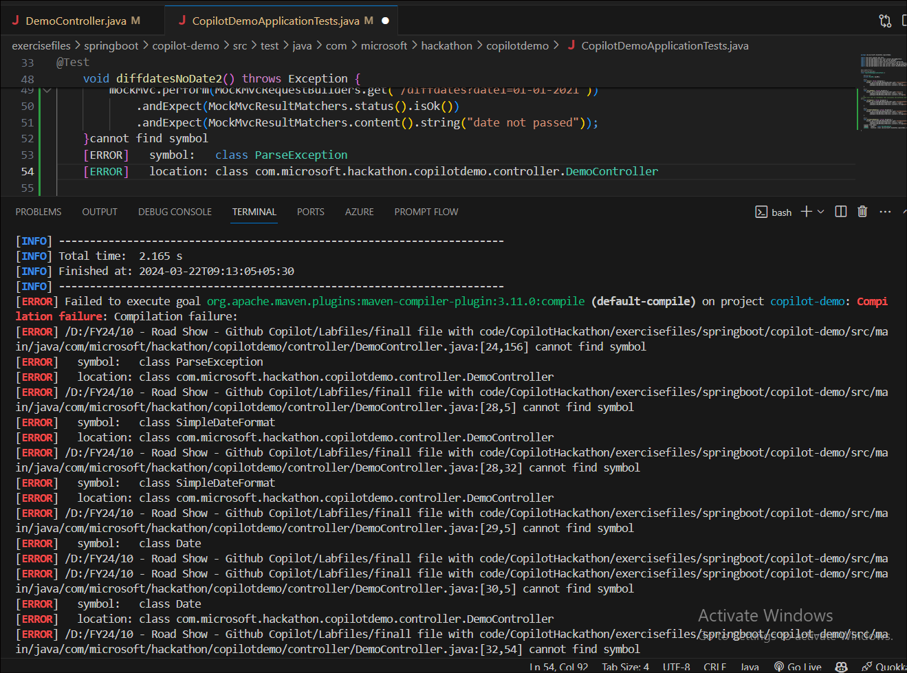

37. Copilot le sugerirá importar paquetes con código. Agregue el comando
    a su código y ejecute mvn test.

38. Ejecute mvn package

39. Ejecute la prueba mvn -Dtest=CopilotDemoApplicationTests#diffdates

40. Ejecute mvn spring-boot:run

41. Haga clic en Split terminal y ejecute curl -v
    http://localhost:8080/diffdates?date1=01-01-2021&date2=01-02-2021

Verá un error. Pida ayuda a Copilot y corrija el problema menor.

42. Pida ayuda a Copilot Chat con el comando curl. Simplemente copie el
    mensaje de error y péguelo en el chat. Copilot le dará el comando
    modificado junto con una explicación.

Tarea 3: Validar el formato de un teléfono español

Valide el formato de un número de teléfono español (prefijo +34, seguido
de 9 dígitos que comiencen con 6, 7 o 9).

La operación debe recibir un número de teléfono como parámetro y
devolver true si el formato es correcto o false en caso contrario.

1.  Abra DemoController.java e ingrese el prompt \`// Validate the
    format of a spanish phone number (+34 prefix, then 9 digits,
    starting with 6, 7 or 9). The operation should receive a phone
    number as parameter and return true if the format is correct, false
    otherwise.\` Presione Tab para aceptar el código.

2.  También puede usar el siguiente código.

3.  // Validate the format of a spanish phone number (+34 prefix, then 9
    digits, starting with 6, 7 or 9). The operation should receive a
    phone number as parameter and return true if the format is correct,
    false otherwise.

4.  @GetMapping("/validatephone")

5.  public boolean validatephone(@RequestParam(name = "phone", required
    = false) String phone) {

6.  if (phone == null || phone.isEmpty()) {

7.  return false;

8.  }

9.  String regex = "^\\+34\[679\]\\d{8}$";

10. return phone.matches(regex);

}

11. Cambie a **CopilotDemoApplicationTests.java**. Para escribir una
    prueba unitaria que valide la función anterior, agregue el prompt
    //Write unit test to validate the format of a spanish phone number
    (+34 prefix, then 9 digits, starting with 6, 7 or 9). The operation
    should receive a phone number as parameter and return true if the
    format is correct, false otherwise y presione Enter. Presione Tab
    para aceptar el código.

12. También puede usar las siguientes pruebas unitarias o puede escribir
    sus propias pruebas unitarias.

13. @Test

14. void validatephone() throws Exception {

15. mockMvc.perform(MockMvcRequestBuilders.get("/validatephone?phone=+34666666666"))

16. .andExpect(MockMvcResultMatchers.status().isOk())

17. .andExpect(MockMvcResultMatchers.content().string("true"));

18. mockMvc.perform(MockMvcRequestBuilders.get("/validatephone?phone=+34766666666"))

19. .andExpect(MockMvcResultMatchers.status().isOk())

20. .andExpect(MockMvcResultMatchers.content().string("true"));

21. mockMvc.perform(MockMvcRequestBuilders.get("/validatephone?phone=+34966666666"))

22. .andExpect(MockMvcResultMatchers.status().isOk())

23. .andExpect(MockMvcResultMatchers.content().string("true"));

24. mockMvc.perform(MockMvcRequestBuilders.get("/validatephone?phone=+3466666666"))

25. .andExpect(MockMvcResultMatchers.status().isOk())

26. .andExpect(MockMvcResultMatchers.content().string("false"));

27. mockMvc.perform(MockMvcRequestBuilders.get("/validatephone?phone=+346666666666"))

28. .andExpect(MockMvcResultMatchers.status().isOk())

29. .andExpect(MockMvcResultMatchers.content().string("false"));

30. mockMvc.perform(MockMvcRequestBuilders.get("/validatephone?phone=+3466666666a"))

31. .andExpect(MockMvcResultMatchers.status().isOk())

32. .andExpect(MockMvcResultMatchers.content().string("false"));

33. mockMvc.perform(MockMvcRequestBuilders.get("/validatephone?phone=+34866666666"))

34. .andExpect(MockMvcResultMatchers.status().isOk())

35. .andExpect(MockMvcResultMatchers.content().string("false"));

36. }

37. @Test

38. void validatephoneNoPhone() throws Exception {

39. mockMvc.perform(MockMvcRequestBuilders.get("/validatephone"))

40. .andExpect(MockMvcResultMatchers.status().isOk())

41. .andExpect(MockMvcResultMatchers.content().string("false"));

}

42. Abra **Terminal -\> Gitbash** y ejecute los siguientes comandos.

cd exercisefiles/springboot/copilot-demo/

mvn test

43. Ejecute mvn package

44. Ejecute mvn spring-boot:run

45. Divida el terminal y ejecute los siguientes comandos curl para
    validar los números de teléfono.

curl -v http://localhost:8080/validatephone?phone=+34866666666

curl -v http://localhost:8080/validatephone?phone=+34666666667

curl -v http://localhost:8080/validatephone?phone=+34666666666

Tarea 4: Validar el formato de un DNI español

Valide el formato de un DNI español (8 dígitos y 1 letra). La operación
debe recibir un DNI como parámetro y devolver true si el formato es
correcto o falso en caso contrario.

1.  Abra DemoController.java e ingrese el prompt // Validate the format
    of a spanish DNI (8 digits and 1 letter). The operation should
    receive a DNI as parameter and return true if the format is correct,
    false otherwise. Presione la tecla Tab para aceptar el código.

2.  También puede usar el siguiente código.

3.  // Validate the format of a spanish DNI (8 digits and 1 letter). The
    operation should receive a DNI as parameter and return true if the
    format is correct, false otherwise.

4.  @GetMapping("/validatedni")

5.  public boolean validatedni(@RequestParam(name = "dni", required =
    false) String dni) {

6.  if (dni == null || dni.isEmpty()) {

7.  return false;

8.  }

9.  String regex = "^\\d{8}\[A-Z\]$";

10. return dni.matches(regex);

}

11. Cambie a **CopilotDemoApplicationTests.java**. Para escribir una
    prueba unitaria que valide la función anterior, agregue el prompt
    //Write unit test to Validate the format of a spanish DNI (8 digits
    and 1 letter). The operation should receive a DNI as parameter and
    return true if the format is correct, false otherwise y presione
    Enter. Presione la tecla Tab para aceptar el código.

12. También puede usar la siguiente prueba unitaria o puede escribir sus
    propias pruebas unitarias.

13. @Test

14. void validatedniNoDni() throws Exception {

15. mockMvc.perform(MockMvcRequestBuilders.get("/validatedni"))

16. .andExpect(MockMvcResultMatchers.status().isOk())

17. .andExpect(MockMvcResultMatchers.content().string("false"));

}

18. Abra Terminal -\> Gitbash y ejecute los siguientes comandos.

cd exercisefiles/springboot/copilot-demo/

mvn test

19. Ejecute mvn package

20. Ejecute mvn spring-boot:run

21. Divida el terminal y ejecute en el segundo terminal el siguiente
    commando: curl -v http://localhost:8080/validatedni?dni=12345678C 

Tarea 5: De nombre de color a código hexadecimal

Con base en el archivo colors.json que se encuentra en resources, dado
el nombre del color como parámetro de ruta, devuelva el código
hexadecimal. Si el color no se encuentra, devuelva 404

Pista: Use TDD. Comience creando la prueba unitaria y después implemente
el código.

1.  Abra DemoController.java e ingrese el prompt // Based on existing
    colors.json file under resources, given the name of the color as
    path parameter, return the hexadecimal code. If the color is not
    found, return 404 y presione la tecla Tab para aceptar el código.

2.  También puede usar el siguiente código o puede escribir su propio
    código.

3.  //Based on existing colors.json file under resources, given the name
    of the color as path parameter, return the hexadecimal code. If the
    color is not found, return 404

4.  @GetMapping("/color/{name}")

5.  public ResponseEntity\<String\> color(@PathVariable("name") String
    name) throws IOException {

6.  InputStream inputStream =
    getClass().getClassLoader().getResourceAsStream("colors.json");

7.  ObjectMapper objectMapper = new ObjectMapper();

8.  // create JsonNode from mapper

9.  JsonNode rootNode = objectMapper.readTree(inputStream);

10. for (JsonNode color : rootNode) {

11. // if color name is found, return the hex code

12. if (color.get("color").asText().equals(name)) {

13. return new
    ResponseEntity\<String\>(color.get("code").get("hex").asText(),
    HttpStatus.OK);

14. }

15. }

16. return new ResponseEntity\<String\>("Color not found",
    HttpStatus.NOT_FOUND);

}

17. Cambie a **CopilotDemoApplicationTests.java**. Para escribir una
    prueba unitaria que valide la función anterior, agregue el prompt
    //test for /color/{color} endpoint y presione Enter. Presione la
    tecla Tab para aceptar el código.

18. Puede escribir sus propias pruebas unitarias. Siempre puede
    consultar con Copilot para cualquier código, corrección o prueba
    unitaria

19. Abra **Terminal -\> Gitbash** y ejecute los siguientes comandos.
    Podrá ver errores de compilación.

cd exercisefiles/springboot/copilot-demo/

mvn test

20. Presione **Ctrl + Alt + I** para abrir **GitHub Copilot Chat**.
    Copie el mensaje de error y péguelo en la ventana de chat. Copilot
    le sugerirá la solución.

21. Copilot le sugerirá importar los paquetes que faltan con la función
    import. Cópielos y agréguelos a su código. Presione Enter y Copilot
    le sugerirá agregar los paquetes faltantes. Presione Tab y acéptelos
    para agregarlos al código.

22. Abra **Terminal -\> Gitbash** y ejecute nuevamente los siguientes
    comandos.

cd exercisefiles/springboot/copilot-demo/

mvn test

23. Ejecute el comando mvn package para empaquetar su aplicación.

24. Ejecute mvn spring-boot:run para la prueba

25. Puede pedir ayuda a Copilot para que le proporcione el comando curl
    y así probar su función.

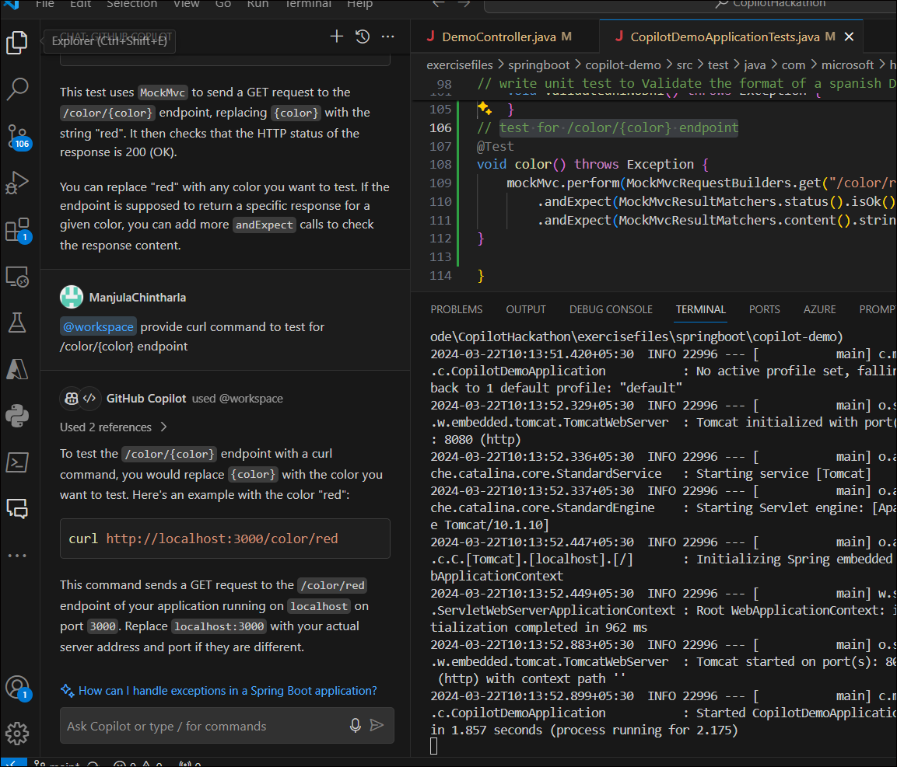

26. Haga clic en **Split terminal** y ejecute el comando curl para
    probar su aplicación (actualice el puerto)

27. Pruebe con los colores que aparecen en el archivo **colors.json**

28. Pruebe con un color que no esté en el archivo **colors.json** y
    observe los resultados.

Tarea 6: Creador de chistes

Cree una nueva operación que llame a la API
https://api.chucknorris.io/jokes/random y devuelva el chiste.

1.  Abra DemoController.java e ingrese el prompt // new operation that
    call the API https://api.chucknorris.io/jokes/random and return the
    joke y presione la tecla Tab para aceptar el código.

2.  También puede usar el siguiente código.

3.  // new operation that call the API
    https://api.chucknorris.io/jokes/random and return the joke

4.  @GetMapping("/joke")

5.  public String getJoke() {

6.  RestTemplate restTemplate = new RestTemplate();

7.  String url = "https://api.chucknorris.io/jokes/random";

8.  ResponseEntity\<String\> response = restTemplate.getForEntity(url,
    String.class);

9.  // parse response to get the value

10. ObjectMapper objectMapper = new ObjectMapper();

11. JsonNode rootNode;

12. try {

13. rootNode = objectMapper.readTree(response.getBody());

14. return rootNode.get("value").asText();

15. } catch (IOException e) {

16. return new String("Error getting joke");

17. }

}

18. Cambie a **CopilotDemoApplicationTests.java**. Para escribir una
    prueba unitaria que valide la función anterior, agregue el prompt //
    Create a unit test for new operation that call the API
    https://api.chucknorris.io/jokes/random and return the joke y
    presione Enter. Presione la tecla Tab para aceptar el código.

19. También puede agregar la siguiente prueba unitaria o puede escribir
    sus propias pruebas unitarias.

20. @Test

21. void joke() throws Exception{

22. mockMvc.perform(MockMvcRequestBuilders.get("/joke"))

23. .andExpect(MockMvcResultMatchers.status().isOk())

24. // check that content is a string

25. .andExpect(MockMvcResultMatchers.content().string(Matchers.any(String.class)));

}

26. Abra Terminal -\> Git bash y ejecute los siguientes comandos.

cd exercisefiles/springboot/copilot-demo/

mvn test

27. Empaquete su aplicación. Ejecute el comando mvn package

28. Ejecute mvn spring-boot:run

29. Divida el terminal y ejecute en el segundo terminal el siguiente
    comando: curl -v http://localhost:8080/joke 

Tarea 7: Análisis de URL

Dada una URL como parámetro de consulta, analícela y devuelva el
protocolo, host, puerto, ruta y parámetros de consulta. La respuesta
debe estar en formato Json.

1.  Abra **DemoController.java** e ingrese el prompt //write a code for
    Given a url as query parameter, parse it and return the protocol,
    host, port, path and query parameters. The response should be in
    Json format y presione la tecla Tab para aceptar el código.

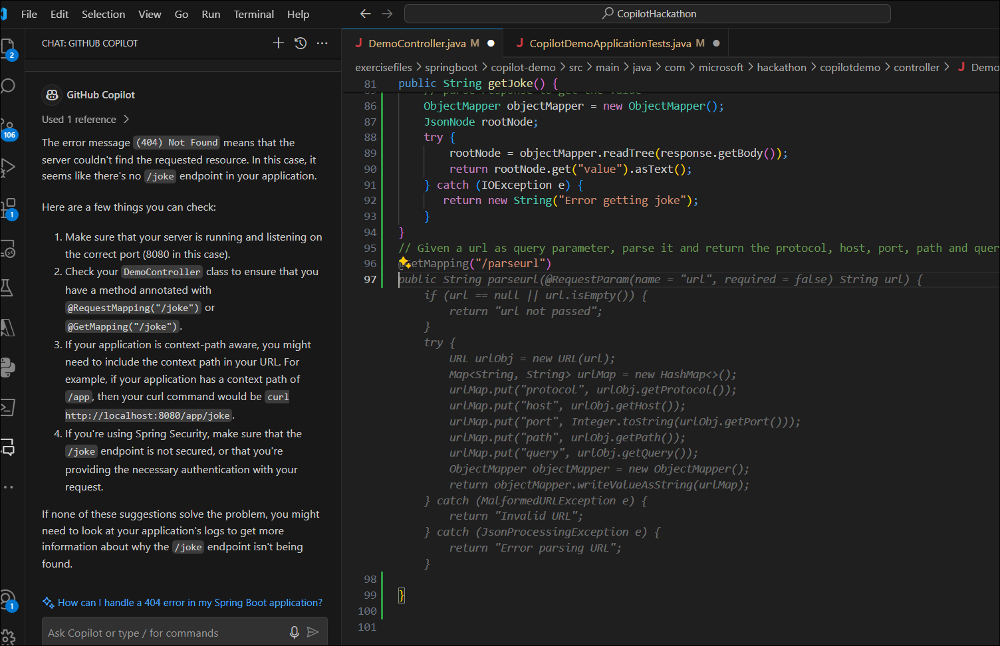

2.  También puede usar el siguiente código.

3.  // Given a url as query parameter, parse it and return the protocol,
    host, port, path and query parameters. The response should be in
    Json format.

4.  @GetMapping("/parseurl")

5.  public String parseurl(@RequestParam(name = "url", required = false)
    String url) throws MalformedURLException {

6.  if (url == null || url.isEmpty()) {

7.  return "url not passed";

8.  }

9.  URL urlObj = new URL(url);

10. String protocol = urlObj.getProtocol();

11. String host = urlObj.getHost();

12. int port = urlObj.getPort();

13. String path = urlObj.getPath();

14. String query = urlObj.getQuery();

15. return "{ \\protocol\\: \\" + protocol + "\\, \\host\\: \\" + host +
    "\\, \\port\\: \\" + port + "\\, \\path\\: \\" + path + "\\,
    \\query\\: \\" + query + "\\ }";

}

16. Cambie a **CopilotDemoApplicationTests.java**. Para escribir una
    prueba unitaria que valide la función anterior, agregue el prompt //
    Create a unit test for new operation that call the API
    https://api.chucknorris.io/jokes/random and return the joke y
    presione Enter. Presione la tecla Tab para aceptar el código.

17. También puede agregar las siguientes pruebas unitarias o escribir
    sus propias pruebas unitarias.

18. @Test

19. void parseUrl() throws Exception{

20. mockMvc.perform(MockMvcRequestBuilders.get("/parseurl?url=https://learn.microsoft.com/en-us/azure/aks/concepts-clusters-workloads?source=recommendations"))

21. .andExpect(MockMvcResultMatchers.status().isOk())

22. // validate json fields

23. .andExpect(MockMvcResultMatchers.jsonPath("$.protocol").value("https"))

24. .andExpect(MockMvcResultMatchers.jsonPath("$.host").value("learn.microsoft.com"))

25. .andExpect(MockMvcResultMatchers.jsonPath("$.path").value("/en-us/azure/aks/concepts-clusters-workloads"))

26. .andExpect(MockMvcResultMatchers.jsonPath("$.query").value("source=recommendations"));

27. }

28. @Test

29. void parseUrlNoUrl() throws Exception{

30. mockMvc.perform(MockMvcRequestBuilders.get("/parseurl"))

31. .andExpect(MockMvcResultMatchers.status().isOk())

32. .andExpect(MockMvcResultMatchers.content().string("url not
    passed"));

}

33. Abra **Terminal -\> Gitbash** y ejecute los siguientes comandos.

cd exercisefiles/springboot/copilot-demo/

mvn test

34. Ejecute el comando mvn package para empaquetar su aplicación.

35. Ejecute mvn spring-boot:run

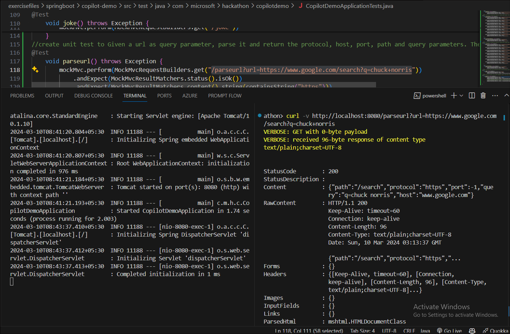

36. Divida el terminal y pruebe su aplicación con el siguiente
    comando: curl -v
    http://localhost:8080/parseurl?url=https://www.google.com/search?q=chuck+norris

Tarea 8: Conteo de palabras

Dado el path de un archivo, cuente el número de ocurrencias de una
palabra proporcionada. El path y la palabra deben ser parámetros de
consulta. La respuesta debe estar en formato Json.

1.  Abra **DemoController.Java** e ingrese el prompt //write a code for
    Given the path of a file and count the number of occurrences of a
    provided word. The path and the word should be query parameters. The
    response should be in Json format y presione la tecla Tab para
    aceptar el código.

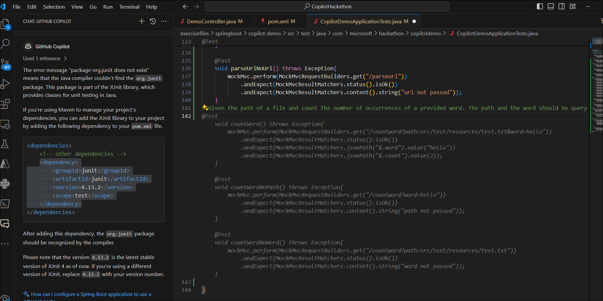

2.  Cambie a **CopilotDemoApplicationTests.java**. Para escribir una
    prueba unitaria que valide la función anterior, agregue el prompt //
    Given the path of a file and count the number of occurrences of a
    provided word. The path and the word should be query parameters. The
    response should be in Json format. y presione Enter. Presione la
    tecla Tab para aceptar el código.

3.  Abra Terminal -\> Gitbash y ejecute los siguientes comandos.

cd exercisefiles/springboot/copilot-demo/

mvn test

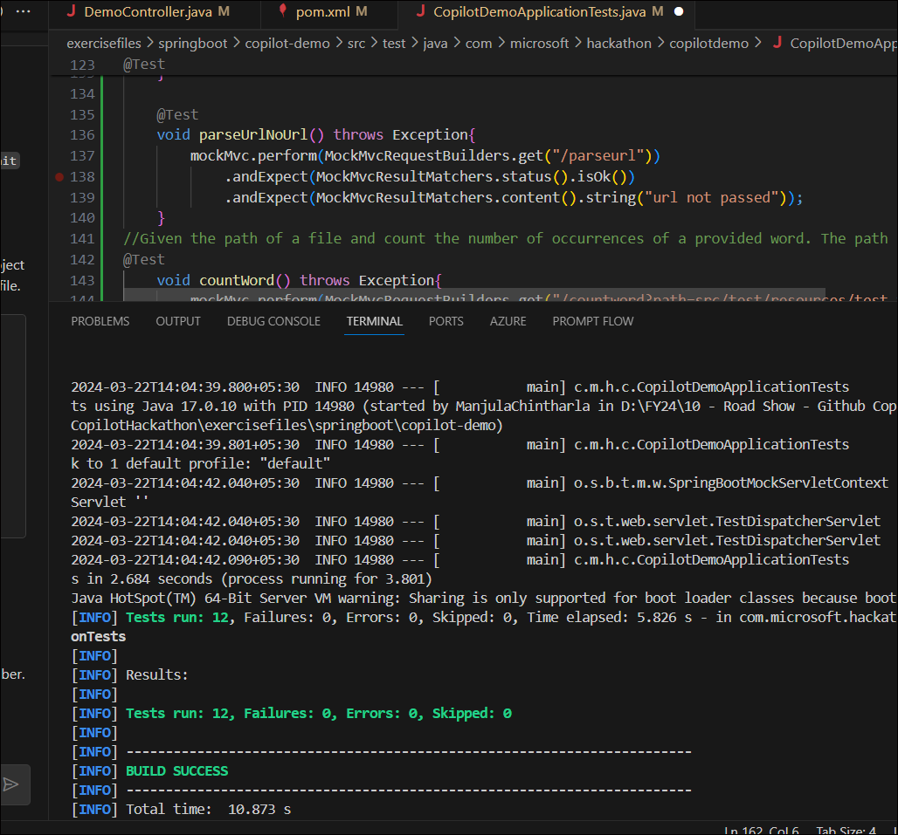

4.  Ejecute el comando mvn package para empaquetar su aplicación.

5.  Ejecute mvn spring-boot:run

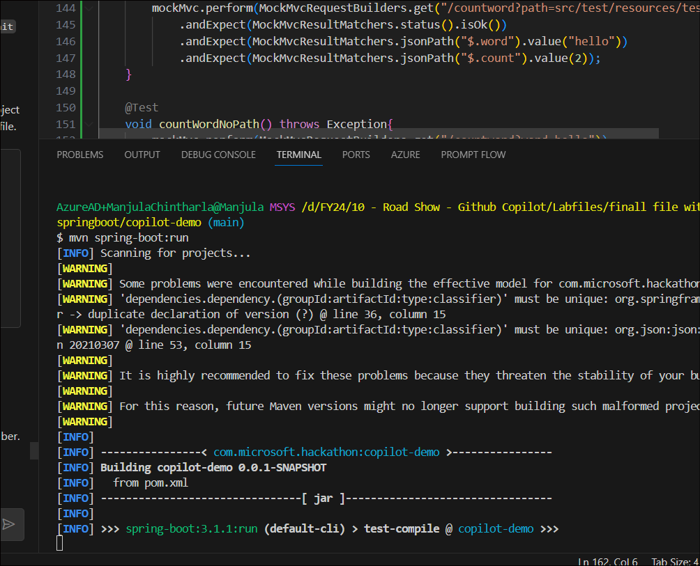

6.  Divida el terminal y ejecute el comando curl para probar su
    aplicación.

curl http://localhost:8080/countword?path=src/test/resources/test.txt

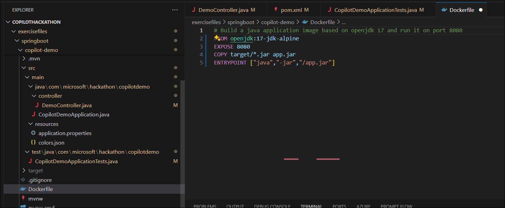

Tarea 9: Contenerizar la aplicación

Use el Dockerfile proporcionado para crear una imagen Docker de la
aplicación. Hay algunos comentarios en el archivo Dockerfile que le
ayudarán a completar el ejercicio.

Para compilar, ejecutar y probar la imagen Docker, también puede usar
Copilot para que genere los comandos.

Por ejemplo, cree un archivo DOCKER.md donde pueda almacenar los
comandos para compilar, ejecutar y probar la imagen Docker. Notará que
Copilot también le ayudará a documentar su proyecto y los comandos.

Ejemplos de pasos a documentar: compilar la imagen del contenedor,
ejecutar el contenedor, probar el contenedor.

1.  Haga doble clic en Docker desde el escritorio e inicie sesión con su
    cuenta.

2.  Abra el archivo Dockerfile en Visual Studio Code, agregue el
    siguiente código y guarde el archivo.

3.  \# Build a java application image based on openjdk 17 and run it on
    port 8080

4.  FROM openjdk:17-jdk-alpine

5.  EXPOSE 8080

6.  COPY target/\*.jar app.jar

ENTRYPOINT \["java","-jar","/app.jar"\]

7.  Presione **Ctrl + Alt + I** para abrir la ventana de chat de
    **GitHub Copilot**. Pregunte a Copilot con el siguiente prompt.
    Copilot le proporcionará los pasos para contenerizar la aplicación.

how to build, run and test the docker image with the Dockerfile provided
to create a docker image of the application

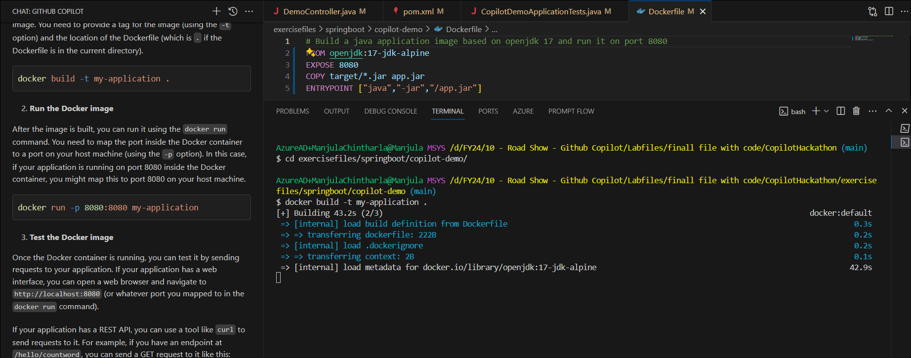

8.  Siga el primer paso: compilar la imagen Docker. Abra **Terminal -\>
    Git Bash** y ejecute el comando para compilar la imagen Docker.

cd exercisefiles/springboot/copilot-demo/

docker build -t my-application .

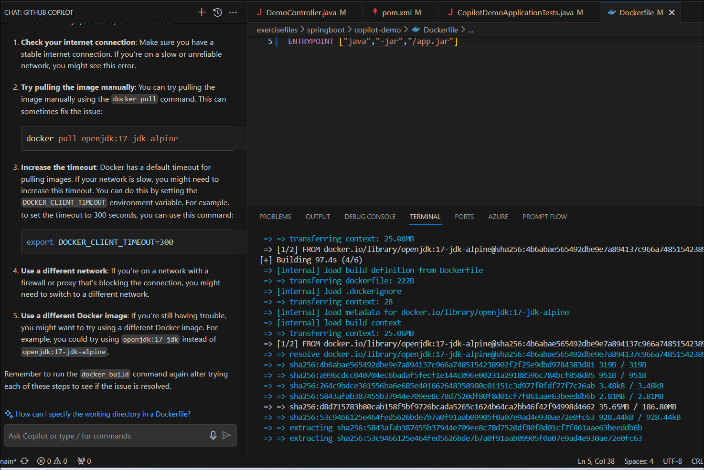

9.  Una vez que la imagen esté compilada, puede ejecutarla usando el
    commando docker run.

docker run -p 8080:8080 my-application

10. Una vez que el contenedor Docker esté en ejecución, puede probarlo
    enviando solicitudes a su aplicación.

curl \<http://localhost:8080/hello?key=world

