**ラボ 18 - GitHub Copilot の助けを借りて Spring Boot を使用して REST
API を構築する**

**ゴール**

このラボの目標は、Spring Boot を使用して REST API
を構築する演習を使用して、GitHub Copilot の使用方法を学習することです。

いくつかのファイルがすでに作成されている Spring Boot
プロジェクトを作成しましたが、プロジェクトは**フォルダー
C:\CopilotHackathon\exercisefiles\springboot** にあります。

このラボを実行する前に、まず必要なソフトウェアパッケージをインストールし、環境をセットアップしましょう。

タスク0: 環境のインストールおよび設定

このラボを実行するための環境を設定するには、次のソフトウェア
パッケージをダウンロードしてインストールする必要があります。

1.  Microsoft JDK 17

2.  apache maven

&nbsp;

1.  Edge ブラウザを開きます。

2.  ブラウザーの URL
    フィールドで、リンクをコピーして貼り付けて、ソフトウェア
    パッケージをラボ VM にダウンロードします。

a\. Microsoft JDK 17 ◊
https://aka.ms/download-jdk/microsoft-jdk-17.0.12-windows-x64.msi

b\. Apache Maven
◊https://dlcdn.apache.org/maven/maven-3/3.9.9/binaries/apache-maven-3.9.9-bin.zip

**注:**
同じ手順を繰り返して、他のすべてのパッケージもダウンロードします。デフォルトでは、パッケージはダウンロードフォルダに保存されます。

1.  **Microsoft JDK 17 をインストールする**

    1.  **Downloads** (**C:\Users\Admin\Downloads**)フォルダーで「Microsoft
        JDK**」**をダブルクリックします。

2.  「**Next」**をクリックします。

3.  EULA に同意し、「**Next」**をクリックします。

4.  「**Install just for you
    (Admin)」**を選択し、**「Next」**をクリックします。

5.  **カスタム設定**画面で
    、**JAVA_HOME変数を設定します**。下矢印をクリックし、「**Entire
    feature will be installed on local hard drive**」を選択します。

6.  「**Next」**をクリックします。

7.  「**Install**」をクリックします。

**b.apache-mavenをインストールする**

8.  ダウンロード
    **Downloads** (**C:\Users\Admin\Downloads**)フォルダーに移動します。

9.  フォルダー **apache-maven-3.9.9-bin.zip** 右クリック し、「**Extract
    All**」を選択します。

10. 「**Select a destination**」ページで、宛先を
    **C:\Users\Admin\Downloads**
    として入力し、「**Extract」**をクリックします。

11. 抽出されたファイルはスクリーンショットのようになります。

**注:**
他の名前が表示されている場合は、フォルダーの名前が**apache-maven-3.9.9**に変更されていることを確認してください。

**環境変数の設定**

12. 「**Windows logo**」をクリックし、「 **Settings」**を選択します

13. Windowsの設定**ページで**「システムの編集」を検索し**、「システム環境変数の編集」を選択します**。

1.  「環境変数」 **ボタン**をクリックします。

2.  「管理者」 セクションの 「ユーザー変数**」 で** 「新規」
    **をクリックします** 。

3.  次に、Maven の環境変数とパス変数を設定します。

「管理者」 セクションの 「ユーザー変数**」 で** 「新規**」
を選択します** 。

4.  「新しいユーザー変数」 **ウィンドウで**、次のように入力し、「**OK」
    をクリックします**

変数名: MAVEN_HOME

変数値: C:\Users\Admin\Downloads\apache-maven-3.9.9

5.  次に、「パス」**を選択し** 、「**編集」をクリックします**

6.  「**環境変数の編集」**ウィンドウで、「**新規」をクリックします**。

7.  空のフィールドに、次の %MAVEN_HOME%\bin を入力し、「**OK」**
    をクリックします。

8.  「OK」**をクリックして** 、Maven
    のユーザー環境変数とパス変数の設定を完了します。

9.  次に、 Maven の**システム変数**を設定します。**「システム変数」**
    セクション**で** 「新規」 を選択します。

10. 「新しいシステム変数」ウィンドウで、次のように入力し、「**OK」をクリックします**

変数名: MAVEN_HOME

変数値: C:\Users\Admin\Downloads\apache-maven-3.9.9

タスク 1 : 単純な GET 要求を処理するコードを作成する

「DemoController.java」ファイルに移動し、単純な GET
リクエストを処理するコードの記述を開始します。この最初の演習では、生成する必要があるコードを説明するコメントを提供しました。Enter
キーを押して数秒待つだけで、Copilot がコードを生成します。

この演習には既に実装されている単体テストがあり、コマンド mvn test
前後を使用して実行し、Copilot
によって生成されたコードが正しいことを検証できます。

次に、要求でキーが指定されていない場合の新しい単体テストを作成します。

演習のたびに、アプリケーションをパッケージ化して実行し、テストしてください。

パッケージ:mvnパッケージ

実行:mvn spring-boot:run

テスト: curl -v http://localhost:8080/hello?key=world

1.  エクスプローラーを開き、ローカル ディスク (C:)
    を展開し、**Springboot \> copilot-demo \> copilot-demo
    src\>main\>java\>com\>Microsoft\>hackathon\>copilotdemo\>controller
    フォルダー\> CopilotHackathon-\>exercisefiles**
    を展開して**、'DemoController.java** ファイルを表示します。

ファイルをダブルクリック**DemoController.java**。この最初の演習では、生成する必要があるコードを説明するコメントのみが提供されます。

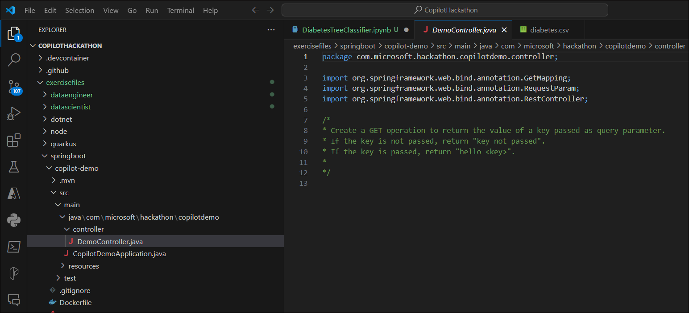

2.  コメントの最後 (12 行目) にカーソルを置き、Enter
    キーを押して数秒待つと、**Copilot**
    がコードを生成します。完全なコードが表示されるまでタブを押します。

Ctrl + Enter キーを押してコード オプションを選択することもできます。

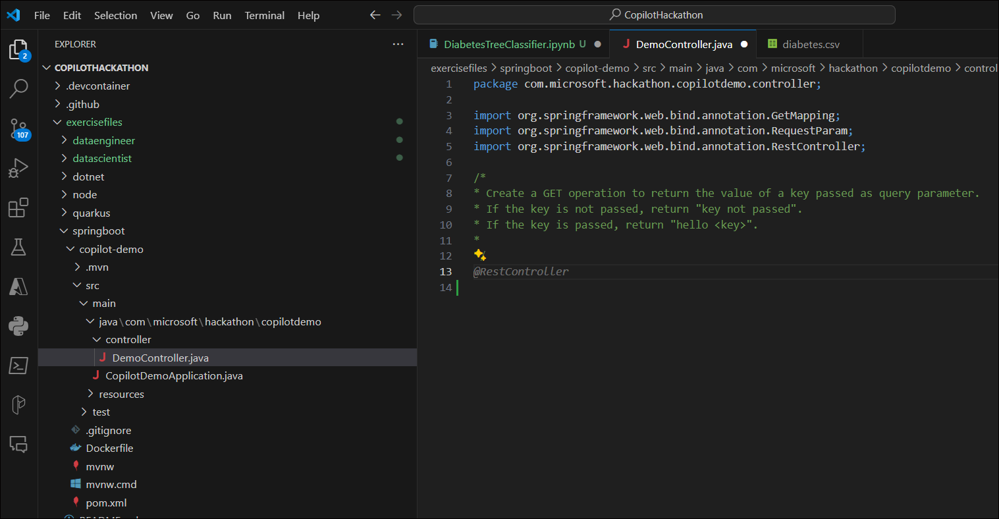

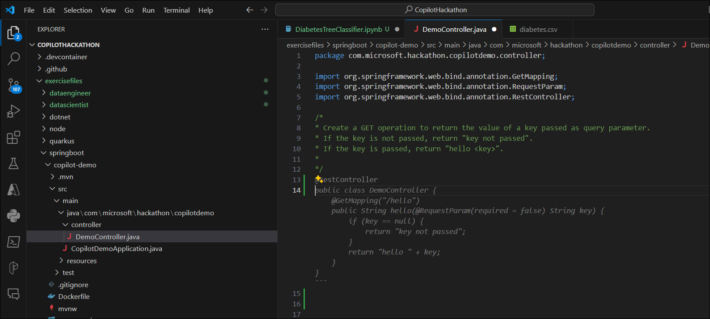

3.  テストフォルダ**を展開**
    し、CopilotDemoApplicationTests.javaをクリックします**。**
    単体テストはすでに提供されています。

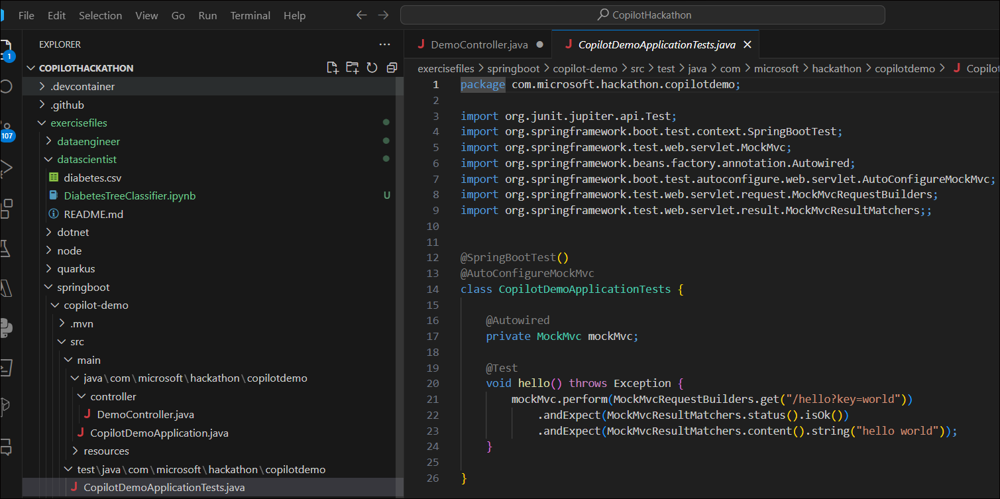

4.  pom
    xmlを更新せずにコードを実行してみて、製品を探索するためのソリューションをCoiplotに依頼することができます。

5.  以下のプラグインを開き**Pom.xml**追加し、ファイルを保存します

6.  \<プラグイン\>

7.  \<groupId\>org.apache.maven.plugins\</groupId\>

8.  \<artifactId\>maven-compiler-plugin\</artifactId\>

9.  \<バージョン\>3.8.1\</version\>

10. \<構成\>

11. \<ソース\>17\</ソース\>

12. \<target\>17\</target\>

13. \</構成\>

\</plugin\>

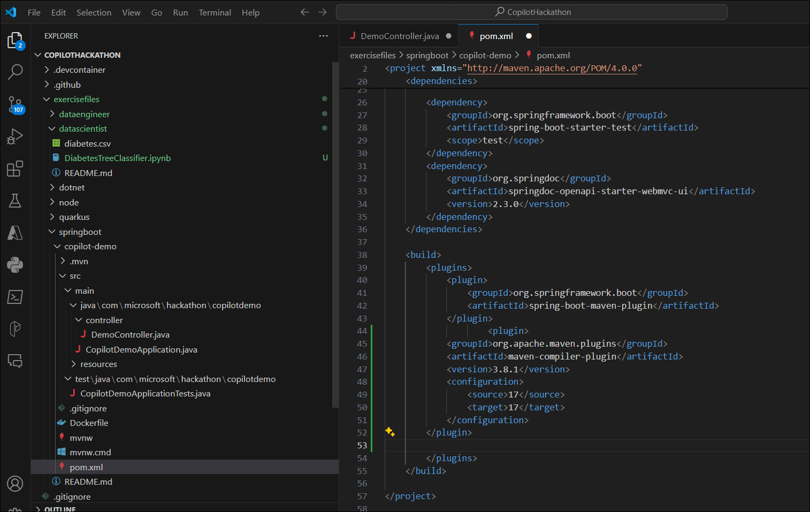

14. ツールバーから **「ターミナル」 -「新しいターミナル\>」**
    をクリックします。

15. Gitbash **を選択し** 、以下のコマンドを実行します。

cd 演習ファイル/springboot/copilot-demo/

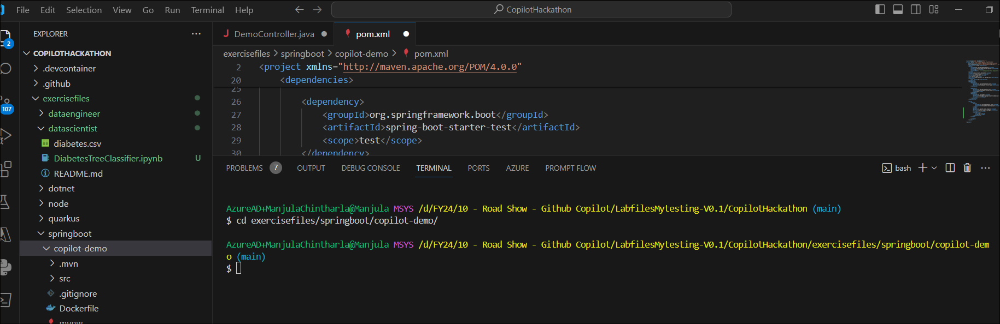

16. mvn clean install -DskipTests コマンドを実行します。

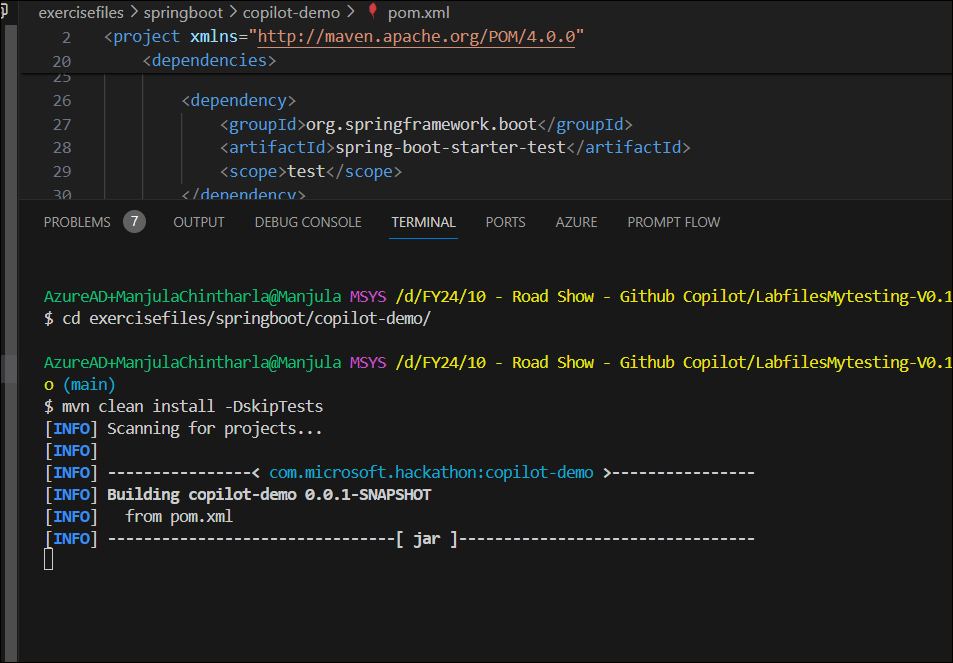

17. mvn test を実行します。ビルドがエラーで失敗した場合。

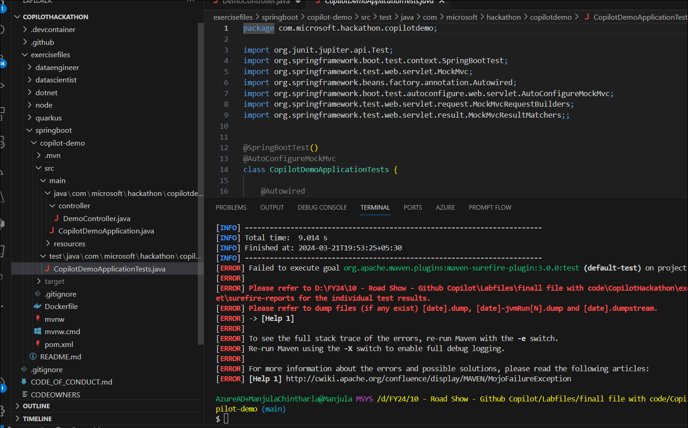

18. 右下隅にある **Copilot** アイコンをクリックし、「**Github Copilot
    Chat」 を選択します**。

19. Github Copilot チャットにエラーの修正を提供するように依頼します。

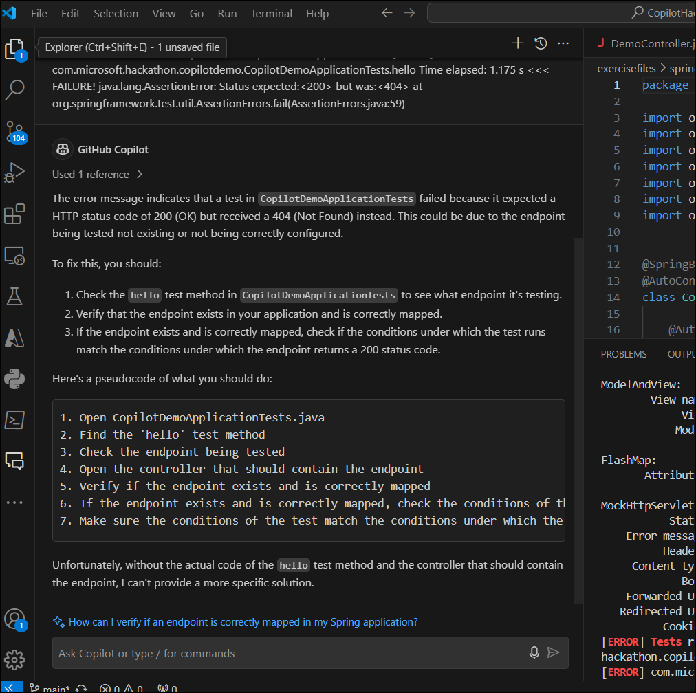

20. 問題と対応する修正を説明する Copilot
    チャットを見てください。それでも修正がわからない場合は、疑問を抱き続ければ、Copilot
    が答えてくれます。エラーと実装する解決策を読んで理解してください。

21. /hello メソッドを Copilot
    に提供して、それが何を提案するかを見てみましょう。

22. **CopilotDemoApplicationTests.java** に戻る テストの最後 (24 行目)
    でカーソルを置き、Enter キーを押します。Copilot
    によって別のテストが生成されます。タブを押して受け入れます。

23. テストから Copilot に /hello
    メソッドを提供し、それが何を提案するかを確認します。

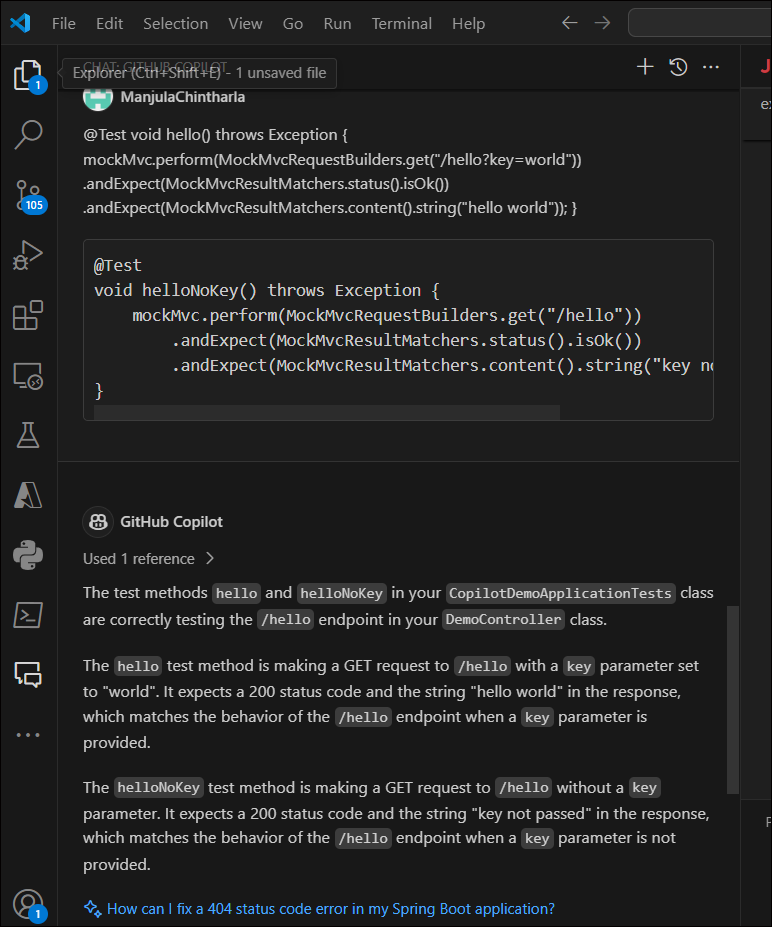

24. mvn
    テストを再実行しますコードは次のようになります。独自のコードを記述して、Copilot
    に検証を依頼することもできます。

25. @RestController

26. パブリッククラス DemoController {

27. @GetMapping("/こんにちは")

28. public 文字列 hello(@RequestParam(name = "key", required = false)
    String key) {

29. if (キー== null) {

30. return "キーが渡されませんでした"

31. }

32. return "こんにちは " + キー;

33. }

34. 

}

35. mvn package コマンドを実行する

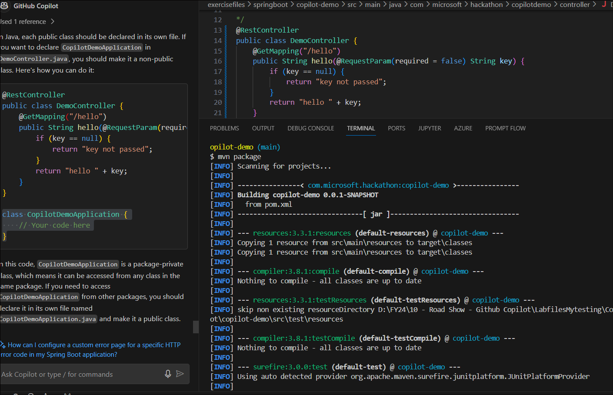

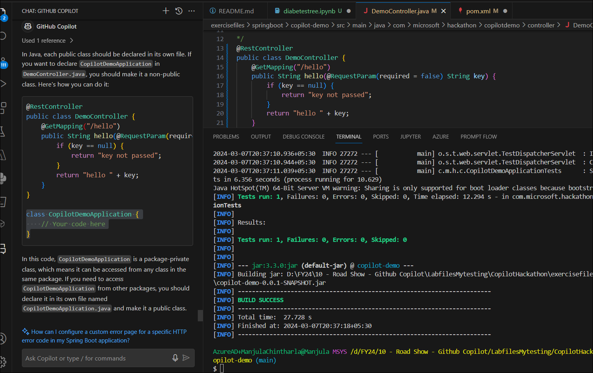

36. mvn spring-boot:runを実行します

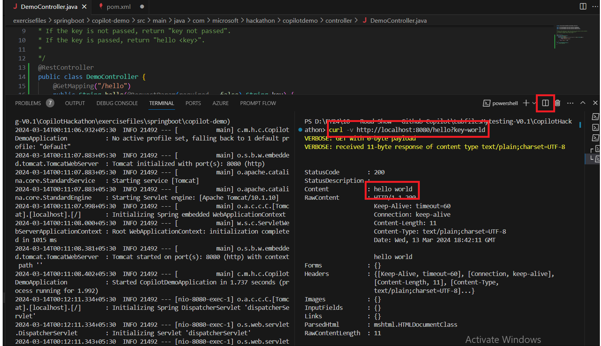

37. ターミナルを分割をクリックし、2番目のターミナルにcurl -v
    http://localhost:8080/hello?key=world
    と入力します。コードをテストするための curl コマンドを提供するように
    Copilot に依頼することもできます。

38. ターミナルの分割をクリックし、2番目のターミナルにcurl -v
    http://localhost:8080/hello と入力します

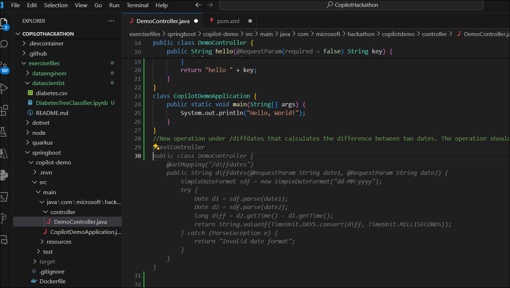

39. Ctrl + C を押して、実行中のサービスを停止します。

タスク 2 : 日付の比較

2 つの日付の差を計算する /diffdates の下の新しい操作。操作は、dd-MM-yyyy
形式のパラメーターとして 2
つの日付を受け取り、日数単位の差を返す必要があります。

さらに、操作を検証する単体テストを作成します。

今後は、新しい操作ごとに単体テストを作成する必要があります。Copilot
は簡単ではありませんでしたか?

1.  DemoController.javaに移動し 、2 つの日付の差を計算するプロンプト
    ///diffdates の下に新しい操作を作成します。操作は、dd-MM-yyyy
    形式のパラメーターとして 2 つの日付を受け取り、日数単位の差を返して
    Enter
    キーを押す必要があります。しばらく待ってから、コパイロットがコードを予測したら、タブを押してコードを受け入れます。

2.  以下のコードを使用することもできます。

3.  @GetMapping("/diffdates")

4.  public String diffdates(@RequestParam(name = "date1", required =
    false) String date1, @RequestParam(name = "date2", required = false)
    String date2) throws ParseException {

5.  if (date1 == null || date2 == null) {

6.  return "日付が経過していません"

7.  }

8.  SimpleDateFormat sdf = 新しい SimpleDateFormat("dd-MM-yyyy");

9.  日付 date1Obj = sdf.parse(date1);

10. 日付 date2Obj = sdf.parse(date2);

11. 長い diffInMillies = Math.abs(date2Obj.getTime() -
    date1Obj.getTime());

12. 長い差分 = TimeUnit.DAYS.convert(diffInMillies,
    TimeUnit.MILLISECONDS);

13. return "日数の差: " + diff;

}

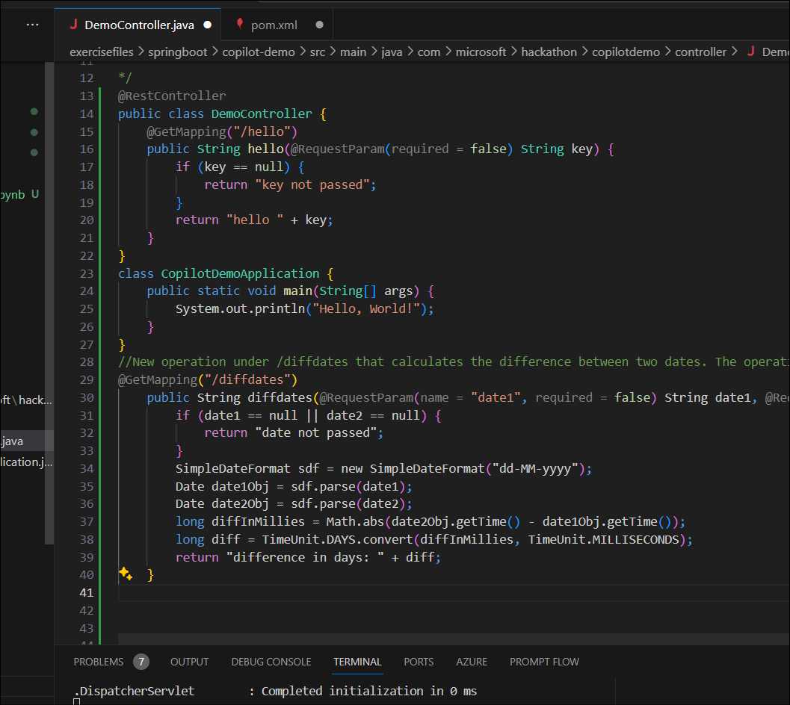

14. 今後は、新しい操作ごとに単体テストを作成する必要があります。Copilot
    を使用して作成します。

15. テスト**フォルダの下に**あるCopilotDemoApplicationTests.java**を開き**
    、2つの日付の差を計算するプロンプト///単体テストを/diffdatesに入力します。操作は、dd-MM-yyyy
    形式のパラメーターとして 2
    つの日付を受け取り、日数単位の差を返す必要があります。次に、Enter
    キーを押します。コパイロットがコードを予測するまでしばらく待ち、Tab
    キーを押して予測されたコードを受け入れます。

16. Tab キーを押して、複数の単体テストを作成できます

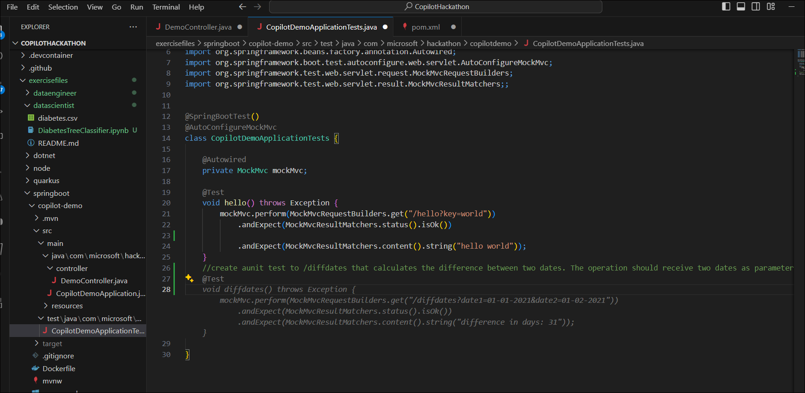

17. Copilot チャット ヘルプを利用して、修正すべき問題について、または
    Copilot
    入力に基づいて必要に応じて単体テストと更新コードを説明します。

18. @Test

19. void diffdates() は Exception { をスローします

20. mockMvc.perform(MockMvcRequestBuilders.get("/diffdates?date1=01-01-2021&date2=01-02-2021"))

21. .andExpect(MockMvcResultMatchers.status().isOk())

22. .andExpect(MockMvcResultMatchers.content().string("日数の差: 31"));

23. }

24. @Test

25. void diffdatesNoDate1() は例外をスローします {

26. mockMvc.perform(MockMvcRequestBuilders.get("/diffdates?date2=01-02-2021"))

27. .andExpect(MockMvcResultMatchers.status().isOk())

28. .andExpect(MockMvcResultMatchers.content().string("日付が渡されていません");

29. }

30. @Test

31. void diffdatesNoDate2() は例外をスローします {

32. mockMvc.perform(MockMvcRequestBuilders.get("/diffdates?date1=01-01-2021"))

33. .andExpect(MockMvcResultMatchers.status().isOk())

34. .andExpect(MockMvcResultMatchers.content().string("日付が渡されていません");

}

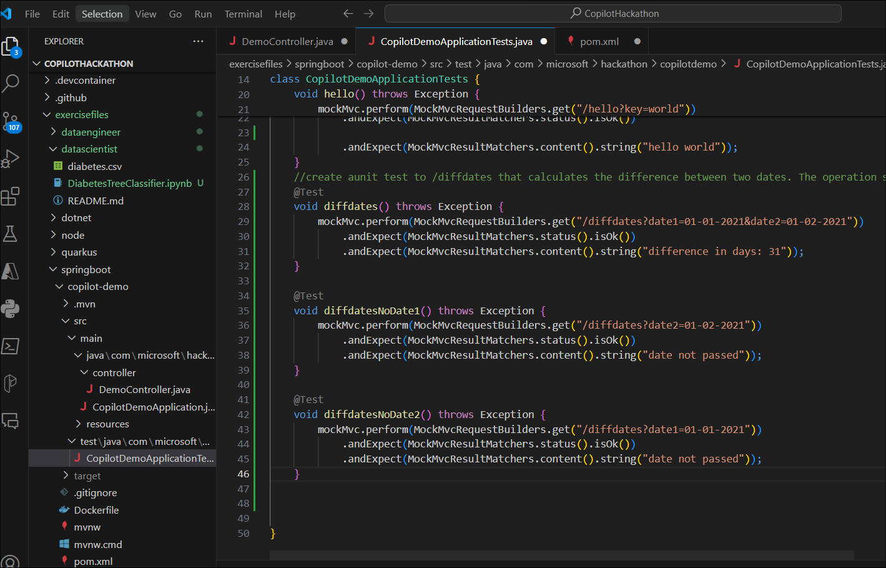

35. ターミナル -\>Gitbash **を開き** 、以下のコマンドを実行します。

cd "exercisefiles\springboot\copilot-demo"

MVNテスト

36. コンパイル エラーが表示された場合は、エラー
    メッセージをコピーして、Copilot に修正を依頼してください。

37. Copolit
    は、コード付きのパッケージをインポートすることを提案しています。コマンドをコードに追加し、mvn
    test を実行します

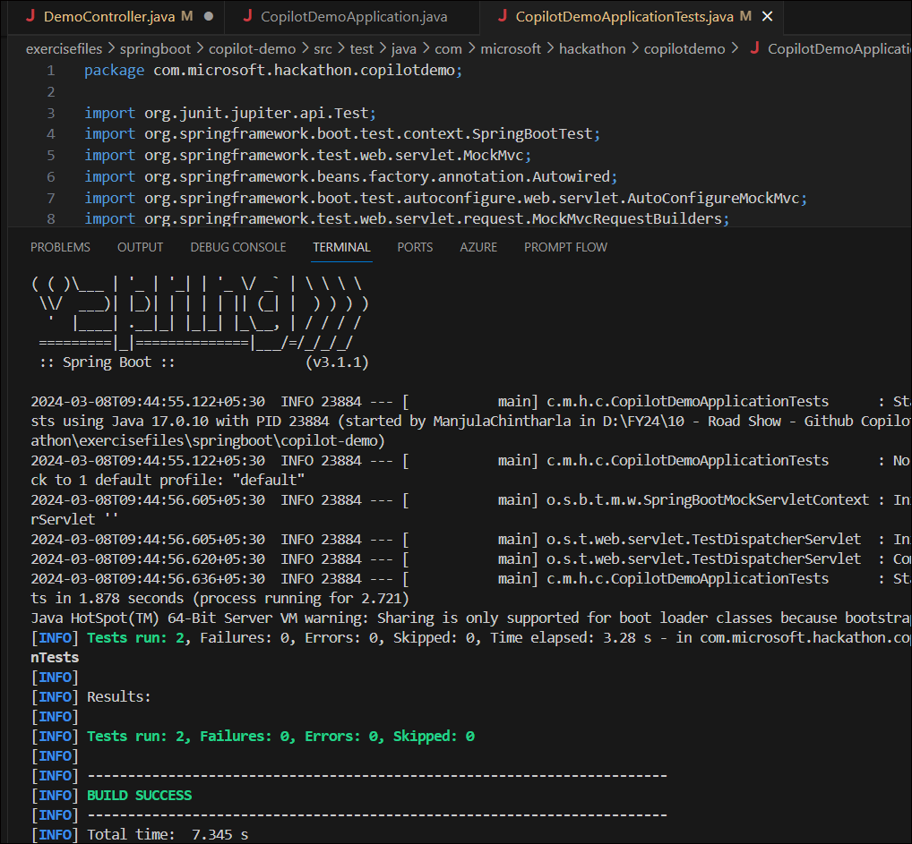

38. mvn パッケージを実行する

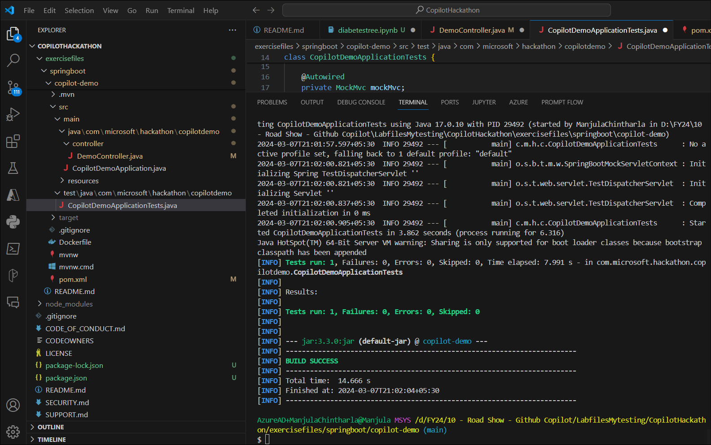

39. テスト mvn -Dtest=CopilotDemoApplicationTests#diffdates
    テストを実行します。

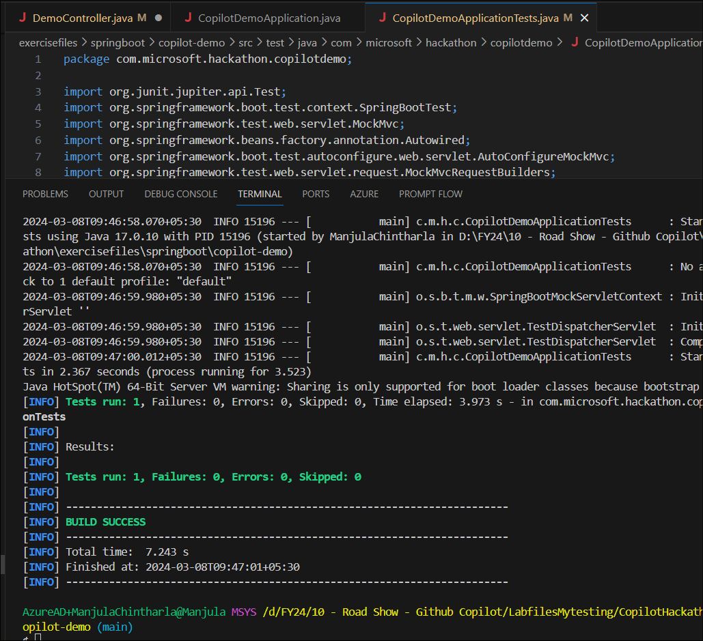

40. mvn spring-boot:runを実行します

41. 「ターミナルの分割」をクリックし、curl -vを実行します
    http://localhost:8080/diffdates?date1=01-01-2021&date2=01-02-2021

エラーが表示されます。Copilot
の助けを借りて、小さな問題を解決してください。

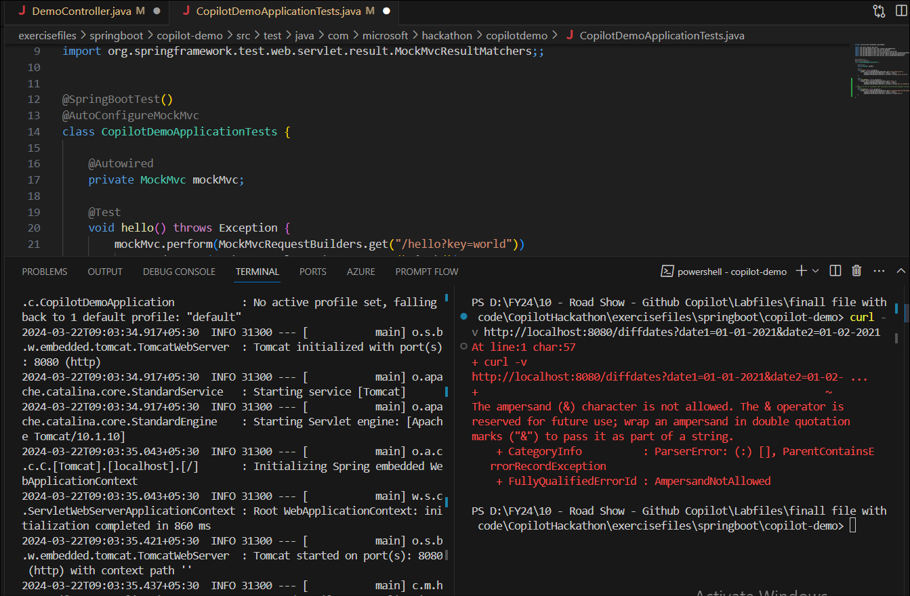

42. として Copilot Chat であなたを助けます curl コマンド
    。エラーメッセージをコピーしてチャットに貼り付けるだけです。Copilot
    は、変更されたコマンドと説明を提供します

タスク 3 : スペイン語の電話の形式を検証する

スペインの電話番号の形式(+34プレフィックス、次に9桁、6、7、または9で始まる)を検証します。操作はパラメータとして電話番号を受け取り、形式が正しい場合はtrueを返し、それ以外の場合はfalseを返す必要があります。

1.  DemoController.Java を開き、プロンプトを入力します //
    スペイン語の電話番号の形式を検証します (+34 プレフィックス、次に 9
    桁、6、7、または 9
    から始まります)。操作はパラメータとして電話番号を受け取り、形式が正しい場合はtrueを返し、それ以外の場合はfalseを返す必要があります。.Tab
    キーを押してコードを受け入れます。

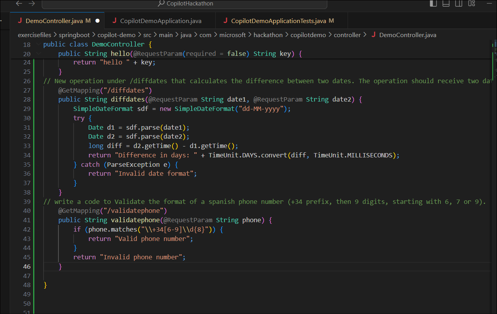

2.  以下のコードを使用することもできます。

3.  スペインの電話番号の形式(+34プレフィックス、次に9桁、6、7、または9で始まる)を検証します。操作はパラメータとして電話番号を受け取り、形式が正しい場合はtrueを返し、それ以外の場合はfalseを返す必要があります。

4.  @GetMapping("/validatephone")

5.  public boolean validatephone(@RequestParam(name = "phone", required
    = false) String phone) {

6.  if (電話 == null || phone.isEmpty()) {

7.  falseを返します。

8.  }

9.  文字列正規表現 = "^\\+34「679」\\d{8}$";

10. phone.matches(正規表現)を返します。

}

11. CopilotDemoApplicationTests.javaに切り替えます。上記の関数をテストする単体テストを作成するには、//単体テストを記述してスペイン語の電話番号の形式を検証します(+34プレフィックス、次に9桁、6、7、または9で始まります)。操作はパラメータとして電話番号を受け取り、形式が正しい場合はtrueを返し、それ以外の場合はfalseを返す必要があります。Enterキーを押します。タブを押してコードを受け入れます。

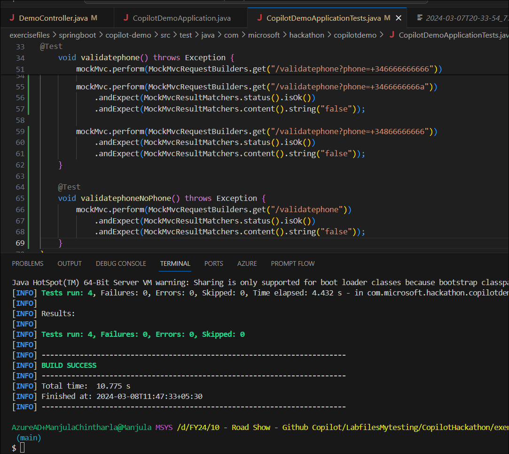

12. 以下の単体テストを使用することも、独自の単体テストを作成することもできます。

13. @Test

14. void validatephone() は例外をスローします {

15. mockMvc.perform(MockMvcRequestBuilders.get("/validatephone?phone=+34666666666"))

16. .andExpect(MockMvcResultMatchers.status().isOk())

17. .andExpect(MockMvcResultMatchers.content().string("true"));

18. mockMvc.perform(MockMvcRequestBuilders.get("/validatephone?phone=+34766666666"))

19. .andExpect(MockMvcResultMatchers.status().isOk())

20. .andExpect(MockMvcResultMatchers.content().string("true"));

21. mockMvc.perform(MockMvcRequestBuilders.get("/validatephone?phone=+34966666666"))

22. .andExpect(MockMvcResultMatchers.status().isOk())

23. .andExpect(MockMvcResultMatchers.content().string("true"));

24. mockMvc.perform(MockMvcRequestBuilders.get("/validatephone?phone=+3466666666"))

25. .andExpect(MockMvcResultMatchers.status().isOk())

26. .andExpect(MockMvcResultMatchers.content().string("false"));

27. mockMvc.perform(MockMvcRequestBuilders.get("/validatephone?phone=+346666666666"))

28. .andExpect(MockMvcResultMatchers.status().isOk())

29. .andExpect(MockMvcResultMatchers.content().string("false"));

30. mockMvc.perform(MockMvcRequestBuilders.get("/validatephone?phone=+3466666666a"))

31. .andExpect(MockMvcResultMatchers.status().isOk())

32. .andExpect(MockMvcResultMatchers.content().string("false"));

33. mockMvc.perform(MockMvcRequestBuilders.get("/validatephone?phone=+34866666666"))

34. .andExpect(MockMvcResultMatchers.status().isOk())

35. .andExpect(MockMvcResultMatchers.content().string("false"));

36. }

37. @Test

38. void validatephoneNoPhone() は例外をスローします {

39. mockMvc.perform(MockMvcRequestBuilders.get("/validatephone"))

40. .andExpect(MockMvcResultMatchers.status().isOk())

41. .andExpect(MockMvcResultMatchers.content().string("false"));

}

42. ターミナル -\>Gitbash **を開き** 、以下のコマンドを実行します。

cd 演習ファイル/springboot/copilot-demo/

MVNテスト

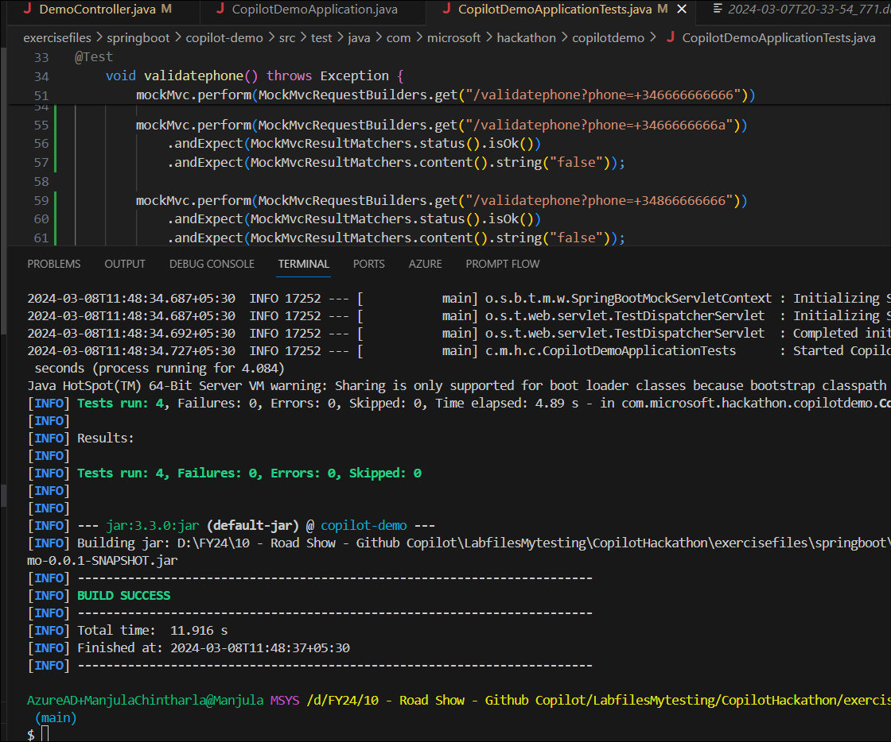

43. mvn パッケージを実行する

44. mvn spring-boot:runを実行します

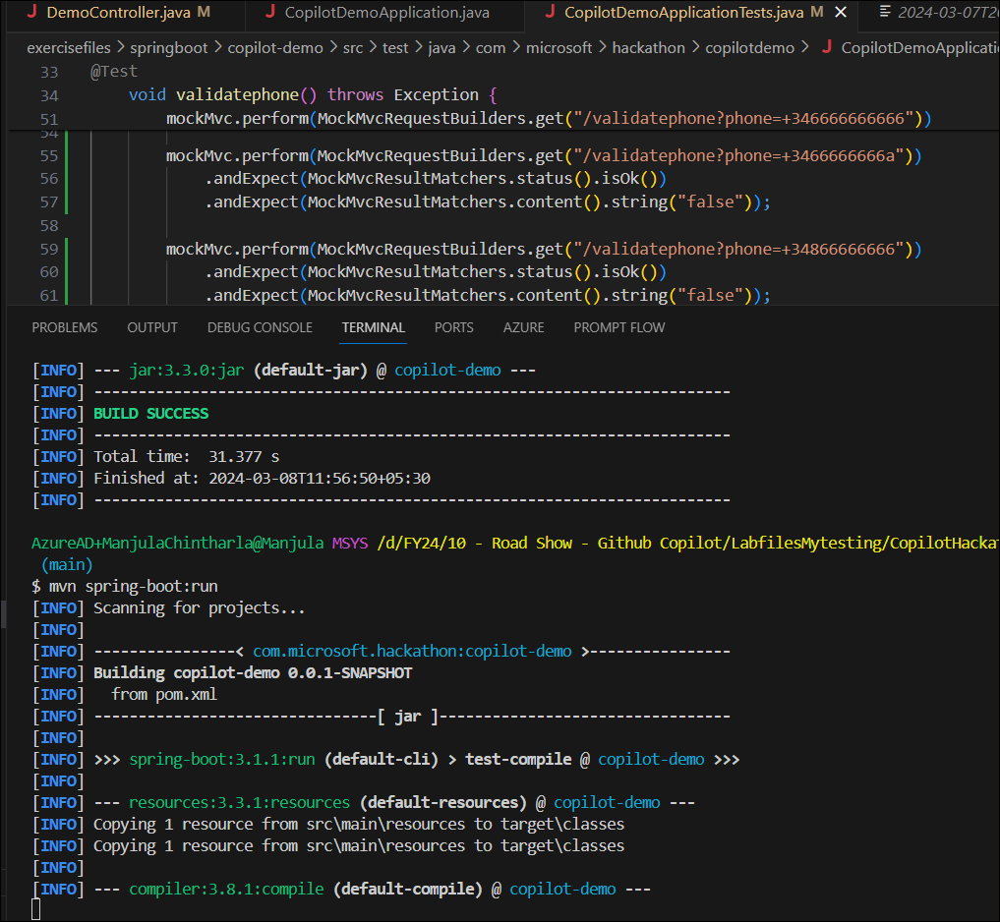

45. 端末を分割し、以下のcurlコマンドを実行して電話番号を検証します。

curl -v http://localhost:8080/validatephone?phone=+34866666666

curl -v http://localhost:8080/validatephone?phone=+34666666667

curl -v http://localhost:8080/validatephone?phone=+34666666666

タスク 4 : スペイン語の DNI の形式の検証

スペイン語のDNI(8桁と1文字)の形式を検証します。操作はパラメータとしてDNIを受け取り、フォーマットが正しい場合はtrueを返し、それ以外の場合はfalseを返す必要があります。

1.  DemoController.Java を開き、プロンプトを入力します // スペイン語の
    DNI の形式 (8 桁と 1 文字)
    を検証します。操作はパラメータとしてDNIを受け取り、フォーマットが正しい場合はtrueを返し、それ以外の場合はfalseを返す必要があります。.タブを押してコードを受け入れます。

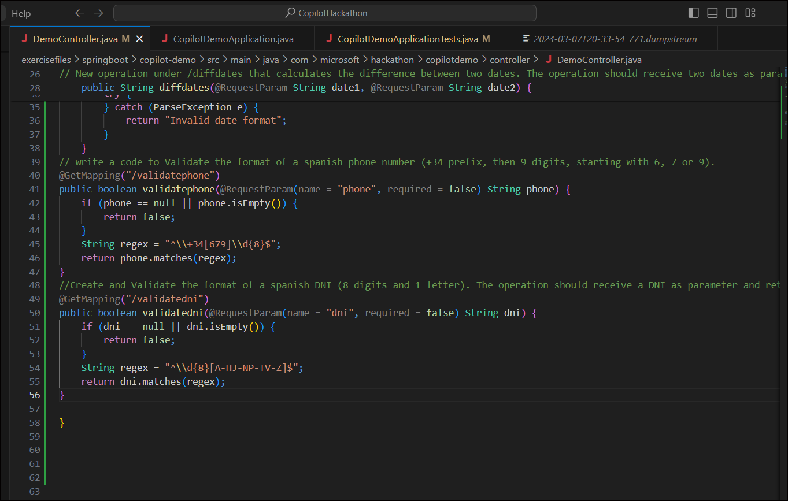

2.  以下のコードを使用することもできます

3.  スペイン語のDNI(8桁と1文字)の形式を検証します。操作はパラメータとしてDNIを受け取り、フォーマットが正しい場合はtrueを返し、それ以外の場合はfalseを返す必要があります。

4.  @GetMapping("/validatedni")

5.  public boolean validatedni(@RequestParam(name = "dni", required =
    false) String dni) {

6.  if (dni == null || dni.isEmpty()) {

7.  falseを返します。

8.  }

9.  文字列正規表現 = "^\\d{8}「A-Z」$";

10. dni.matches(regex)を返します。

}

11. CopilotDemoApplicationTests.javaに切り替えます。上記の関数をテストする単体テストを記述するには、スペイン語のDNI(8桁と1文字)の形式を検証するために//単体テストを記述します。操作はパラメータとしてDNIを受け取り、フォーマットが正しい場合はtrueを返し、それ以外の場合はfalseを返します。Enterキーを押します。タブを押してコードを受け入れます。

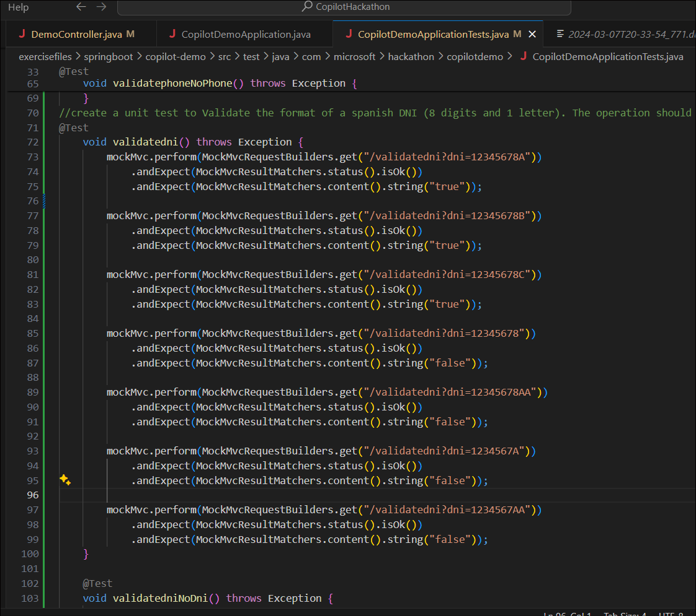

12. 以下の単体テストを使用することも、独自の単体テストを作成することもできます。

13. @Test

14. void validatedniNoDni() は例外をスローします {

15. mockMvc.perform(MockMvcRequestBuilders.get("/validatedni"))

16. .andExpect(MockMvcResultMatchers.status().isOk())

17. .andExpect(MockMvcResultMatchers.content().string("false"));

}

18. ターミナル -\> Gitbash を開き、以下のコマンドを実行します。

cd 演習ファイル/springboot/copilot-demo/

MVNテスト

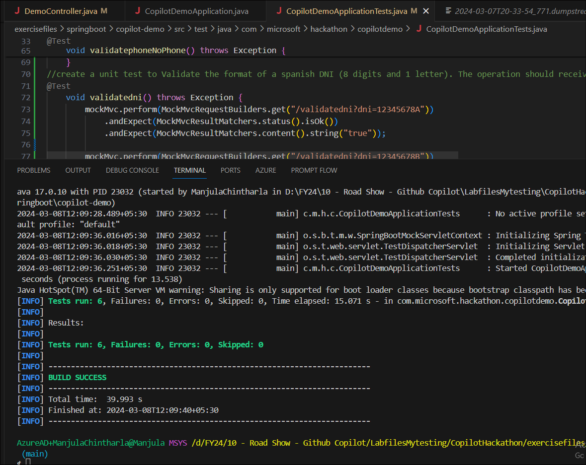

19. mvn パッケージを実行する

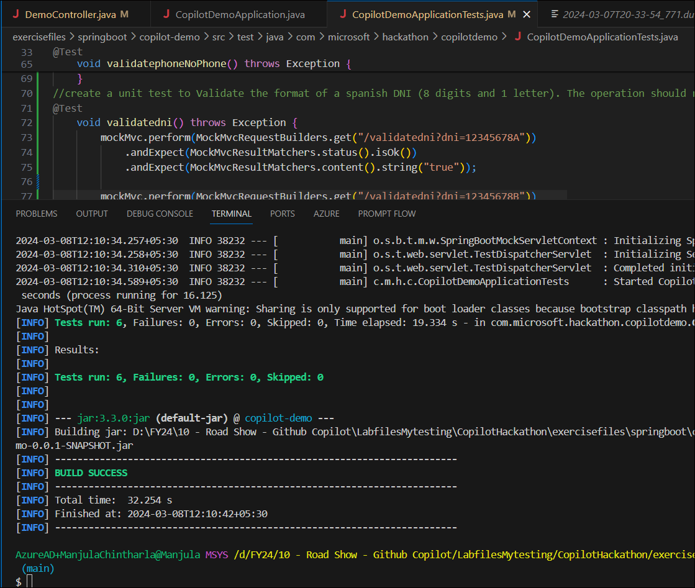

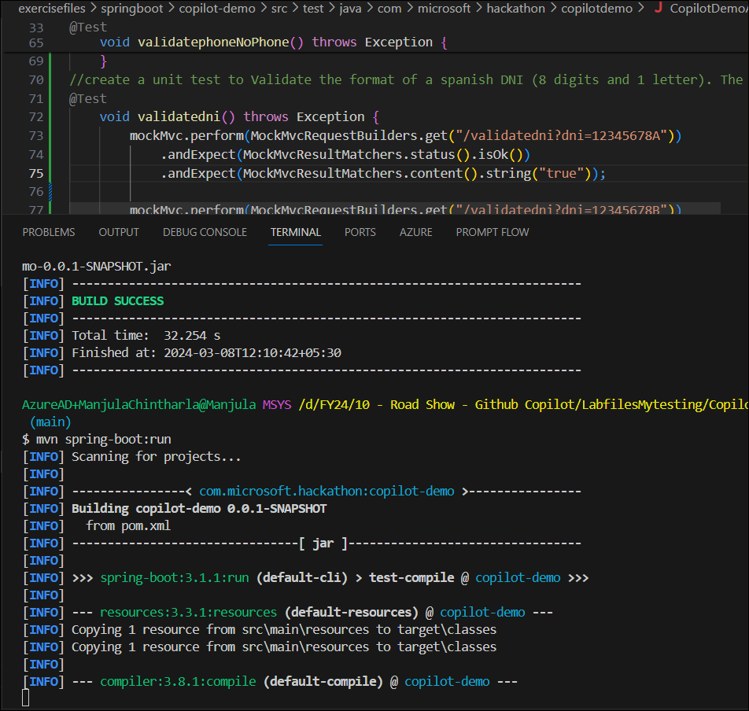

20. mvn spring-boot:runを実行します

21. ターミナルを分割し、\>2番目のターミナルでcurl -v
    http://localhost:8080/validatedni?dni=12345678C を実行します。

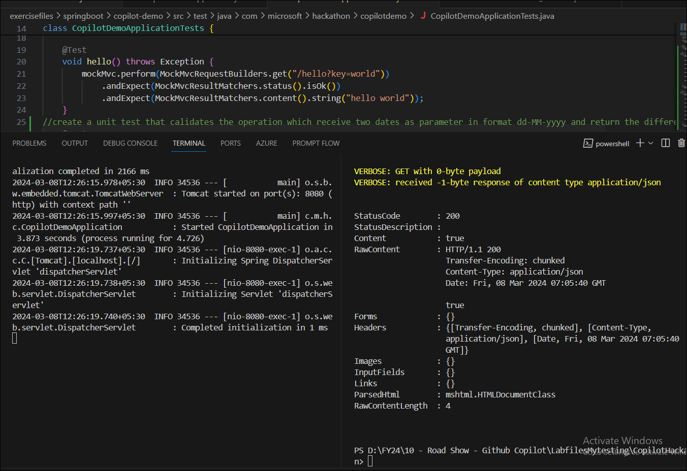

タスク 5 : 色名から 16 進数コードへ

リソースの下の既存のcolors.jsonファイルに基づいて、パスパラメータとして色の名前を指定して、16進数コードを返します。色が見つからない場合は、404
を返します

ヒント: TDD を使用します。まず単体テストを作成し、コードを実装します。

1.  DemoController.Java を開き、プロンプトを入力します //
    リソースの下にある既存のcolors.jsonファイルに基づいて、パスパラメータとして色の名前を指定して、16
    進数コードを返します。色が見つからない場合は、404
    を返します。タブを押してコードを受け入れます。

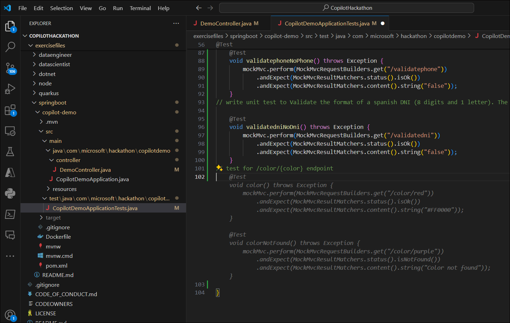

2.  以下のコードを使用することも、コードを記述することもできます。

3.  リソースの下の既存のcolors.jsonファイルに基づいて、パスパラメータとして色の名前を指定して、16進数コードを返します。色が見つからない場合は、404
    を返します

4.  @GetMapping("/color/{name}")

5.  public ResponseEntity\<String\> color(@PathVariable("name") String
    name) は IOException {

6.  InputStream inputStream =
    getClass().getClassLoader().getResourceAsStream("colors.json");

7.  ObjectMapper objectMapper = 新しい ObjectMapper();

8.  マッパーから JsonNode を作成する

9.  JsonNode rootNode = objectMapper.readTree(inputStream);

10. for (JsonNode color : rootNode) {

11. 色名が見つかった場合は、16進数コードを返します

12. if (color.get("color").asText().equals(name)) {

13. return new
    ResponseEntity\<String\>(color.get("code").get("hex").asText(),
    HttpStatus.OK);

14. }

15. }

16. return new ResponseEntity\<String\>("色が見つかりません",
    HttpStatus.NOT_FOUND);

}

17. CopilotDemoApplicationTests.javaに切り替えます。上記の関数をテストする単体テストを記述するには、//test
    for /color/{color} endpoint Enter
    キーを押します。タブを押してコードを受け入れます。

18. 単体テストを記述できます。コード/修正/単体テストについては、いつでも
    Copilot で確認できます

19. ターミナル -\> Gitbash **を開き**
    、以下のコマンドを実行します。コンパイルのエラーがわかります。

cd 演習ファイル/springboot/copilot-demo/

MVNテスト

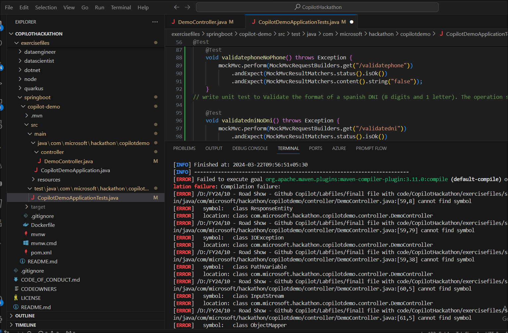

20. Ctrl + Alt+ I **を押して、**Github Copilot Chat
    **を開きます**。エラーメッセージをコピーして、チャットウィンドウに貼り付けます。Copilot
    は解決策を提案します。

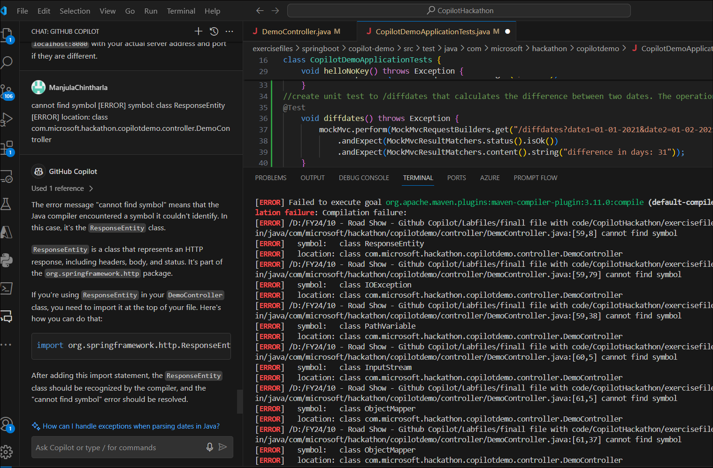

21. Copilot
    は、インポート関数を使用して不足しているパッケージをインポートすることを提案します。それをコピーしてコードに追加します。Enter
    キーを押すと、Copilot
    は不足しているパッケージを追加するように提案します。タブを押して、コードに追加することを受け入れます。

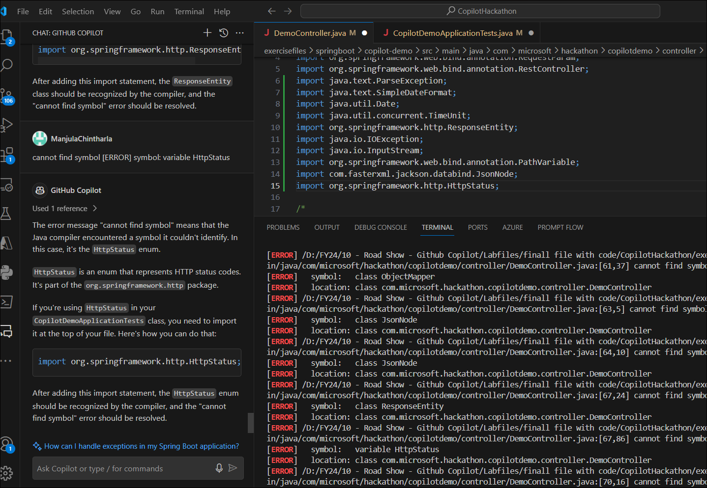

22. ターミナル -\> Gitbash **を開き** 、以下のコマンドを再度実行します。

cd 演習ファイル/springboot/copilot-demo/

MVNテスト

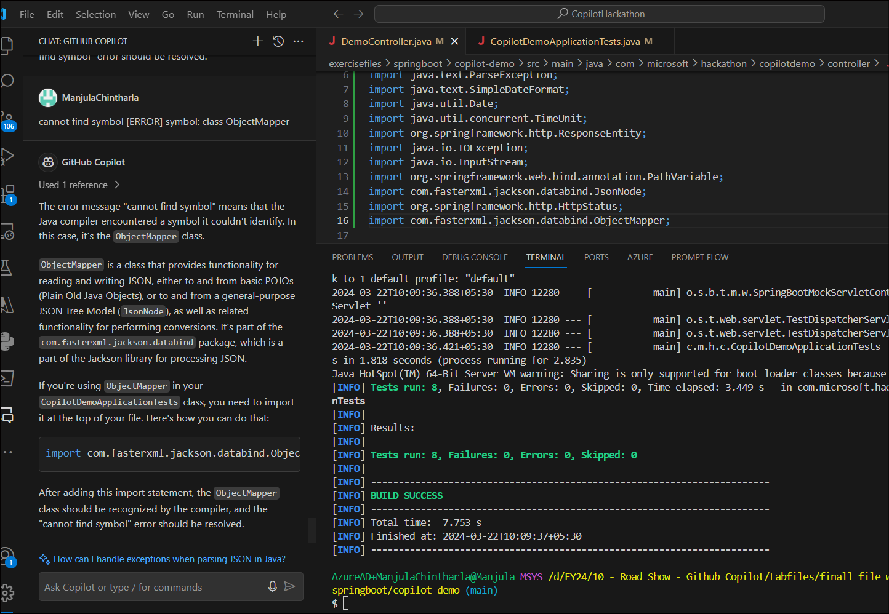

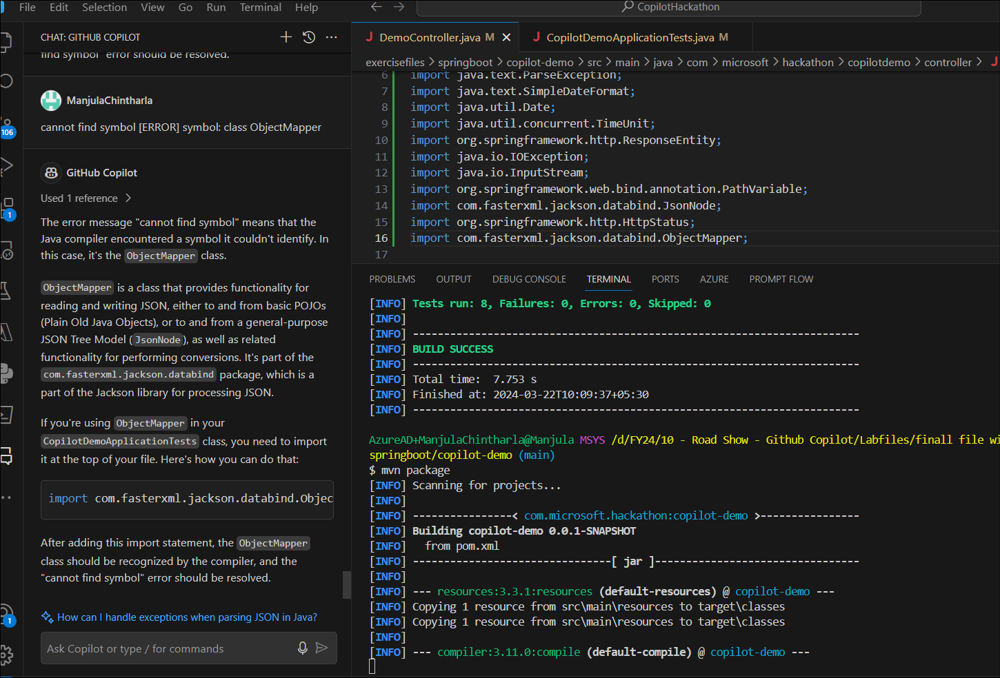

23. mvn パッケージを実行する アプリケーションをパッケージ化します。

24. mvn spring-boot:runを実行してテストします

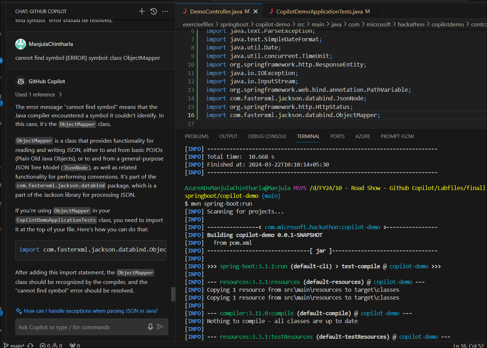

25. コパイロットに curl コマンドを手伝ってもらい、関数をテストできます。

26. 「ターミナルの分割」 **をクリックし** 、curl
    コマンドを実行してアプリケーションをテストします。ポートを更新する)

27. ファイル**にリストされている色でテスト**colors.json

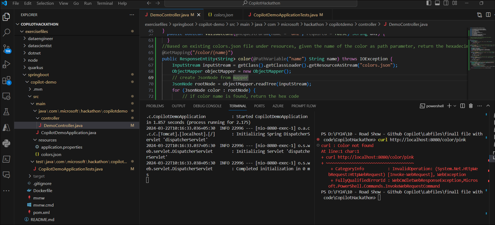

28. colors.jsonに記載されていない色をテスト して結果を確認します

タスク6 : ジョーク作成者

API https://api.chucknorris.io/jokes/random
を呼び出してジョークを返す新しい操作を作成します。

1.  DemoController.Java を開き、プロンプト // API
    を呼び出してジョークを返す新しい操作 // を入力します
    https://api.chucknorris.io/jokes/random。タブを押してコードを受け入れます。

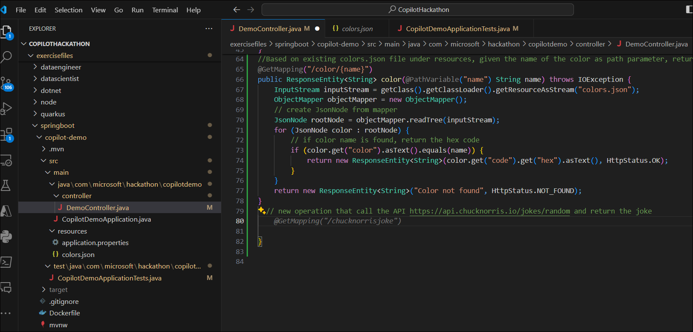

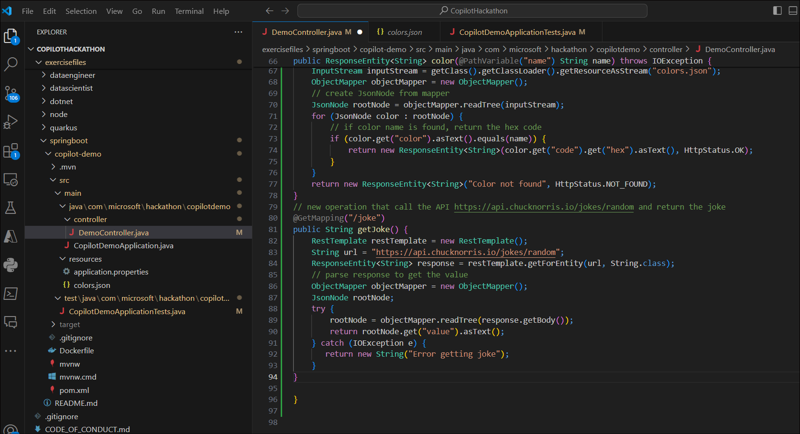

2.  以下のコードを使用することもできます。

3.  新しい操作を呼び出して API https://api.chucknorris.io/jokes/random
    呼び出し、ジョークを返します

4.  @GetMapping("/ジョーク")

5.  パブリック文字列getJoke() {

6.  RestTemplate restTemplate = 新しい RestTemplate();

7.  文字列 url = "https://api.chucknorris.io/jokes/random";

8.  ResponseEntity\<String\> 応答 = restTemplate.getForEntity(url,
    String.class);

9.  応答を解析して値を取得します

10. ObjectMapper objectMapper = 新しい ObjectMapper();

11. JsonNode rootNode;

12. {を試す

13. rootNode = objectMapper.readTree(response.getBody());

14. returnrootNode.get("value").asText();

15. } キャッチ (IOException e) {

16. return new String("ジョークの取得エラー");

17. }

}

18. CopilotDemoApplicationTests.javaに切り替えます。上記の関数をテストする単体テストを作成するには、
    // API https://api.chucknorris.io/jokes/random
    を呼び出してジョークを返す新しい操作の単体テストを作成する Enter
    キーを押します。タブを押してコードを受け入れます。

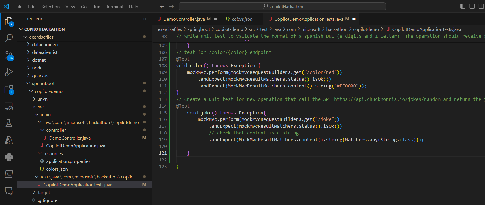

19. 以下の単体テストを追加したり、独自の単体テストを作成したりすることもできます。

20. @Test

21. void joke() は Exception{ をスローします。

22. mockMvc.perform(MockMvcRequestBuilders.get("/joke"))

23. .andExpect(MockMvcResultMatchers.status().isOk())

24. コンテンツが文字列であることを確認する

25. .andExpect(MockMvcResultMatchers.content().string(Matchers.any(String.class)));

}

26. ターミナル -\> Gitbahs を開き、以下のコマンドを実行します。

cd 演習ファイル/springboot/copilot-demo/

MVNテスト

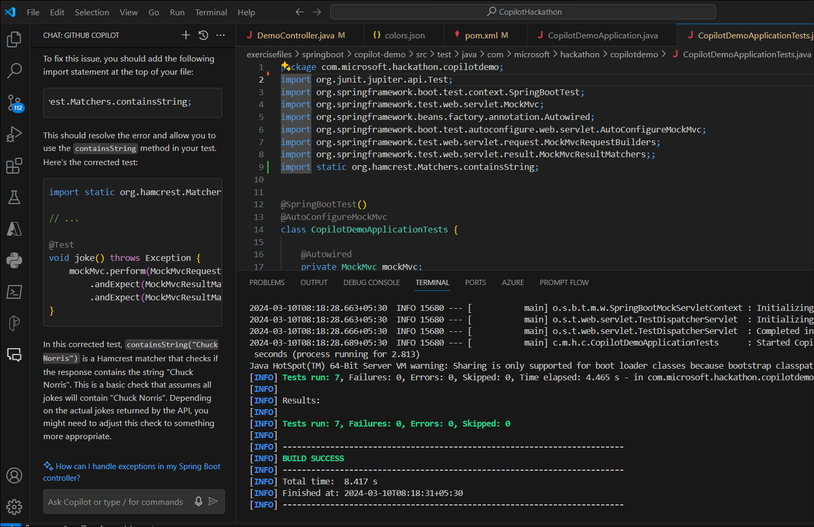

27. アプリケーションをパッケージ化します。mvn パッケージを実行する

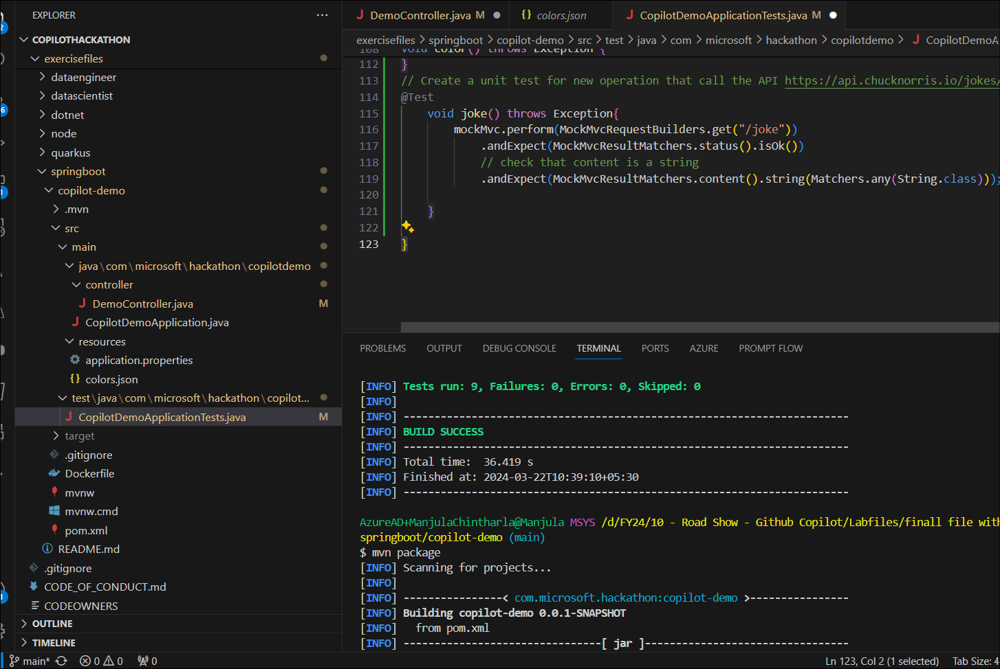

28. mvn spring-boot:runを実行します

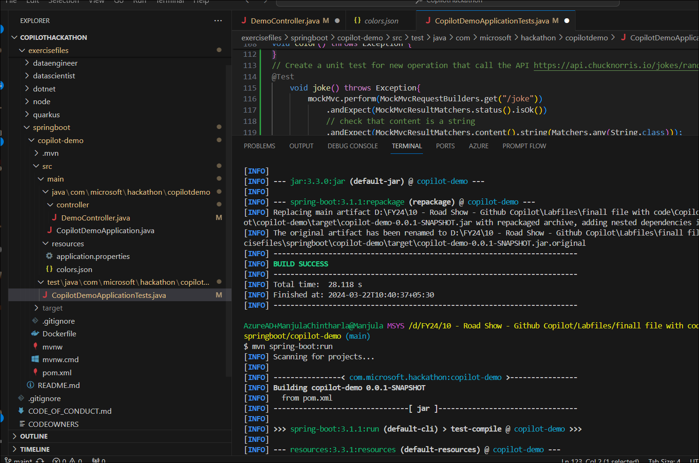

29. 「ターミナルの分割」をクリックし、コマンドを実行して、2番目のターミナルでcurl
    -v http://localhost:8080/joke を実行します。

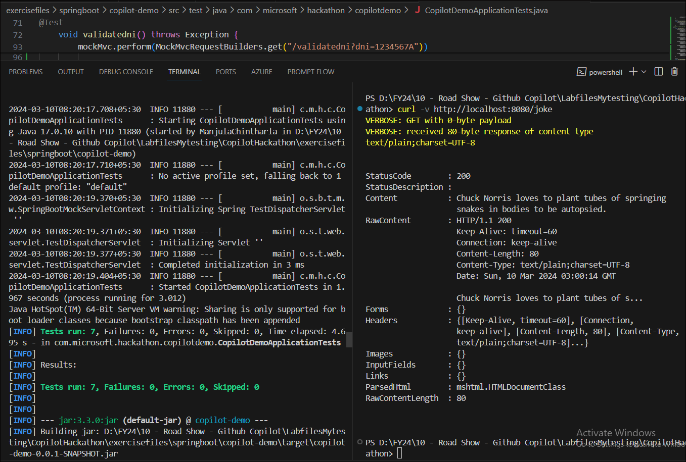

タスク7 : URL解析

クエリパラメータとして url
を指定すると、それを解析し、プロトコル、ホスト、ポート、パス、およびクエリパラメータを返します。応答は
Json 形式である必要があります。

1.  DemoController.Java**を開き** 、プロンプトを入力します
    //クエリパラメータとしてURLを指定したコードを記述し、それを解析して、プロトコル、ホスト、ポート、パス、およびクエリパラメータを返します。応答は
    Json 形式である必要があります。タブを押してコードを受け入れます。

2.  以下のコードを使用することもできます。

3.  クエリパラメータとして url
    を指定すると、それを解析し、プロトコル、ホスト、ポート、パス、およびクエリパラメータを返します。応答は
    Json 形式である必要があります。

4.  @GetMapping("/parseurl")

5.  public String parseurl(@RequestParam(name = "url", required = false)
    String url) throws MalformedURLException {

6.  if (url == null || url.isEmpty()) {

7.  return "URL not passed" (URL が渡されていません)

8.  }

9.  URL urlObj = 新しい URL(url);

10. 文字列プロトコル = urlObj.getProtocol();

11. 文字列 host = urlObj.getHost();

12. int ポート = urlObj.getPort();

13. 文字列パス = urlObj.getPath();

14. 文字列クエリ = urlObj.getQuery();

15. return "{ \\protocol\\: \\" + protocol + "\\, \\host\\: \\" + host +
    "\\, \\port\\: \\" + port + "\\, \\path\\: \\" + path + "\\,
    \\query\\: \\" + query + "\\ }";

}

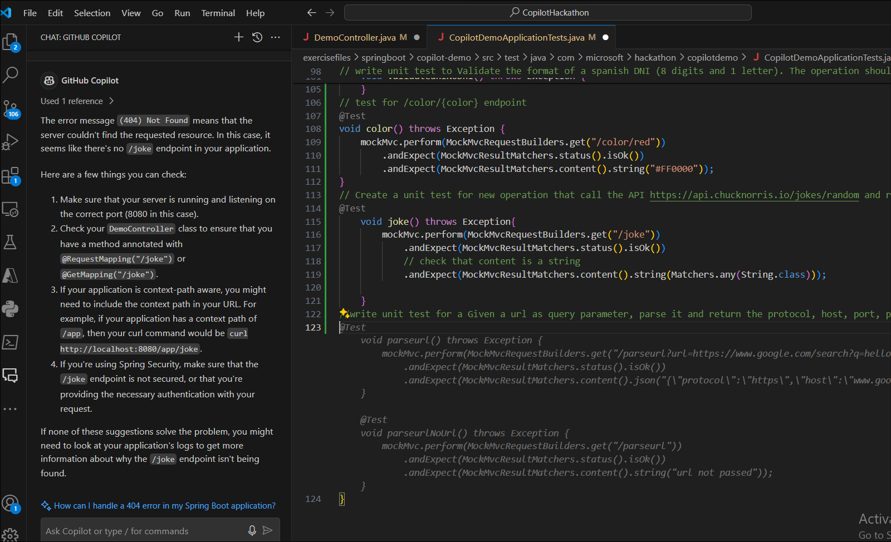

16. CopilotDemoApplicationTests.javaに切り替えます。上記の関数をテストする単体テストを作成するには、
    // API https://api.chucknorris.io/jokes/random
    を呼び出してジョークを返す新しい操作の単体テストを作成する Enter
    キーを押します。タブを押してコードを受け入れます。

17. 以下の単体テストを追加したり、独自の単体テストを作成したりすることもできます。

18. @Test

19. void parseUrl() は Exception{ をスローします。

20. mockMvc.perform(MockMvcRequestBuilders.get("/parseurl?url=https://learn.microsoft.com/en-us/azure/aks/concepts-clusters-workloads?source=recommendations"))

21. .andExpect(MockMvcResultMatchers.status().isOk())

22. JSON フィールドの検証

23. .andExpect(MockMvcResultMatchers.jsonPath("$.protocol").value("https"))

24. .andExpect(MockMvcResultMatchers.jsonPath("$.host").value("learn.microsoft.com"))

25. .andExpect(MockMvcResultMatchers.jsonPath("$.path").value("/en-us/azure/aks/concepts-clusters-workloads"))

26. .andExpect(MockMvcResultMatchers.jsonPath("$.query").value("source=recommendations"));

27. }

28. @Test

29. void parseUrlNoUrl() は Exception{ をスローします。

30. mockMvc.perform(MockMvcRequestBuilders.get("/parseurl"))

31. .andExpect(MockMvcResultMatchers.status().isOk())

32. .andExpect(MockMvcResultMatchers.content().string("url not
    passed"));

}

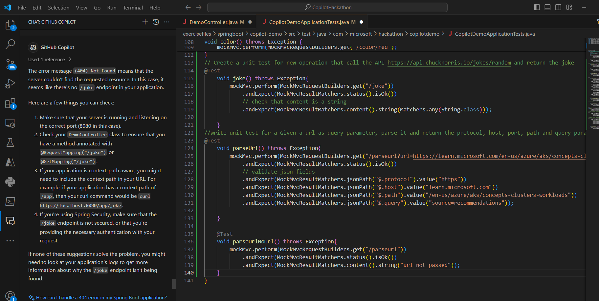

33. ターミナル -\> Gitbash **を開き** 、以下のコマンドを実行します。

cd 演習ファイル/springboot/copilot-demo/

MVNテスト

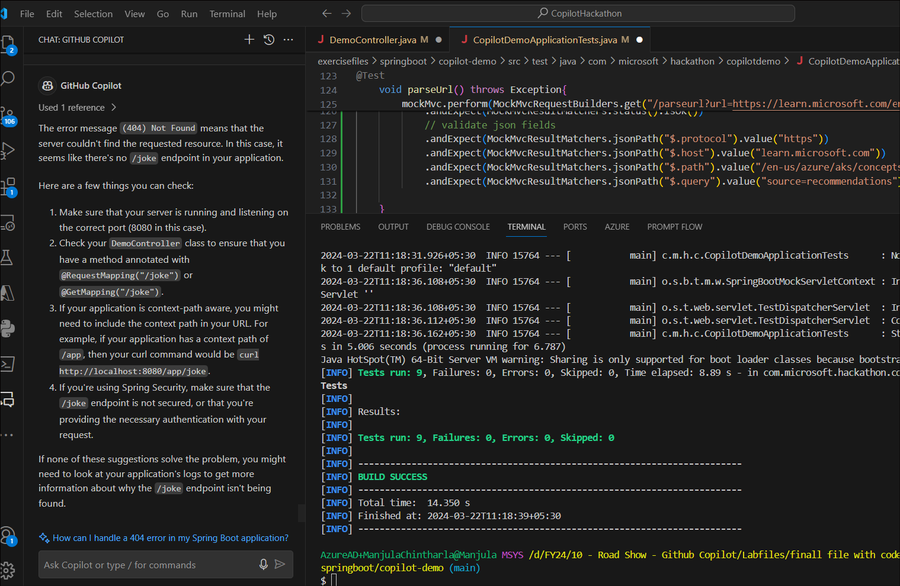

34. mvn パッケージを実行する アプリケーションをパッケージ化します。

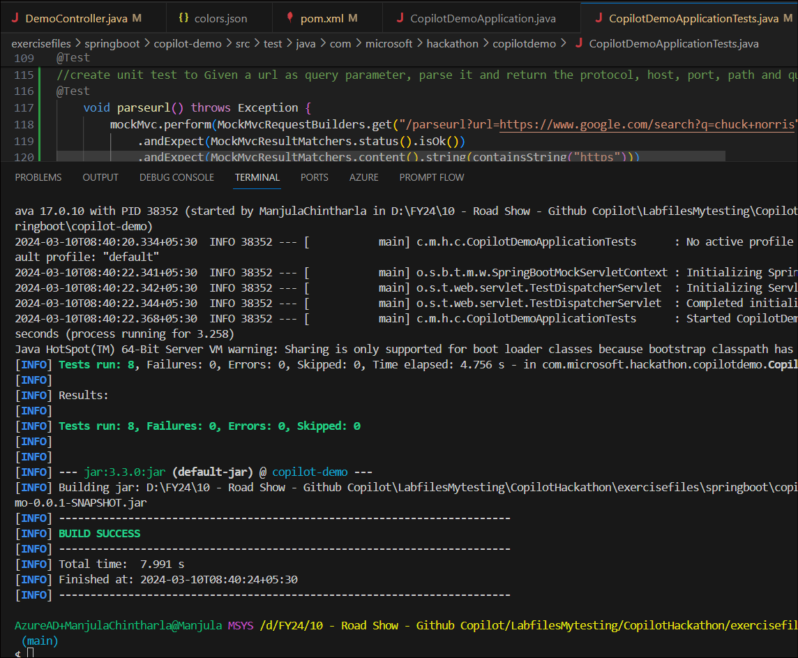

35. mvn spring-boot:runを実行します

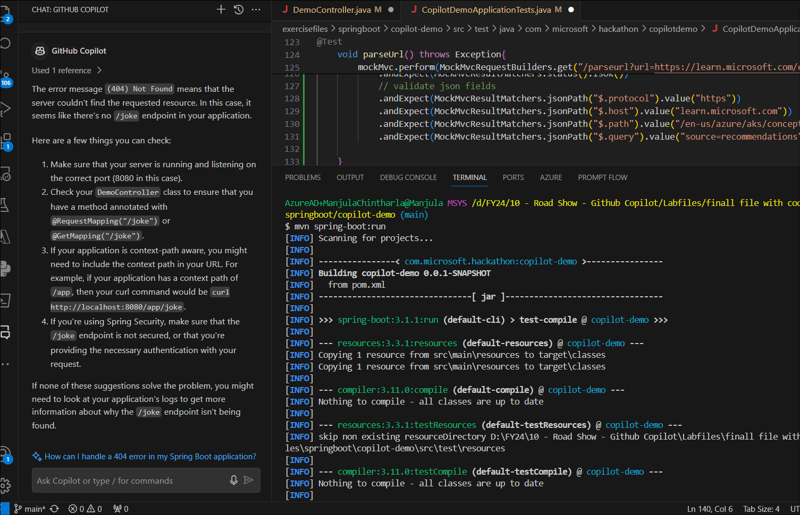

36. ターミナルを分割してアプリケーションをテストします : curl -v
    http://localhost:8080/parseurl?url=https://www.google.com/search?q=chuck+norris

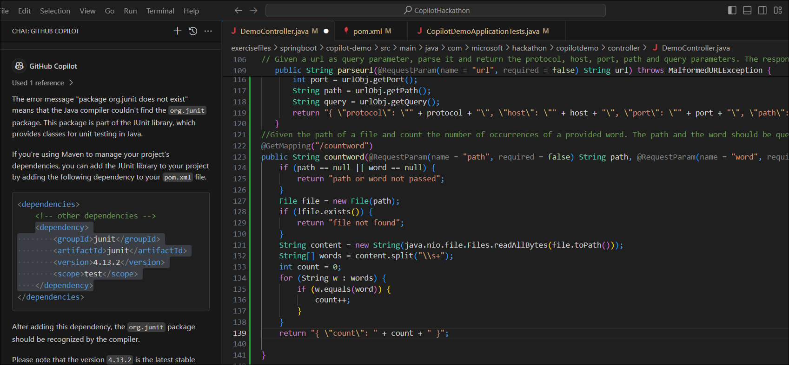

タスク 8 : 単語数カウント

ファイルのパスが与えられ、指定された単語の出現回数をカウントします。パスと単語はクエリ
パラメーターである必要があります。応答は Json 形式である必要があります。

1.  DemoController.Java **を開き** 、プロンプトを入力します
    //ファイルのパスを指定して、指定された単語の出現回数をカウントするコードを書きます。パスと単語はクエリ
    パラメーターである必要があります。応答は Json
    形式である必要があります。タブを押してコードを受け入れます。

2.  CopilotDemoApplicationTests.javaに切り替えます。上記の関数をテストするための単体テストを作成するには、
    //
    ファイルのパスを指定して、指定された単語の出現回数をカウントします。パスと単語はクエリ
    パラメーターである必要があります。応答は Json
    形式である必要があります。Enter
    キーを押します。タブを押してコードを受け入れます。

3.  ターミナル -\> Gitbash を開き、以下のコマンドを実行します。

cd 演習ファイル/springboot/copilot-demo/

MVNテスト

4.  mvn パッケージを実行してアプリケーションをパッケージ化します/

5.  mvn spring-boot:runを実行します

6.  「ターミナルの分割」をクリックし、curlコマンドを実行してアプリケーションをテストします。

カール http://localhost:8080/countword?path=src/test/resources/test.txt

タスク 9 : アプリケーションのコンテナ化

提供されている Dockerfile を使用して、アプリケーションの Docker
イメージを作成します。Dockerfile
には、演習を完了するのに役立つコメントがいくつかあります。

Docker イメージをビルド、実行、テストするために、Copilot
を使用してコマンドを生成することもできます。

たとえば、Docker
イメージをビルド、実行、テストするためのコマンドを格納できる DOCKER.md
ファイルを作成します。Copilot
は、プロジェクトとコマンドの文書化にも役立つことに気付くでしょう。

文書化する手順の例: コンテナー
イメージのビルド、コンテナーの実行、コンテナーのテスト。

1.  Dekstop から Docker
    をダブルクリックし、アカウントでサインインします。

2.  Docker ファイル om Visual Studio Code
    を開き、以下のコードを追加してファイルを保存します。

3.  \# openjdk 17 に基づいて Java アプリケーション
    イメージをビルドし、ポート 8080 で実行します。

4.  openjdk:17-jdk-alpineから

5.  8080 を公開する

6.  COPY ターゲット/\*.jar app.jar

エントリポイント 「"java","-jar","/app.jar"」

7.  Ctrl + Alt + I **を押して** 、**GitHub Copilot** チャット
    ウィンドウを開きます。以下のプロンプトで Copilot
    に尋ねてください。Copilot
    には、アプリケーションをコンテナー化する手順が用意されています。

アプリケーションの Docker イメージを作成するために提供された Dockerfile
を使用して Docker イメージをビルド、実行、テストする方法

8.  1ststep-Dockerイメージをビルドします。\*\*ターミナル -\> Gitbash\*\*
    を開き、コマンドを実行して Docker イメージをビルドします。

cd 演習ファイル/springboot/copilot-demo/

docker build -t my-application です。

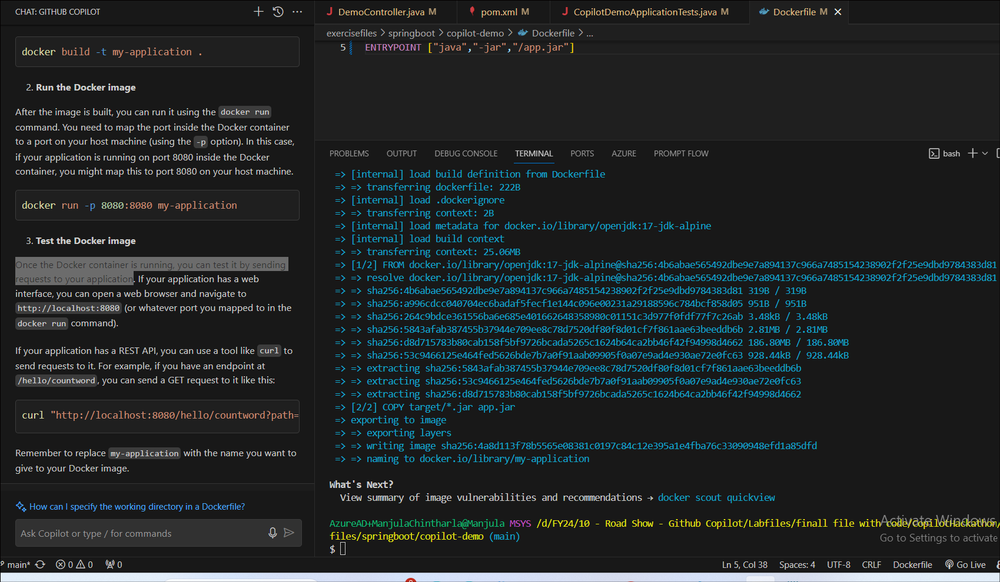

9.  イメージがビルドされたら、docker run
    コマンドを使用して実行できます。

docker run -p 8080:8080 my-application

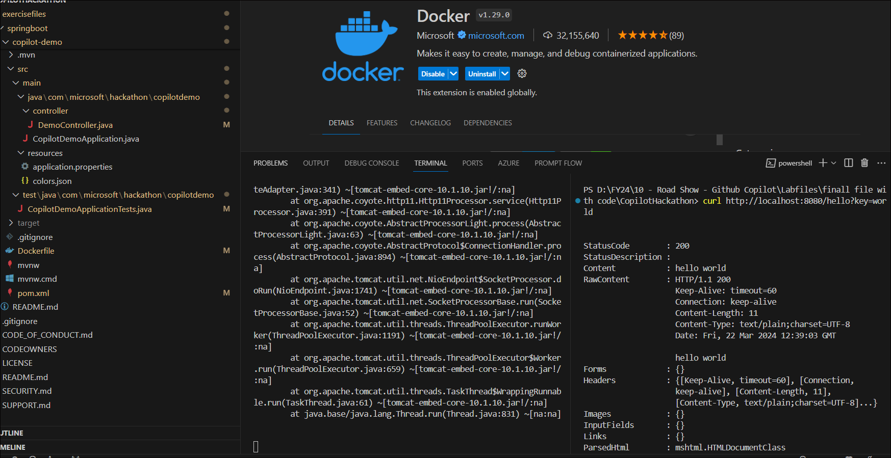

10. Docker
    コンテナーが実行されたら、アプリケーションにリクエストを送信してテストできます。

カール\<http://localhost:8080/hello?key=world

