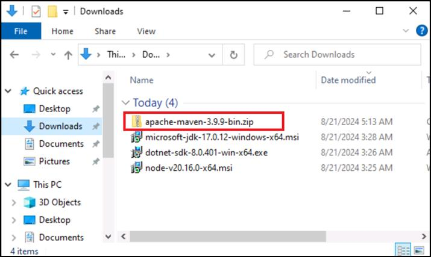
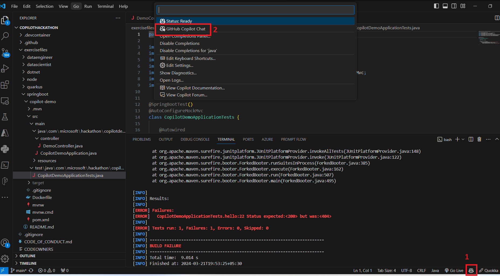
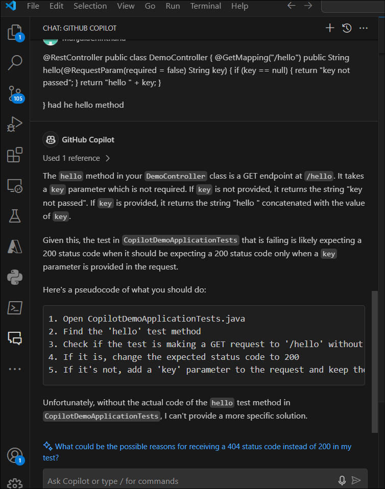
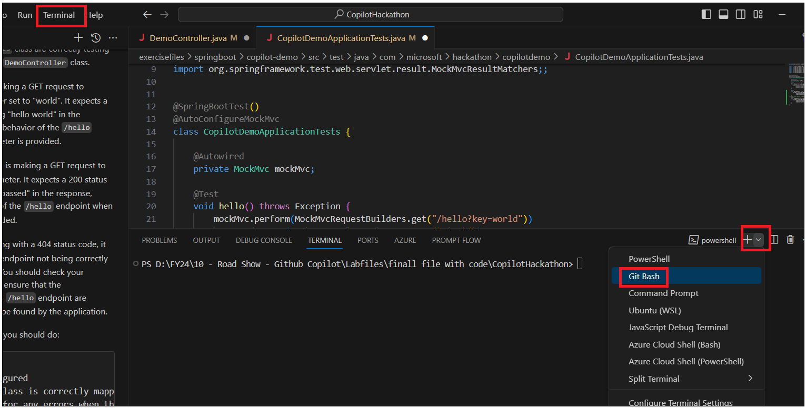
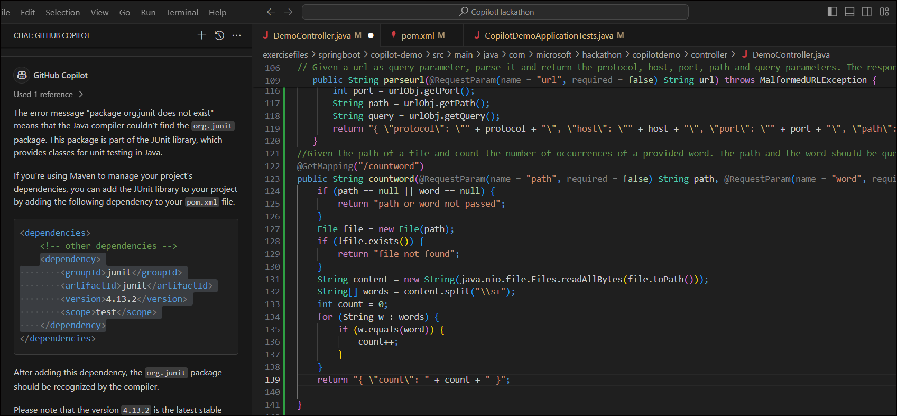
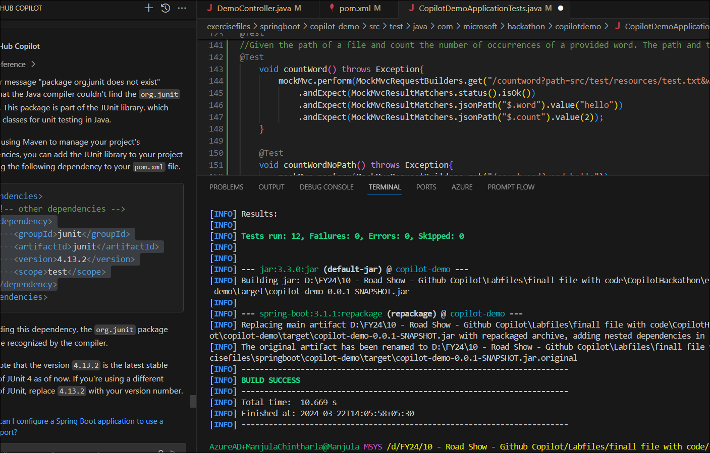

**실습 18 - GitHub Copilot의 도움으로 Spring Boot를 사용하여 REST API
빌드하기**

**목표**

이 실습의 목표는 Spring Boot를 사용하여 REST API를 빌드하는 연습을
사용하여 GitHub Copilot을 사용하는 방법을 배우는 것입니다.

일부 파일이 이미 생성된 Spring Boot 프로젝트를
생성했으며 **C:\CopilotHackathon\exercisefiles\springboot** 폴더에서
프로젝트를 찾을 수 있습니다.

이 실습을 실행하기 전에 먼저 필요한 소프트웨어 패키지를 설치하고 환경을
설정해 보겠습니다.

작업 0: 환경을 설치하고 설정하기

이 실습을 실행하기 위해 환경을 설정하려면 다음 소프트웨어 패키지를
다운로드하여 설치해야 합니다.

a. Microsoft JDK 17

b. apache maven

1.  Edge 브라우저를 여세요.

2.  브라우저 URL 필드에서 링크를 복사하여 붙여넣어 실습 VM에 소프트웨어
    패키지를 다운로드하세요.

a. Microsoft JDK 17
◊ https://aka.ms/download-jdk/microsoft-jdk-17.0.12-windows-x64.msi

b. apache maven
◊https://dlcdn.apache.org/maven/maven-3/3.9.9/binaries/apache-maven-3.9.9-bin.zip

**참고:** 동일한 단계를 반복하여 다른 모든 패키지도 다운로드하세요.
기본적으로 패키지는 다운로드 폴더에 저장됩니다.

a. **Install Microsoft JDK 17**

1.  **Downloads** (**C:\Users\Admin\Downloads**) 폴더에서 **Microsoft
    JDK**를 두 번 클릭하세요

2.  **Next**를 클릭하세요.

3.  EULA에 동의하고 **Next**를 클릭하세요.

4.  **Install just for you (Admin)**을 선택하고 **Next**를 클릭하세요.

5.  **Custom setup** 화면에서 **JAVA_HOME variable**를 설정합니다.
    아래쪽 화살표를 **Entire feature will be installed on local hard
    drive**를 선택하세요.

6.  **Next**를 클릭하세요.

7.  **Install**를 클릭하세요.

**b. Install apache- maven**

8.  **Downloads** (**C:\Users\Admin\Downloads**) 폴더로 이동하세요

9.  **apache-maven-3.9.9-bin.zip** 폴더를 마우스 오론쪽 버튼으로
    클릭하고 **Extract All**을 선택하세요.

10. "**Select a destination**" 페이지에서
    목적지를 **C:\Users\Admin\Downloads**로 입력하고 **Extract**를
    클릭하세요.

11. 추출된 파일은 스크린샷과 같습니다.

**참고:** 다른 이름이 표시되는 경우 폴더의 이름이
**apache-maven-3.9.9**로 바뀌었는지 확인하세요.

**Setup Environmental variables**

12. **Windows logo**를 클릭하고 **Settings**를 선택하세요

13. **Windows settings** 페이지에서 Edit system 을 검색하고 **Edit
    System Environment variable**를 선택하세요.

14. **Environment Variable** 버튼을 클릭하세요.

15. **User variable for Admin** 섹션에서 **New** 를 클릭하세요.

16. 이제 Maven에 대한 환경 및 경로 변수를 설정합니다.

**User variable for Admin** 섹션에서 **New** 를 선택하세요.

17. **New User Variable** 창에서 다음을 입력하고 **OK**를 클릭하세요

Variable name: MAVEN_HOME

Variable value: C:\Users\Admin\Downloads\apache-maven-3.9.9

18. **Path**를 선택하고 **Edit**을 클릭하세요

19. **Edit environment variable** 창에서 **New**를 클릭하세요.

20. 빈 필드에 다음 %MAVEN_HOME%\bin을 입력하고 **OK**를 클릭하세요.

21. **OK**를 클릭하고 Maven에 대한 사용자 환경 및 경로 변수 설정을
    완료하세요.

22. **System variables** for 이제 Maven에 대한 시스탬 변수를 설정합니다.
    **System variables** 섹션에서 **New**를 선택하세요.

23. New System Variable 창에서 다음을 입력하고 **OK**를 클릭하세요.

Variable name: MAVEN_HOME

Variable value: C:\Users\Admin\Downloads\apache-maven-3.9.9

작업 1: 간단한 GET 요청을 처리하는 코드 생성하기

'DemoController.java' 파일로 이동하여 간단한 GET 요청을 처리하는 코드
작성을 시작하세요. 이 첫 번째 연습에서는 생성해야 하는 코드를 설명하는
주석을 제공했습니다. Enter 키를 누르고 몇 초만 기다리면 Copilot이 코드를
생성합니다.

이 연습을 위해 구현된 단위 테스트가 이미 있으므로 mvn test 전후에 명령을
사용하여 실행하여 Copilot에서 생성된 코드가 올바른지 확인할 수 있습니다.

요청에 키가 제공되지 않는 경우에 대한 새 단위 테스트를 생성하세요

모든 연습이 끝나면 자유롭게 애플리케이션을 패키징하고 실행하여
테스트하세요

패키지: mvn package

실행: mvn spring-boot:run

테스트: curl -v http://localhost:8080/hello?key=world

1.  File Explorer를 열고 Local Disk (C:)를
    확장하고 **CopilotHackathon-\>exercisefiles \> Springboot \>
    copilot-demo \>
    src\>main\>java\>com\>Microsoft\>hackathon\>copilotdemo\>controller** 폴더를
    확정하고 **'DemoController.java** 파일을 보세요.

**DemoController.java** 파일을 두번 클릭하세요. 이 첫 번째 연습에서는
생성해야 하는 코드를 설명하는 주석만 제공됩니다.

2.  댓글 끝(12행)에 커서를 놓고 Enter 키를 누르고 몇 초만 기다리면
    **Copilot**이 코드를 생성하세요. 전체 코드가 표시될 때까지 탭을
    누르세요.

코드 옵션을 선택하려면 Ctrl + Enter 도 누를 수 있습니다.

3.  **test** 폴더를 확장하고 **CopilotDemoApplicationTests.java**를
    클릭하세요. 단위 테스트는 이미 제공되었습니다.

4.  pom xml을 업데이트하지 않고 코드를 실행하고 Copilot에 제품을 탐색할
    수 있는 솔루션을 요청할 수 있습니다.

5.  아래 플러그인 열고 추가 **Pom.xml** 파일을 저장하세요

6.  \<plugin\>

7.  \<groupId\>org.apache.maven.plugins\</groupId\>

8.  \<artifactId\>maven-compiler-plugin\</artifactId\>

9.  \<version\>3.8.1\</version\>

10. \<configuration\>

11. \<source\>17\</source\>

12. \<target\>17\</target\>

13. \</configuration\>

\</plugin\>

14. 도구 모음에서 **Terminal -\> New Terminal**을 클릭하세요.

15. **Gitbash**를 선택하고 다음 명령을 실행하세요.

cd exercisefiles/springboot/copilot-demo/

16. mvn clean install -DskipTests 명령을 실행하세요

17. mvn테스트를 실행하세요. 빌드가 오류와 함께 실패하는 경우.

18. 오른쪽 아래 모서리에 있는 **Copilot** 아이콘을 클릭하고 **Github
    Copilot Chat**을 선택하세요.

19. Github Copilot chat에 오류에 대한 수정 사항을 제공하도록 요청하세요.

20. 문제 및 해당 수정 사항을 설명하는 Copilot chat을 살펴보세요. 여전히
    수정 사항이 명확하지 않은 경우 계속 의심을 하면 Copilot이 답변해
    드립니다. 오류와 구현할 솔루션을 읽고 이해하세요.

21. Copilot에 /hello 방법을 제공하고 제안하는 내용을 살펴보겠습니다.

22. **CopilotDemoApplicationTests.java**로 돌아가기 테스트 끝 (24행)에서
    커서를 가져와 Enter 키를 누르세요. Copilot이 다른 테스트를
    생성합니다. 탭을 눌러 수락하세요.

23. 테스트에서 Copilot에 /hello 메서드를 제공하고 제안하는 내용을
    확인하세요.

24. mvn 테스트 다시 실행 코드는 아래와 같습니다. 자체 코드를 작성하고
    Copilot에 유효성을 검사하도록 요청할 수도 있습니다.

25. @RestController

26. public class DemoController {

27. @GetMapping("/hello")

28. public String hello(@RequestParam(name = "key", required = false)
    String key) {

29. if (key == null) {

30. return "key not passed";

31. }

32. return "hello " + key;

33. }

34. 

}

35. mvn 패키지 명령을 실행하세요

36. mvn spring-boot:run을 실행하세요

37. 터미널 분할을 클릭하고 2nd터미널에 curl -v
    http://localhost:8080/hello?key=world 를 입력하세요. Copilot에게
    코드를 테스트하기 위해 curl 명령을 제공하도록 요청할 수도 있습니다.

38. 터미널 분할을 클릭하고 2번째 터미널에 curl -v
    http://localhost:8080/hello 를 입력하세요.

39. Ctrl +C를 눌러 실행 서비스를 중단하세요.

작업 2: 날짜 비교

두 날짜 간의 차이를 계산하는 /diffdates 아래의 새 작업입니다. 작업은
dd-MM-yyyy 형식의 매개 변수로 두 개의 날짜를 수신하고 차이를 일 단위로
반환해야 합니다.

또한 작업의 유효성을 검사하는 단위 테스트를 생성하세요.

이제부터는 모든 새 작업에 대한 단위 테스트를 생성해야 합니다.
Copilot으로 쉽지 않았나요?

1.  DemoController.java로 이동하여 두 날짜 간의 차이를 계산하는
    //diffdates 아래에 새 작업 생성 프롬프트를 입력하세요. 작업은
    dd-MM-yyyy 형식의 매개 변수로 두 개의 날짜를 수신하고 차이(일)를
    반환하고 Enter 키를 눌러야 합니다. 잠시 기다렸다가 Copilot이 코드를
    예측한 다음 탭을 눌러 코드를 수락하세요.

2.  아래 코드를 사용할 수도 있습니다.

3.  @GetMapping("/diffdates")

4.  public String diffdates(@RequestParam(name = "date1", required =
    false) String date1, @RequestParam(name = "date2", required = false)
    String date2) throws ParseException {

5.  if (date1 == null \|\| date2 == null) {

6.  return "date not passed";

7.  }

8.  SimpleDateFormat sdf = new SimpleDateFormat("dd-MM-yyyy");

9.  Date date1Obj = sdf.parse(date1);

10. Date date2Obj = sdf.parse(date2);

11. long diffInMillies = Math.abs(date2Obj.getTime() -
    date1Obj.getTime());

12. long diff = TimeUnit.DAYS.convert(diffInMillies,
    TimeUnit.MILLISECONDS);

13. return "difference in days: " + diff;

}

14. 이제부터는 모든 새 작업에 대한 단위 테스트를 생성해야 합니다.
    Copilot을 사용하여 생성하세요.

15. **test** 폴더 아래에서 **CopilotDemoApplicationTests.java** 열고 두
    날짜 간의 차이를 계산하는 // 단위 테스트 생성 프롬프트를 //
    diffdates에 입력하세요. 작업은 dd-MM-yyyy 형식의 매개 변수로 두 개의
    날짜를 수신하고 차이를 일 단위로 반환해야 합니다. 그런 다음 Enter
    키를 누르세요. Copilot이 코드를 예측할 때까지 잠시 기다렸다가 Tab
    키를 눌러 예측된 코드를 수락하세요.

16. 입력하고 탭 키를 눌러 여러 단위 테스트를 생성할 수 있습니다.

17. Copilot 채팅 도움말을 사용하여 문제를 해결하거나 Copilot 입력에 따라
    필요한 경우 단위 테스트를 설명하고 코드를 업데이트하세요.

18. @Test

19. void diffdates() throws Exception {

20. mockMvc.perform(MockMvcRequestBuilders.get("/diffdates?date1=01-01-2021&date2=01-02-2021"))

21. .andExpect(MockMvcResultMatchers.status().isOk())

22. .andExpect(MockMvcResultMatchers.content().string("difference in
    days: 31"));

23. }

24. @Test

25. void diffdatesNoDate1() throws Exception {

26. mockMvc.perform(MockMvcRequestBuilders.get("/diffdates?date2=01-02-2021"))

27. .andExpect(MockMvcResultMatchers.status().isOk())

28. .andExpect(MockMvcResultMatchers.content().string("date not
    passed"));

29. }

30. @Test

31. void diffdatesNoDate2() throws Exception {

32. mockMvc.perform(MockMvcRequestBuilders.get("/diffdates?date1=01-01-2021"))

33. .andExpect(MockMvcResultMatchers.status().isOk())

34. .andExpect(MockMvcResultMatchers.content().string("date not
    passed"));

}

35. **Terminal -\>Gitbash**를 열고 다음 명령을 실행하세요

cd "exercisefiles\springboot\copilot-demo"

mvn test

36. 컴파일 오류가 표시되면 오류 메시지를 복사하고 Copilot에 수정 사항을
    요청하세요.

37. Copilot은 코드가 포함된 패키지를 가져올 것을 제안합니다. 코드에
    명령을 추가하고 mvn test를 실행하세요.

38. mvn 패키지를 실행하세요

39. mvn -Dtest=CopilotDemoApplicationTests#diffdates 테스트를 실행하세요

40. mvn spring-boot:run을 실행하세요

41. 터미널 분할을 클릭하고 curl -v
    http://localhost:8080/diffdates?date1=01-01-2021&date2=01-02-2021
    실행하세요.

오류가 표시됩니다. Copilot의 도움을 받아 작은 문제를 해결하세요.

42. Copilot Chat에 curl 명령에 도움을 요청하세요. 오류 메시지를 복사하여
    채팅에 붙여넣으세요. Copilot은 설명과 함께 수정된 명령을 제공합니다.

작업 3 : 스페인어 전화의 형식 확인하기

스페인어 전화번호의 형식(+34 접두사, 9자리, 6, 7 또는 9로 시작)의
유효성을 검사하세요. 작업은 전화 번호를 매개 변수로 수신하고 형식이
올바르면 true를 반환하고 그렇지 않으면 false를 반환해야 합니다.

1.  DemoController.Java를 열고 프롬프트를 입력하세요 // 스페인어 전화
    번호의 형식(+34 접두사, 9, 6, 7 또는 9로 시작)의 형식을 확인하세요.
    작업은 전화 번호를 매개 변수로 수신하고 형식이 올바르면 true를
    반환하고 그렇지 않으면 false를 반환해야 합니다. Tab 키를 눌러 코드를
    수락하세요.

2.  아래 코드를 사용할 수 있습니다.

3.  // 스페인어 전화번호의 형식(+34 접두사, 9자리, 6, 7 또는 9로 시작)의
    유효성을 검사하세요. 작업은 전화 번호를 매개 변수로 수신하고 형식이
    올바르면 true를 반환하고 그렇지 않으면 false를 반환해야 합니다.

4.  @GetMapping("/validatephone")

5.  public boolean validatephone(@RequestParam(name = "phone", required
    = false) String phone) {

6.  if (phone == null \|\| phone.isEmpty()) {

7.  return false;

8.  }

9.  String regex = "^\\+34\[679\]\\d{8}\$";

10. return phone.matches(regex);

}

11. **CopilotDemoApplicationTests.java**로 전환하세요. 위의 함수를
    테스트하기 위한 단위 테스트를 작성하려면 //Write unit test를
    추가하여 스페인어 전화번호의 형식(+34 접두사, 6, 7 또는 9로 시작하는
    9자리)의 유효성을 검사하세요. 작업은 전화 번호를 매개 변수로
    수신하고 형식이 올바르면 true를 반환하고 그렇지 않으면 false를
    반환해야 합니다. Enter 키를 누르세요. 탭을 눌러 코드를 수락하세요.

12. 아래 단위 테스트를 사용하거나 자체 단위 테스트를 작성할 수도
    있습니다.

13. @Test

14. void validatephone() throws Exception {

15. mockMvc.perform(MockMvcRequestBuilders.get("/validatephone?phone=+34666666666"))

16. .andExpect(MockMvcResultMatchers.status().isOk())

17. .andExpect(MockMvcResultMatchers.content().string("true"));

18. mockMvc.perform(MockMvcRequestBuilders.get("/validatephone?phone=+34766666666"))

19. .andExpect(MockMvcResultMatchers.status().isOk())

20. .andExpect(MockMvcResultMatchers.content().string("true"));

21. mockMvc.perform(MockMvcRequestBuilders.get("/validatephone?phone=+34966666666"))

22. .andExpect(MockMvcResultMatchers.status().isOk())

23. .andExpect(MockMvcResultMatchers.content().string("true"));

24. mockMvc.perform(MockMvcRequestBuilders.get("/validatephone?phone=+3466666666"))

25. .andExpect(MockMvcResultMatchers.status().isOk())

26. .andExpect(MockMvcResultMatchers.content().string("false"));

27. mockMvc.perform(MockMvcRequestBuilders.get("/validatephone?phone=+346666666666"))

28. .andExpect(MockMvcResultMatchers.status().isOk())

29. .andExpect(MockMvcResultMatchers.content().string("false"));

30. mockMvc.perform(MockMvcRequestBuilders.get("/validatephone?phone=+3466666666a"))

31. .andExpect(MockMvcResultMatchers.status().isOk())

32. .andExpect(MockMvcResultMatchers.content().string("false"));

33. mockMvc.perform(MockMvcRequestBuilders.get("/validatephone?phone=+34866666666"))

34. .andExpect(MockMvcResultMatchers.status().isOk())

35. .andExpect(MockMvcResultMatchers.content().string("false"));

36. }

37. @Test

38. void validatephoneNoPhone() throws Exception {

39. mockMvc.perform(MockMvcRequestBuilders.get("/validatephone"))

40. .andExpect(MockMvcResultMatchers.status().isOk())

41. .andExpect(MockMvcResultMatchers.content().string("false"));

}

42. Open **Terminal -\>Gitbash** and run the below commands.

cd exercisefiles/springboot/copilot-demo/

mvn test

43. mvn 패키지를 실행하세요

44. mvn spring-boot:run을 실행하세요

45. 터미널을 분할하고 아래 curl 명령을 실행하여 전화번호의 유효성을
    검사하세요.

curl -v http://localhost:8080/validatephone?phone=+34866666666

curl -v http://localhost:8080/validatephone?phone=+34666666667

curl -v http://localhost:8080/validatephone?phone=+34666666666

작업 4: 스페인어 DNI의 형식 유효성 검사하기

스페인어 DNI(8자리 1자)의 형식을 확인하세요. 작업은 DNI를 매개 변수로
수신하고 형식이 올바른 경우 true를 반환하고 그렇지 않으면 false를
반환해야 합니다.

1.  DemoController.Java를 열고 프롬프트를 입력하세요// 스페인어
    DNI(8자리 1자)의 형식을 확인하세요. 작업은 DNI를 매개 변수로
    수신하고 형식이 올바른 경우 true를 반환하고 그렇지 않으면 false를
    반환해야 합니다. 탭을 눌러 코드를 수락하세요.

2.  아래 코드를 사용할 수도 있습니다

3.  // 스페인어 DNI(8자리 1자)의 형식을 확인하세요. 작업은 DNI를 매개
    변수로 수신하고 형식이 올바르면 true를 반환하고 그렇지 않으면
    false를 반환해야 합니다.

4.  @GetMapping("/validatedni")

5.  public boolean validatedni(@RequestParam(name = "dni", required =
    false) String dni) {

6.  if (dni == null \|\| dni.isEmpty()) {

7.  return false;

8.  }

9.  String regex = "^\\d{8}\[A-Z\]\$";

10. return dni.matches(regex);

}

11. **CopilotDemoApplicationTests.java**로 전환하세요. 위의 함수를
    테스트하기 위한 단위 테스트를 작성하려면 //Write unit test 를
    Validate the format of a spanish DNI(8자리 1자)에 추가하세요. 작업은
    DNI를 매개변수로 수신하고 형식이 올바르면 true를 반환하고, 그렇지
    않으면 false를 반환해야 합니다. Enter 키를 누르세요. 탭을 눌러
    코드를 수락하세요.

12. 아래 단위 테스트를 사용하거나 자체 단위 테스트를 작성할 수도
    있습니다.

13. @Test

14. void validatedniNoDni() throws Exception {

15. mockMvc.perform(MockMvcRequestBuilders.get("/validatedni"))

16. .andExpect(MockMvcResultMatchers.status().isOk())

17. .andExpect(MockMvcResultMatchers.content().string("false"));

}

18. Terminal -\> Gitbash를 열고 다음 명령을 실행하세요.

cd exercisefiles/springboot/copilot-demo/

mvn test

19. mvn 패키지를 실행하세요

20. mvn spring-boot:run을 실행하세요

21. 터미널을 분할하고 \>2nd터미널에서 curl -v
    http://localhost:8080/validatedni?dni=12345678C 실행하세요.

작업 5: 색상 이름에서 16진수 코드까지

리소스 아래의 기존 colors.json 파일을 기반으로 경로 매개 변수로 색상의
이름이 주어지면 16진수 코드를 반환하세요. 색상을 찾을 수 없으면 404를
반환하세요.

힌트: TDD를 사용하세요. 단위 테스트를 만든 다음 코드를 구현하여
시작하세요.

1.  DemoController.Java를 열고 프롬프트를 입력하세요 // 리소스 아래의
    기존 colors.json 파일을 기반으로 경로 매개 변수로 색상의 이름을
    지정하여 16진수 코드를 반환하세요. 색상을 찾을 수 없으면 404를
    반환하세요. 탭을 눌러 코드를 수락하세요.

2.  아래 코드를 사용하거나 코드를 작성할 수도 있습니다.

3.  //리소스 아래의 기존 colors.json 파일을 기반으로 경로 매개 변수로
    색상의 이름이 주어지면 16진수 코드를 반환하세요. 색상을 찾을 수
    없으면 404를 반환하세요.

4.  @GetMapping("/color/{name}")

5.  public ResponseEntity\<String\> color(@PathVariable("name") String
    name) throws IOException {

6.  InputStream inputStream =
    getClass().getClassLoader().getResourceAsStream("colors.json");

7.  ObjectMapper objectMapper = new ObjectMapper();

8.  // create JsonNode from mapper

9.  JsonNode rootNode = objectMapper.readTree(inputStream);

10. for (JsonNode color : rootNode) {

11. // if color name is found, return the hex code

12. if (color.get("color").asText().equals(name)) {

13. return new
    ResponseEntity\<String\>(color.get("code").get("hex").asText(),
    HttpStatus.OK);

14. }

15. }

16. return new ResponseEntity\<String\>("Color not found",
    HttpStatus.NOT_FOUND);

}

17. **CopilotDemoApplicationTests.java**로 전환하세요. 위의 함수를
    테스트하기 위한 단위 테스트를 작성하려면 //test for /color/{color}
    엔드포인트를 추가하세요. Enter 키를 누르세요. 탭을 눌러 코드를
    수락하세요.

18. 단위 테스트를 작성할 수 있습니다. 코드/수정/단위 테스트에 대해
    언제든지 Copilot에서 확인할 수 있습니다.

19. **Terminal -\> Gitbash**를 열고 다음 명령을 실행하세요. 컴파일
    오류를 볼 수 있습니다.

cd exercisefiles/springboot/copilot-demo/

mvn test

20. **Ctrl +Alt+ I**를 눌러 **Github Copilot Chat**을 여세요. 오류
    메시지를 복사하여 채팅 창에 붙여넣으세요. Copilot이 솔루션을
    제안합니다.

21. Copilot은 가져오기 기능을 사용하여 누락된 패키지를 가져올 것을
    제안합니다. 복사하여 코드에 추가하세요. Enter 키를 누르면 Copilot이
    누락된 패키지를 추가하도록 제안합니다. 탭을 누르고 수락하여 코드에
    추가하세요.

22. **Terminal -\> Gitbash**를 열고 다음 명령을 다시 실행하세요.

cd exercisefiles/springboot/copilot-demo/

mvn test

23. mvn 패키지를 실행하고 애플리케이션을 패키지하세요.

24. 테스트하려면 mvn spring-boot:run을 실행하세요

25. Copilot에게 curl 명령을 요청하여 함수를 테스트할 수 있습니다.

26. **Split terminal**을 클릭하고 curl 명령을 실행하여 애플리케이션을
    테스트하세요. ( 포트 업데이트)

27. **colors.json**파일에 나열된 색상으로 테스트하세요

28. **colors.json**에 나열되지 않은 색상을 테스트 하고 결과를
    확인하세요.

작업 6 : Jokes creator

API https://api.chucknorris.io/jokes/random 를 호출하고 농담을 반환하는
새 작업을 생성하세요.

1.  DemoController.Java를 열고 API
    https://api.chucknorris.io/jokes/random 를 호출하고 농담을 반환하는
    프롬프트 // 새 작업을 입력하세요. 탭을 눌러 코드를 수락하세요.

2.  다음 코드를 사용할 수 있습니다.

3.  // new operation that call the API
    https://api.chucknorris.io/jokes/random and return the joke

4.  @GetMapping("/joke")

5.  public String getJoke() {

6.  RestTemplate restTemplate = new RestTemplate();

7.  String url = "https://api.chucknorris.io/jokes/random";

8.  ResponseEntity\<String\> response = restTemplate.getForEntity(url,
    String.class);

9.  // parse response to get the value

10. ObjectMapper objectMapper = new ObjectMapper();

11. JsonNode rootNode;

12. try {

13. rootNode = objectMapper.readTree(response.getBody());

14. return rootNode.get("value").asText();

15. } catch (IOException e) {

16. return new String("Error getting joke");

17. }

}

18. Switch to **CopilotDemoApplicationTests.java**. To write a unit test
    to test for the above function, add // Create a unit test for new
    operation that call the API https://api.chucknorris.io/jokes/random
    and return the joke Press Enter. Press the tab to accept the code.

19. 아래 단위 테스트를 추가하거나 자체 단위 테스트를 작성할 수도
    있습니다..

20. @Test

21. void joke() throws Exception{

22. mockMvc.perform(MockMvcRequestBuilders.get("/joke"))

23. .andExpect(MockMvcResultMatchers.status().isOk())

24. // check that content is a string

25. .andExpect(MockMvcResultMatchers.content().string(Matchers.any(String.class)));

}

26. Terminal -\> Gitbash를 열고 다음 명령을 실행하세요.

cd exercisefiles/springboot/copilot-demo/

mvn test

27. 애플리케이션을 패키지하세요. mvn 패키지 실행하세요.

28. mvn spring-boot:run을 실행하세요

29. 2nd터미널에서 터미널 Split을 클릭하고 명령을 실행하세요: curl -v
    http://localhost:8080/joke

작업 7: URL 구문 분석

쿼리 매개 변수로 URL이 주어지면 구문 분석하고 프로토콜, 호스트, 포트,
경로 및 쿼리 매개 변수를 반환하세요. 응답은 Json 형식이어야 합니다.

1.  **DemoController.Java**를 열고 프롬프트를 입력하세요 //쿼리
    매개변수로 URL이 주어진 코드를 작성하고, 구문 분석하고, 프로토콜,
    호스트, 포트, 경로 및 쿼리 매개변수를 반환하세요. 응답은 Json
    형식이어야 합니다. 탭을 눌러 코드를 수락하세요.

2.  아래 코드를 사용할 수도 있습니다.

3.  // Given a url as query parameter, parse it and return the protocol,
    host, port, path and query parameters. The response should be in
    Json format.

4.  @GetMapping("/parseurl")

5.  public String parseurl(@RequestParam(name = "url", required = false)
    String url) throws MalformedURLException {

6.  if (url == null \|\| url.isEmpty()) {

7.  return "url not passed";

8.  }

9.  URL urlObj = new URL(url);

10. String protocol = urlObj.getProtocol();

11. String host = urlObj.getHost();

12. int port = urlObj.getPort();

13. String path = urlObj.getPath();

14. String query = urlObj.getQuery();

15. return "{ \\protocol\\: \\" + protocol + "\\, \\host\\: \\" + host +
    "\\, \\port\\: \\" + port + "\\, \\path\\: \\" + path + "\\,
    \\query\\: \\" + query + "\\ }";

}

16. **CopilotDemoApplicationTests.java**로 전환하세요. 위의 함수를
    테스트하기 위한 단위 테스트를 작성하려면 // API
    https://api.chucknorris.io/jokes/random 를 호출하고 농담을 반환하는
    새 작업에 대한 단위 테스트 생성 Enter 키를 누르세요. 탭을 눌러
    코드를 수락하세요.

17. 아래 단위 테스트를 추가하거나 자체 단위 테스트를 작성할 수도
    있습니다.

18. @Test

19. void parseUrl() throws Exception{

20. mockMvc.perform(MockMvcRequestBuilders.get("/parseurl?url=https://learn.microsoft.com/en-us/azure/aks/concepts-clusters-workloads?source=recommendations"))

21. .andExpect(MockMvcResultMatchers.status().isOk())

22. // validate json fields

23. .andExpect(MockMvcResultMatchers.jsonPath("\$.protocol").value("https"))

24. .andExpect(MockMvcResultMatchers.jsonPath("\$.host").value("learn.microsoft.com"))

25. .andExpect(MockMvcResultMatchers.jsonPath("\$.path").value("/en-us/azure/aks/concepts-clusters-workloads"))

26. .andExpect(MockMvcResultMatchers.jsonPath("\$.query").value("source=recommendations"));

27. }

28. @Test

29. void parseUrlNoUrl() throws Exception{

30. mockMvc.perform(MockMvcRequestBuilders.get("/parseurl"))

31. .andExpect(MockMvcResultMatchers.status().isOk())

32. .andExpect(MockMvcResultMatchers.content().string("url not
    passed"));

}

33. **Terminal -\> Gitbash**를 열고 다음 명령을 실행하세요.

cd exercisefiles/springboot/copilot-demo/

mvn test

34. Run mvn package To package your application.

35. mvn spring-boot:run을 실행하세요

36. 터미널 분할 및 애플리케이션 테스트하세요: curl -v
    http://localhost:8080/parseurl?url=https://www.google.com/search?q=chuck+norris

작업 8: 단어 계산

파일의 경로가 주어지고 제공된 단어의 발생 횟수를 계산하세요. 경로와
단어는 쿼리 매개 변수여야 합니다. 응답은 Json 형식이어야 합니다.

1.  **DemoController.Java**를 열고 프롬프트를 입력하세요 //파일에 대한
    코드를 작성하고 제공된 단어의 발생 횟수를 계산하세요. 경로와 단어는
    쿼리 매개 변수여야 합니다. 응답은 Json 형식이어야 합니다. 탭을 눌러
    코드를 수락하세요.

2.  **CopilotDemoApplicationTests.java**로 전환하세요. 위의 함수를
    테스트하기 위해 단위 테스트를 작성하려면 // 파일의 경로가 주어지고
    제공된 단어의 발생 횟수를 계산하세요. 경로와 단어는 쿼리 매개
    변수여야 합니다. 응답은 Json 형식이어야 합니다. Enter 키를 누르세요.
    탭을 눌러 코드를 수락하세요.

3.  Terminal -\> Gitbash를 열고 다음 명령을 실행하세요.

cd exercisefiles/springboot/copilot-demo/

mvn test

4.  mvn 패키지를 실행하여 애플리케이션 패키징하세요/

5.  mvn spring-boot:run을 실행하세요

6.  터미널 분할을 클릭하고 curl 명령을 실행하여 애플리케이션을
    테스트하세요.

curl http://localhost:8080/countword?path=src/test/resources/test.txt

작업 9: 애플리케이션 컨테이너화

제공된 Dockerfile을 사용하여 애플리케이션의 Docker 이미지를 생성합니다.
Dockerfile에는 연습을 완료하는 데 도움이 되는 몇 가지 주석이 있습니다.

Docker 이미지를 빌드, 실행 및 테스트하기 위해 Copilot을 사용하여 명령을
생성할 수도 있습니다.

예를 들어 docker 이미지를 빌드, 실행 및 테스트하기 위한 명령을 저장할 수
있는 DOCKER.md 파일을 생성하세요. Copilot은 프로젝트와 명령을 문서화하는
데도 도움이 된다는 것을 알 수 있습니다.

문서화할 단계의 예: 컨테이너 이미지 빌드, 컨테이너 실행, 컨테이너
테스트.

1.  Dekstop에서 Docker를 두 번 클릭하고 계정으로 로그인하세요.

2.  Docker 파일 om Visual Studio 코드를 열고 아래 코드를 추가하고 파일을
    저장하세요.

3.  \# Build a java application image based on openjdk 17 and run it on
    port 8080

4.  FROM openjdk:17-jdk-alpine

5.  EXPOSE 8080

6.  COPY target/\*.jar app.jar

ENTRYPOINT \["java","-jar","/app.jar"\]

7.  **Ctrl +Alt +I**를 눌러 **GitHub Copilot** 채팅 창을 여세요.
    아래에서 Copilot에게 질문하세요. Copilot은 애플리케이션을
    컨테이너화하는 단계를 제공합니다.

애플리케이션의 도커 이미지를 생성하기 위해 제공된 Dockerfile을 사용하여
Docker 이미지를 빌드, 실행 및 테스트하는 방법

8.  1단계 - Docker 이미지를 빌드하세요. \*\* Terminal -\> Gitbash\*\*를
    열고 명령을 실행하여 Docker 이미지를 빌드하세요.

cd exercisefiles/springboot/copilot-demo/

docker build -t my-application .

9.  이미지가 빌드된 후 docker run 명령을 사용하여 실행할 수 있습니다.

docker run -p 8080:8080 my-application

10. Docker 컨테이너가 실행되면 애플리케이션에 요청을 보내 테스트할 수
    있습니다.

curl \<http://localhost:8080/hello?key=world

