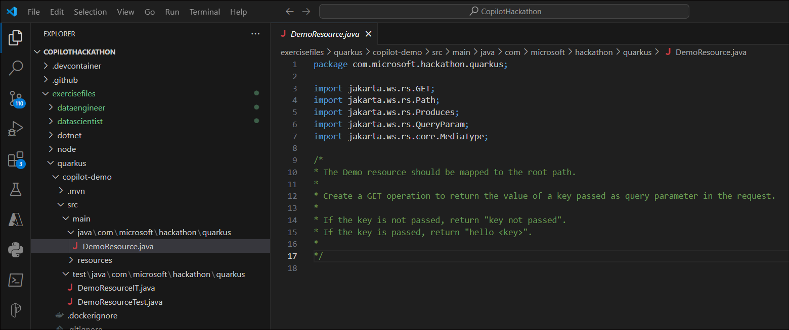
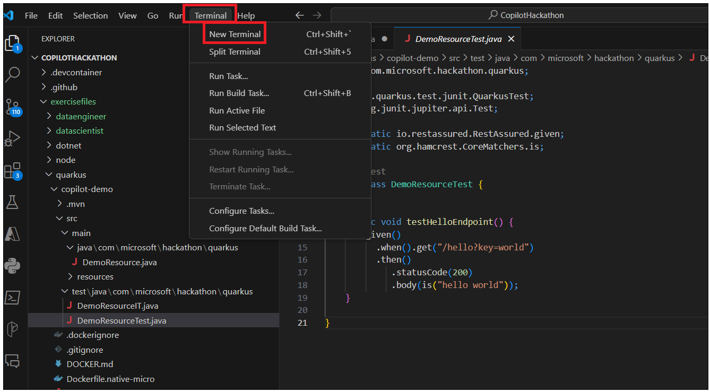
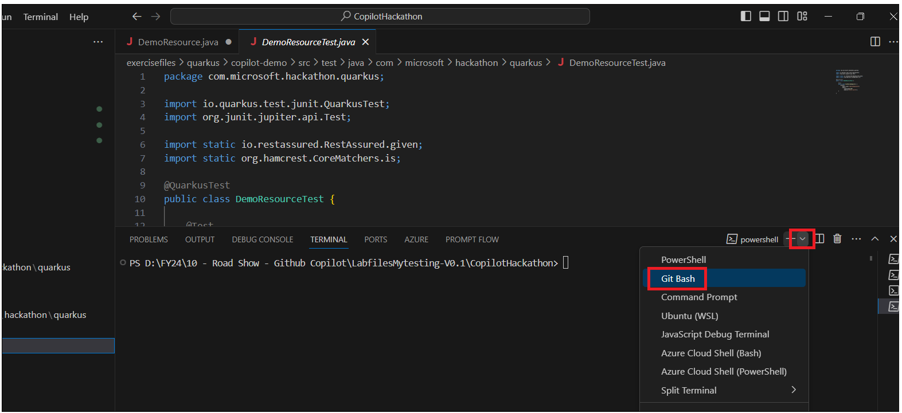
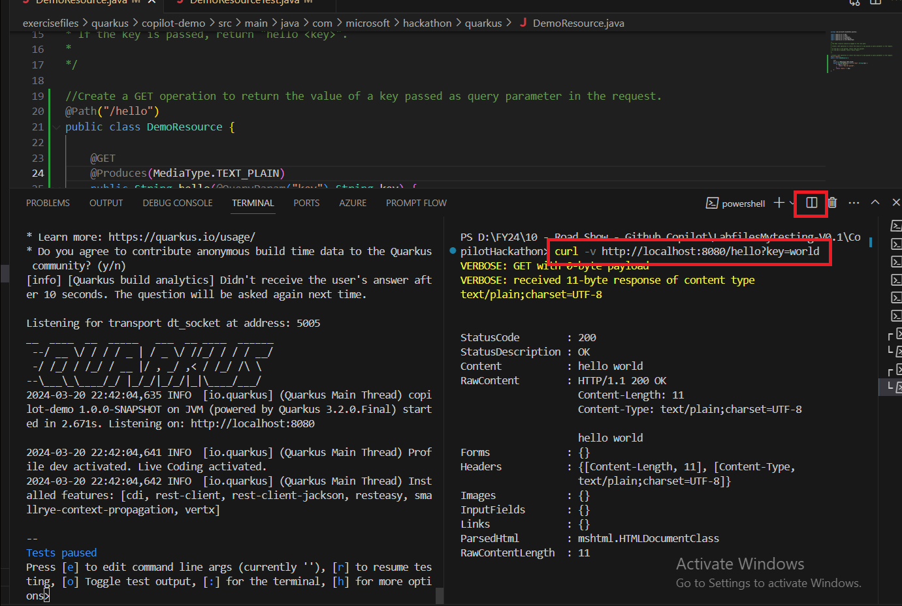
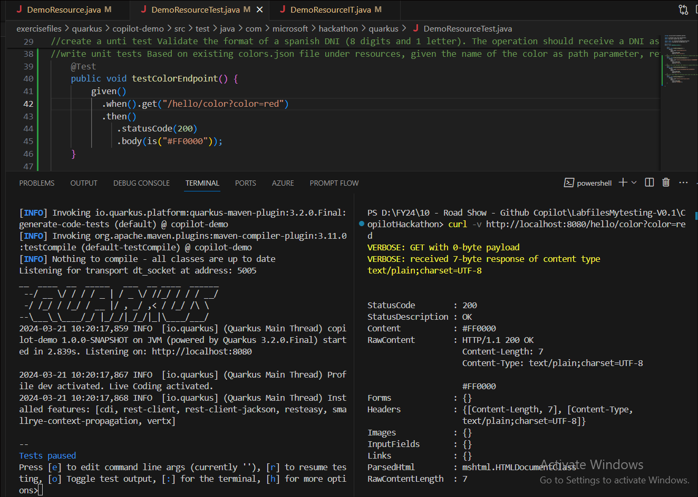
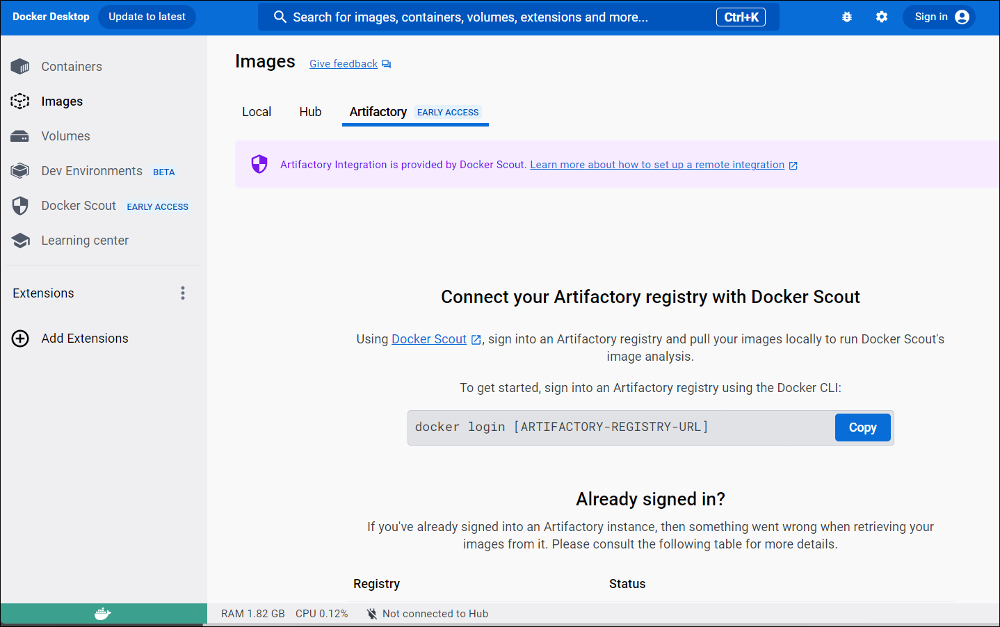
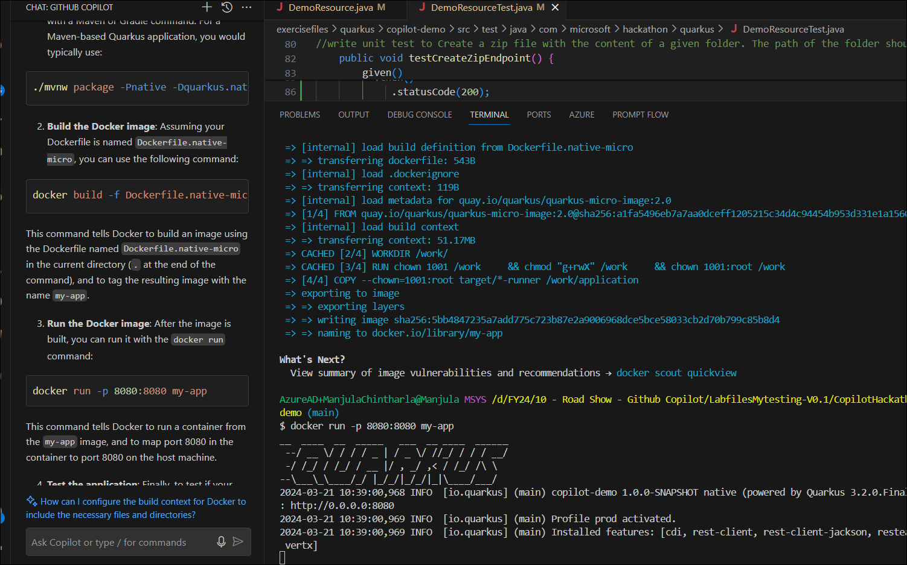

**Laboratoire 19 - Création d'une API REST à l'aide de Quarkus à l'aide
de GitHub CopilotGoal**

L'objectif de cet atelier est d'apprendre à utiliser GitHub Copilot, à
l'aide d'une tâche qui consiste à créer une API REST à l'aide de
https://quarkus.io/.

Nous avons créé un projet Quarkus avec certains fichiers déjà créés,
vous pouvez trouver le projet dans le dossier **exercisefiles/quarkus**.

Commençons le copilotage !!

**Tâche 1 - Créer le code pour gérer une requête GET simple**

Passez au fichier 'DemoResource.java' et commencez à écrire le code pour
gérer une simple requête GET.

1.  Dans cette première étape, nous avons fourni un commentaire qui
    décrit le code que vous devez générer. Il suffit de taper Entrée et
    d'attendre quelques secondes.

2.  Copilot générera le code pour vous. Si vous n'êtes pas satisfait du
    code, appuyez sur Ctrl + Entrée et il vous proposera plusieurs
    options de code.

3.  . Si vous n'êtes pas satisfait du code généré, vous pouvez appuyer à
    nouveau sur Entrée et Copilot générera un nouveau code

4.  Allez sur **test/java/com/Microsoft/hackthon/quarkus/** et cliquez
    sur **DemoResourceTest.java**. Il existe déjà un test unitaire
    implémenté pour cette tâche.

5.  Cliquez sur **Terminal -\> New Terminal.**

6.  Sélectionnez **Gitbash**.

7.  Exécutez la commande cd exercisefiles/quarkus/copilot-demo/.

8.  Vous pouvez l'exécuter à l'aide de la commande mvn test before et
    after pour vérifier que le code généré par Copilot est correct.

9.  Après chaque tâche, n'hésitez pas à empaqueter et à exécuter votre
    application pour la tester.

Package: mvn package

10. Exécuter : mvn quarkus :dev

11. Cliquez sur Split terminal et entrez la commande dans le 2^(nd)
    terminal et lancez

curl -v http://localhost:8080/hello?key=world

curl http://localhost:8080/hello

curl http://localhost:8080/hello?key=world

**Tâche 2 : Comparaison des dates**

Nouvelle opération sous /diffdates qui calcule la différence entre deux
dates. L'opération doit recevoir deux dates en paramètre au format
jj-MM-aaaa (dd-MM-yyyy) et renvoyer la différence en jours.

1.  Tapez le commentaire suivant // New operation under /diffdates that
    calculates the difference between two dates. L'opération doit
    recevoir deux dates en paramètre au format jj-MM-aaaa (dd-MM-yyyy)
    et renvoyer la différence en jours. et appuyez sur Entrée

**Remarque :** Le commentaire se trouve dans le fichier
**DemoResource.java**. **C:\CopiolHackathon\exercisefiles\\ quarkus\\
copilot-demo\src\main\\
java\com\microsoft\hackathon\quarkus\DemoResource.java**

2.  Appuyez sur la touche Tab puis à nouveau sur la touche Tab pour
    accepter le code.

3.  Ouvrez DemoResourceTest.java fichier, créez un test unitaire qui
    valide l'opération. Ajoutez //Create a unit test to validate
    /diffdates that calculates the difference between two dates, puis
    appuyez sur Entrée.

4.  Appuyez sur la touche pour accepter le code. Vous pouvez également
    utiliser le code ci-dessous.

5.  package com.microsoft.hackathon.quarkus;

6.  

7.  import jakarta.ws.rs.GET;

8.  import jakarta.ws.rs.Path;

9.  import jakarta.ws.rs.Produces;

10. import jakarta.ws.rs.QueryParam;

11. import jakarta.ws.rs.client.Client;

12. import jakarta.ws.rs.client.ClientBuilder;

13. import jakarta.ws.rs.client.WebTarget;

14. import jakarta.ws.rs.core.MediaType;

15. import jakarta.ws.rs.core.Response;

16. 

17. import java.io.File;

18. import java.io.FileInputStream;

19. import java.io.IOException;

20. import java.io.InputStream;

21. import java.net.URL;

22. import java.nio.file.Files;

23. import java.nio.file.Paths;

24. import java.text.SimpleDateFormat;

25. import java.util.ArrayList;

26. import java.util.Date;

27. import java.util.List;

28. import java.util.Objects;

29. 

30. import com.fasterxml.jackson.databind.JsonNode;

31. import com.fasterxml.jackson.databind.ObjectMapper;

32. import com.fasterxml.jackson.databind.node.ObjectNode;

33. 

34. import io.quarkus.fs.util.ZipUtils;

35. 

36. 

37. 

38. 

39. 

40. /\*

41. \* The Demo resource should be mapped to the root path.

42. \*

43. \* Create a GET operation to return the value of a key passed as
    query parameter in the request.

44. \*

45. \* If the key is not passed, return "key not passed".

46. \* If the key is passed, return "hello \<key\>".

47. \*

48. \*/

49. 

50. @Path("/")

51. public class DemoResource {

52. @GET

53. @Path("/hello")

54. @Produces(MediaType.TEXT_PLAIN)

55. public String hello(@QueryParam("key") String key) {

56. if (key == null) {

57. return "key not passed";

58. } else {

59. return "hello " + key;

60. }

61. }

62. // New operation under /diffdates that calculates the difference
    between two dates. L'opération doit recevoir deux dates en paramètre
    au format jj-MM-aaaa (dd-MM-yyyy) et renvoyer la différence en
    jours.

63. @GET

64. @Path("/diffdates")

65. @Produces(MediaType.TEXT_PLAIN)

66. public String diffdates(@QueryParam("date1") String date1,
    @QueryParam("date2") String date2) {

67. Objects.requireNonNull(date1, "date1 must not be null");

68. Objects.requireNonNull(date2, "date2 must not be null");

69. try {

70. SimpleDateFormat dateFormat = new SimpleDateFormat("dd-MM-yyyy");

71. Date date1Obj = dateFormat.parse(date1);

72. Date date2Obj = dateFormat.parse(date2);

73. long diffMillis = Math.abs(date1Obj.getTime() - date2Obj.getTime());

74. long diffDays = diffMillis / (24 \* 60 \* 60 \* 1000);

75. return String.valueOf(diffDays);

76. } catch (Exception e) {

77. return "invalid date format";

78. }

}

79. Ouvrez Terminal et exécutez la commande mvn test.

80. Empaqueter la solution en exécutant la commande mvn package

81. Exécutez : mvn quarkus :dev ou mvn compile quarkus :dev

82. Séparez le terminal et exécutez curl -v
    http://localhost:8080/diffdates

**Tâche 3 : Valider le format d'un téléphone espagnol**

Validez le format d'un numéro de téléphone espagnol (+34 préfixes, puis
9 chiffres, commençant par 6, 7 ou 9). L'opération doit recevoir un
numéro de téléphone en paramètre et retourner true si le format est
correct, false dans le cas contraire.

1.  Tapez //Validate the format of a spanish phone number (+34 prefix,
    then 9 digits, starting with 6, 7 or 9). L'opération doit recevoir
    un numéro de téléphone en paramètre et retourner true si le format
    est correct, false sinon et appuyez sur Entrée. Appuyez sur tab pour
    accepter le code de suggestion de Copilot.

2.  Tapez // write unit test to Validate the format of a spanish phone
    number (+34 prefix, then 9 digits, starting with 6, 7 or 9).
    L'opération doit recevoir un numéro de téléphone en paramètre et
    retourner true si le format est correct, false sinon et appuyez sur
    Entrée. Appuyez sur tab pour accepter les tests unitaires suggérés
    par copilot

3.  Ouvrez le terminal et exécutez mvn test.

4.  Exécuter mvn package

5.  Exécuter mvn quarkus :dev

6.  Cliquez sur Diviser le terminal et exécutez dans l'un des terminaux
    -

curl -v http://localhost:8080/validatephone?phone=+34866666666

curl -v http://localhost:8080/validatephone?phone=+34666666667

curl -v http://localhost:8080/validatephone?phone=+34666666666

**Tâche 4 : Valider le format d'un DNI espagnol**

Validez le format d'une carte d'identité espagnole (8 chiffres et 1
lettre). L'opération doit recevoir un DNI en paramètre et retourner true
si le format est correct, false dans le cas contraire.

1.  Tapez // Validate the format of a spanish DNI (8 digits and 1
    letter). L'opération doit recevoir un DNI en paramètre et retourner
    true si le format est correct, false dans le cas contraire. et
    appuyez sur Entrée. Appuyez sur la touche de tabulation pour
    accepter le code de suggestion du Copilot.

2.  Passez à **CopilotDemoApplicationTests.java**. Pour écrire un test
    unitaire pour tester la fonction ci-dessus, ajoutez // Write unit
    test to Validate the format of a spanish DNI (8 digits and 1
    letter). L'opération doit recevoir un DNI en paramètre et retourner
    true si le format est correct, false dans le cas contraire. Appuyez
    sur Entrée. Appuyez sur l'onglet pour accepter le code.

3.  Ouvrez le terminal et exécutez le test mvn

4.  Exécuter mvn package

5.  Exécuter : mvn quarkus :dev

6.  Test: curl -v http://localhost:8080/hello/validatedni?dni=12345678A

**Tâche 5 : Du nom de la couleur au code hexadécimal**

Sur la base du fichier colors.json existant sous resources, étant donné
le nom de la couleur comme paramètre de chemin, renvoie le code
hexadécimal. Si la couleur n'est pas trouvée, retournez 404

Astuce : utilisez TDD. Commencez par créer le test unitaire, puis
implémentez le code.

1.  Type // Based on the existing colors.json file under resources,
    given the name of the color as path parameter, return the
    hexadecimal code. Si la couleur n'est pas trouvée, retournez 404. et
    appuyez sur Entrée. Appuyez sur la touche de tabulation pour
    accepter le code de suggestion du Copilot.

2.  Passez à **CopilotDemoApplicationTests.java**. Pour écrire un test
    unitaire pour tester la fonction ci-dessus, ajoutez //Write unit
    test to Based on the existing colors.json file under resources,
    given the name of the color as path parameter, return the
    hexadecimal code. Si la couleur n'est pas trouvée, retournez
    404. Appuyez sur Entrée. Appuyez sur l'onglet pour accepter le code.

3.  Exécuter mvn test

4.  Exécuter mvn package

5.  Exécuter : mvn quarkus :dev

6.  Test: curl -v http://localhost:8080/hello/color?color=red

**Tâche 6 : Créateur de blagues**

Créez une nouvelle opération qui appelle l'API
https://api.chucknorris.io/jokes/random et renvoie la blague.

1.  Tapez // Create a new operation that call the API
    https://api.chucknorris.io/jokes/random and return the joke. et
    appuyez sur Entrée. Appuyez sur la touche de tabulation pour
    accepter le code de suggestion du Copilote.

2.  Appuyez sur la touche pour accepter le code

3.  Passez à **CopilotDemoApplicationTests.java**. Pour écrire un test
    unitaire pour tester la fonction ci-dessus, ajoutez //Create a new
    operation that call the API
    \[\<u\>https://api.chucknorris.io/jokes/random\</u\>\](https://api.chucknorris.io/jokes/random)
    and return the joke. Appuyez sur Entrée. Appuyez sur l'onglet pour
    accepter le code.

4.  Appuyez sur la touche pour accepter le code.

5.  Cliquez sur Terminal -\> New Terminal -\> Gitbash et exécutez les
    commandes ci-dessous

cd exercisefiles/quarkus/copilot-demo/

mvn test

6.  Exécutez mvn package pour empaqueter votre application.

7.  Exécuter : mvn quarkus :dev

8.  Test: curl -v http://localhost:8080/hello/joke

**Tâche 7 : Analyse d'URL**

Étant donné une URL comme paramètre de requête, analysez-la et renvoyez
les paramètres de protocole, d'hôte, de port, de chemin et de requête.
La réponse doit être au format Json.

1.  Tapez // Given a url as query parameter, parse it and return the
    protocol, host, port, path and query parameters. et appuyez sur
    Entrée. Appuyez sur la touche de tabulation pour accepter le code de
    suggestion du Copilot.

2.  Passez à **CopilotDemoApplicationTests.java**. Pour écrire un test
    unitaire pour tester la fonction ci-dessus, ajoutez // Write unit
    test for Given a url as query parameter, parse it and return the
    protocol, host, port, path and query parameters. La réponse doit
    être au format Json. Appuyez sur Entrée. Appuyez sur l'onglet pour
    accepter le code.

3.  Exécuter mvn test

4.  Exécutez mvn package pour empaqueter votre application.

5.  Exécuter mvn quarkus :dev

6.  Cliquez sur split terminal et exécutez curl -v
    http://localhost:8080/hello/parseurl?url=https://www.google.com/search?q=quarkus

**Tâche 9 : Comptage de mots**

Étant donné le chemin d'un fichier et comptez le nombre d'occurrences
d'un mot fourni. Le chemin d'accès et le mot doivent être des paramètres
de requête. La réponse doit être au format Json.

1.  Tapez // Given the path of a file and count the number of occurrence
    of a provided word. Le chemin d'accès et le mot doivent être des
    paramètres de requête. La réponse doit être au format Json. et
    appuyez sur Entrée. Appuyez sur la touche de tabulation pour
    accepter le code de suggestion du Copilote.

2.  Passez à **CopilotDemoApplicationTests.java**. Pour écrire un test
    unitaire pour tester la fonction ci-dessus, ajoutez // Write unit
    test to Given the path of a file and count the number of occurrence
    of a provided word. La réponse doit être au format Json. Appuyez sur
    Entrée. Appuyez sur l'onglet pour accepter le code.

3.  Ouvrez **Terminal** et exécutez mvn test

4.  Exécutez mvn package pour empaqueter votre application.

5.  Exécuter : mvn quarkus :dev

6.  Test : curl
    \<http://localhost:8080/hello/countword?path=/tmp/test.txt&word=hello

Vous pouvez demander à GitHub copilot la commande curl pour votre
projet.

**Tâche 10 : Conteneuriser l'application**

Utilisez le fichier Dockerfile fourni pour créer une image Docker de
l'application. Dans ce cas, le contenu complet est fourni, mais pour
construire, exécuter et tester l'image docker, vous utiliserez également
Copilot pour générer les commandes.

J'ai créé un fichier DOCKER.md où nous allons documenter les étapes de
construction de l'application (native), créer l'image du conteneur,
exécuter le conteneur et tester le conteneur.

1.  Dans le code Visual Studio, appuyez sur **Ctrl + Shit + X**
    Rechercher **Docker** et installez-le.

2.  Double-cliquez sur **Desktop Docker** et chantez avec votre compte
    Docker.

3.  Appuyez sur **Ctrl + Alt + I** pour ouvrir le **chat Github
    Copilot**. Demandez à votre Copilot comment créer l'image du
    conteneur, exécuter le conteneur et tester le conteneur avec le
    fichier Dockerfile fourni

4.  Suivez l'instruction de Copilot.Build l'application : Exécutez la
    commande suivante dans votre terminal :

./mvnw package -Pnative -Dquarkus.native.container-build=true

5.  **Générer l'image Docker :** en supposant que votre fichier
    Dockerfile est nommé **Dockerfile.native-micro**, vous pouvez
    utiliser la commande suivante :

docker build -f Dockerfile.native-micro -t my-app .

6.  Cette commande indique à Docker de créer une image à l'aide du
    fichier Dockerfile nommé \`Dockerfile.native-micro\` dans le
    répertoire courant (\`.\` at the end of the command) et de marquer
    l'image résultante avec le nom \`my-app\`.

7.  Exécuter l'image Docker : Une fois l'image construite, vous pouvez
    l'exécuter avec la commande 'docker run' :

docker run -p 8080:8080 my-app

Cette commande indique à Docker d'exécuter un conteneur à partir de
l'image « my-app » et de mapper le port 8080 dans le conteneur au port
8080 sur la machine hôte.

1.  **Testez l'application** : Enfin, pour tester si votre application
    fonctionne correctement, vous pouvez envoyer une requête à
    http://localhost:8080 dans votre navigateur ou à l'aide d'un outil
    comme curl :

curl http://localhost:8080

Cette commande envoie une requête GET à votre application et imprime la
réponse. Si votre application s'exécute correctement, vous devriez voir
la réponse attendue.

Veuillez noter que ces commandes doivent être exécutées dans votre
terminal, et non dans le code de votre application Java.
