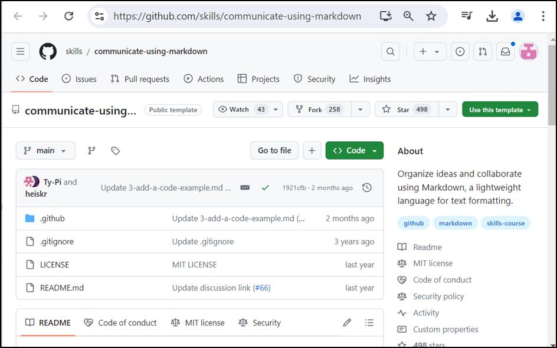

**ラボ 02: Markdown を使用した通信**

目的：

開発チームと共同プロジェクトに取り組んでいると想像してください。コミュニケーションと組織化は、プロジェクトを確実に成功させるための鍵です。Markdown
は、あなたのような開発者にとって、**特に問題**や**プル
リクエスト**の操作において、コミュニケーションの明確さと組織を強化するための重要なツールです
。

このラボでは、次のことを行います:

- パブリックテンプレートを使用してリポジトリを作成し、すぐに開始します。

- プルリクエストを生成して変更を提案し、効果的に比較します。

- ファイルを編集してヘッダーを含め、それらの変更をコミットすることで、ドキュメントをより構造化され読みやすくします。

タスク \#1: パブリック テンプレートを使用したリポジトリの作成

1.  GitHub アカウントにサインインします。

2.  次のリンクを参照します:
    https://github.com/skills/communicate-using-markdown

このラボでは、パブリック テンプレート
"**skills-communicate-using-markdown**"
を使用してリポジトリを作成します。

3.  「**Use this template」**メニュー の**「Create a new
    repository」**を選択します 。

4.  次の詳細を入力し、「**Create Repository」**を選択します。

    - リポジトリ名: **skills-communicate-using-markdown**

    - リポジトリの種類: **Public**

タスク \#2: Pull request の作成と変更の比較

1.  **skills-communicate-using-markdown** ページで、上部のナビゲーション
    ウィンドウの「**Pull requests**」タブを選択します。

2.  次のページで、「**New pull request」**ボタンを選択します。

3.  「**変更の比較」**ページで、「**base: main」**と**「compare:
    start-markdown」**を選択します。

**注:**
通常、ブランチを表示するには、数秒待ってからページを更新する必要があります。

4.  「**変更の比較」**ページで、**「Create pull
    request」**ボタンをクリックします 。

5.  「**プルリクエストを開く**」ページで、タイトルを入力し、「**Create
    pull request」**ボタンをクリックします。**タイトルを追加する:**
    Start markdown

> 

6.  「**変更の比較」**ページで、**「View pull request」**
    ボタンをクリックして 詳細を表示します。

7.  「**Start markdown
    \#1** 」ページで、「**ファイルの変更」**タブに移動します。

8.  ページの一番下までスクロールして、ファイル index.md 見つけます

9.  省略記号...
    (3つの等間隔のピリオド)アイコンをクリックして、ドロップダウンメニューから「**Edit
    file**」を選択します。

10. ファイルの編集ページで、次のテキストを入力します。

11. \# Hello World

12. \## This is an \`\<h1\>\` header, which is the largest

13. \### This is an \`\<h2\>\` header

\#### This is an \`\<h6\>\` header, which is the smallest

14. 「**プレビュー」**ボタンをクリックして、エディターに貼り付けられたコンテンツを表示します。

15. 「**Commit
    changes**」ボタンをクリックし、加えた変更のコミットを確認します。

16. 約 20 秒待ってからページを更新すると、更新された \[**index.md**
    file\*\*.\*\*\] のページが表示されます。

概要：

これで、リポジトリを作成し、pull request を生成し、ヘッダーを使用して
Markdown
ドキュメントを構造化しました。このワークフローにより、チームと効果的にコミュニケーションを取り、調整する能力が大幅に向上します。
