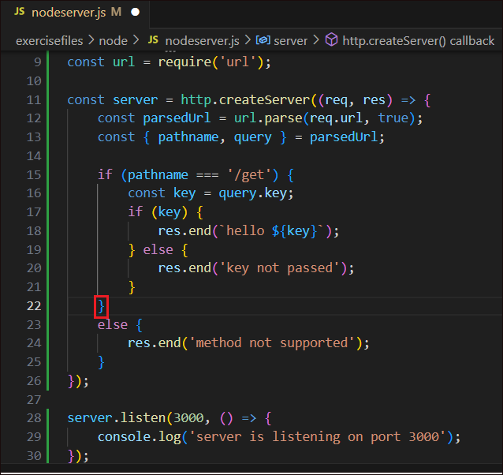
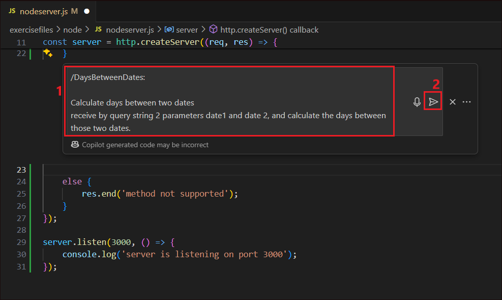
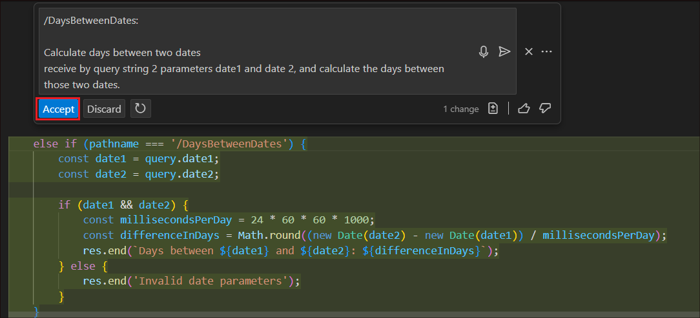
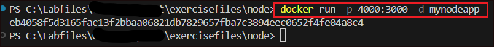

# **Laboratorio 20 - Activar GitHub Copilot usando Node.js**

**Objetivo:**

Este laboratorio tiene como objetivo ayudar a comprender el proyecto
Demo para la ejecución de laboratorios que evalúan la viabilidad de
Copilot.

Antes de ejecutar este laboratorio, primero instalemos los paquetes de
software necesarios y configuremos el entorno.

**Tarea 0: Instalación y configuración del entorno**

Debe descargar e instalar los siguientes paquetes de software para
configurar el entorno y ejecutar este laboratorio.

1.  Node.js

2.  mocha

&nbsp;

1.  Abra el navegador Edge.

> 

2.  En el campo de URL del navegador, copie y pegue el enlace para
    descargar los paquetes de software en su máquina virtual del
    laboratorio.

&nbsp;

1.  Node.js y mvn 🡪
    <https://nodejs.org/dist/v20.16.0/node-v20.16.0-x64.msi>

2.  mocha (no se requiere descarga)

> **Nota**: De forma predeterminada, los paquetes se guardarán en la
> carpeta **Downloads**.
>
> 

1.  **Instale Node.js and mvn**

&nbsp;

1.  Vaya a la carpeta **Downloads** (**C:\Users\Admin\Downloads**) y
    haga doble clic en **node-v20.16.0-x64.msi.**

> 

2.  En la ventana “Node.js setup wizard” haga clic en **Next**.

> 

3.  Acepte el **EULA** y haga clic en **Next**.

> 

4.  Mantenga la carpeta de destino predeterminada y luego haga clic en
    **Next**.

> 

5.  Haga clic en **Add to the PATH** y luego haga clic en **Next**.

> 

6.  En la ventana **Tools for native Modules**, Seleccione la **casilla
    de verificación** y haga clic en Next.

> 

7.  Haga clic en **Install**.

> 
>
> Nota: Si aparece una ventana emergente **User Access Control**, por
> favor haga clic en **Yes** para continuar**.**

8.  Haga clic en **Finish** una vez haya terminado.

> 

9.  Se abre la terminal **Cmd**. Presione cualquier tecla para
    continuar..

> 
>
> Nota: Es posible que observe un pequeño retraso después de presionar
> una tecla. Espere unos momentos para continuar con la instalación.

10. Haga clic en **Yes** en la ventana UAC para continuar.

> 

11. Se abre **Windows PowerShell** mostrando los detalles de la
    instalación.

> 

12. Una vez completada la instalación, escriba **Enter** para salir de
    PowerShell.

> 

2.  **Instale mocha**

&nbsp;

1.  Abra el símbolo del sistema (Command Prompt).

> 

2.  Primero, ejecute el siguiente comando.

> +++npm install --global mocha+++
>
> 
>
> 

3.  Luego, ejecute el siguiente comando

> +++npm install axios+++
>
> 
>
> 
>
> Ahora ha terminado de instalar **mocha**. Cierre la terminal para
> continuar con la instalación de los demás paquetes.

## **Ejercicio 1: Introducción** 

1.  Desde Visual Studio, abra **nodeserver.js** desde exercisefiles -\>
    node.

2.  Necesitamos comenzar a programar el servidor Node.js que expondrá un
    método llamado “get” el cual devolverá el valor de la clave pasada
    en la cadena de consulta (query string). Usemos Copilot para que nos
    ayude con esto.

3.  Presione **Ctrl + I** y pegue los siguientes comandos para que
    Copilot genere el código. Luego seleccione **Send**.

**// write a nodejs server that will expose a method call "get" that
will return the value of the key passed in the query string**

**// example: http://localhost:3000/get?key=hello**

**// if the key is not passed, return "key not passed"**

**// if the key is passed, return "hello" + key**

**// if the url has other methods, return "method not supported"**

**// when server is listening, log "server is listening on port 3000"**

4.  Copilot generará el código y lo mostrará. Seleccione **Accept** para
    aceptarlo.

5.  Haga clic derecho en la carpeta **node** y seleccione **Open in
    Integrated Terminal**.

6.  Una vez que la terminal esté abierta, ejecute el siguiente comando
    desde ella.

!!**mocha test.js**!!

7.  Debería obtener un resultado como **1 Passing**, tal como se muestra
    en la captura de pantalla a continuación.

8.  Esta es la prueba unitaria del método en el archivo nodeserver.js y
    ha pasado correctamente.

9.  Continuaremos agregando distintos métodos al servidor utilizando
    Copilot.

## **Ejercicio 2: Creación de nuevas funcionalidades**

El ejercicio consiste en construir un servidor web usando Node.js que
atienda solicitudes de distintas funcionalidades.

1.  Agregue la funcionalidad **DaysBetweenDates** que el servidor debe
    atender.

2.  Presione **Enter** después de que finalice la condición **if** –
    **pathname == ‘/get’**.

**Nota:** Consulte el corchete resaltado en rojo para saber exactamente
dónde debe presionar **Enter**

3.  Presione **Ctrl+I** para abrir la función inline de Copilot, ingrese
    el siguiente comentario y seleccione **Send**.

> **/DaysBetweenDates:**
>
> **Calculate days between two dates**
>
> **receive by query string 2 parameters date1 and date 2, and calculate
> the days between those two dates.**

**Código de referencia:**

if (req.url.startsWith('/DaysBetweenDates')) {

//calculate days between two dates

//get dates from querystring

var queryData = url.parse(req.url, true).query;

var date1 = queryData.date1;

var date2 = queryData.date2;

//convert dates to milliseconds

var date1_ms = Date.parse(date1);

var date2_ms = Date.parse(date2);

//calculate difference in milliseconds

var difference_ms = date2_ms - date1_ms;

//convert to days and return

res.end(Math.round(difference_ms / 86400000) + " days");

}

4.  **Copilot** genera el código. Seleccione **Accept** para aceptarlo.
    Tenga en cuenta que el código generado es un bloque **else if** en
    el que la solicitud corresponde a **DaysBetweenDates**.

5.  Presione **Enter** después del bloqueo **DaysBetweenDates**.

6.  Ingrese el siguiente bloqueo de comentario y presione **Enter**.

**/\***

**/Validatephonenumber:**

**Receive by querystring a parameter called phoneNumber**

**validate phoneNumber with proper Spanish format, for example
34666666666**

**if phoneNumber is valid return "valid"**

**if phoneNumber is not valid return "invalid"**

**\*/**

**Código de referencia:**

else if (req.url.startsWith('/Validatephonenumber')) {

//get phoneNumber var from querystring

var queryData = url.parse(req.url, true).query;

var phoneNumber = queryData.phoneNumber;

//validate phoneNumber with Spanish format

var regex = /^(\\34|0034|34)?\[ -\]\*(6|7)\[ -\]\*(\[0-9\]\[
-\]\*){8}$/;

//if phoneNumber is valid return "valid"

if (regex.test(phoneNumber)) {

res.end("valid");

}

//if phoneNumber is not valid return "invalid"

else {

res.end("invalid");

}

}

7.  Copilot genera el código. Seleccione **Accept** para aceptarlo.

8.  Presione **Enter** después del bloque **Validatephonenumber** para
    agregar el siguiente bloque de código.

9.  Copie y pegue el siguiente texto en el archivo js.

> **/\***
>
> **/ValidateSpanishDNI:**
>
> **Receive by querystring a parameter called dni**
>
> **calculate DNI letter**
>
> **if DNI is valid return "valid"**
>
> **if DNI is not valid return "invalid"**
>
> **\*/**
>
> **Código de referencia:**
>
> else if (req.url.startsWith('/ValidateSpanishDNI')) {
>
> var queryData = url.parse(req.url, true).query;
>
> var dni = queryData.dni;
>
> // calculate DNI letter
>
> var dniLetter = dni.charAt(dni.length - 1);
>
> var dniNumber = dni.substring(0, dni.length - 1);
>
> var dniLetterCalc = "TRWAGMYFPDXBNJZSQVHLCKE".charAt(dniNumber % 23);
>
> //if DNI is valid return "valid"
>
> if (dniLetter == dniLetterCalc) {
>
> res.end("valid");
>
> }
>
> //if DNI is not valid return "invalid"
>
> else {
>
> res.end("invalid");
>
> }
>
> }
>
> 

10. Una vez pegado el contenido anterior, **Copilot** generará el código
    que se mostrará justo debajo del comentario. Seleccione **Accept**
    para aceptarlo.

11. Abra Copilot Chat desde el panel de navegación izquierdo.

12. Pegue el siguiente contenido en el chat de Copilot y seleccione el
    botón **Send**.

> **/ReturnColorCode:**
>
> **Receive by querystring a parameter called color**
>
> **read colors.json file and return the rgba field**
>
> **get color var from querystring**
>
> **iterate for each color in colors.json to find the color**
>
> **return the code.hex field**
>
> **Código de referencia:**

else if (req.url.startsWith('/ReturnColorCode')) {

//read colors.json file and return the rgba field

var colors = fs.readFileSync('colors.json', 'utf-8');

var colorsObj = JSON.parse(colors);

//get color var from querystring

var queryData = url.parse(req.url, true).query;

var color = queryData.color;

var colorFound = "not found";

//for each color in colors.json

for (var i = 1; i \< colorsObj.length; i++) {

//if color is found return the color code

if (colorsObj\[i\].color == color) {

colorFound = colorsObj\[i\].code.hex;

}

}

res.end(colorFound);

}

> **Nota:** Copilot usará por defecto el archivo abierto como contexto
> para generar la sugerencia.

13. Coloque el cursor después del bloque **ValidateSpanishDNI** y haga
    clic en el icono Insert at cursor en el chat. Esto copia el código
    generado por **Copilot** desde el chat al archivo server.js en la
    ubicación mencionada.

14. Verifique si hay errores. En este código generado, hay un error ya
    que hay una declaración de constante entre los bloques else if.

15. Presione **Ctrl + I** para abrir **Copilot Inline**, escriba
    !!**/fix**!! y seleccione el botón **Send**.

16. Copilot genera una solución si puede encontrar una. Acéptela o
    descártela según qué tan precisa sea la solución.

17. Aquí, estamos moviendo la declaración de la constante dentro del
    bloque else if de returncolors para resolver el error.

**Importante:** El código y la solución pueden ser diferentes para
usted, dependiendo de lo que genere Copilot.

18. Después del bloque agregado, presione **Ctrl + I** para abrir la
    función inline de Copilot, pegue el siguiente contenido y seleccione
    **Send**.

**/TellMeAJoke:**

**Make a call to the joke api and return a random joke using axios
(<https://official-joke-api.appspot.com/random_joke>)**

**Código de referencia**:

else if (req.url.startsWith('/TellMeAJoke')) {

//make a call to the joke api and return a random joke using axios

const axios = require('axios');

axios.get('https://official-joke-api.appspot.com/random_joke')

.then(function (response) {

// handle success

res.end(response.data.setup + " " + response.data.punchline);

}

)

.catch(function (error) {

// handle error

console.log(error);

})

.then(function () {

// always executed

});

}

19. Seleccione **Accept** para aceptar el código generado por Copilot.

20. Después del bloque de código generado, presione **Ctrl + I**,
    ingrese el siguiente texto y seleccione el botón **Send**.

**/MoviesByDirector:**

**Receive by querystring a parameter called director**

**Make a call to the movie api and return a list of movies of that
director using axios**

**Return the full list of movies**

**Código de referencia:**

//method that gets the name of a director and retrieves from an api the
list of movies of that director

else if (req.url.startsWith('/MoviesByDirector')) {

//get a director name from querystring

var queryData = url.parse(req.url, true).query;

var director = queryData.director;

//make a call to the movie api omdbapi.com and return a list of movies
of that director using axios

const axios = require('axios');

axios.get('http://www.omdbapi.com/?apikey=XXXXXXX&s=' + director)

.then(function (response) {

//return the full list of movies

var movies = "";

for (var i = 0; i \< response.data.Search.length; i++) {

movies = movies + response.data.Search\[i\].Title + ", ";

}

res.end(movies);

}

)

.catch(function (error) {

// handle error

console.log(error);

}

)

.then(function () {

// always executed

}

);

}

21. Seleccione **Accept** para aceptar el código.

22. Después del bloque de código generado, presione **Ctrl + I**,
    ingrese el siguiente texto y seleccione el botón **Send**.

**/ParseUrl:**

**Retrieves a parameter from querystring called someurl**

**Parse the url and return the protocol, host, port, path, querystring
and hash**

**Return the parsed host**

**Código de referencia:**

> //If url equals to ParseUrl
>
> else if (req.url.startsWith('/ParseUrl')) {
>
> //retrieves a parameter from querystring called someurl
>
> var queryData = url.parse(req.url, true).query;
>
> var someUrl = queryData.someurl;
>
> //parse the url and return the protocol, host, port, path, querystring
> and hash
>
> var urlObj = new URL(someUrl);
>
> var protocol = urlObj.protocol;
>
> var host = urlObj.host;
>
> var port = urlObj.port;
>
> var path = urlObj.pathname;
>
> var querystring = urlObj.search;
>
> var hash = urlObj.hash;
>
> //return the parsed host
>
> res.end("host: " + host);
>
> }

23. Seleccione **Accept** para aceptar el código.

24. Después del bloque de código generado, presione **Ctrl + I**,
    ingrese el texto siguiente y seleccione el botón **Send**.

**/GetFullTextFile:**

**Read \`sample.txt\`\` and return lines that contains the word
"Fusce"**

**Código de referencia:**

else if (req.url.startsWith('/GetFullTextFile')) {

//read sample.txt and return lines that contains the word "Fusce"

var text = fs.readFileSync('sample.txt', 'utf-8');

var lines = text.split("\r");

var linesFound = "";

for (var i = 1; i \< lines.length; i++) {

if (lines\[i\].includes("Fusce")) {

linesFound = linesFound + lines\[i\] + ", ";

}

}

res.end(linesFound);

}

**NOTA:** Tenga cuidado con esta implementación, ya que normalmente lee
el contenido completo del archivo antes de analizarlo, por lo que el uso
de memoria es alto y puede fallar si los archivos son demasiado grandes.

25. Seleccione **Accept** para aceptar el código.

26. Después del bloque de código generado, presione **Ctrl + I**,
    ingrese el siguiente texto y seleccione el botón **Send**.

**/GetLineByLinefromtTextFile:**

**Read sample.txt line by line**

**Create a promise to read the file line by line, and return a list of
lines that contains the word "Fusce"**

**Return the list of lines**

**Código de referencia:**

else if (req.url.startsWith('/GetLineByLinefromtTextFile')) {

//read sample.txt line by line

var lineReader = require('readline').createInterface({

input: require('fs').createReadStream('sample.txt')

});

//create a promise to read the file line by line, and return a list of
lines that contains the word "Fusce"

var promise = new Promise(function (resolve, reject) {

var lines = \[\];

lineReader.on('line', function (line) {

if (line.includes("Fusce")) {

lines.push(line);

}

});

lineReader.on('close', function () {

resolve(lines);

});

});

//return the list of lines

promise.then(function (lines) {

res.end(lines.toString());

});

}

27. Seleccione **Accept** para aceptar el código.

28. Después del bloque de código generado, presione **Ctrl + I**,
    ingrese el siguiente texto y seleccione el botón **Send**.

**/CalculateMemoryConsumption:**

**Return the memory consumption of the process in GB, rounded to 2
decimals**

**Código de referencia:**

else if (req.url.startsWith('/CalculateMemoryConsumption')) {

//return the memory consumption of the process in GB, rounded to 2
decimals

var memory = process.memoryUsage().heapUsed / 1024 / 1024;

res.end(memory.toFixed(2) + " GB");

}

29. Seleccione **Accept** para aceptar el código.

30. Después del bloque de código generado, presione **Ctrl + I**,
    ingrese el siguiente texto y seleccione el botón **Send**.

**/RandomEuropeanCountry:**

**Make an array of european countries and its iso codes**

**Return a random country from the array**

**Return the country and its iso code**

**Código de referencia:**

else if (req.url.startsWith('/RandomEuropeanCountry')) {

//make an array of european countries and its iso codes

var countries = \[

{ country: "Italy", iso: "IT" },

{ country: "France", iso: "FR" },

{ country: "Spain", iso: "ES" },

{ country: "Germany", iso: "DE" },

{ country: "United Kingdom", iso: "GB" },

{ country: "Greece", iso: "GR" },

{ country: "Portugal", iso: "PT" },

{ country: "Romania", iso: "RO" },

{ country: "Bulgaria", iso: "BG" },

{ country: "Croatia", iso: "HR" },

{ country: "Czech Republic", iso: "CZ" },

{ country: "Denmark", iso: "DK" },

{ country: "Estonia", iso: "EE" },

{ country: "Finland", iso: "FI" },

{ country: "Hungary", iso: "HU" },

{ country: "Ireland", iso: "IE" },

{ country: "Latvia", iso: "LV" },

{ country: "Lithuania", iso: "LT" },

{ country: "Luxembourg", iso: "LU" },

{ country: "Malta", iso: "MT" },

{ country: "Netherlands", iso: "NL" },

{ country: "Poland", iso: "PL" },

{ country: "Slovakia", iso: "SK" },

{ country: "Slovenia", iso: "SI" },

{ country: "Sweden", iso: "SE" },

{ country: "Belgium", iso: "BE" },

{ country: "Austria", iso: "AT" },

{ country: "Switzerland", iso: "CH" },

{ country: "Cyprus", iso: "CY" },

{ country: "Iceland", iso: "IS" },

{ country: "Norway", iso: "NO" },

{ country: "Albania", iso: "AL" },

{ country: "Andorra", iso: "AD" },

{ country: "Armenia", iso: "AM" },

{ country: "Azerbaijan", iso: "AZ" },

{ country: "Belarus", iso: "BY" },

{ country: "Bosnia and Herzegovina", iso: "BA" },

{ country: "Georgia", iso: "GE" },

{ country: "Kazakhstan", iso: "KZ" },

{ country: "Kosovo", iso: "XK" },

{ country: "Liechtenstein", iso: "LI" },

{ country: "Macedonia", iso: "MK" },

{ country: "Moldova", iso: "MD" },

{ country: "Monaco", iso: "MC" },

{ country: "Montenegro", iso: "ME" },

{ country: "Russia", iso: "RU" },

{ country: "San Marino", iso: "SM" },

{ country: "Serbia", iso: "RS" },

{ country: "Turkey", iso: "TR" },

{ country: "Ukraine", iso: "UA" },

{ country: "Vatican City", iso: "VA" }

\];

//return a random country from the array

var randomCountry = countries\[Math.floor(Math.random() \*
countries.length)\];

//return the country and its iso code

res.end(randomCountry.country + " " + randomCountry.iso);

}

31. Seleccione **Accept** para aceptar el código.

## **Ejercicio 3: Documentar el código** 

Documentar el código siempre es una tarea aburrida y tediosa. Sin
embargo, podemos usar Copilot para que lo documente por nosotros. En el
chat, solicite a Copilot que documente el archivo nodeserver.js.

1.  **Seleccione todo el contenido** del archivo **nodeserver.js**.

2.  En el chat de Copilot, escriba!!**document the nodeserver.js
    file**!! y haga clic en Send.

3.  Copilot generará una documentación detallada del archivo.

## **Ejercicio 4: Crear pruebas** 

Crearemos pruebas automatizadas para verificar que la funcionalidad de
los endpoints implementados anteriormente esté correctamente
desarrollada. Todas las pruebas deben agruparse en el archivo test.js.

Puede aprovechar Copilot para ejecutar las pruebas. Existe un comando
llamado /tests que puede ejecutar directamente desde Copilot Chat, o
bien puede seleccionar el fragmento de código que desea probar y
utilizar la función inline de Copilot.

1.  Abra el archivo test.js.

2.  Presione **Enter** después del bloque existente **it** para agregar
    una nueva prueba.

3.  Ingrese el siguiente texto y presione **Enter**.

**//add test to test DaysBetweenDates**

4.  Esto genera el bloque de prueba unitaria para **DaysBetweenDates**.
    Seleccione **Accept** para aceptar el código.

5.  Desde la terminal, ejecute el siguiente commando !!**mocha
    test.js**!!

6.  Ingrese el siguiente texto **//add test to check
    validatephoneNumber** y haga clic en **Enter**.

7.  Haga clic en **Accept** para aceptar el código generado por Copilot.

8.  Desde la terminal, ejecute el siguiente comando, !!**mocha
    test.js**!!. Verifique que la prueba de validate phone number haya
    pasado correctamente.

9.  Ingrese el siguiente texto y presione **Enter**.

!!**//write test to validate validateSpanishDNI**!!

10. Acepte el texto generado por Copilot.

11. Desde la terminal, ejecute !!**mocha test.js**!! y verifique que la
    función ValidateSpanishDNI haya pasado.

**Código de referencia:**

//write npm command line to install mocha

//npm install --global mocha

//command to run this test file

//mocha test.js

const assert = require('assert');

const http = require('http');

const server = require('./nodeserver');

describe('Node Server', () =\> {

it('should return "key not passed" if key is not passed', (done) =\> {

http

.get('http://localhost:3000/Get' , (res) =\> {

let data = '';

res.on('data', (chunk) =\> {

data += chunk;

});

res.on('end', () =\> {

assert.equal(data, 'key not passed');

done();

});

});

});

it('should return the value of the key if key is found', (done) =\> {

http.get('http://localhost:3000/Get?key=world', (res) =\> {

let data = '';

res.on('data', (chunk) =\> {

data += chunk;

});

res.on('end', () =\> {

assert.equal(data, 'hello world');

done();

});

});

});

//add test to check validatephoneNumber

it('should return "valid" if phoneNumber is valid', (done) =\> {

http.get('http://localhost:3000/Validatephonenumber?phoneNumber=34666666666',
(res) =\> {

let data = '';

res.on('data', (chunk) =\> {

data += chunk;

});

res.on('end', () =\> {

assert.equal(data, 'valid');

done();

});

});

});

//write test to validate spanish DNI

it('should return "valid" if spanish DNI 86471508H is valid', (done) =\>
{

http.get('http://localhost:3000/ValidateSpanishDNI?dni=86471508H', (res)
=\> {

let data = '';

res.on('data', (chunk) =\> {

data += chunk;

});

res.on('end', () =\> {

assert.equal(data, 'valid');

done();

});

});

});

//write test to validate spanish DNI

it('should return "valid" if spanish DNI 24153149K is valid', (done) =\>
{

http.get('http://localhost:3000/ValidateSpanishDNI?dni=24153149K', (res)
=\> {

let data = '';

res.on('data', (chunk) =\> {

data += chunk;

});

res.on('end', () =\> {

assert.equal(data, 'valid');

done();

});

});

});

//write test to validate spanish DNI

it('should return "valid" if spanish DNI 12345678A is invalid', (done)
=\> {

http.get('http://localhost:3000/ValidateSpanishDNI?dni=12345678A', (res)
=\> {

let data = '';

res.on('data', (chunk) =\> {

data += chunk;

});

res.on('end', () =\> {

assert.equal(data, 'invalid');

done();

});

});

});

//write test for returnColorCode

it('should return "red" if color is red', (done) =\> {

http.get('http://localhost:3000/ReturnColorCode?color=red', (res) =\> {

let data = '';

res.on('data', (chunk) =\> {

data += chunk;

});

res.on('end', () =\> {

assert.equal(data, '#FF0000');

done();

});

});

});

//write test for daysBetweenDates

it('should return "1" if dates are 2020-01-01 and 2020-01-02', (done)
=\> {

http.get('http://localhost:3000/DaysBetweenDates?date1=2020-01-01&date2=2020-01-02',
(res) =\> {

let data = '';

res.on('data', (chunk) =\> {

data += chunk;

});

res.on('end', () =\> {

assert.equal(data, '1 days');

done();

});

});

});

});

## **Ejercicio 5: Crear un Dockerfile**

1.  Abre el archivo **Dockerfile** desde la carpeta **node**.

2.  El archivo contendrá comentarios sobre cómo debe llenarse.

3.  Presione **Ctrl+I** y escriba !!**/fix**!!. Haga clic en icono
    **Send**.

4.  Copilot generará el contenido del Dockerfile. Haga clic en
    **Accept** para aceptarlo.

5.  Desde la terminal, ejecuta el siguiente comando:

!!**docker build -t mynodeapp .**!!

Esto es para compilar la imagen y etiquetarla como mynodeapp.

6.  Ejecuta el contenedor de Docker en el puerto **4000** usando el
    siguiente comando.

!!**docker run -p 4000:3000 -d mynodeapp**!!

7.  Abre el demonio de Docker para verificar que la aplicación ha sido
    contenerizada y se está ejecutando en él.

**Resumen:**

En este laboratorio, hemos aprendido cómo utilizar Copilot en un
proyecto de Node.js
