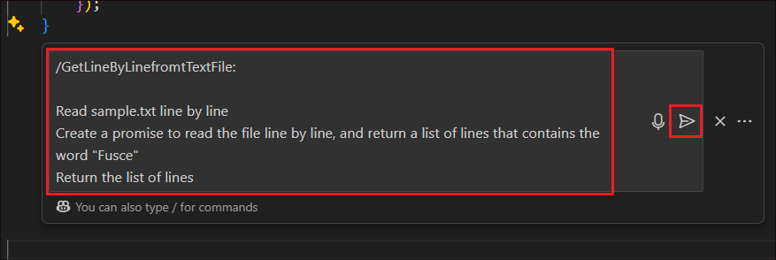

# **ラボ 20 - Nodejs を使用して GitHub Copilot をアクティブ化する**

**客観的:**

このラボは、Copilot の実行可能性を評価するためのラボを実行するためのデモ
プロジェクトを理解するのに役立ちます。

このラボを実行する前に、まず必要なソフトウェアパッケージをインストールし、環境をセットアップしましょう。

**タスク0: 環境のインストールおよび設定**

このラボを実行するための環境を設定するには、次のソフトウェア
パッケージをダウンロードしてインストールする必要があります。

1.  Node.js

2.  mocha

&nbsp;

1.  Edgeブラウザを開きます。

2.  ブラウザーの URL
    フィールドで、リンクをコピーして貼り付けて、ソフトウェア
    パッケーをラボ VM にダウンロードします。

&nbsp;

1.  Node.jsとMVN 🡪
    <https://nodejs.org/dist/v20.16.0/node-v20.16.0-x64.msi>

2.  mocha (ダウンロード不要)

> **注**:
> デフォルトでは、パッケージは**ダウンロード**フォルダに保存されます。
>
> 

1.  **Node.js and mvnをインストールする**

&nbsp;

1.  ダウンロードの(**C:\Users\Admin\Downloads**)**フォルダー**に移動し**、node-v20.16.0-x64.msi**
    をダブルクリックします。

> 

2.  「Node.js setup wizard」ウィンドウで、「**Next」**をクリックします。

> 

3.  **EULA** に同意し、「**Next」**をクリックします。

> 

4.  既定の宛先フォルダーを保持し、「**Next」**をクリックします。

> 

5.  「**Add to the PATH**」をクリックし、「**Next**」をクリックします。

> 

6.  「**ネイティブ・モジュールのツール」**ウィンドウで**、check
    box**をオンにして「**Next**」をクリックします。

> 

7.  「**インストール**」をクリックします。

> 
>
> **注**:
> **ユーザーアクセス制御**ポップアップが表示された場合は、「**Yes**」をクリックして
> 続行してください。

8.  完了したら**、「Finish」**をクリックします。

> 

9.  **Cmd**
    ターミナルが開きます。続行するには、任意のキーを押してください。

> 
>
> 注:キーを押すと遅延が発生する場合があります。インストールを進めるまでしばらくお待ちください。

10. **「Yes」**をクリックして、UAC ウィンドウで続行します。

> 

11. **Windows Powershell**が開き、インストールの詳細が表示されます。

> 

12. インストールが完了したら「**Enter**」と入力
    してPowerShellを終了します。

> 

2.  **mocha**をインストールします

&nbsp;

1.  コマンドプロンプトを開きます

> 

2.  まず、次のコマンドを実行します。

+++npm install --global mocha+++

> 
>
> 

3.  次に、次のコマンドを実行します

+++npm install axios+++

> 
>
> 
>
> これで**mocha**のインストールは完了です。ターミナルを閉じて、他のパッケージのインストールを続行します。

## **演習 1: はじめに**

1.  Visual Studio で、exercisefiles -\>
    nodeから**nodeserver.js**を開きます。

2.  クエリ文字列で渡されたキーの値を返すメソッド呼び出し "get"
    を公開する'
    node..js'サーバーのコーディングを開始する必要があります。これを支援するために
    Copilot を使用しましょう。

3.  **Ctrl+I**を押して、Copilot
    がコードを生成するための以下のコマンドを貼り付け、「**Send**」
    をクリックします。

**// write a nodejs server that will expose a method call "get" that
will return the value of the key passed in the query string**

**// example: http://localhost:3000/get?key=hello**

**// if the key is not passed, return "key not passed"**

**// if the key is passed, return "hello" + key**

**// if the url has other methods, return "method not supported"**

**// when server is listening, log "server is listening on port 3000"**

4.  Copilot
    がコードを生成して表示します。「**Accept」**をクリックして同意します。

5.  **ノード**フォルダを右クリックし、「**Open in Integrated
    Terminal」**を選択します。

6.  ターミナルが開いたら、そこから以下のコマンドを実行します。

> !!**mocha test.js**!!

7.  下のスクリーンショットのように、結果は **1
    Passing**として取得されるはずです。

8.  これはnodeserver.jsのメソッドの単体テストであり、合格しました。

9.  Copilot を使用してサーバーにさまざまな方法を追加していきます。

## **演習 2: 新しい機能の構築**

この演習では、さまざまな機能の要求に対応する Nodejs を使用して Web
サーバーを構築することで構成されます。

1.  サーバーが参加する必要がある **DaysBetweenDates**
    機能要求を追加します。

2.  if **条件 –** pathname == '/get' **が終了**したら **Enter**
    キーを押します。

**注:Enter**キーを押す必要がある場合は、赤いハイライトで中括弧を参照してください

3.  Ctrl+I **を押して** Copilot インライン機能を開き、次のように入力して
    「Send」 **をクリックします**。

**/DaysBetweenDates:**

**Calculate days between two dates**

**receive by query string 2 parameters date1 and date 2, and calculate
the days between those two dates.  
**

**参照コード:**

if (req.url.startsWith('/DaysBetweenDates')) {

//calculate days between two dates

//get dates from querystring

var queryData = url.parse(req.url, true).query;

var date1 = queryData.date1;

var date2 = queryData.date2;

//convert dates to milliseconds

var date1_ms = Date.parse(date1);

var date2_ms = Date.parse(date2);

//calculate difference in milliseconds

var difference_ms = date2_ms - date1_ms;

//convert to days and return

res.end(Math.round(difference_ms / 86400000) + " days");

}

4.  Copilot
    がコードを生成します。「**Accept」**をクリックしてコードを受け入れます。生成されたコードは、リクエスト内の**DaysBetweenDates**である**else
    if**ブロックであることに注意してください。

5.  **DaysBetweenDates**ブロックの後に**Enter をクリックします**。

6.  以下のコメントブロックを入力し、**Enter**キーを押します。

**/\***

**/Validatephonenumber:**

**Receive by querystring a parameter called phoneNumber**

**validate phoneNumber with proper Spanish format, for example
34666666666**

**if phoneNumber is valid return "valid"**

**if phoneNumber is not valid return "invalid"**

**\*/**

**参照コード:**

else if (req.url.startsWith('/Validatephonenumber')) {

//get phoneNumber var from querystring

var queryData = url.parse(req.url, true).query;

var phoneNumber = queryData.phoneNumber;

//validate phoneNumber with Spanish format

var regex = /^(\\34|0034|34)?\[ -\]\*(6|7)\[ -\]\*(\[0-9\]\[
-\]\*){8}$/;

//if phoneNumber is valid return "valid"

if (regex.test(phoneNumber)) {

res.end("valid");

}

//if phoneNumber is not valid return "invalid"

else {

res.end("invalid");

}

}

7.  Copilot
    がコードを生成します。「**Accept」**をクリックしてコードを受け入れます。

8.  Validatephonenumberブロックの後に **Enter**
    をクリックして、次のコードブロックを追加します。

9.  以下のテキストをコピーして js ファイルに貼り付けます。

> **/\***
>
> **/ValidateSpanishDNI:**
>
> **Receive by querystring a parameter called dni**
>
> **calculate DNI letter**
>
> **if DNI is valid return "valid"**
>
> **if DNI is not valid return "invalid"**
>
> **\*/**
>
> **  
> 参照コード:**
>
> else if (req.url.startsWith('/ValidateSpanishDNI')) {
>
> var queryData = url.parse(req.url, true).query;
>
> var dni = queryData.dni;
>
> // calculate DNI letter
>
> var dniLetter = dni.charAt(dni.length - 1);
>
> var dniNumber = dni.substring(0, dni.length - 1);
>
> var dniLetterCalc = "TRWAGMYFPDXBNJZSQVHLCKE".charAt(dniNumber % 23);
>
> //if DNI is valid return "valid"
>
> if (dniLetter == dniLetterCalc) {
>
> res.end("valid");
>
> }
>
> //if DNI is not valid return "invalid"
>
> else {
>
> res.end("invalid");
>
> }
>
> }
>
> 

10. 上記のコンテンツが貼り付けられると、Copilot
    はコメントのすぐ下に表示されるコードを生成します。「**Accept」**をクリックしてコードを受け入れます。

11. 左側のナビゲーション ウィンドウから Copilot チャットを開きます。

12. 以下のコンテンツをチャットに貼り付け、「
    **Send」**ボタンをクリックします。

> **/ReturnColorCode:**
>
> **Receive by querystring a parameter called color**
>
> **read colors.json file and return the rgba field**
>
> **get color var from querystring**
>
> **iterate for each color in colors.json to find the color**
>
> **return the code.hex field**
>
> **  
> 参照コード:**

else if (req.url.startsWith('/ReturnColorCode')) {

//read colors.json file and return the rgba field

var colors = fs.readFileSync('colors.json', 'utf-8');

var colorsObj = JSON.parse(colors);

//get color var from querystring

var queryData = url.parse(req.url, true).query;

var color = queryData.color;

var colorFound = "not found";

//for each color in colors.json

for (var i = 1; i \< colorsObj.length; i++) {

//if color is found return the color code

if (colorsObj\[i\].color == color) {

colorFound = colorsObj\[i\].code.hex;

}

}

res.end(colorFound);

}

> **注:** Copilot
> は、提案を生成するために、既定で開いているファイルをコンテキストとして使用します。

13. **ValidateSpanishDNI**ブロックの後にカーソルを置き、チャットのカーソルに挿入アイコンをクリックします。これにより、Copilot
    が生成したコードがチャットから上記の場所にあるサーバー js
    ファイルに**コピーされます**。

14. エラーがある場合はチェックします。この生成されたコードでは、else
    ifブロックの間に定数宣言があるため、エラーが発生します。

15. **Ctrl+I** を押して Copilot Inline
    を開き、「!!**/fix**!!をクリックし、「
    **Send」**ボタンをクリックします。

16. Copilot
    は、ソリューションが見つかった場合は、ソリューションを生成します。ソリューションの精度に基づいてソリューションを受け入れるか破棄します。

17. ここでは、エラーを解決するために、定数宣言をreturncolorsのelse
    ifブロック内に移動しています。

**重要:** コードと解像度は、Copilot
が生成するものに基づいて異なる場合があります。

18. ブロックを追加した後、**Ctrl+I**を押してCopilot
    インライン機能を開き、以下のコンテンツを貼り付けて「**Submit」**をクリックします。

**/TellMeAJoke:**

**Make a call to the joke api and return a random joke using axios
(<https://official-joke-api.appspot.com/random_joke>)**

Reference code:

else if (req.url.startsWith('/TellMeAJoke')) {

//make a call to the joke api and return a random joke using axios

const axios = require('axios');

axios.get('https://official-joke-api.appspot.com/random_joke')

.then(function (response) {

// handle success

res.end(response.data.setup + " " + response.data.punchline);

}

)

.catch(function (error) {

// handle error

console.log(error);

})

.then(function () {

// always executed

});

}

19. 「**Accept**」をクリックして、Copilot
    が生成したコードを受け入れます。

20. 生成されたコードブロックの後、**Ctrl +
    I**を押し、以下のテキストを入力して**、「Sends」**ボタンをクリックします。

**/MoviesByDirector:**

**Receive by querystring a parameter called director**

**Make a call to the movie api and return a list of movies of that
director using axios**

**Return the full list of movies**

**参照コード:**

//method that gets the name of a director and retrieves from an api the
list of movies of that director

else if (req.url.startsWith('/MoviesByDirector')) {

//get a director name from querystring

var queryData = url.parse(req.url, true).query;

var director = queryData.director;

//make a call to the movie api omdbapi.com and return a list of movies
of that director using axios

const axios = require('axios');

axios.get('http://www.omdbapi.com/?apikey=XXXXXXX&s=' + director)

.then(function (response) {

//return the full list of movies

var movies = "";

for (var i = 0; i \< response.data.Search.length; i++) {

movies = movies + response.data.Search\[i\].Title + ", ";

}

res.end(movies);

}

)

.catch(function (error) {

// handle error

console.log(error);

}

)

.then(function () {

// always executed

}

);

}

21. 「**Accept**」をクリックして コードを受け入れます。

22. 生成されたコードブロックの後、**Ctrl +
    I**を押し、以下のテキストを入力して**、「Send」**ボタンをクリックします。

**/ParseUrl:**

**Retrieves a parameter from querystring called someurl**

**Parse the url and return the protocol, host, port, path, querystring
and hash**

**Return the parsed host**

**Reference code:**

**参照コード:**

> //If url equals to ParseUrl
>
> else if (req.url.startsWith('/ParseUrl')) {
>
> //retrieves a parameter from querystring called someurl
>
> var queryData = url.parse(req.url, true).query;
>
> var someUrl = queryData.someurl;
>
> //parse the url and return the protocol, host, port, path, querystring
> and hash
>
> var urlObj = new URL(someUrl);
>
> var protocol = urlObj.protocol;
>
> var host = urlObj.host;
>
> var port = urlObj.port;
>
> var path = urlObj.pathname;
>
> var querystring = urlObj.search;
>
> var hash = urlObj.hash;
>
> //return the parsed host
>
> res.end("host: " + host);
>
> }

23. 「**Accept**」をクリックしてコードを受け入れます。

24. 生成されたコードブロックの後、**Ctrl +
    I**を押し、以下のテキストを入力して**、「Send」**ボタンをクリックします。

**/GetFullTextFile:**

**Read \`sample.txt\`\` and return lines that contains the word
"Fusce"**

**Reference code:**

else if (req.url.startsWith('/GetFullTextFile')) {

//read sample.txt and return lines that contains the word "Fusce"

var text = fs.readFileSync('sample.txt', 'utf-8');

var lines = text.split("\r");

var linesFound = "";

for (var i = 1; i \< lines.length; i++) {

if (lines\[i\].includes("Fusce")) {

linesFound = linesFound + lines\[i\] + ", ";

}

}

res.end(linesFound);

}

**注:**
この実装では、通常、ファイルを分析する前にファイルの全内容を読み取るため、メモリ使用量が多くなり、ファイルが大きすぎると失敗する可能性があるため、注意してください。

25. 「**Accept**」をクリックして コードを受け入れます。

26. 生成されたコードブロックの後、**Ctrl +
    I**を押し、以下のテキストを入力して**、「Send」**ボタンをクリックします。

**/GetLineByLinefromtTextFile:**

**Read sample.txt line by line**

**Create a promise to read the file line by line, and return a list of
lines that contains the word "Fusce"**

**Return the list of lines**

**参照コード:**

else if (req.url.startsWith('/GetLineByLinefromtTextFile')) {

//read sample.txt line by line

var lineReader = require('readline').createInterface({

input: require('fs').createReadStream('sample.txt')

});

//create a promise to read the file line by line, and return a list of
lines that contains the word "Fusce"

var promise = new Promise(function (resolve, reject) {

var lines = \[\];

lineReader.on('line', function (line) {

if (line.includes("Fusce")) {

lines.push(line);

}

});

lineReader.on('close', function () {

resolve(lines);

});

});

//return the list of lines

promise.then(function (lines) {

res.end(lines.toString());

});

}

27. 「**Accept**」をクリックして コードを受け入れます。

28. 生成されたコードブロックの後、**Ctrl +
    I**を押し、以下のテキストを入力して**、「Send」**ボタンをクリックします。

**/CalculateMemoryConsumption:**

**Return the memory consumption of the process in GB, rounded to 2
decimals**

**参照コード:**

else if (req.url.startsWith('/CalculateMemoryConsumption')) {

//return the memory consumption of the process in GB, rounded to 2
decimals

var memory = process.memoryUsage().heapUsed / 1024 / 1024;

res.end(memory.toFixed(2) + " GB");

}

29. **「Accept」** をクリックして コードを受け入れます。

30. 生成されたコードブロックの後、**Ctrl +
    I**を押し、以下のテキストを入力して**、「Send」**ボタンをクリックします。

**/RandomEuropeanCountry:**

**Make an array of european countries and its iso codes**

**Return a random country from the array**

**Return the country and its iso code**

**参照コード:**

else if (req.url.startsWith('/RandomEuropeanCountry')) {

//make an array of european countries and its iso codes

var countries = \[

{ country: "Italy", iso: "IT" },

{ country: "France", iso: "FR" },

{ country: "Spain", iso: "ES" },

{ country: "Germany", iso: "DE" },

{ country: "United Kingdom", iso: "GB" },

{ country: "Greece", iso: "GR" },

{ country: "Portugal", iso: "PT" },

{ country: "Romania", iso: "RO" },

{ country: "Bulgaria", iso: "BG" },

{ country: "Croatia", iso: "HR" },

{ country: "Czech Republic", iso: "CZ" },

{ country: "Denmark", iso: "DK" },

{ country: "Estonia", iso: "EE" },

{ country: "Finland", iso: "FI" },

{ country: "Hungary", iso: "HU" },

{ country: "Ireland", iso: "IE" },

{ country: "Latvia", iso: "LV" },

{ country: "Lithuania", iso: "LT" },

{ country: "Luxembourg", iso: "LU" },

{ country: "Malta", iso: "MT" },

{ country: "Netherlands", iso: "NL" },

{ country: "Poland", iso: "PL" },

{ country: "Slovakia", iso: "SK" },

{ country: "Slovenia", iso: "SI" },

{ country: "Sweden", iso: "SE" },

{ country: "Belgium", iso: "BE" },

{ country: "Austria", iso: "AT" },

{ country: "Switzerland", iso: "CH" },

{ country: "Cyprus", iso: "CY" },

{ country: "Iceland", iso: "IS" },

{ country: "Norway", iso: "NO" },

{ country: "Albania", iso: "AL" },

{ country: "Andorra", iso: "AD" },

{ country: "Armenia", iso: "AM" },

{ country: "Azerbaijan", iso: "AZ" },

{ country: "Belarus", iso: "BY" },

{ country: "Bosnia and Herzegovina", iso: "BA" },

{ country: "Georgia", iso: "GE" },

{ country: "Kazakhstan", iso: "KZ" },

{ country: "Kosovo", iso: "XK" },

{ country: "Liechtenstein", iso: "LI" },

{ country: "Macedonia", iso: "MK" },

{ country: "Moldova", iso: "MD" },

{ country: "Monaco", iso: "MC" },

{ country: "Montenegro", iso: "ME" },

{ country: "Russia", iso: "RU" },

{ country: "San Marino", iso: "SM" },

{ country: "Serbia", iso: "RS" },

{ country: "Turkey", iso: "TR" },

{ country: "Ukraine", iso: "UA" },

{ country: "Vatican City", iso: "VA" }

\];

//return a random country from the array

var randomCountry = countries\[Math.floor(Math.random() \*
countries.length)\];

//return the country and its iso code

res.end(randomCountry.country + " " + randomCountry.iso);

}

31. **「Accept」**をクリックしてコードを受け入れます。

## **演習 3: コードを文書化する**

コードを文書化することは、常に退屈で苦痛な作業です。ただし、Copilot
を使用して文書化することはできます。チャットで、Copilot にnodeserver.js
ファイルを文書化するように依頼します。

1.  **nodeserver.js**ファイルですべて**選択します。**

2.  Copilotチャットから、!!**document the nodeserver.js
    file**!!をクリックし、「Send」をクリックします。

3.  Copilot は、ファイルの詳細なドキュメントを生成します。

## **演習 4: テストの構築**

自動テストを作成して、前のエンドポイントの機能が正しく実装されていることを確認します。テストはtest.jsファイルにまとめて保存する必要があります。

Copilot を活用してテストを実行できます。Copilot Chat
から直接実行するか、テストを作成するコードを選択して Copilot
インライン機能を使用して実行できる /tests コマンドがあります。

1.  test.jsファイルを開きます。

2.  既存の it **ブロック**の後に **Enter をクリックします**。

3.  以下のテキストを入力し、**Enterをクリックします**。

**//add test to test DaysBetweenDates**

4.  これにより、**DaysBetweenDates**の単体テストブロックが生成されます。「**Accept」**
    をクリックしてコードを受け入れます。

5.  ターミナルから以下のコマンドを実行します!!**mocha test.js**!!

6.  以下のテキスト **//add test to check
    validatephoneNumber**、「**Enter」**をクリックします。

7.  **「Accept」**をクリックして、Copilot
    が生成したコードを受け入れます。

8.  端末からコマンドを実行します。!!**mocha
    test.js**!!検証電話番号が通過したことを確認します。

9.  以下のテキストを入力し、**Enter**キーを押します。

!!**//write test to validate validateSpanishDNI**!!

10. Copilot が生成したテキストを受け入れます。

11. 端末から、実行!!**mocha
    test.js**!!ValidateSpanishDNIが合格したことを確認します。

**参照コード:**

## //write npm command line to install mocha

## //npm install --global mocha

## 

## //command to run this test file

## //mocha test.js

## 

## const assert = require('assert');

## const http = require('http');

## 

## const server = require('./nodeserver');

## 

## 

## 

## describe('Node Server', () =\> {

##  it('should return "key not passed" if key is not passed', (done) =\> {

##  http

##  .get('http://localhost:3000/Get' , (res) =\> {

##  let data = '';

##  res.on('data', (chunk) =\> {

##  data += chunk;

##  });

##  res.on('end', () =\> {

##  assert.equal(data, 'key not passed');

##  done();

##  });

##  });

##  });

## 

##  

##  it('should return the value of the key if key is found', (done) =\> {

##  http.get('http://localhost:3000/Get?key=world', (res) =\> {

##  let data = '';

##  res.on('data', (chunk) =\> {

##  data += chunk;

##  });

##  res.on('end', () =\> {

##  assert.equal(data, 'hello world');

##  done();

##  });

##  });

##  });

## 

##  //add test to check validatephoneNumber

##  it('should return "valid" if phoneNumber is valid', (done) =\> {

##  http.get('http://localhost:3000/Validatephonenumber?phoneNumber=34666666666', (res) =\> {

##  let data = '';

##  res.on('data', (chunk) =\> {

##  data += chunk;

##  });

##  res.on('end', () =\> {

##  assert.equal(data, 'valid');

##  done();

##  });

##  });

##  });

## 

##  //write test to validate spanish DNI

##  it('should return "valid" if spanish DNI 86471508H is valid', (done) =\> {

##  http.get('http://localhost:3000/ValidateSpanishDNI?dni=86471508H', (res) =\> {

##  let data = '';

##  res.on('data', (chunk) =\> {

##  data += chunk;

##  });

##  res.on('end', () =\> {

##  assert.equal(data, 'valid');

##  done();

##  });

##  });

##  });

## 

## 

##  

##  //write test to validate spanish DNI

##  it('should return "valid" if spanish DNI 24153149K is valid', (done) =\> {

##  http.get('http://localhost:3000/ValidateSpanishDNI?dni=24153149K', (res) =\> {

##  let data = '';

##  res.on('data', (chunk) =\> {

##  data += chunk;

##  });

##  res.on('end', () =\> {

##  assert.equal(data, 'valid');

##  done();

##  });

##  });

##  });

## 

## 

##  //write test to validate spanish DNI

##  it('should return "valid" if spanish DNI 12345678A is invalid', (done) =\> {

##  http.get('http://localhost:3000/ValidateSpanishDNI?dni=12345678A', (res) =\> {

##  let data = '';

##  res.on('data', (chunk) =\> {

##  data += chunk;

##  });

##  res.on('end', () =\> {

##  assert.equal(data, 'invalid');

##  done();

##  });

##  });

##  });

## 

##  //write test for returnColorCode

##  it('should return "red" if color is red', (done) =\> {

##  http.get('http://localhost:3000/ReturnColorCode?color=red', (res) =\> {

##  let data = '';

##  res.on('data', (chunk) =\> {

##  data += chunk;

##  });

##  res.on('end', () =\> {

##  assert.equal(data, '#FF0000');

##  done();

##  });

##  });

##  });

## 

##  //write test for daysBetweenDates

##  it('should return "1" if dates are 2020-01-01 and 2020-01-02', (done) =\> {

##  http.get('http://localhost:3000/DaysBetweenDates?date1=2020-01-01&date2=2020-01-02', (res) =\> {

##  let data = '';

##  res.on('data', (chunk) =\> {

##  data += chunk;

##  });

##  res.on('end', () =\> {

##  assert.equal(data, '1 days');

##  done();

##  });

##  });

##  });

## 

## 

## });

##  **演習 5: Dockerfile を作成する**

1.  **node**フォルダーから **dockerfile** を開きます。

2.  ファイルは、どのように入力するかに関するコメントで構成されます。

3.  **Ctrl+I**を押して!!**/fix**!.送信アイコンをクリックします 。

4.  Copilot は Docker
    ファイルの内容を生成します。「**Accept」**をクリックします。

5.  ターミナルから、以下のコマンドを実行します

!!**docker build -t mynodeapp .**!!

これは、イメージをビルドし、mynodeappとしてタグ付けするためです。

6.  以下のコマンドを使用して、ポート **4000** で Docker を実行します。

!!**docker run -p 4000:3000 -d mynodeapp**!!

7.  Docker
    デーモンを開いて、アプリケーションがコンテナ化され、その中で実行されていることを確認します。

**概要：**

このラボでは、ノード プロジェクトで Copilot を使用する方法を学習しました
