# **실습 20 - Nodejs를 사용하여 GitHub Copilot을 활성화**

**목표:**

이 실습은 Copilot 실행 가능성을 평가하기 위해 실습을 실행하기 위한 데모
프로젝트를 이해하는 데 도움이 됩니다.

이 실습을 실행하기 전에 먼저 필요한 소프트웨어 패키지를 설치하고 환경을
설정해 보겠습니다.

**작업 0: 환경을 설치하고 설정하기**

이 실습을 실행하기 위한 환경을 설정하려면 다음 소프트웨어 패키지를
다운로드하여 설치해야 합니다.

1.  Node.js

2.  mocha

<!-- -->

1.  Edge 브라우저를 여세요.

> 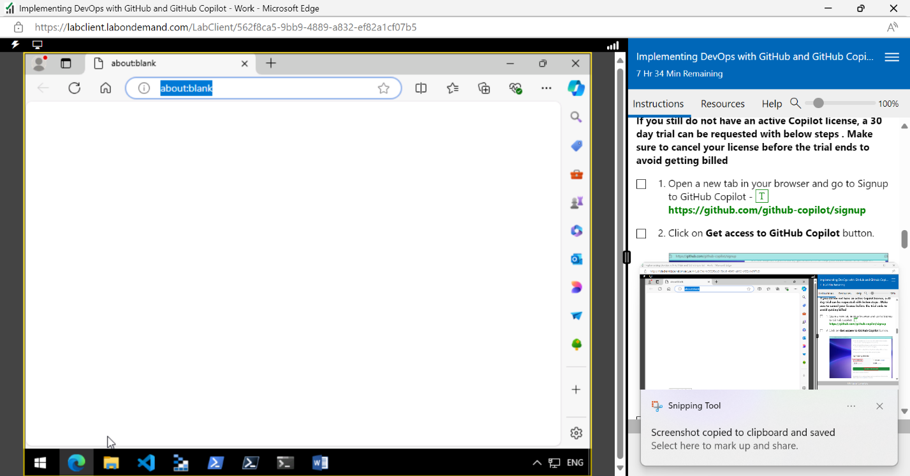

2.  브라우저 URL 필드에서 링크를 복사하여 붙여넣어 랩 VM에 소프트웨어
    패키지를 다운로드하세요.

<!-- -->

1.  Node.js and mvn 🡪
    <https://nodejs.org/dist/v20.16.0/node-v20.16.0-x64.msi>

2.  mocha (no download is required)

> **참고**: 기본적으로 패키지는 **downloads** 폴더에 저장 됩니다.
>
> 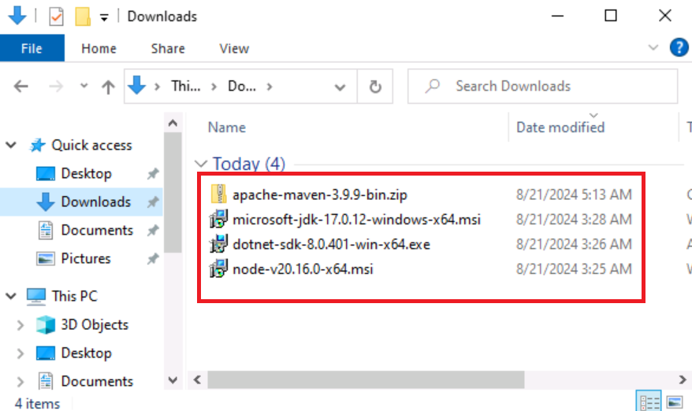

1.  **Install Node.js and mvn**

<!-- -->

1.  **Downloads** (**C:\Users\Admin\Downloads**) 폴더로 이동하고
    **node-v20.16.0-x64.msi**를 두번 클릭하세요.

> 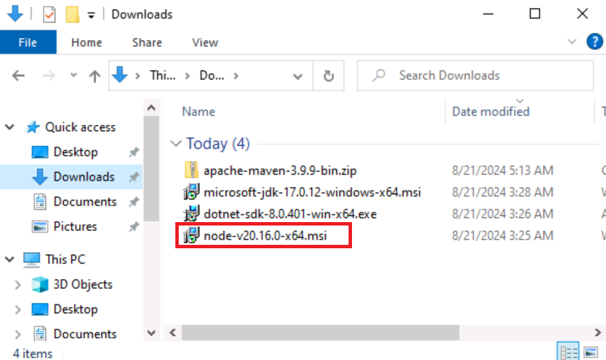

2.  “Node.js setup wizard” 창에서 **Next**를 클릭하세요.

> 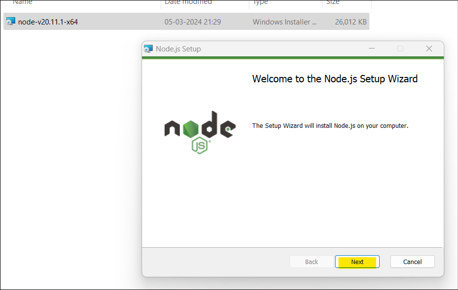

3.  **EULA**를 동의하고 **Next**를 클릭하세요.

> 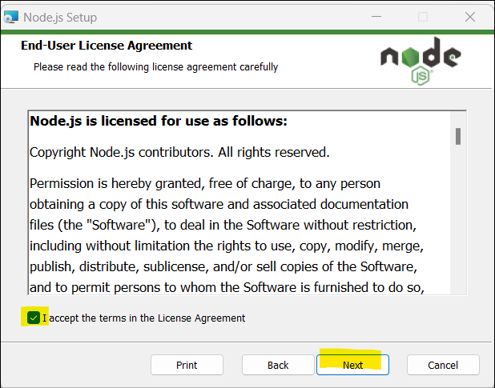

4.  기본 대상 폴더를 유지하고 **Next**를 클릭하세요.

> 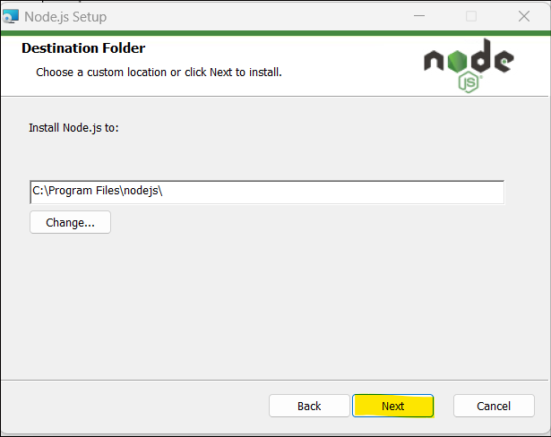

5.  **Add to the PATH**를 클릭하고 **Next**를 클릭하세요.

> 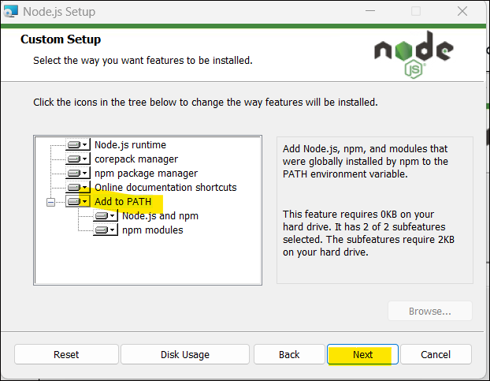

6.  **Tools for native Module** 창에서 **check box**를 선택하고 Next 를
    클릭하세요.

> 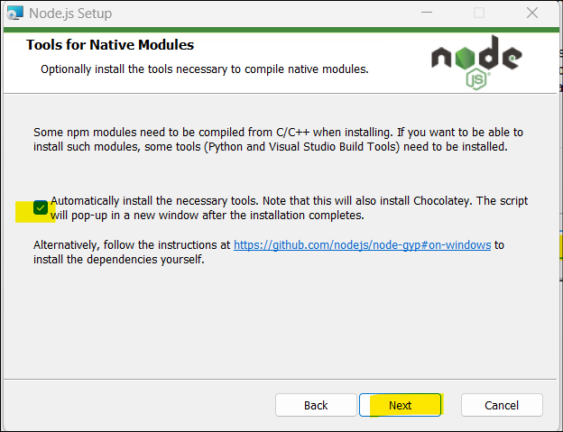

7.  **Install**을 클릭하세요.

> 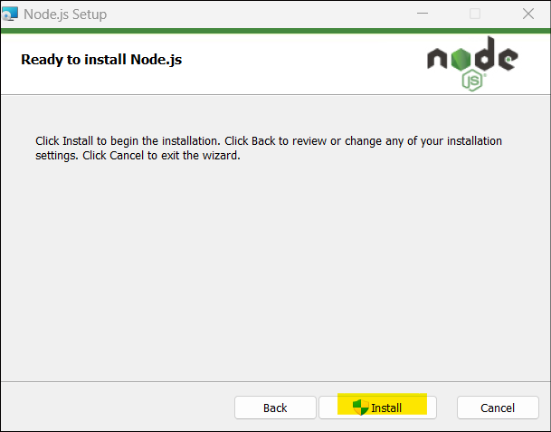
>
> 참고: **User Access Control** 팝업이 표시되면 **Yes를** 클릭하여
> 계속하세요**.**

8.  완료되면 **Finish** 를 클릭하세요.

> 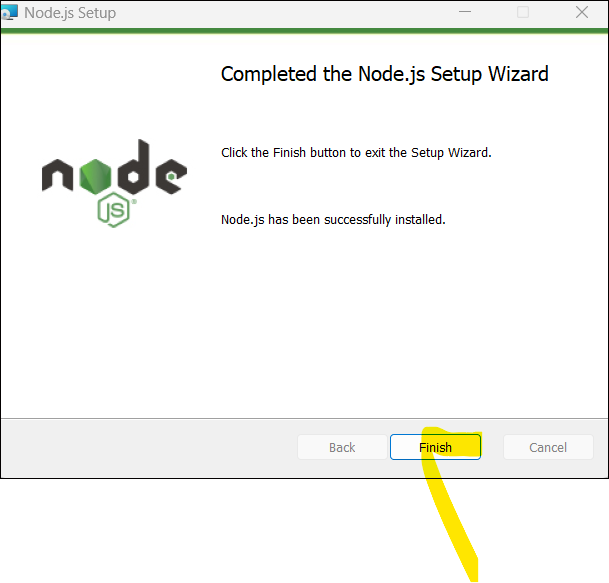

9.  **Cmd** 터미널이 열립니다. 계속하려면 아무 키나 누르세요.

> 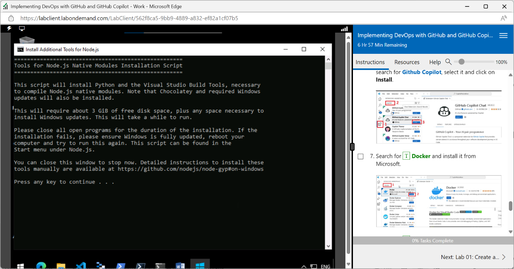
>
> 참고: 키를 누른 후 지연이 발생할 수 있습니다. 설치를 진행하려면 잠시
> 기다려 주세요.

10. 예를 클릭하여 UAC 창에서 계속하세요.

> 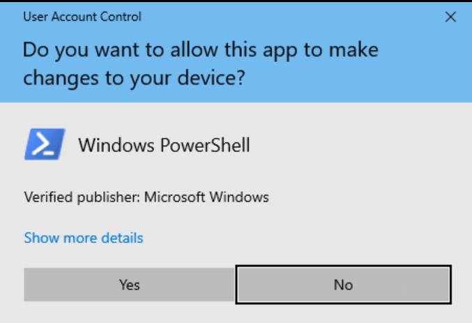

11. **Windows Powershell** 이 열리고 설치 세부 정보가 표시됩니다.

> 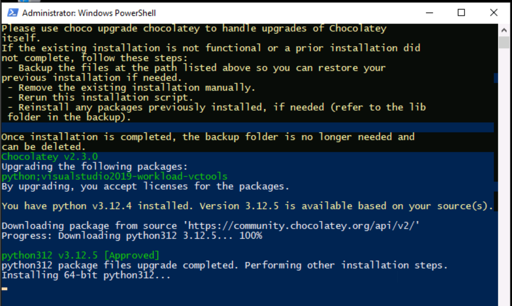

12. 설치가 완료되면 **Enter를 입력** 하여 PowerShell을 종료하세요.

> 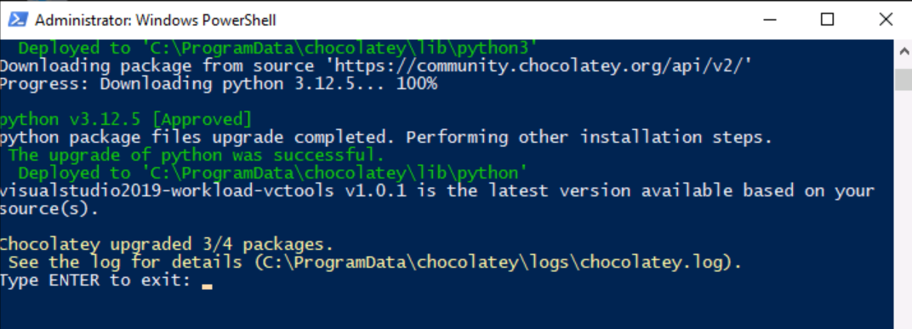

2.  **Install mocha**

<!-- -->

1.  command prompt를 여세요

> 

2.  먼저 다음 명령을 실행하세요.

> +++npm install --global mocha+++
>
> 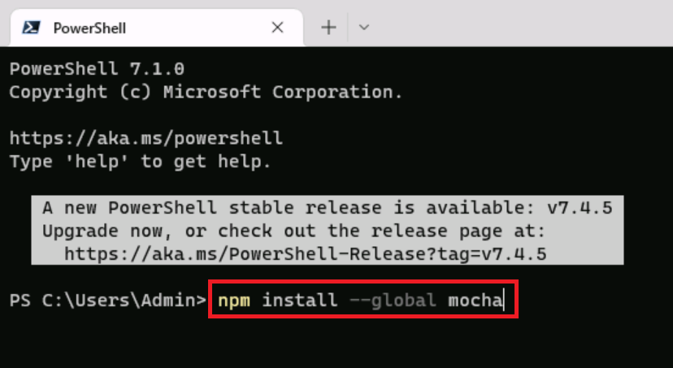
>
> 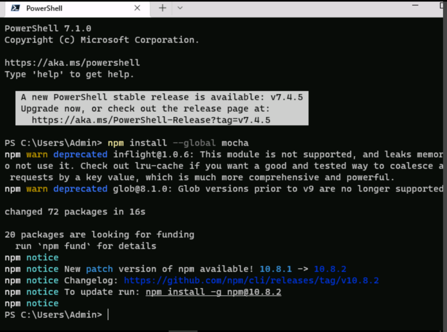

3.  다음으로 다음 명령을 실행하세요

> +++npm install axios+++
>
> 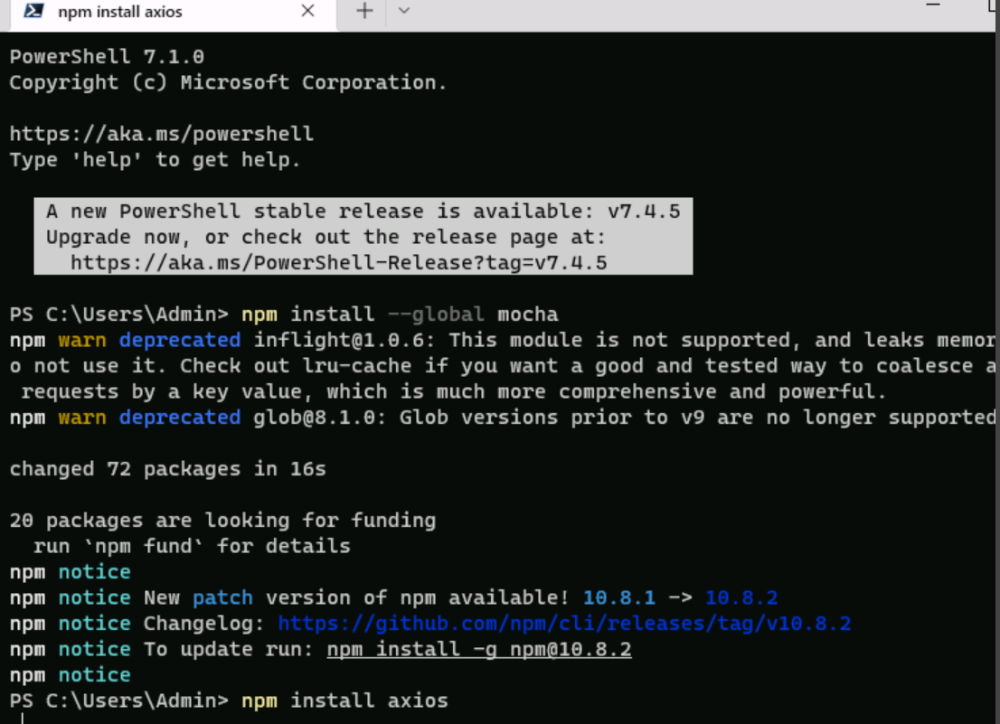
>
> 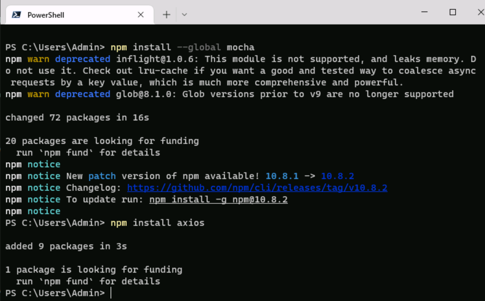
>
> 이제 **mocha** 설치가 완료되었습니다.터미널을 닫아 다른 패키지 설치를
> 진행하새요.

## **연습 1: 소개**

1.  Visual Studio에서 exercisefiles -\> node에서 **nodeserver.js**를
    여세요.

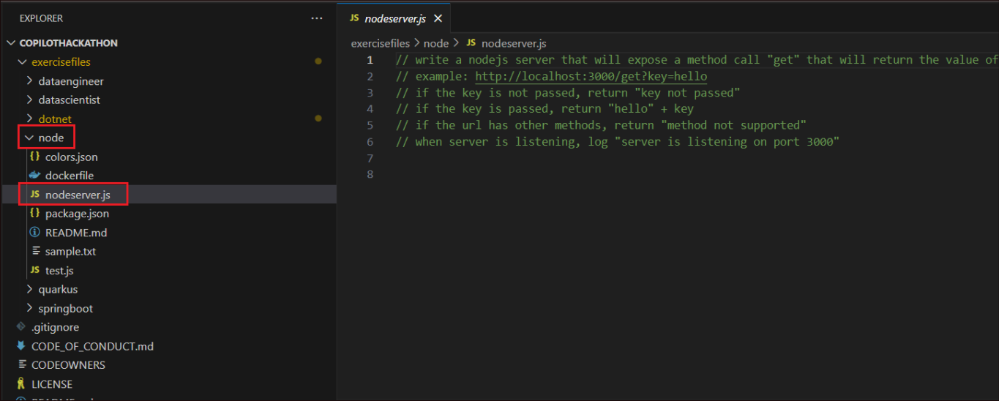

2.  노드에 대한 코딩을 시작해야 합니다.. 쿼리 문자열에 전달된 키의 값을
    반환하는 메서드 호출 "get"을 노출하는 js 서버입니다. Copilot을
    사용하여 이 작업을 도와드리겠습니다.

3.  **Ctrl+I**를 누르고 Copilot이 코드를 생성하도록 아래 명령을 붙여넣고
    **Send**를 누르세요.

**// write a nodejs server that will expose a method call "get" that
will return the value of the key passed in the query string**

**// example: http://localhost:3000/get?key=hello**

**// if the key is not passed, return "key not passed"**

**// if the key is passed, return "hello" + key**

**// if the url has other methods, return "method not supported"**

**// when server is listening, log "server is listening on port 3000"**

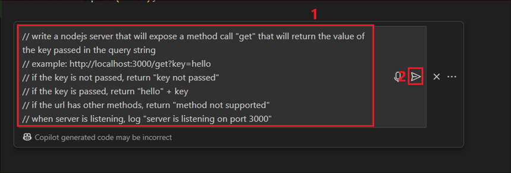

4.  Copilot이 코드를 생성하고 표시합니다. **Accept**을 클릭하여
    수락하세요.

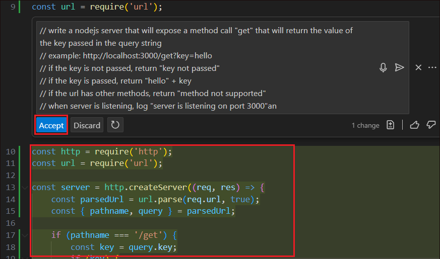

5.  Node 폴더를 마우스 오른쪽 버튼으로 클릭하고 **Open in Integrated
    Terminal**를 선택하세요.

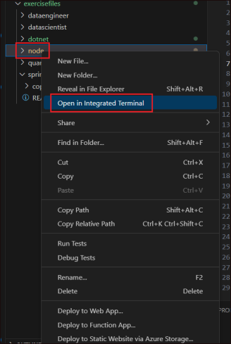

6.  터미널이 열리면 터미널에서 아래 명령을 실행하세요.

!!**mocha test.js**!!

7.  아래 스크린샷과 같이 **1 Passing**으로 결과를 얻어야 합니다.

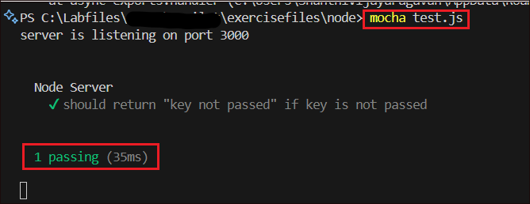

8.  이것은 nodeserver.js의 메서드에 대한 단위 테스트이며 통과했습니다.

9.  Copilot을 사용하여 서버에 다양한 방법을 계속 추가할 것입니다.

## **연습 2: 새로운 기능 구축하기**

이 연습은 다양한 기능의 요청을 제공하는 Nodejs를 사용하여 웹 서버를
구축하는 것으로 구성됩니다.

1.  서버가 참석해야 하는 **DaysBetweenDates** 기능 요청을 추가하세요.

2.  **if** 조건 – **pathname == '/get'**이 끝난 후 **Enter** 키를
    누르세요.

**참고: Enter** 키를 눌러야 하는 빨간색 강조 표시의 중괄호를 참조하세요.

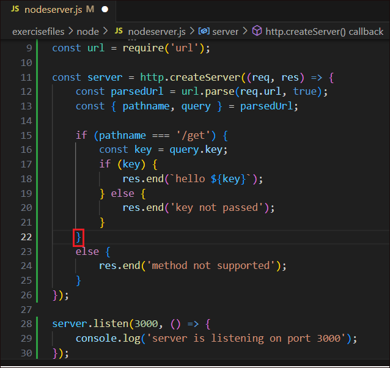

3.  **Ctrl+I**를 눌러 Copilot 인라인 기능을 열고 다음을 입력한 후
    **Send**를 클릭하세요.

> **/DaysBetweenDates:**
>
> **Calculate days between two dates**
>
> **receive by query string 2 parameters date1 and date 2, and calculate
> the days between those two dates.**

**Reference Code:**

if (req.url.startsWith('/DaysBetweenDates')) {

//calculate days between two dates

//get dates from querystring

var queryData = url.parse(req.url, true).query;

var date1 = queryData.date1;

var date2 = queryData.date2;

//convert dates to milliseconds

var date1_ms = Date.parse(date1);

var date2_ms = Date.parse(date2);

//calculate difference in milliseconds

var difference_ms = date2_ms - date1_ms;

//convert to days and return

res.end(Math.round(difference_ms / 86400000) + " days");

}

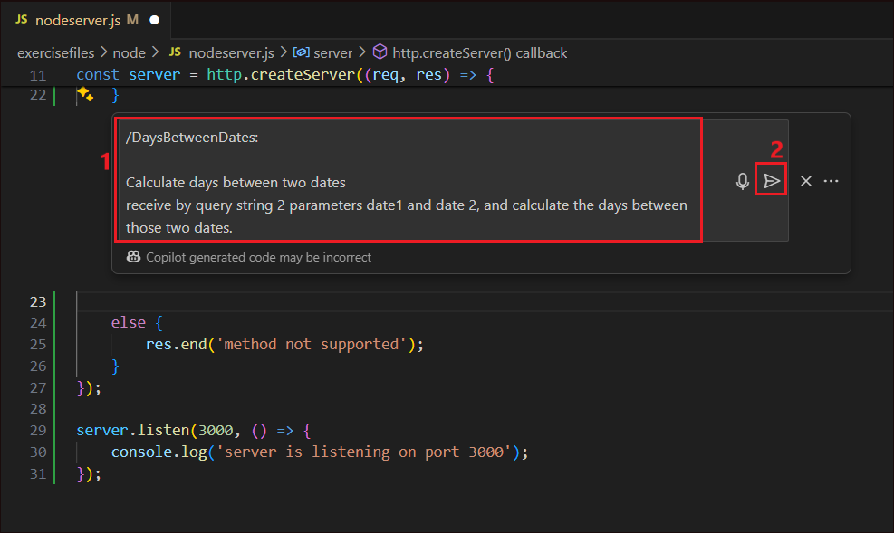

4.  Copilot이 코드를 생성합니다. **Accept**를 클릭하여 코드를
    수락하세요. 생성된 코드는 요청에서 **DaysBetweenDates**인 **else
    if** 블록입니다.

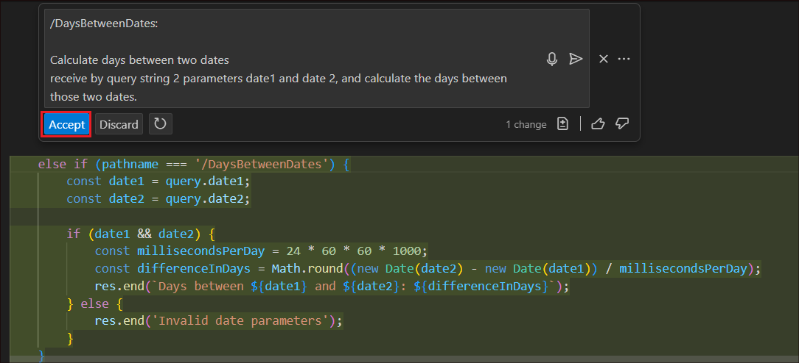

5.  **DaysBetweenDates** 블록 뒤에 **Enter**를 클릭하세요.

6.  아래 댓글 블록을 입력하고 **Enter** 키를 누르세요.

**/\***

**/Validatephonenumber:**

**Receive by querystring a parameter called phoneNumber**

**validate phoneNumber with proper Spanish format, for example
34666666666**

**if phoneNumber is valid return "valid"**

**if phoneNumber is not valid return "invalid"**

**\*/**

**Reference Code:**

else if (req.url.startsWith('/Validatephonenumber')) {

//get phoneNumber var from querystring

var queryData = url.parse(req.url, true).query;

var phoneNumber = queryData.phoneNumber;

//validate phoneNumber with Spanish format

var regex = /^(\\34\|0034\|34)?\[ -\]\*(6\|7)\[ -\]\*(\[0-9\]\[
-\]\*){8}\$/;

//if phoneNumber is valid return "valid"

if (regex.test(phoneNumber)) {

res.end("valid");

}

//if phoneNumber is not valid return "invalid"

else {

res.end("invalid");

}

}

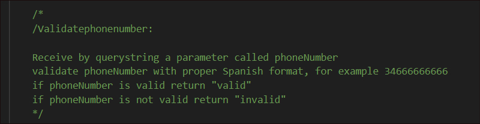

7.  Copilot이 코드를 생성합니다. **Accept**를 클릭하여 코드를
    수락하세요.

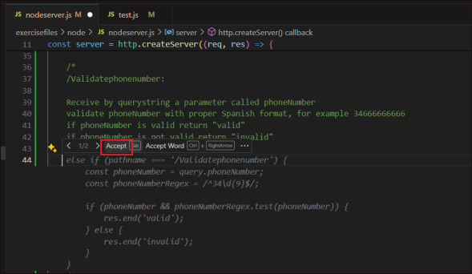

8.  **Validatephonenumber** 블록 뒤에 **Enter**를 클릭하여 다음 코드
    블록을 추가하세요.

9.  아래 텍스트를 복사하여 js 파일에 붙여넣으세요.

> **/\***
>
> **/ValidateSpanishDNI:**
>
> **Receive by querystring a parameter called dni**
>
> **calculate DNI letter**
>
> **if DNI is valid return "valid"**
>
> **if DNI is not valid return "invalid"**
>
> **\*/**
>
> **Reference Code:**
>
> else if (req.url.startsWith('/ValidateSpanishDNI')) {
>
> var queryData = url.parse(req.url, true).query;
>
> var dni = queryData.dni;
>
> // calculate DNI letter
>
> var dniLetter = dni.charAt(dni.length - 1);
>
> var dniNumber = dni.substring(0, dni.length - 1);
>
> var dniLetterCalc = "TRWAGMYFPDXBNJZSQVHLCKE".charAt(dniNumber % 23);
>
> //if DNI is valid return "valid"
>
> if (dniLetter == dniLetterCalc) {
>
> res.end("valid");
>
> }
>
> //if DNI is not valid return "invalid"
>
> else {
>
> res.end("invalid");
>
> }
>
> }
>
> 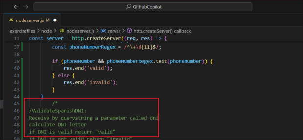

10. 위의 내용이 붙여넣기되면 Copilot은 주석 바로 아래에 표시되는 코드를
    생성합니다. **Accept**를 클릭하여 코드를 수락하세요.

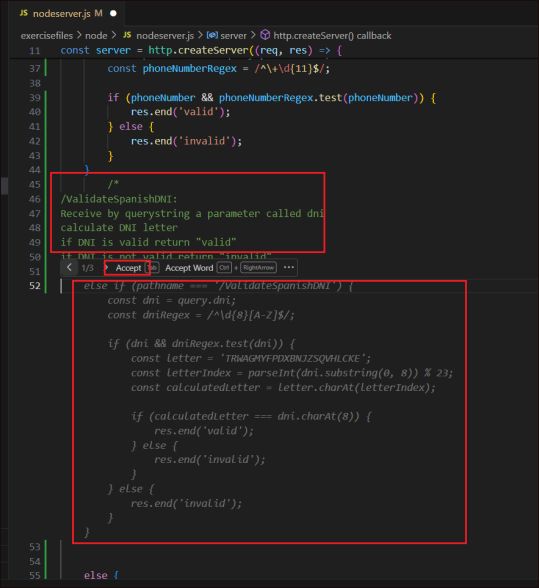

11. 왼쪽 탐색 창에서 Copilot 채팅을 여세요.

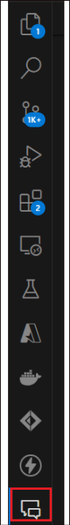

12. 아래 내용을 채팅에 붙여넣고 **Send** 버튼을 클릭하세요.

> **/ReturnColorCode:**
>
> **Receive by querystring a parameter called color**
>
> **read colors.json file and return the rgba field**
>
> **get color var from querystring**
>
> **iterate for each color in colors.json to find the color**
>
> **return the code.hex field**
>
> **Reference code:**

else if (req.url.startsWith('/ReturnColorCode')) {

//read colors.json file and return the rgba field

var colors = fs.readFileSync('colors.json', 'utf-8');

var colorsObj = JSON.parse(colors);

//get color var from querystring

var queryData = url.parse(req.url, true).query;

var color = queryData.color;

var colorFound = "not found";

//for each color in colors.json

for (var i = 1; i \< colorsObj.length; i++) {

//if color is found return the color code

if (colorsObj\[i\].color == color) {

colorFound = colorsObj\[i\].code.hex;

}

}

res.end(colorFound);

}

> **참고:** Copilot은 기본적으로 제안을 생성하기 위해 열려 있는 파일을
> 컨텍스트로 사용합니다.

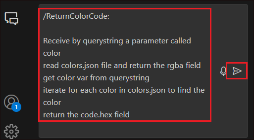

13. **ValidateSpanishDNI** 블록 뒤에 커서를 놓고 채팅에서 커서에 삽입
    아이콘을 클릭하세요. 이렇게 하면 Copilot이 생성한 코드가 채팅에서
    언급된 위치의 서버 js 파일로 **복사됩니다**.

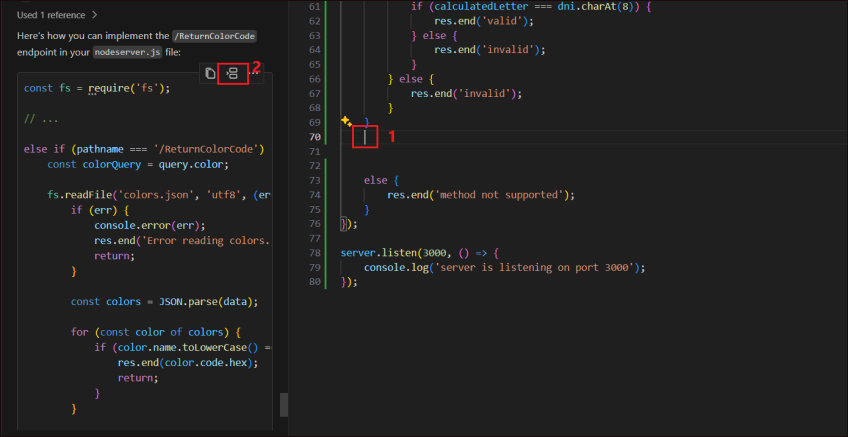

14. 오류가 있는 경우 확인하세요. 이 생성된 코드에서는 else if 블록
    사이에 상수 선언이 있기 때문에 오류가 있습니다.

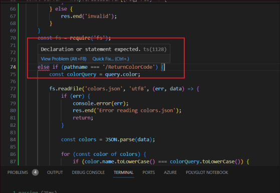

15. **Ctrl+I**를 눌러 Copilot Inline을 열고 !!**/fix**!!를 입력하고
    **Send** 버튼을 클릭하세요.

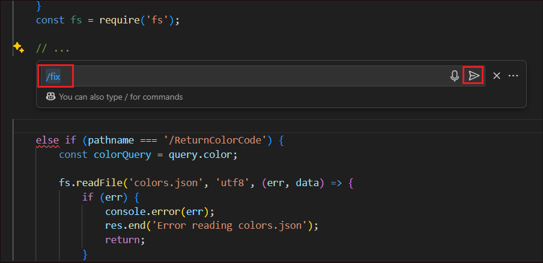

16. Copilot은 솔루션을 찾을 수 있는 경우 솔루션을 생성합니다. 솔루션의
    정확성에 따라 솔루션을 수락하거나 폐기하세요.

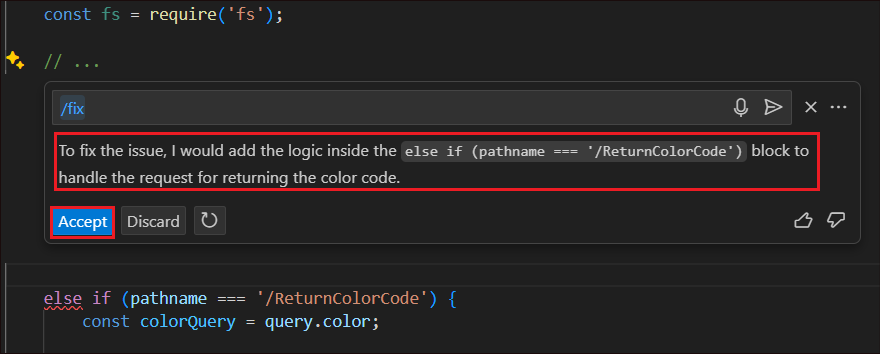

17. 여기서는 오류를 해결하기 위해 returncolors의 else if 블록 내부로
    상수 선언을 이동하고 있습니다.

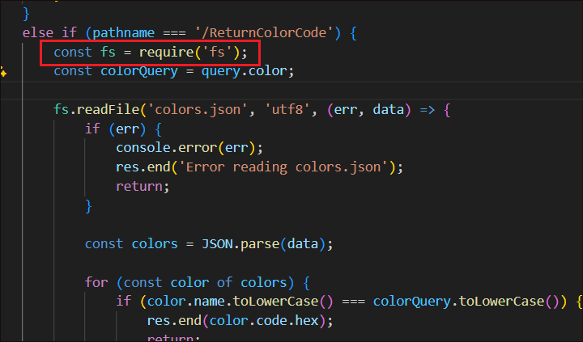

**중요:** 코드와 해상도는 Copilot이 생성하는 코드와 해상도에 따라 다를
수 있습니다.

18. 블록을 추가한 후 **Ctrl+I**를 눌러 Copilot 인라인 기능을 열고 아래
    내용을 붙여넣은 후 **Send**를 클릭하세요.

**/TellMeAJoke:**

**Make a call to the joke api and return a random joke using axios
(<https://official-joke-api.appspot.com/random_joke>)**

Reference code:

else if (req.url.startsWith('/TellMeAJoke')) {

//make a call to the joke api and return a random joke using axios

const axios = require('axios');

axios.get('https://official-joke-api.appspot.com/random_joke')

.then(function (response) {

// handle success

res.end(response.data.setup + " " + response.data.punchline);

}

)

.catch(function (error) {

// handle error

console.log(error);

})

.then(function () {

// always executed

});

}

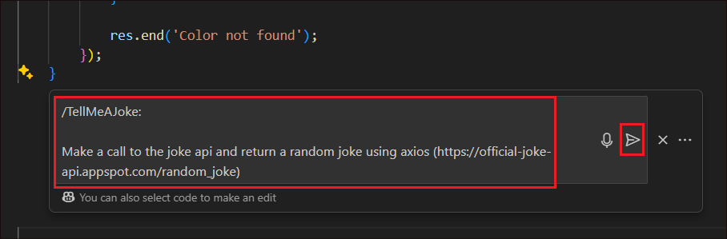

19. **Accept**을 클릭하여 Copilot에서 생성된 코드를 수락하세요.

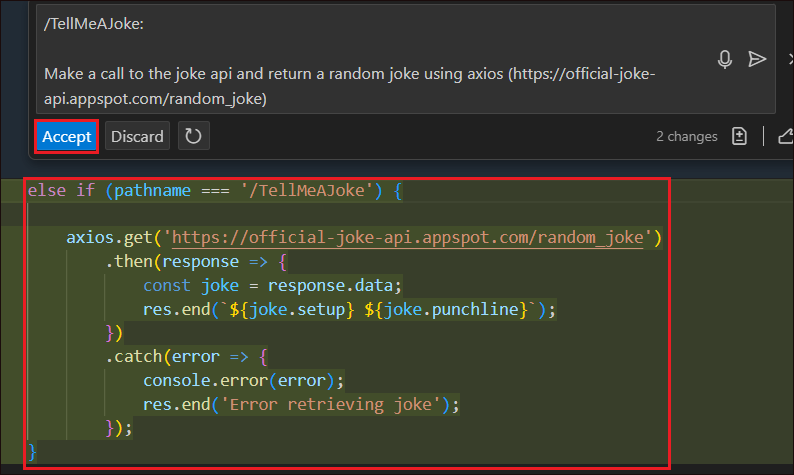

20. 생성된 코드 블록 후 **Ctrl+I**를 누르고 아래 텍스트를 입력한 후
    **Send**버튼을 클릭하세요.

**/MoviesByDirector:**

**Receive by querystring a parameter called director**

**Make a call to the movie api and return a list of movies of that
director using axios**

**Return the full list of movies**

**Reference code:**

//method that gets the name of a director and retrieves from an api the
list of movies of that director

else if (req.url.startsWith('/MoviesByDirector')) {

//get a director name from querystring

var queryData = url.parse(req.url, true).query;

var director = queryData.director;

//make a call to the movie api omdbapi.com and return a list of movies
of that director using axios

const axios = require('axios');

axios.get('http://www.omdbapi.com/?apikey=XXXXXXX&s=' + director)

.then(function (response) {

//return the full list of movies

var movies = "";

for (var i = 0; i \< response.data.Search.length; i++) {

movies = movies + response.data.Search\[i\].Title + ", ";

}

res.end(movies);

}

)

.catch(function (error) {

// handle error

console.log(error);

}

)

.then(function () {

// always executed

}

);

}

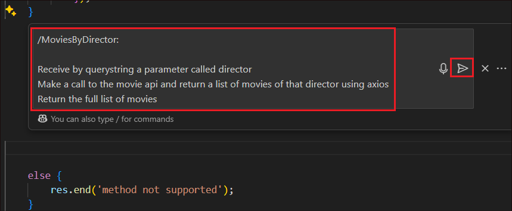

21. **Accept**을 클릭하여 코드를 수락하세요.

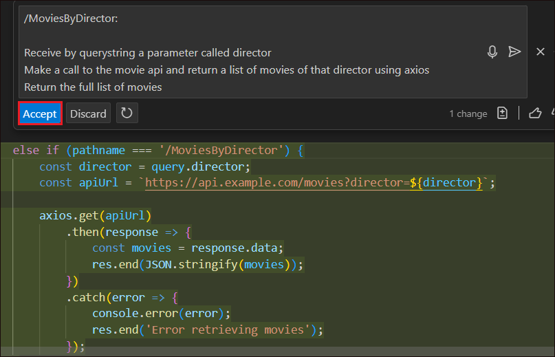

22. 생성된 코드 블록 후 **Ctrl+I**를 누르고 아래 텍스트를 입력한 후
    **Send** 버튼을 클릭하세요.

**/ParseUrl:**

**Retrieves a parameter from querystring called someurl**

**Parse the url and return the protocol, host, port, path, querystring
and hash**

**Return the parsed host**

**Reference code:**

> //If url equals to ParseUrl
>
> else if (req.url.startsWith('/ParseUrl')) {
>
> //retrieves a parameter from querystring called someurl
>
> var queryData = url.parse(req.url, true).query;
>
> var someUrl = queryData.someurl;
>
> //parse the url and return the protocol, host, port, path, querystring
> and hash
>
> var urlObj = new URL(someUrl);
>
> var protocol = urlObj.protocol;
>
> var host = urlObj.host;
>
> var port = urlObj.port;
>
> var path = urlObj.pathname;
>
> var querystring = urlObj.search;
>
> var hash = urlObj.hash;
>
> //return the parsed host
>
> res.end("host: " + host);
>
> }

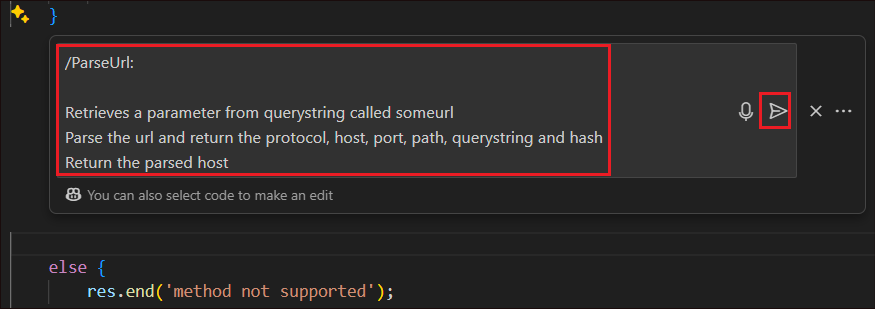

23. **Accept**를 클릭하여 코드를 수락하세요.

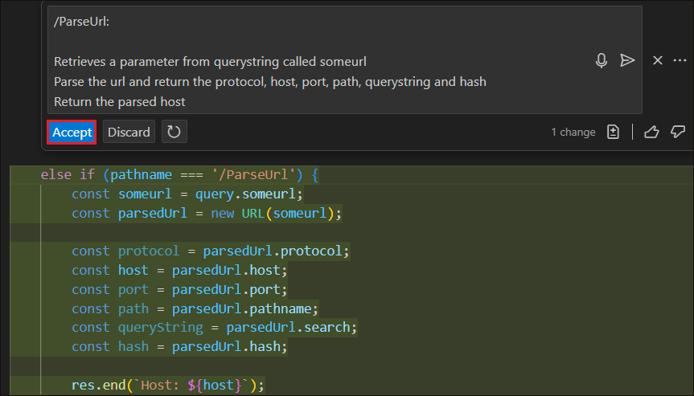

24. 생성된 코드 블록 후 **Ctrl+I**를 누르고 아래 텍스트를 입력한 후
    **Send**버튼을 클릭하세요.

**/GetFullTextFile:**

**Read \`sample.txt\`\` and return lines that contains the word
"Fusce"**

**Reference code:**

else if (req.url.startsWith('/GetFullTextFile')) {

//read sample.txt and return lines that contains the word "Fusce"

var text = fs.readFileSync('sample.txt', 'utf-8');

var lines = text.split("\r");

var linesFound = "";

for (var i = 1; i \< lines.length; i++) {

if (lines\[i\].includes("Fusce")) {

linesFound = linesFound + lines\[i\] + ", ";

}

}

res.end(linesFound);

}

**참고:** 이 구현은 일반적으로 파일을 분석하기 전에 파일의 전체 내용을
읽기 때문에 메모리 사용량이 높고 파일이 너무 크면 실패할 수 있으므로
주의하세요.

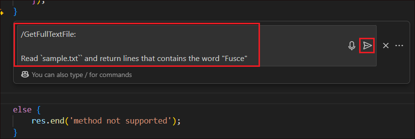

25. **Accept**를 클릭하여 코드를 수락하세요.

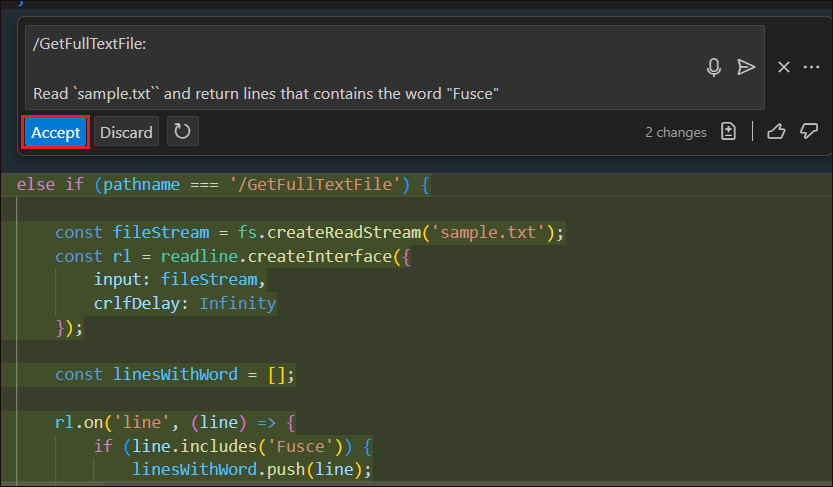

26. 생성된 코드 블록 후 **Ctrl+I**를 누르고 아래 텍스트를 입력한 후
    **Send**버튼을 클릭하세요.

**/GetLineByLinefromtTextFile:**

**Read sample.txt line by line**

**Create a promise to read the file line by line, and return a list of
lines that contains the word "Fusce"**

**Return the list of lines**

**Reference code:**

else if (req.url.startsWith('/GetLineByLinefromtTextFile')) {

//read sample.txt line by line

var lineReader = require('readline').createInterface({

input: require('fs').createReadStream('sample.txt')

});

//create a promise to read the file line by line, and return a list of
lines that contains the word "Fusce"

var promise = new Promise(function (resolve, reject) {

var lines = \[\];

lineReader.on('line', function (line) {

if (line.includes("Fusce")) {

lines.push(line);

}

});

lineReader.on('close', function () {

resolve(lines);

});

});

//return the list of lines

promise.then(function (lines) {

res.end(lines.toString());

});

}

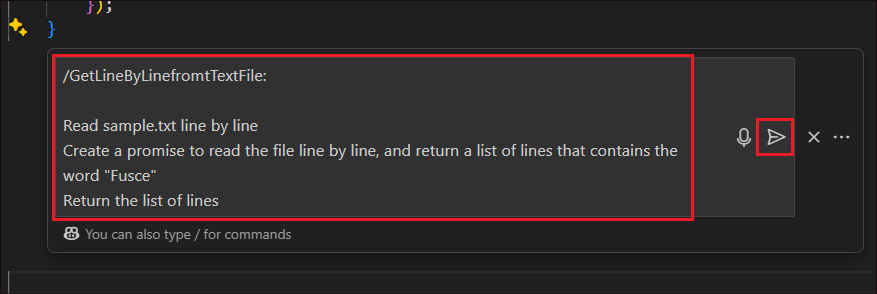

27. **Accept**을 클릭하여 코드를 수락하세요.

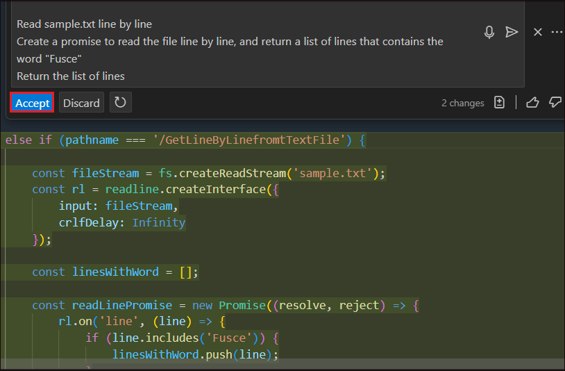

28. 생성된 코드 블록 후 **Ctrl+I**를 누르고 아래 텍스트를 입력한 후
    **Send**버튼을 클릭하세요.

**/CalculateMemoryConsumption:**

**Return the memory consumption of the process in GB, rounded to 2
decimals**

**Reference code:**

else if (req.url.startsWith('/CalculateMemoryConsumption')) {

//return the memory consumption of the process in GB, rounded to 2
decimals

var memory = process.memoryUsage().heapUsed / 1024 / 1024;

res.end(memory.toFixed(2) + " GB");

}

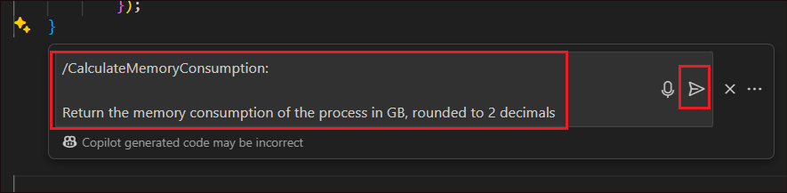

29. Accept를 클릭하여 코드를 수락하세요.

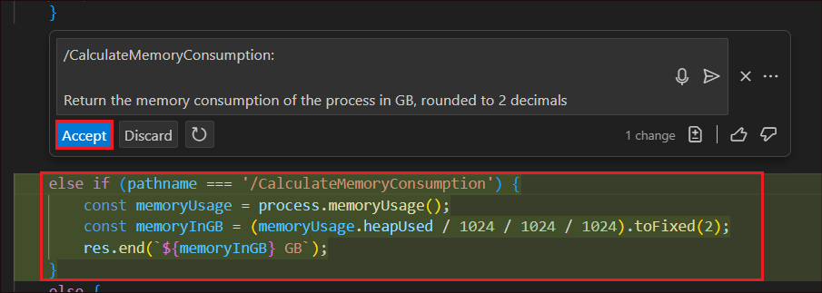

30. 생성된 코드 블록 후 **Ctrl+I**를 누르고 아래 텍스트를 입력한 후
    **Send** 버튼을 클릭하세요.

**/RandomEuropeanCountry:**

**Make an array of european countries and its iso codes**

**Return a random country from the array**

**Return the country and its iso code**

**Reference code:**

else if (req.url.startsWith('/RandomEuropeanCountry')) {

//make an array of european countries and its iso codes

var countries = \[

{ country: "Italy", iso: "IT" },

{ country: "France", iso: "FR" },

{ country: "Spain", iso: "ES" },

{ country: "Germany", iso: "DE" },

{ country: "United Kingdom", iso: "GB" },

{ country: "Greece", iso: "GR" },

{ country: "Portugal", iso: "PT" },

{ country: "Romania", iso: "RO" },

{ country: "Bulgaria", iso: "BG" },

{ country: "Croatia", iso: "HR" },

{ country: "Czech Republic", iso: "CZ" },

{ country: "Denmark", iso: "DK" },

{ country: "Estonia", iso: "EE" },

{ country: "Finland", iso: "FI" },

{ country: "Hungary", iso: "HU" },

{ country: "Ireland", iso: "IE" },

{ country: "Latvia", iso: "LV" },

{ country: "Lithuania", iso: "LT" },

{ country: "Luxembourg", iso: "LU" },

{ country: "Malta", iso: "MT" },

{ country: "Netherlands", iso: "NL" },

{ country: "Poland", iso: "PL" },

{ country: "Slovakia", iso: "SK" },

{ country: "Slovenia", iso: "SI" },

{ country: "Sweden", iso: "SE" },

{ country: "Belgium", iso: "BE" },

{ country: "Austria", iso: "AT" },

{ country: "Switzerland", iso: "CH" },

{ country: "Cyprus", iso: "CY" },

{ country: "Iceland", iso: "IS" },

{ country: "Norway", iso: "NO" },

{ country: "Albania", iso: "AL" },

{ country: "Andorra", iso: "AD" },

{ country: "Armenia", iso: "AM" },

{ country: "Azerbaijan", iso: "AZ" },

{ country: "Belarus", iso: "BY" },

{ country: "Bosnia and Herzegovina", iso: "BA" },

{ country: "Georgia", iso: "GE" },

{ country: "Kazakhstan", iso: "KZ" },

{ country: "Kosovo", iso: "XK" },

{ country: "Liechtenstein", iso: "LI" },

{ country: "Macedonia", iso: "MK" },

{ country: "Moldova", iso: "MD" },

{ country: "Monaco", iso: "MC" },

{ country: "Montenegro", iso: "ME" },

{ country: "Russia", iso: "RU" },

{ country: "San Marino", iso: "SM" },

{ country: "Serbia", iso: "RS" },

{ country: "Turkey", iso: "TR" },

{ country: "Ukraine", iso: "UA" },

{ country: "Vatican City", iso: "VA" }

\];

//return a random country from the array

var randomCountry = countries\[Math.floor(Math.random() \*
countries.length)\];

//return the country and its iso code

res.end(randomCountry.country + " " + randomCountry.iso);

}

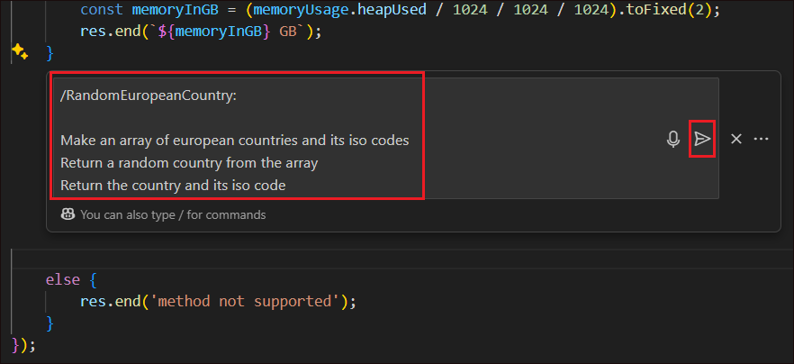

31. **Accept**를 클릭하여 코드를 수락하세요.

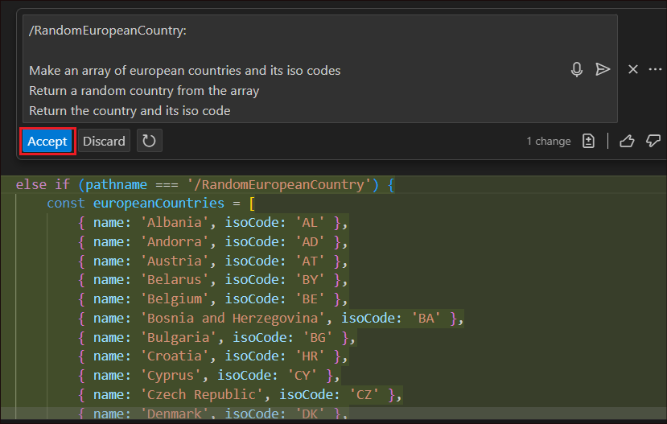

## **연습 3: 코드 문서화**

코드를 문서화하는 것은 항상 지루하고 고통스러운 작업입니다. 그러나
Copilot을 사용하여 문서화할 수 있습니다. 채팅에서 Copilot에게
nodeserver.js 파일을 문서화하도록 요청하세요.

1.  **nodeserver.js** 파일에서 **모두 선택하세요.**

2.  Copilot chat에서 !!**document the nodeserver.js file**!!를 입력하고
    Send를 클릭하세요.

3.  Copilot은 파일에 대한 자세한 문서를 생성합니다.

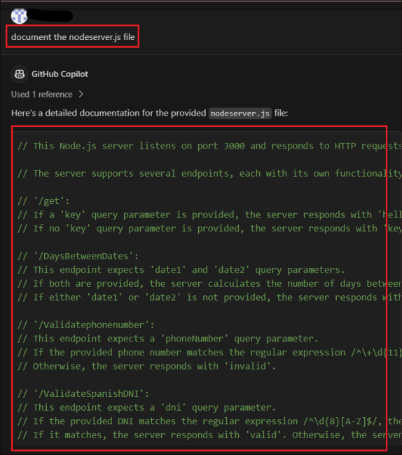

## **연습 4: 테스트 구축**

이전 엔드포인트의 기능이 올바르게 구현되었는지 확인하기 위해 자동화된
테스트를 생성합니다. 테스트는 test.js 파일에 함께 있어야 합니다.

Copilot을 활용하여 테스트를 실행할 수 있습니다. Copilot Chat에서 직접
실행하거나 테스트를 생성하려는 코드 조각을 선택하고 Copilot 인라인
기능을 사용하여 실행할 수 있는 /tests 명령이 있습니다.

1.  test.js 파일 여세요.

2.  기존 **it** 블록 뒤에 **Enter** 를 클릭하세요.

3.  아래 텍스트를 입력하고 **Enter**를 클릭하세요.

**//add test to test DaysBetweenDates**

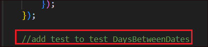

4.  이렇게 하면 **DaysBetweenDates**에 대한 단위 테스트 블록이
    생성됩니다. **Accept**를 클릭하여 코드를 수락하세요.

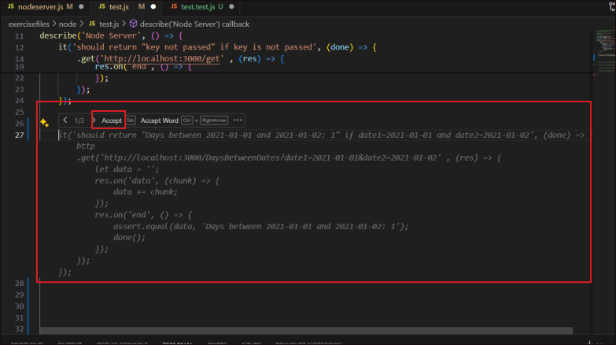

5.  터미널에서 아래 명령을 실행하세요. !!**mocha test.js**!!

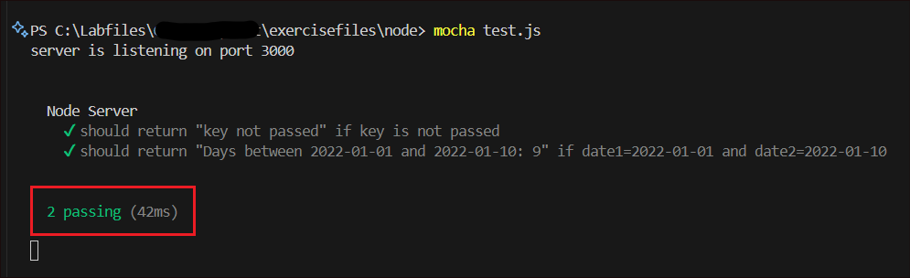

6.  아래 텍스트를 입력하세요 **//add test to check
    validatephoneNumber.** **Enter**를 클릭하세요.

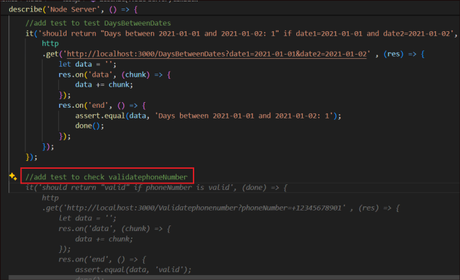

7.  **Accept**를 클릭하여 Copilot에서 생성된 코드를 수락하세요.

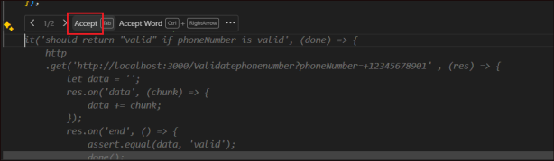

8.  터미널에서 명령을 실행하세요, !!**mocha test.js**!!. 유효성 검사
    전화 번호가 통과했는지 확인하세요.

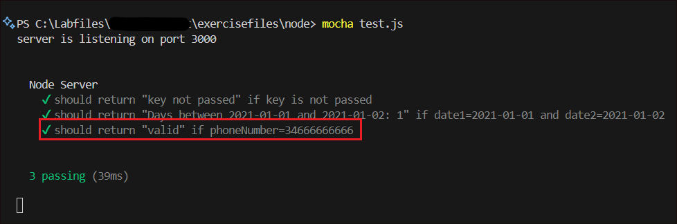

9.  다음 텍스트를 입력하고 **Enter**를 클릭하세요.

!!**//write test to validate validateSpanishDNI**!!

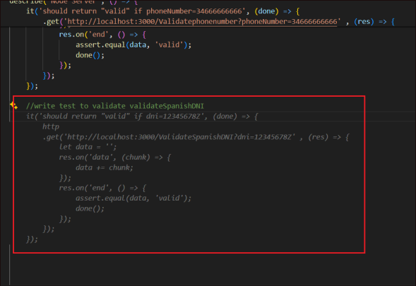

10. Copilot에서 생성된 텍스트 수락하세요.

11. 터미널에서 !!**mocha test.js**!!를 실행하고 ValidateSpanishDNI가
    통과했는지 확인하세요.

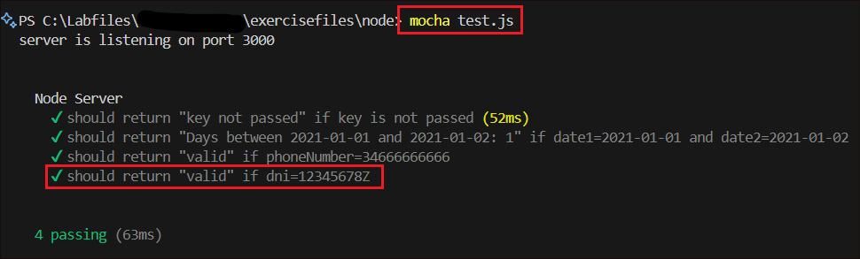

**Reference Code:**

//write npm command line to install mocha

//npm install --global mocha

//command to run this test file

//mocha test.js

const assert = require('assert');

const http = require('http');

const server = require('./nodeserver');

describe('Node Server', () =\> {

it('should return "key not passed" if key is not passed', (done) =\> {

http

.get('http://localhost:3000/Get' , (res) =\> {

let data = '';

res.on('data', (chunk) =\> {

data += chunk;

});

res.on('end', () =\> {

assert.equal(data, 'key not passed');

done();

});

});

});

it('should return the value of the key if key is found', (done) =\> {

http.get('http://localhost:3000/Get?key=world', (res) =\> {

let data = '';

res.on('data', (chunk) =\> {

data += chunk;

});

res.on('end', () =\> {

assert.equal(data, 'hello world');

done();

});

});

});

//add test to check validatephoneNumber

it('should return "valid" if phoneNumber is valid', (done) =\> {

http.get('http://localhost:3000/Validatephonenumber?phoneNumber=34666666666',
(res) =\> {

let data = '';

res.on('data', (chunk) =\> {

data += chunk;

});

res.on('end', () =\> {

assert.equal(data, 'valid');

done();

});

});

});

//write test to validate spanish DNI

it('should return "valid" if spanish DNI 86471508H is valid', (done) =\>
{

http.get('http://localhost:3000/ValidateSpanishDNI?dni=86471508H', (res)
=\> {

let data = '';

res.on('data', (chunk) =\> {

data += chunk;

});

res.on('end', () =\> {

assert.equal(data, 'valid');

done();

});

});

});

//write test to validate spanish DNI

it('should return "valid" if spanish DNI 24153149K is valid', (done) =\>
{

http.get('http://localhost:3000/ValidateSpanishDNI?dni=24153149K', (res)
=\> {

let data = '';

res.on('data', (chunk) =\> {

data += chunk;

});

res.on('end', () =\> {

assert.equal(data, 'valid');

done();

});

});

});

//write test to validate spanish DNI

it('should return "valid" if spanish DNI 12345678A is invalid', (done)
=\> {

http.get('http://localhost:3000/ValidateSpanishDNI?dni=12345678A', (res)
=\> {

let data = '';

res.on('data', (chunk) =\> {

data += chunk;

});

res.on('end', () =\> {

assert.equal(data, 'invalid');

done();

});

});

});

//write test for returnColorCode

it('should return "red" if color is red', (done) =\> {

http.get('http://localhost:3000/ReturnColorCode?color=red', (res) =\> {

let data = '';

res.on('data', (chunk) =\> {

data += chunk;

});

res.on('end', () =\> {

assert.equal(data, '#FF0000');

done();

});

});

});

//write test for daysBetweenDates

it('should return "1" if dates are 2020-01-01 and 2020-01-02', (done)
=\> {

http.get('http://localhost:3000/DaysBetweenDates?date1=2020-01-01&date2=2020-01-02',
(res) =\> {

let data = '';

res.on('data', (chunk) =\> {

data += chunk;

});

res.on('end', () =\> {

assert.equal(data, '1 days');

done();

});

});

});

});

## **연습 5: Dockerfile를 생성하기**

1.  **node** 폴더에서 **dockerfile**를 여세요.

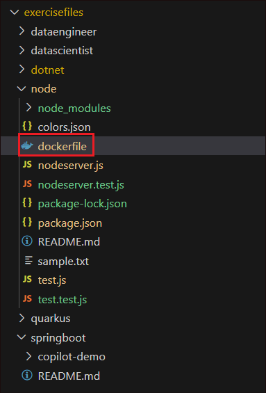

2.  파일은 어떻게 채워야 하는지에 대한 주석으로 구성됩니다.

3.  **Ctrl+I**를 누르고 !!**/fix**!!를 입력하세요. **Send** 아이콘을
    클릭하세요.

4.  Copilot은 Docker 파일 콘텐츠를 생성합니다. **Accept**를 클릭하세요.

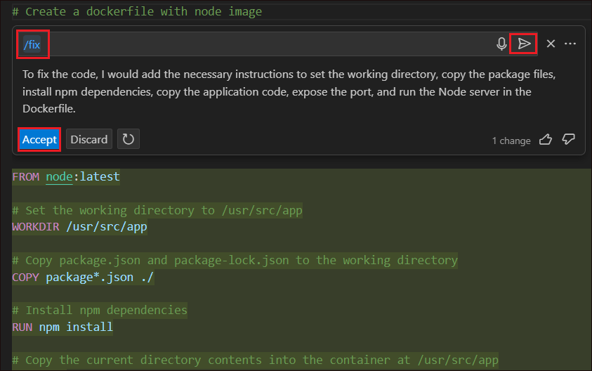

5.  터미널에서 아래 명령을 실행하세요.

!!**docker build -t mynodeapp .**!!

이는 이미지를 빌드하고 mynodeapp으로 태그를 지정하기 위한 것입니다.

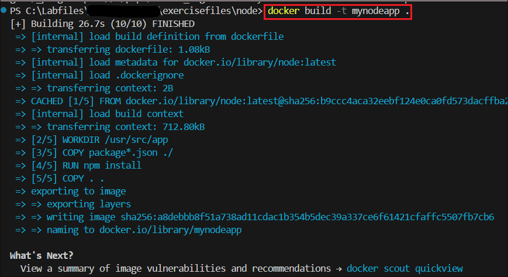

6.  아래 명령을 사용하여 포트 **4000**에서 도커를 실행하세요.

!!**docker run -p 4000:3000 -d mynodeapp**!!

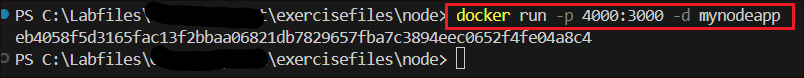

7.  Docker 데몬을 열어 애플리케이션이 컨테이너화되어 실행되고 있는지
    확인하세요.

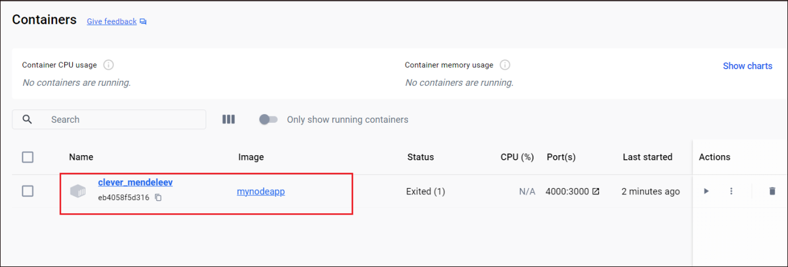

**요약:**

이 랩에서는 노드 프로젝트에서 Copilot을 사용하는 방법을 배웠습니다
