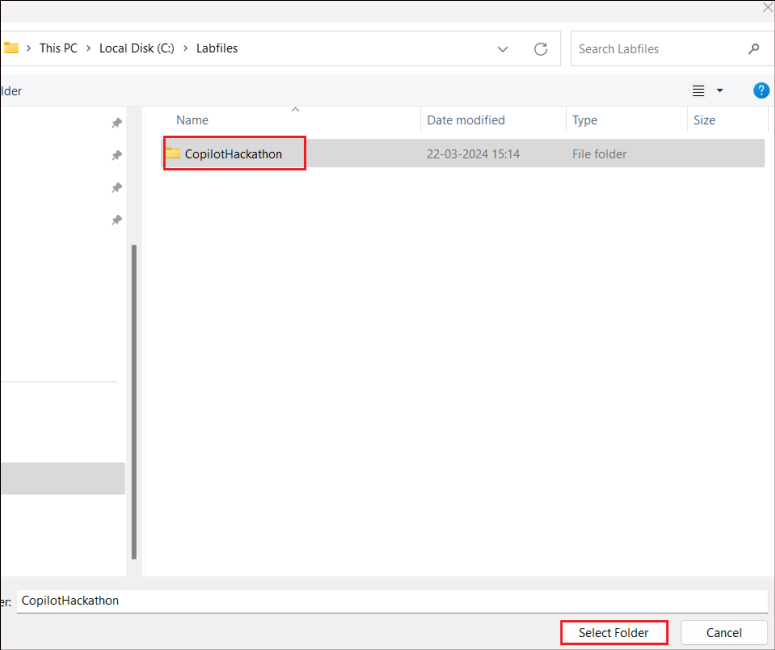
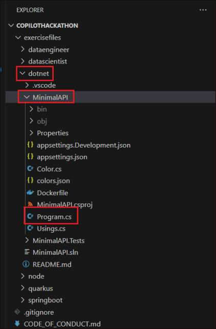
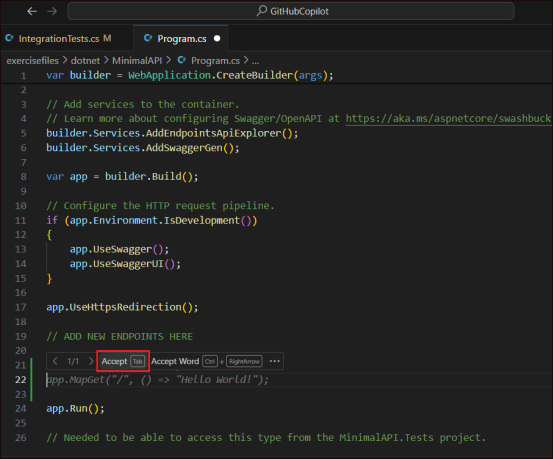
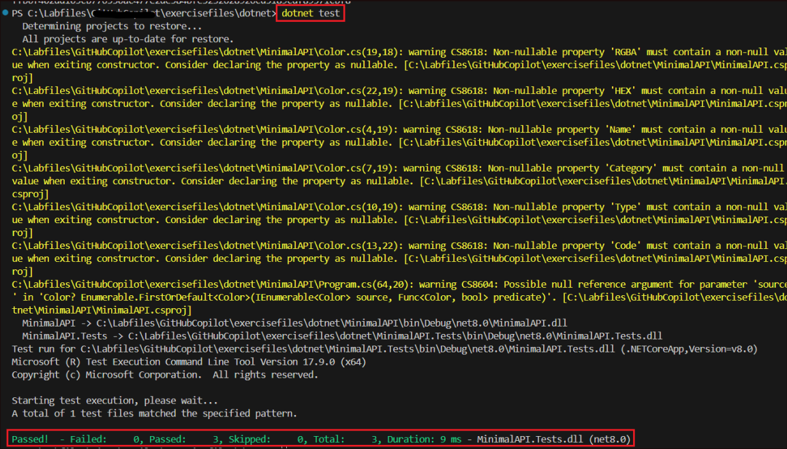
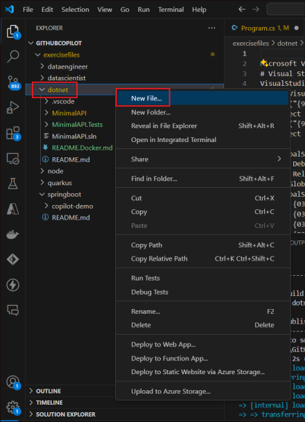
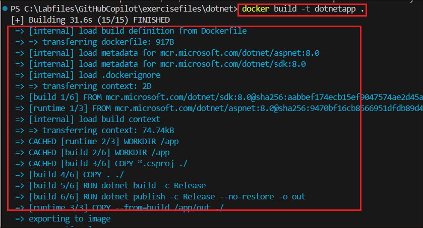
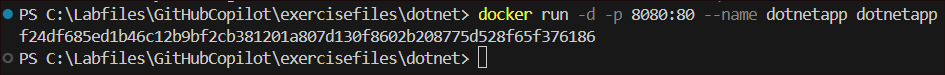

**Laboratório 21 - Crie uma WebAPI mínima usando .NET e uma imagem
Docker correspondente com o GitHub Copilot**

**Objetivo:**

O objetivo é criar uma WebAPI mínima usando o .NET 7.0 e uma imagem
Docker correspondente com a ajuda do GitHub Copilot. Aqui, usamos o
GitHub Copilot tanto quanto possível.

Experimente diferentes opções e veja o que o GitHub Copilot pode fazer
por você, como gerar um Dockerfile ou uma classe, adicionar comentários
etc.

Antes de executar este laboratório, vamos primeiro instalar os pacotes
de software necessários e configurar o ambiente.

Exercício 0: instalar e configurar o ambiente

Você precisa baixar e instalar os seguintes pacotes de software para
configurar o ambiente para executar este laboratório.

• dotnet-sdk-8.0

1.  Abra o navegador Edge.

2.  No campo URL do navegador, copie e cole o link para baixar o pacote
    de software para sua VM de laboratório.

dotnet-sdk-8.0
◊ https://dotnet.microsoft.com/en-us/download/dotnet/thank-you/sdk-8.0.401-windows-x64-installer

**Observação:** por padrão, os pacotes serão salvos na pasta de
**downloads.**

3.  Instale o .NET SDK Vá para a pasta **Downloads
    (C:\Users\Admin\Downloads)**, clique duas vezes em
    **dotnet-sdk-8.0.401** e siga o processo de instalação.

**Exercício 1: Configurar o projeto no VS Code**

1.  Abra o **Visual Studio Code** a partir do **Start** menu.

2.  Selecione **File** -\> **Open Folder…**

3.  Selecione a pasta **CopilotHackathon** em **C:\Labfiles** e clique
    em **Select Folder**.

4.  Clique em **Yes, I trust the authors**.

**Exercício 2: Introdução**

**Observação:** O código gerado pelo Copilot pode variar em diferentes
execuções. Nos passos abaixo em que a geração de código está envolvida,
fornecemos o **código de referência.** Use-o para verificar a correção
do código gerado pelo Copilot ou para resolver erros, se houver.

1.  Abra o **Program.cs** em **dotnet -\> MinimalAPI**.

2.  Dentro de **MinimalAPI\Program.cs**, após a linha **// ADD NEW
    ENDPOINTS HERE** (linha número 19), digite // Hello World Get
    endpoint e pressione **Enter**. O Copilot irá sugerir o código em
    cinza.

3.  Assim que você receber o código gerado pelo Copilot, você pode
    **aceitá-lo** ou **descartá-lo**. Para aceitar, clique no botão
    **Ctrl** e a barra de opções aparecerá sobre o texto em cinza. Outra
    opção é simplesmente pressionar a tecla **Tab**.

**Código de refêrencia :** app.MapGet("/", () =\> "Hello World!");

4.  O código agora ficará assim. **Salve** o arquivo.

5.  Clique com o botão direito na pasta **dotnet** e selecione **Open in
    Integrated Terminal**.

6.  No terminal, execute o comando abaixo.

dotnet test

**Exercício 3: Criando novas funcionalidades**

1.  Ao lado do endpoint Hello World, adicione **DaysBetweenDates.**

2.  Pressione **Ctrl+I** para abrir o Copilot inline.

3.  Digite o texto abaixo e clique no botão **Send**.

4.  /DaysBetweenDates:

5.  calculate days between two dates

receive by query string two parameters date1 and date2, and calculate
the days between those two dates.

6.  O Copilot agora gera o **código** e o insere no arquivo
    **Program.cs**. Quando concluído, você verá duas opções: **Accept**
    ou **Discard**. Selecione **Accept** para aceitar o código.

7.  Depois de aceitar, selecione o código gerado e pressione
    **Ctrl+I**.  
    Digite: Convert this code into a single line e pressione
    **Enter**.  
    Clique em Accept assim que o código for convertido em uma única
    linha.

**Código de
referência** - app.MapGet("/DaysBetweenDates", (DateTime date1, DateTime date2) =\> (date2 - date1).Days.ToString());

8.  Digite as instruções abaixo (comentadas) e pressione **Enter**.

Clique em Accept para aceitar o código gerado pelo Copilot.

/\*

/validatephonenumber:

receive by querystring a parameter called phoneNumber

validate phoneNumber with Spanish format, for example +34666777888

if phoneNumber is valid return true

\*/

**Código de referência:**

app.MapGet("/validatephonenumber", (string phonenumber) =\> Regex.IsMatch(phonenumber, @"^(\\\[0-9\]{9})$").ToString());

9.  Adicione o texto abaixo usando o recurso Copilot inline, no arquivo
    Program.cs, e pressione **Enter**.

10. /validatespanishdni:

11. receive by querystring a parameter called dni

12. calculate DNI letter

13. if DNI is valid return "valid"

if DNI is not valid return "invalid"

Neste caso, você pode querer ver várias soluções do Copilot para
escolher a que melhor se adapta à forma de calcular a letra. Para ver as
10 primeiras sugestões do Copilot, pressione Ctrl + Enter.

Aceite o código gerado pelo GitHub Copilot.

**Código de referência:**

app.MapGet("/validatespanishdni", (string dni) =\> {

var valid = false;

if (dni.Length == 9 && int.TryParse(dni.Substring(0, 8), out int
number))

{

var letters = "TRWAGMYFPDXBNJZSQVHLCKE";

var letter = letters\[number % 23\];

valid = dni.EndsWith(letter.ToString());

}

return valid ? "valid" : "invalid";

});

14. Selecione **Chat** no painel esquerdo.

15. Digite o texto abaixo e clique em **Enter**.

16. /returncolorcode:

receive by querystring a parameter called color read colors.json file
and return the rgba field get color var from querystring iterate for
each color in colors.json to find the color return the code.hex field

17. Veja que o Copilot fornece etapas detalhadas e, em seguida, o
    **código** gerado. Coloque o cursor no arquivo Program.cs, após o
    código **validatespanishdni**. Clique no ícone **Insert at cursor**
    para colar o código no arquivo.

**Código de referência:**

app.MapGet("/color", (string color) =\>

{

var colors =
JsonSerializer.Deserialize\<Color\[\]\>(File.ReadAllText("colors.json"));

return colors.First(c =\> c.Name == color).Code.HEX;

});

18. Certifique-se de que não há erros no código gerado. Se houver algum
    erro, mantenha o código de referência como referência e corrija o
    código.

19. Neste caso, há um erro: **Color does not contain definition for
    code**.

20. O código gerado é atualizado conforme abaixo para resolver os erros.

21. Digite o texto abaixo, pressione Enter, revise e aceite o código
    gerado pelo Copilot.

22. /\*

23. /tellmeajoke:

24. Make a call to the joke api and return a random joke

\*/

**Código de referência:**

app.MapGet("/tellmeajoke", async () =\> {

var client = new HttpClient();

var response = await
client.GetAsync("https://official-joke-api.appspot.com/jokes/random");

var joke = await response.Content.ReadAsStringAsync();

return joke;

});

OBSERVAÇÃO: Este é um exemplo em que você pode precisar usar seu próprio
conhecimento e julgamento para validar se o Copilot segue as práticas
recomendadas. Só porque o Copilot imita o que muitos desenvolvedores
fazem, nem sempre significa que seja a maneira correta. Você pode
precisar ser mais específico em seu prompt para que o Copilot saiba
quais são as práticas recomendadas. Dica: preste atenção ao HttpClient.

25. O Copilot pode ajudá-lo a aprender novas estruturas.

Digite o texto abaixo no Copilot inline e pressione **Enter.**

/parseurl:

Retrieves a parameter from querystring called someurl

Parse the url and return the protocol, host, port, path, querystring and
hash

Return the parsed host

**Código de referência:**

app.MapGet("/parseurl", (string someurl) =\> {

var uri = new Uri(someurl);

var host = uri.Host;

var protocol = uri.Scheme;

var port = uri.Port;

var path = uri.AbsolutePath;

var query = uri.Query;

var hash = uri.Fragment;

return host;

});

26. O Copilot também pode ajudar com esses tipos de comandos localmente.
    O recurso é chamado Copilot na CLI. Você pode obter mais informações
    sobre esse recurso aqui.

Abra o Copilot Inline, digite o texto abaixo e pressione **Enter**.

/listfiles:

Get the current directory

Get the list of files in the current directory

Return the list of files

**Código de referência:**

app.MapGet("/listfiles", () =\> {

var currentDirectory = Directory.GetCurrentDirectory();

var files = Directory.GetFiles(currentDirectory);

return files;

});

27. Digite o texto abaixo no Copilot inline e pressione **Enter**.

28. /calculatememoryconsumption:

Return the memory consumption of the process in GB, rounded to 2
decimals

**Código de referência:**

// Calculate memory consumption endpoint

app.MapGet("/calculatememoryconsumption", () =\>

{

var process = System.Diagnostics.Process.GetCurrentProcess();

var memoryUsage = process.WorkingSet64 / (1024.0 \* 1024 \* 1024); //
Convert to GB

return Math.Round(memoryUsage, 2);

});

29. Digite o texto abaixo no Copilot inline e pressione **Enter.**

30. /randomeuropeancountry:

31. Make an array of european countries and its iso codes

32. Return a random country from the array

Return the country and its iso code

**Código de referência:**

// Random European Country endpoint

app.MapGet("/randomeuropeancountry", () =\>

{

var europeanCountries = new Dictionary\<string, string\>

{

{ "Albania", "AL" },

{ "Andorra", "AD" },

{ "Austria", "AT" },

{ "Belarus", "BY" },

{ "Belgium", "BE" },

{ "Bosnia and Herzegovina", "BA" },

{ "Bulgaria", "BG" },

{ "Croatia", "HR" },

{ "Cyprus", "CY" },

{ "Czech Republic", "CZ" },

{ "Denmark", "DK" },

{ "Estonia", "EE" },

{ "Finland", "FI" },

{ "France", "FR" },

{ "Germany", "DE" },

{ "Greece", "GR" },

{ "Hungary", "HU" },

{ "Iceland", "IS" },

{ "Ireland", "IE" },

{ "Italy", "IT" },

{ "Kosovo", "XK" },

{ "Latvia", "LV" },

{ "Liechtenstein", "LI" },

{ "Lithuania", "LT" },

{ "Luxembourg", "LU" },

{ "Malta", "MT" },

{ "Moldova", "MD" },

{ "Monaco", "MC" },

{ "Montenegro", "ME" },

{ "Netherlands", "NL" },

{ "North Macedonia", "MK" },

{ "Norway", "NO" },

{ "Poland", "PL" },

{ "Portugal", "PT" },

{ "Romania", "RO" },

{ "Russia", "RU" },

{ "San Marino", "SM" },

{ "Serbia", "RS" },

{ "Slovakia", "SK" },

{ "Slovenia", "SI" },

{ "Spain", "ES" },

{ "Sweden", "SE" },

{ "Switzerland", "CH" },

{ "Ukraine", "UA" },

{ "United Kingdom", "GB" },

{ "Vatican City", "VA" }

};

var random = new Random();

var index = random.Next(europeanCountries.Count);

var country = europeanCountries.ElementAt(index);

return $"{country.Key} ({country.Value})";

});

**Exercício 4: Documentar o código**

1.  Abra a janela de chat.

2.  Digite **Document the Program.cs file** e selecione **Send**.

O GitHubCopilot gera uma breve **documentação** do arquivo
**Program.cs**.

**Exercício 5: Criando testes**

1.  Abra o arquivo **Program.cs**.

2.  Selecione o endpoint **DaysBetweenDates**, pressione **Ctrl+I** para
    abrir o Copilot inline.

No Copilot inline, digite **/tests** e clique no botão **Send**.

3.  Copie o teste gerado.

4.  Abra o IntegrationTests.cs em MinimalAPI.Tests.

5.  Cole o código no arquivo .cs após o bloco de teste do Hello World.
    Resolva quaisquer problemas que possam surgir.

6.  Abra o Copilot chat no painel esquerdo.

7.  Digite /tests, o comando para criar testes unitários, e pressione
    **Enter**. O Copilot gera um arquivo de teste. Copie o conteúdo.

8.  Abra o **IntegrationTests.cs** a partir do **MinimalAPI.Tests**.

9.  Substitua o conteúdo do arquivo pelo código gerado pelo Copilot e
    salve.

**Importante:** verifique se há erros e corrija-os usando o comando /fix
ou manualmente. Use o código de referência abaixo para solucionar o
problema.

10. Se os testes não forem gerados para todos os endpoints, no chat,
    especifique o nome do endpoint e peça ao Copilot para gerar o teste
    conforme abaixo. Atualize os nomes dos endpoints de acordo com os
    que foram atualizados e os que estão faltando no seu teste.

generate test units for moviesbydirector, parseurl, listfiles,
calculatememoryconsumption and randomeuropeancountry

**Código de referência:**

using System;

using System.Net.Http;

using System.Threading.Tasks;

using Microsoft.AspNetCore.Mvc.Testing;

using Xunit;

public class EndpointTests :
IClassFixture\<WebApplicationFactory\<Program\>\>

{

private readonly WebApplicationFactory\<Program\> \_factory;

private readonly HttpClient \_client;

public EndpointTests(WebApplicationFactory\<Program\> factory)

{

\_factory = factory;

\_client = \_factory.CreateClient();

}

\[Fact\]

public async Task Get_HelloWorld_ReturnsHelloWorld()

{

var response = await \_client.GetAsync("/");

response.EnsureSuccessStatusCode();

var stringResponse = await response.Content.ReadAsStringAsync();

Assert.Equal("Hello World!", stringResponse);

}

\[Fact\]

public async Task Get_ValidatePhoneNumber_ReturnsInvalid()

{

var response = await
\_client.GetAsync("/validatephonenumber?phonenumber=123456789");

response.EnsureSuccessStatusCode();

var stringResponse = await response.Content.ReadAsStringAsync();

Assert.Equal("False", stringResponse);

}

\[Fact\]

public async Task Get_ValidateSpanishDni_ReturnsValid()

{

var response = await
\_client.GetAsync("/validatespanishdni?dni=12345678Z");

response.EnsureSuccessStatusCode();

var stringResponse = await response.Content.ReadAsStringAsync();

Assert.Equal("valid", stringResponse);

}

\[Fact\]

public async Task Get_Color_ReturnsHexCode()

{

var response = await \_client.GetAsync("/color?color=red");

response.EnsureSuccessStatusCode();

var stringResponse = await response.Content.ReadAsStringAsync();

Assert.Equal("#FF0000", stringResponse); // assuming red color returns
\#FF0000

}

\[Fact\]

public async Task Get_TellMeAJoke_ReturnsJoke()

{

var response = await \_client.GetAsync("/tellmeajoke");

response.EnsureSuccessStatusCode();

var stringResponse = await response.Content.ReadAsStringAsync();

Assert.NotNull(stringResponse); // assuming the joke API always returns
a joke

}

\[Fact\]

public async Task Get_ParseUrl_ReturnsHost()

{

var response = await
\_client.GetAsync("/parseurl?someurl=https://www.example.com");

response.EnsureSuccessStatusCode();

var stringResponse = await response.Content.ReadAsStringAsync();

Assert.Equal("www.example.com", stringResponse);

}

\[Fact\]

public async Task Get_ListFiles_ReturnsFiles()

{

var response = await \_client.GetAsync("/listfiles");

response.EnsureSuccessStatusCode();

var stringResponse = await response.Content.ReadAsStringAsync();

Assert.NotNull(stringResponse); // assuming the API always returns a
list of files

}

\[Fact\]

public async Task Get_CalculateMemoryConsumption_ReturnsMemoryUsage()

{

var response = await \_client.GetAsync("/calculatememoryconsumption");

response.EnsureSuccessStatusCode();

var stringResponse = await response.Content.ReadAsStringAsync();

Assert.NotNull(stringResponse); // assuming the API always returns a
memory usage

}

\[Fact\]

public async Task Get_RandomEuropeanCountry_ReturnsCountry()

{

var response = await \_client.GetAsync("/randomeuropeancountry");

response.EnsureSuccessStatusCode();

var stringResponse = await response.Content.ReadAsStringAsync();

Assert.NotNull(stringResponse); // assuming the API always returns a
country

}

// Add similar tests for the other endpoints

}

11. No terminal, execute o comando, **dotnet test**

12. Se o teste passar, você deverá ver uma saída semelhante à mostrada
    na captura de tela abaixo.

13. Você pode adicionar mais testes, se necessário.

**Exercício 6: Criar um Dockerfile**

1.  Clique com o botão direito no **dotnet** folder, selecione **New
    File** e nomeie o arquivo como **Dockerfile**.

2.  Nomeie o arquivo como **Dockerfile**.

3.  No arquivo recém-criado, pressione **Ctrl+I**, digite o texto abaixo
    e pressione **Enter**.

**Generate content for Dockerfile for .NET 8 Project Name - MinimalAPI**

4.  Aceite o código gerado.

5.  Salve o arquivo. No Terminal, execute o comando abaixo.

docker build -t dotnetapp .

Use the reference code to solve errors if any.

**Código de referência:**

\# Use the official .NET SDK image as the base image

FROM mcr.microsoft.com/dotnet/sdk:8.0 AS build

\# Set the working directory in the container

WORKDIR /app

\# Copy the project file(s) to the container

COPY \*.csproj ./

\# Copy the remaining source code to the container

COPY . ./

\# Build the application

RUN dotnet build -c Release

\# Publish the application

RUN dotnet publish -c Release --no-build -o out

\# Use the official .NET runtime image as the base image for the final
stage

FROM mcr.microsoft.com/dotnet/runtime:8.0 AS runtime

\# Set the working directory in the container

WORKDIR /app

\# Copy the published output from the build stage to the final stage

COPY --from=build /app/out ./

\# Set the entry point for the container

ENTRYPOINT \["dotnet", "MinimalAPI.dll"\]

6.  Execute o comando abaixo para executar o aplicativo na porta 8080

docker run -d -p 8080:80 --name dotnetapp dotnetapp

7.  Agora, temos o aplicativo dotnet em execução no docker.

