**ラボ 21 - GitHub Copilot で .NET と対応する Docker
イメージを使用して最小限の WebAPI を作成する**

**目的：**

目標は、.NET 7.0 を使用して最小限の WebAPI を作成し、GitHub Copilot
を使用して対応する Docker
イメージを作成することです。ここでは、可能な限り GitHub Copilot
を使用します。

さまざまなことを試して、Dockerfile
やクラスの生成、コメントの追加など、GitHub Copilot
で何ができるかを確認してください。

このラボを実行する前に、まず必要なソフトウェアパッケージをインストールし、環境をセットアップしましょう

演習 0: 環境のインストールとセットアップ

このラボを実行するための環境を設定するには、次のソフトウェア
パッケージをダウンロードしてインストールする必要があります。

• dotnet-sdk-8.0

1.  Edge ブラウザを開きます。

2.  ブラウザーの URL
    フィールドで、リンクをコピーして貼り付けて、ソフトウェア
    パッケージをラボ VM にダウンロードします。

dotnet-sdk-8.0 ◊
https://dotnet.microsoft.com/en-us/download/dotnet/thank-you/sdk-8.0.401-windows-x64-installer

**注:**
デフォルトでは、パッケージは**ダウンロード**フォルダに保存されます。

3.  .NET SDK をインストールする: **ダウンロード**
    (**C:\Users\Admin\Downloads**)フォルダーに移動し、**dotnet-sdk-8.0.401**
    をダブルクリック して、インストール プロセスに従います。

**演習 1: VS Code でプロジェクトを設定する**

1.  「**スタート**」メニューから **Visual Studio Code**を開きます。

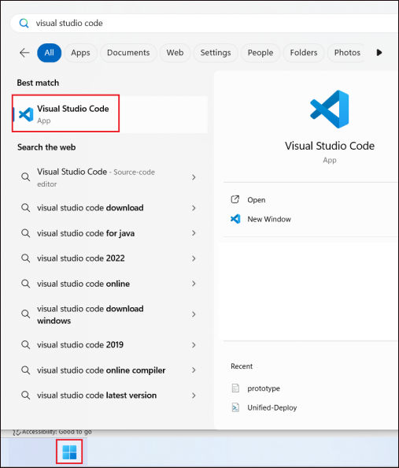

2.  **「File** -\> **Open Folder…」**を選択します

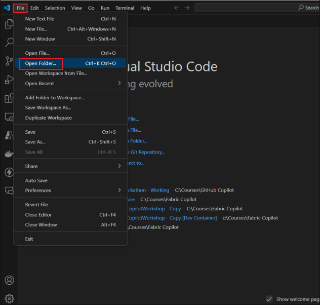

3.  **C:\Labfiles**から**CopilotHackathon**フォルダーを選択し、「**フォルダーの選択」**をクリックします。

4.  「**Yes, I trust the authors**」をクリックします。

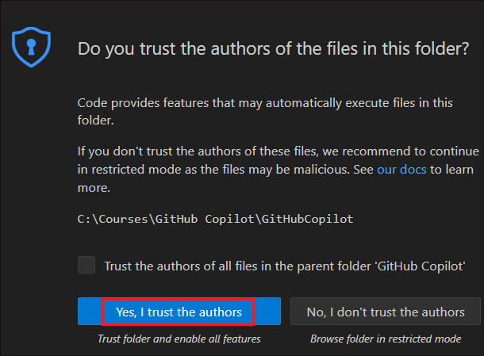

**演習 2: はじめに**

**注:** Copilot
が生成したコードは、実行によって異なる場合があります。以下のコード生成が関係する手順では、**参照コード**を与えました。これを使用して、Copilot
が生成したコードの正確性をクロスチェックしたり、エラーがある場合は解決したりしてください。

1.  **dotnet** -\> **MinimalAPI**から **Program.cs** を開きます。

2.  **MinimalAPI\Program.cs** 内の**ADD NEW ENDPOINTS HERE**(行番号 19)
    の後に、「// Hello World Get endpoint」と入力し、**Enter**
    キーを押します。Copilot はコードを灰色で提案します。

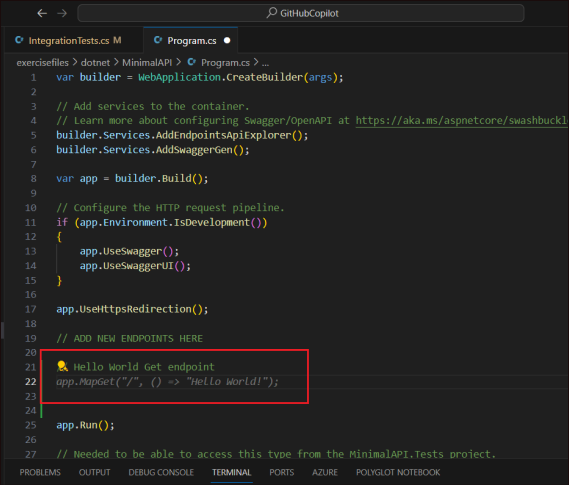

3.  Copilot
    が生成したコードを取得したら、それを**受け入れる**か**破棄すること**ができます。同意するには、**Ctrl**ボタンをクリックすると、オプションバーが灰色のテキストの上に表示されます。別のオプションは、単に
    **Tab** キーを押すことです。

**参照コード:** app.MapGet("/", () =\> "Hello World!");

4.  コードは次のようになります。 ファイルを**保存**します。

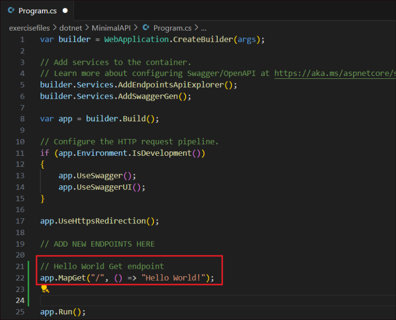

5.  **dotnet** フォルダーを右クリックし、「**Open in Integrated
    Terminal**」を選択します。

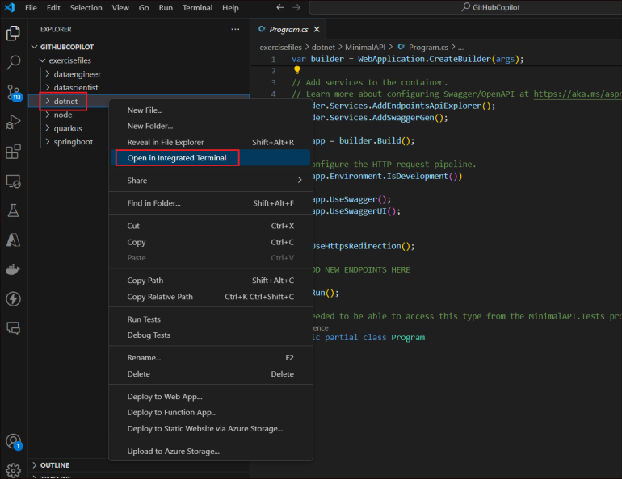

6.  ターミナルから、以下のコマンドを実行します。

> dotnet test

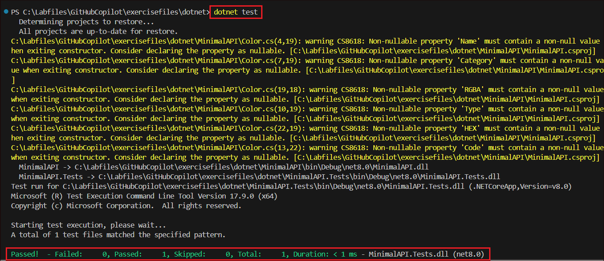

**演習 3: 新しい機能の構築**

1.  Hello Worldエンドポイントの横に、**DaysBetweenDates**を追加します。

2.  **Ctrl + I** を押して 、Copilot をインラインで開きます。

3.  以下のテキストを入力し、「**Send**」ボタンを押します 。

4.  /DaysBetweenDates:

5.  2 つの日付間の日数を計算する

クエリ文字列で 2 つのパラメーター date1 と date2 を受け取り、これら 2
つの日付の間の日数を計算します。

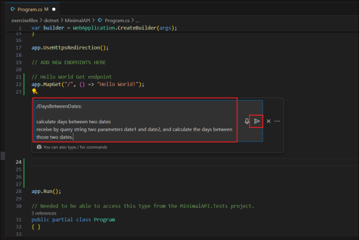

6.  Copilotはコードを生成し、それを**Program.cs**
    ファイルに入力します。完了すると、「**Accept**」または「**Discard**」の
    2 つのオプションが表示されます。コードを**受け入れます**。

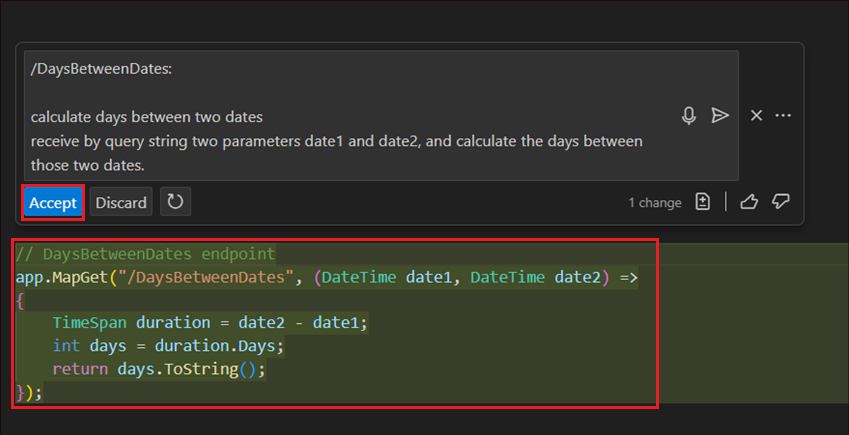

7.  受け入れたら、生成されたコードを選択し、**Ctrl+I**を押します。**Enter**、このコードを
    1 行に変換して Enter
    キーを押します。コードが1行に変換されたら、「Accept」をクリックします。

**参照コード** -
**code** - app.MapGet("/DaysBetweenDates", (DateTime date1, DateTime date2) =\> (date2 - date1).Days.ToString());

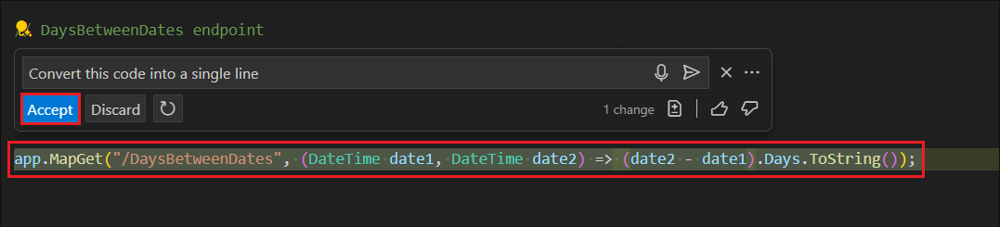

8.  以下のステートメント(コメント付き)を入力し、「**Enter」**をクリックします。

「同意する」 をクリックして、Copilot
によって生成されたコードを受け入れます。

/\*

/validatephonenumber:

receive by querystring a parameter called phoneNumber

validate phoneNumber with Spanish format, for example +34666777888

if phoneNumber is valid return true

\*/

**参照コード:**

app.MapGet("/validatephonenumber", (string phonenumber) =\> Regex.IsMatch(phonenumber, @"^(\\\[0-9\]{9})$").ToString());

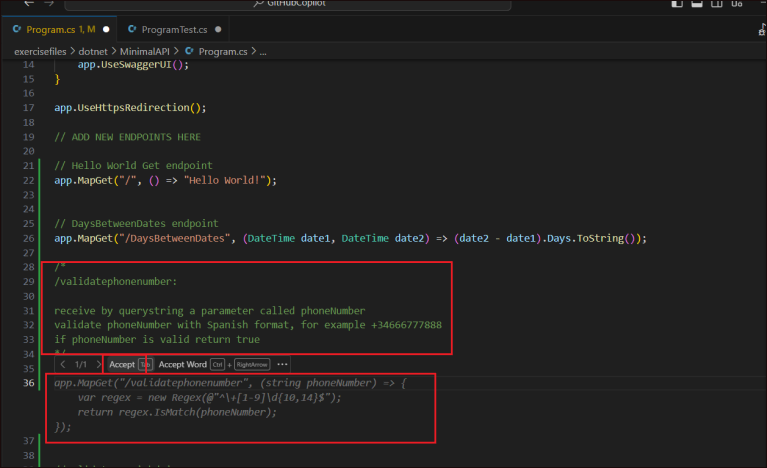

9.  Copilot インライン機能と同様に、以下のテキストを Program.cs
    ファイルに追加し、Enter キーを押します。

10. //validatespanishdni:

11. receive by querystring a parameter called dni

12. calculate DNI letter

13. if DNI is valid return "valid"

DNIが無効な場合は、「無効」を返します

この場合、Copilot
から複数のソリューションを確認して、文字の計算方法に最も適したソリューションを選択することをお勧めします。Copilot
からの 10 の提案を表示するには、Ctrl + Enter キーを押します。

GitHub で生成されたコードを受け入れます。

**参照コード:**

app.MapGet("/validatespanishdni", (string dni) =\> {

var valid = false;

if (dni.Length == 9 && int.TryParse(dni.Substring(0, 8), out int
number))

{

var letters = "TRWAGMYFPDXBNJZSQVHLCKE";

var letter = letters\[number % 23\];

valid = dni.EndsWith(letter.ToString());

}

return valid ? "valid" : "invalid";

});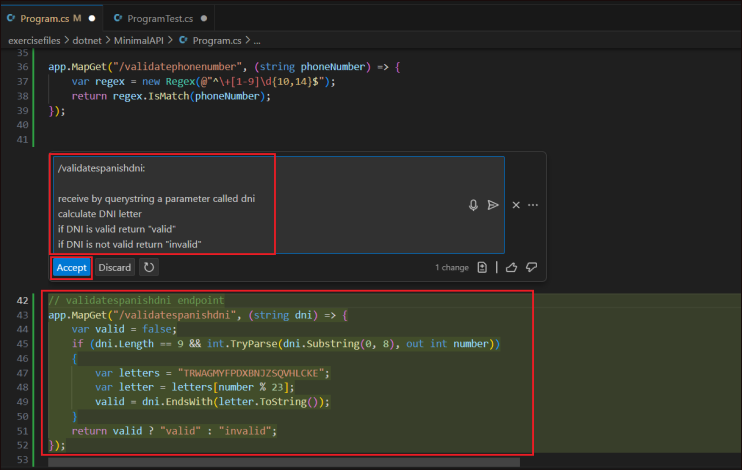

14. 左側のウィンドウから**「Chat**」を選択します。

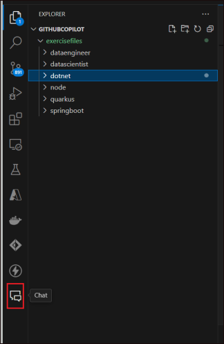

15. 以下のテキストを入力し、**Enterをクリックします**。

16. /returncolorcode:

クエリ文字列で color
というパラメーターを受け取り、ファイルを読み取りcolors.json RGBA
フィールドを返します クエリ文字列から色変数を取得します colors.json
の色ごとに反復処理して色を見つけ、code.hex フィールドを返します。

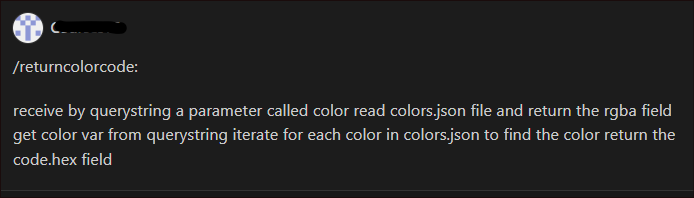

17. Copilot
    が詳細な手順を示し、次に生成されたコードが表示されていることを確認します。Program.csファイルの
    **validatespanishdni**
    コードの後にカーソルを置きます。「**カーソルに挿入」
    アイコン**をクリックして、コードをファイルに貼り付けます。

**参照コード:**

app.MapGet("/color", (string color) =\>

{

var colors =
JsonSerializer.Deserialize\<Color\[\]\>(File.ReadAllText("colors.json"));

return colors.First(c =\> c.Name == color).Code.HEX;

});

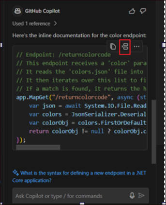

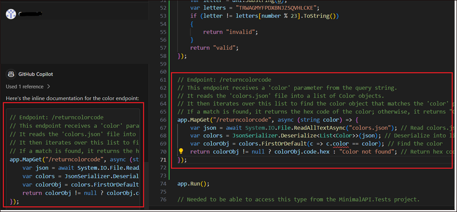

18. 生成されたコードにエラーがないことを確認します。エラーが存在する場合は、参照コードを参照として保持し、コードを修正してください。

19. この場合、**Colorにコードの定義が含まれていませんというエラーがあります。**

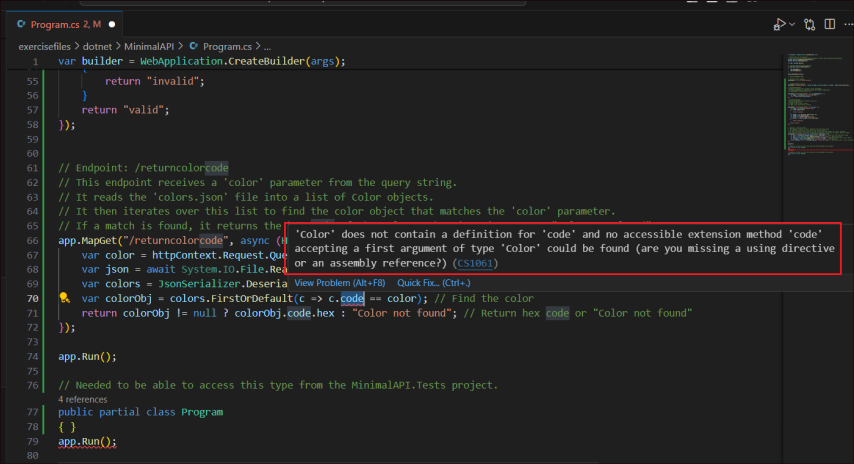

20. 生成されたコードは、エラーを解決するために次のように更新されます。

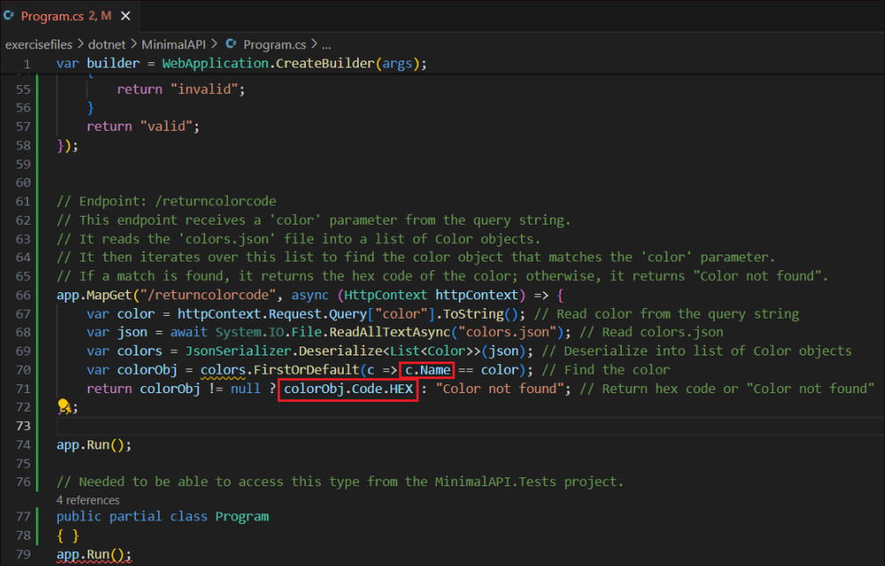

21. 以下のテキストを入力し、Enter キーを押して、Copilot
    が生成したコードを確認して受け入れます。

22. /\*

23. /tellmeajoke:

24. Make a call to the joke api and return a random joke

\*/

**参照コード:**

app.MapGet("/tellmeajoke", async () =\> {

var client = new HttpClient();

var response = await
client.GetAsync("https://official-joke-api.appspot.com/jokes/random");

var joke = await response.Content.ReadAsStringAsync();

return joke;

});

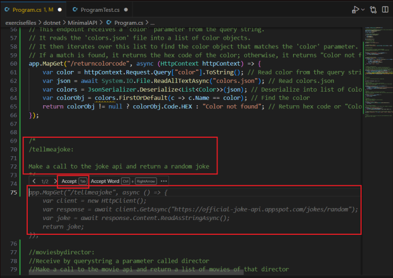

注: これは、Copilot がベスト
プラクティスに従っていることを検証するために、独自の知識と判断を使用する必要がある場合の例です。Copilot
が多くの開発者が行っていることを模倣しているからといって、それが正しい方法であるとは限りません。ベスト
プラクティスを Copilot
に知らせるために、プロンプトをさらに具体的にする必要がある場合があります。ヒント:
HttpClient に注意してください。

25. Copilot は、新しいフレームワークの学習に役立ちます。

Copilot に以下のテキストをインラインで入力し、**Enter**キーを押します。

/parseurl:

Retrieves a parameter from querystring called someurl

Parse the url and return the protocol, host, port, path, querystring and
hash

Return the parsed host

**参照コード:**

app.MapGet("/parseurl", (string someurl) =\> {

var uri = new Uri(someurl);

var host = uri.Host;

var protocol = uri.Scheme;

var port = uri.Port;

var path = uri.AbsolutePath;

var query = uri.Query;

var hash = uri.Fragment;

return host;

});

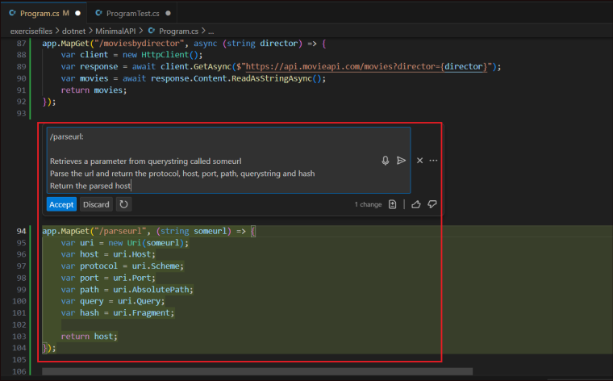

26. Copilot
    は、この種のコマンドをローカルで支援することもできます。この機能は、CLI
    では Copilot
    と呼ばれます。この機能の詳細については、こちらをご覧ください。

Copilot Inline を開き、以下のテキストを入力して **Enter**
キーを押します。

/listfiles:

Get the current directory

Get the list of files in the current directory

Return the list of files

**参照コード:**

app.MapGet("/listfiles", () =\> {

var currentDirectory = Directory.GetCurrentDirectory();

var files = Directory.GetFiles(currentDirectory);

return files;

});

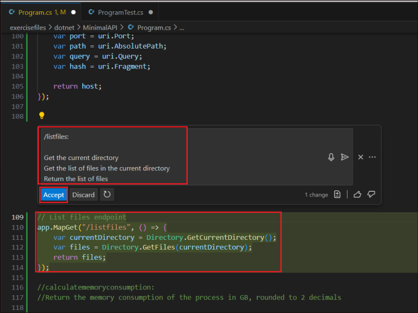

27. インライン
    コパイロットに以下のテキストを入力し、**Enter**キーを押します。

28. /calculatememoryconsumption を使用します。

プロセスのメモリ消費量を GB 単位で返し、小数点以下 2 桁に丸めます。

**参照コード:**

// Calculate memory consumption endpoint

app.MapGet("/calculatememoryconsumption", () =\>

{

var process = System.Diagnostics.Process.GetCurrentProcess();

var memoryUsage = process.WorkingSet64 / (1024.0 \* 1024 \* 1024); //
Convert to GB

return Math.Round(memoryUsage, 2);

});

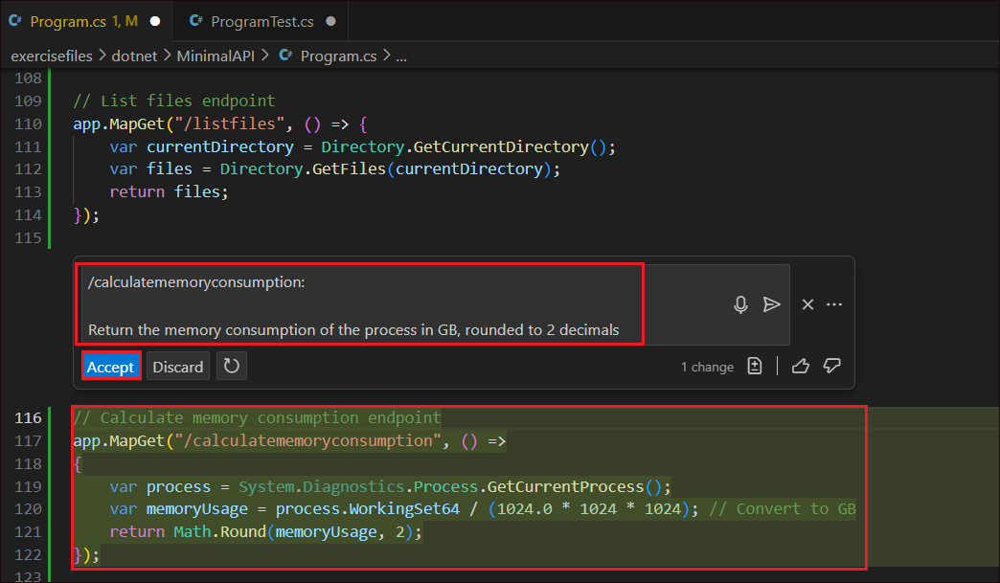

29. Copilot
    に以下のテキストをインラインで入力し、**Enter**キーを押します。

30. /ランダムヨーロッパの国:

31. ヨーロッパ諸国とそのISOコードの配列を作成する

32. 配列からランダムな国を返す

国とその iso コードを返します

**参照コード:**

// Random European Country endpoint

app.MapGet("/randomeuropeancountry", () =\>

{

var europeanCountries = new Dictionary\<string, string\>

{

{ "Albania", "AL" },

{ "Andorra", "AD" },

{ "Austria", "AT" },

{ "Belarus", "BY" },

{ "Belgium", "BE" },

{ "Bosnia and Herzegovina", "BA" },

{ "Bulgaria", "BG" },

{ "Croatia", "HR" },

{ "Cyprus", "CY" },

{ "Czech Republic", "CZ" },

{ "Denmark", "DK" },

{ "Estonia", "EE" },

{ "Finland", "FI" },

{ "France", "FR" },

{ "Germany", "DE" },

{ "Greece", "GR" },

{ "Hungary", "HU" },

{ "Iceland", "IS" },

{ "Ireland", "IE" },

{ "Italy", "IT" },

{ "Kosovo", "XK" },

{ "Latvia", "LV" },

{ "Liechtenstein", "LI" },

{ "Lithuania", "LT" },

{ "Luxembourg", "LU" },

{ "Malta", "MT" },

{ "Moldova", "MD" },

{ "Monaco", "MC" },

{ "Montenegro", "ME" },

{ "Netherlands", "NL" },

{ "North Macedonia", "MK" },

{ "Norway", "NO" },

{ "Poland", "PL" },

{ "Portugal", "PT" },

{ "Romania", "RO" },

{ "Russia", "RU" },

{ "San Marino", "SM" },

{ "Serbia", "RS" },

{ "Slovakia", "SK" },

{ "Slovenia", "SI" },

{ "Spain", "ES" },

{ "Sweden", "SE" },

{ "Switzerland", "CH" },

{ "Ukraine", "UA" },

{ "United Kingdom", "GB" },

{ "Vatican City", "VA" }

};

var random = new Random();

var index = random.Next(europeanCountries.Count);

var country = europeanCountries.ElementAt(index);

return $"{country.Key} ({country.Value})";

});

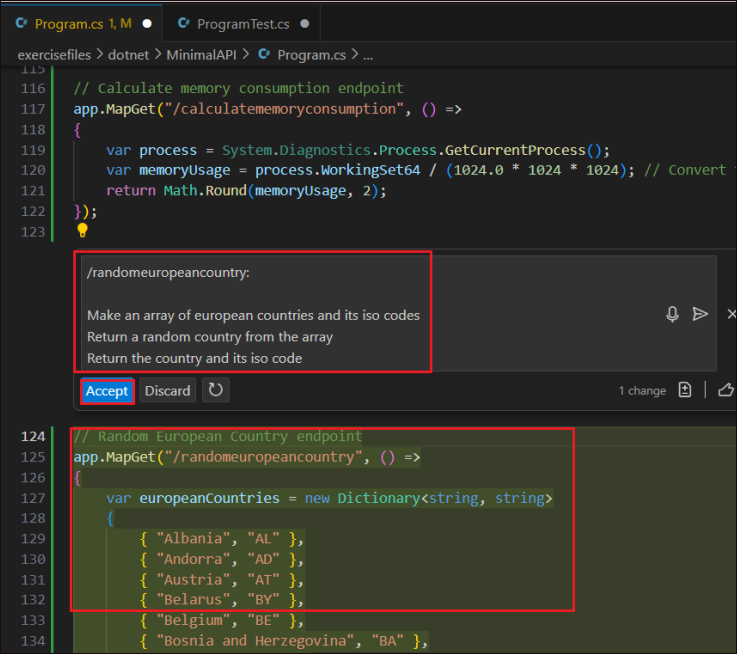

**演習 4: コードを文書化する**

1.  チャットウィンドウを開きます。

2.  **Program.csファイルを文書化**し**、**「**Send**」を選択します。

GitHubCopiot は、**Program.cs
ファイルの**簡単なドキュメントを生成します。

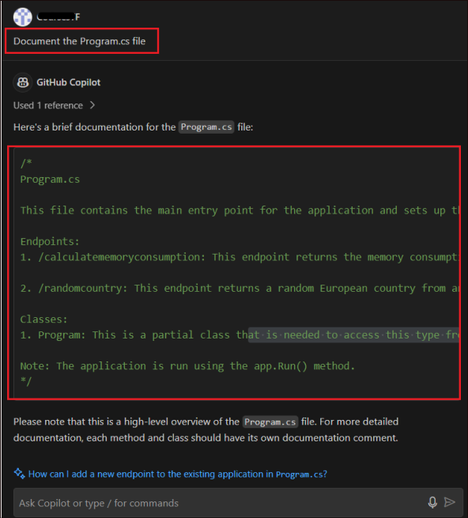

**演習 5: テストの構築**

1.  ファイル**Program.cs**開きます 。

2.  **DaysBetweenDates**エンドポイントを選択し、**Ctrl+I** を押して
    Copilot をインラインで開きます。

Copilot
インラインで「**/tests**」と入力し、「**Send」**ボタンをクリックします。

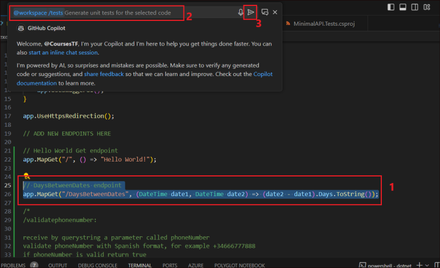

3.  生成されたテストをコピーします。

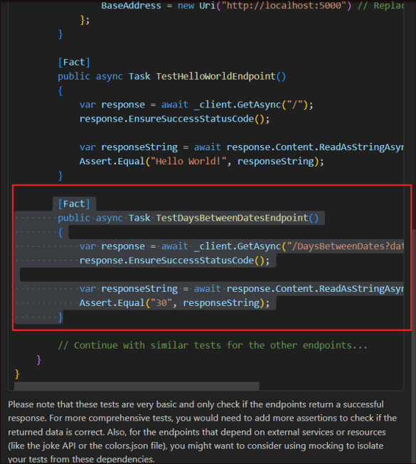

4.  MinimalAPI.TestsからIntegrationTests.csを開きます。

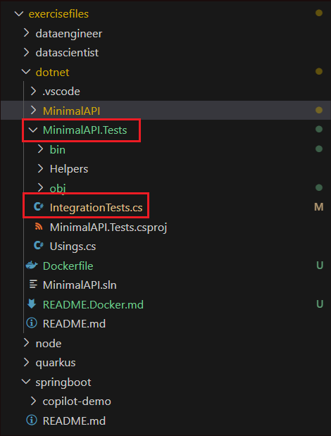

5.  Hello
    Worldのテストブロックの後のcsファイルに貼り付けます。発生する可能性のある問題を解決します。

6.  左側のウィンドウから Copilot チャットを開きます。

7.  テストユニットを作成するコマンドである/testsと入力し**、Enter**キーを押します。Copilot
    はテスト ファイルを生成します。その内容をコピーします。

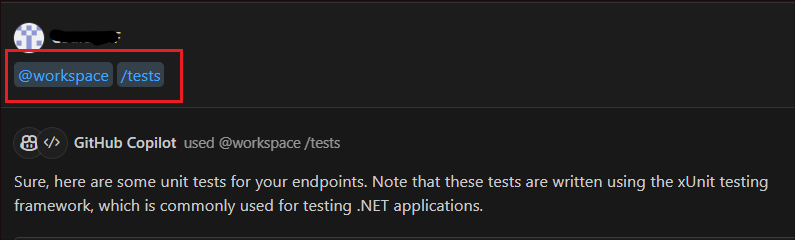

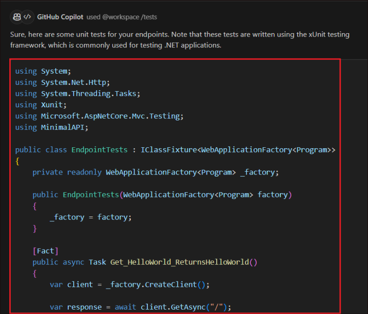

8.  **MinimalAPI.Tests**から**IntegrationTests.cs**を開きます。

9.  ファイルの内容を Copilot が生成したコードに置き換えて保存します。

**重要:** エラーがないか確認し、/fix
コマンドを使用するか手動で修正します。トラブルシューティングには、以下の参照コードを使用してください。

10. すべてのエンドポイントに対してテストが生成されない場合は、チャットからエンドポイント名を指定し、以下のようにテストを生成するように
    Copilot
    に依頼します。テストで更新されたエンドポイント名と欠落しているエンドポイント名を更新します。

MoviesbyDirector、Parseurl、ListFiles、CalculateMemoryConsumption、およびRandomEuropeanCountryのテストユニットを生成する

**参照コード:**

using System;

using System.Net.Http;

using System.Threading.Tasks;

using Microsoft.AspNetCore.Mvc.Testing;

using Xunit;

public class EndpointTests :
IClassFixture\<WebApplicationFactory\<Program\>\>

{

private readonly WebApplicationFactory\<Program\> \_factory;

private readonly HttpClient \_client;

public EndpointTests(WebApplicationFactory\<Program\> factory)

{

\_factory = factory;

\_client = \_factory.CreateClient();

}

\[Fact\]

public async Task Get_HelloWorld_ReturnsHelloWorld()

{

var response = await \_client.GetAsync("/");

response.EnsureSuccessStatusCode();

var stringResponse = await response.Content.ReadAsStringAsync();

Assert.Equal("Hello World!", stringResponse);

}

\[Fact\]

public async Task Get_ValidatePhoneNumber_ReturnsInvalid()

{

var response = await
\_client.GetAsync("/validatephonenumber?phonenumber=123456789");

response.EnsureSuccessStatusCode();

var stringResponse = await response.Content.ReadAsStringAsync();

Assert.Equal("False", stringResponse);

}

\[Fact\]

public async Task Get_ValidateSpanishDni_ReturnsValid()

{

var response = await
\_client.GetAsync("/validatespanishdni?dni=12345678Z");

response.EnsureSuccessStatusCode();

var stringResponse = await response.Content.ReadAsStringAsync();

Assert.Equal("valid", stringResponse);

}

\[Fact\]

public async Task Get_Color_ReturnsHexCode()

{

var response = await \_client.GetAsync("/color?color=red");

response.EnsureSuccessStatusCode();

var stringResponse = await response.Content.ReadAsStringAsync();

Assert.Equal("#FF0000", stringResponse); // assuming red color returns
\#FF0000

}

\[Fact\]

public async Task Get_TellMeAJoke_ReturnsJoke()

{

var response = await \_client.GetAsync("/tellmeajoke");

response.EnsureSuccessStatusCode();

var stringResponse = await response.Content.ReadAsStringAsync();

Assert.NotNull(stringResponse); // assuming the joke API always returns
a joke

}

\[Fact\]

public async Task Get_ParseUrl_ReturnsHost()

{

var response = await
\_client.GetAsync("/parseurl?someurl=https://www.example.com");

response.EnsureSuccessStatusCode();

var stringResponse = await response.Content.ReadAsStringAsync();

Assert.Equal("www.example.com", stringResponse);

}

\[Fact\]

public async Task Get_ListFiles_ReturnsFiles()

{

var response = await \_client.GetAsync("/listfiles");

response.EnsureSuccessStatusCode();

var stringResponse = await response.Content.ReadAsStringAsync();

Assert.NotNull(stringResponse); // assuming the API always returns a
list of files

}

\[Fact\]

public async Task Get_CalculateMemoryConsumption_ReturnsMemoryUsage()

{

var response = await \_client.GetAsync("/calculatememoryconsumption");

response.EnsureSuccessStatusCode();

var stringResponse = await response.Content.ReadAsStringAsync();

Assert.NotNull(stringResponse); // assuming the API always returns a
memory usage

}

\[Fact\]

public async Task Get_RandomEuropeanCountry_ReturnsCountry()

{

var response = await \_client.GetAsync("/randomeuropeancountry");

response.EnsureSuccessStatusCode();

var stringResponse = await response.Content.ReadAsStringAsync();

Assert.NotNull(stringResponse); // assuming the API always returns a
country

}

// Add similar tests for the other endpoints

}

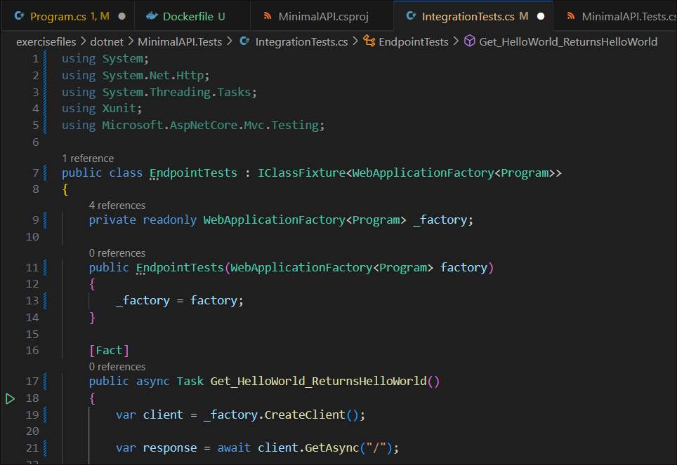

11. ターミナルから、コマンド **dotnet test** を実行します。

12. テストに合格すると、以下のスクリーンショットのような出力が表示されます。

13. 必要に応じて、さらにテストを追加できます。

**演習 6: Dockerfile を作成する**

1.  **dotnet**フォルダーを右クリックして「**New
    File」**を選択し、ファイルに **Dockerfile** という名前を付けます。

2.  ファイルに **Dockerfile**という名前を付けます。

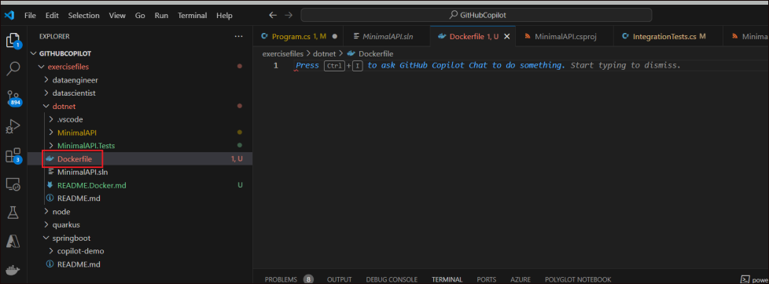

3.  新しく作成したファイルで、**Ctrl+I**
    を押し、以下のテキストを入力して **Enter** キーを押します。

**Generate content for Dockerfile for .NET 8 Project Name - MinimalAPI**

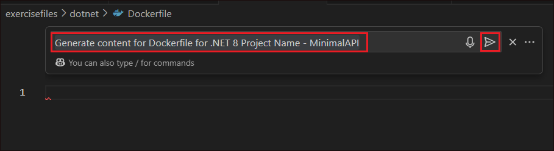

4.  生成されたコードを受け入れます。

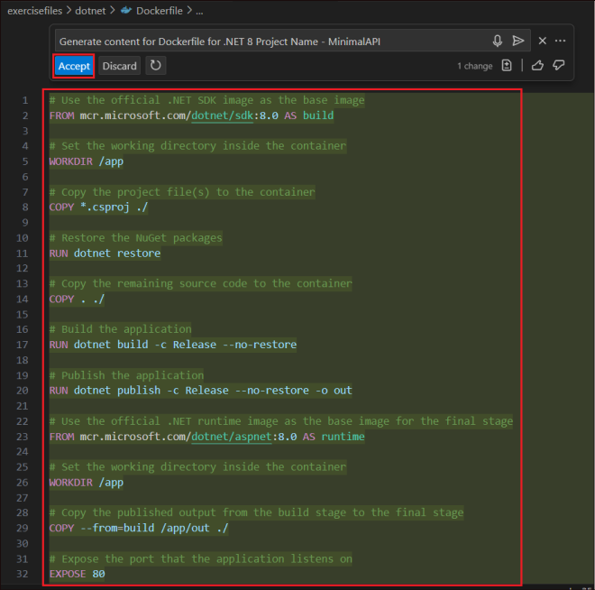

5.  ファイルを保存します。ターミナルから、以下のコマンドを実行します。

docker build -t dotnetappです。

エラーがある場合は、参照コードを使用して解決します。

**参照コード:**

\# Use the official .NET SDK image as the base image

FROM mcr.microsoft.com/dotnet/sdk:8.0 AS build

\# Set the working directory in the container

WORKDIR /app

\# Copy the project file(s) to the container

COPY \*.csproj ./

\# Copy the remaining source code to the container

COPY . ./

\# Build the application

RUN dotnet build -c Release

\# Publish the application

RUN dotnet publish -c Release --no-build -o out

\# Use the official .NET runtime image as the base image for the final
stage

FROM mcr.microsoft.com/dotnet/runtime:8.0 AS runtime

\# Set the working directory in the container

WORKDIR /app

\# Copy the published output from the build stage to the final stage

COPY --from=build /app/out ./

\# Set the entry point for the container

ENTRYPOINT \["dotnet", "MinimalAPI.dll"\]

6.  以下のコマンドを実行して、ポート 8080 でアプリを実行します

docker run -d -p 8080:80 --name dotnetapp dotnetapp

7.  これで、ドッカーで dotnet アプリが実行されています。

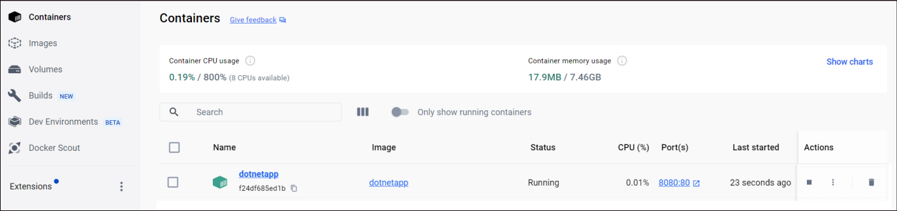
