**실습 21 - GitHub Copilot을 사용하여 .NET 및 해당 Docker 이미지를
사용하여 최소 WebAPI 생성하기**

**목표:**

목표는 GitHub Copilot의 도움으로 .NET 7.0 및 해당 Docker 이미지를
사용하여 최소 WebAPI를 생성하는 것입니다. 여기서는 GitHub Copilot을
최대한 많이 사용합니다.

다양한 작업을 시도하고 Dockerfile 또는 클래스 생성, 주석 추가 등과 같이
GitHub Copilot이 수행할 수 있는 작업을 확인하세요.

이 실습을 실행하기 전에 먼저 필요한 소프트웨어 패키지를 설치하고 환경을
설정해 보겠습니다

연습 0: 환경을 설치하고 설정하기

이 실습을 실행하기 위한 환경을 설정하려면 다음 소프트웨어 패키지를
다운로드하여 설치해야 합니다.

• dotnet-sdk-8.0

1.  Edge 브라우저를 여세요.

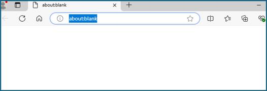

2.  브라우저 URL 필드에서 링크를 복사하여 붙여넣어 실습 VM에 소프트웨어
    패키지를 다운로드하세요.

dotnet-sdk-8.0
◊ https://dotnet.microsoft.com/en-us/download/dotnet/thank-you/sdk-8.0.401-windows-x64-installer

**참고:** 기본적으로 패키지는 **downloads** 폴더에 저장됩니다.

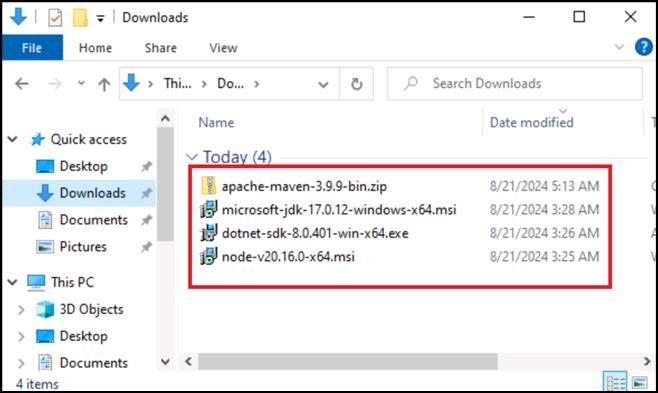

3.  .NET SDK를 설치하고 **Downloads** (**C:\Users\Admin\Downloads**)
    폴더로 이동하고 **dotnet-sdk-8.0.401**를 두번 클릭하고 설치
    프로세스를 따르세요.

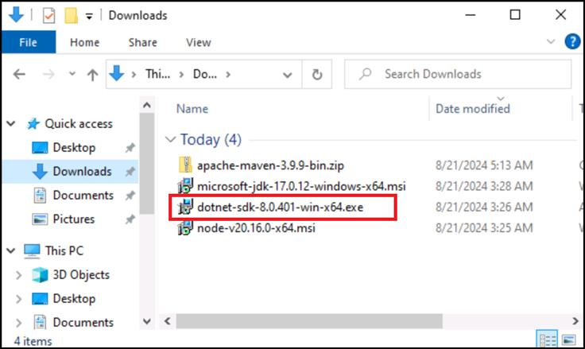

**연습 1: VS Code에 프로젝트를 설정하기**

1.  **Start** 메뉴에서 **Visual Studio Code**를 여세요.

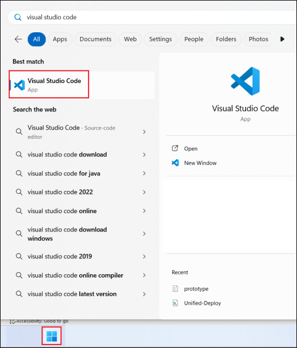

2.  **File** -\> **Open Folder…**를 선택하세요

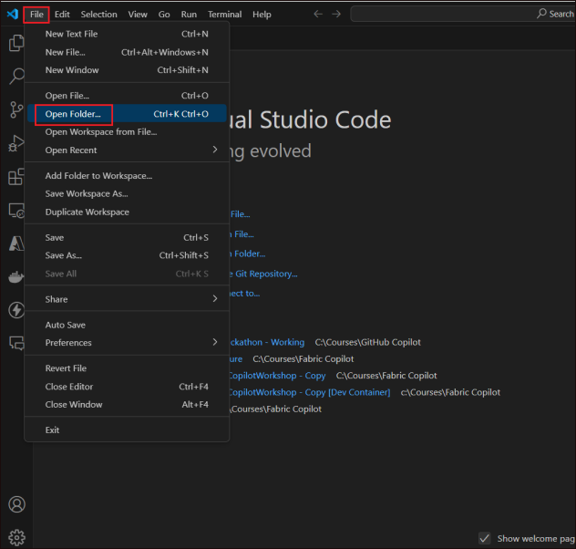

3.  **C:\Labfiles**에서 **CopilotHackathon** 폴더를 선택하고 **Select
    Folder**를 클릭하세요.

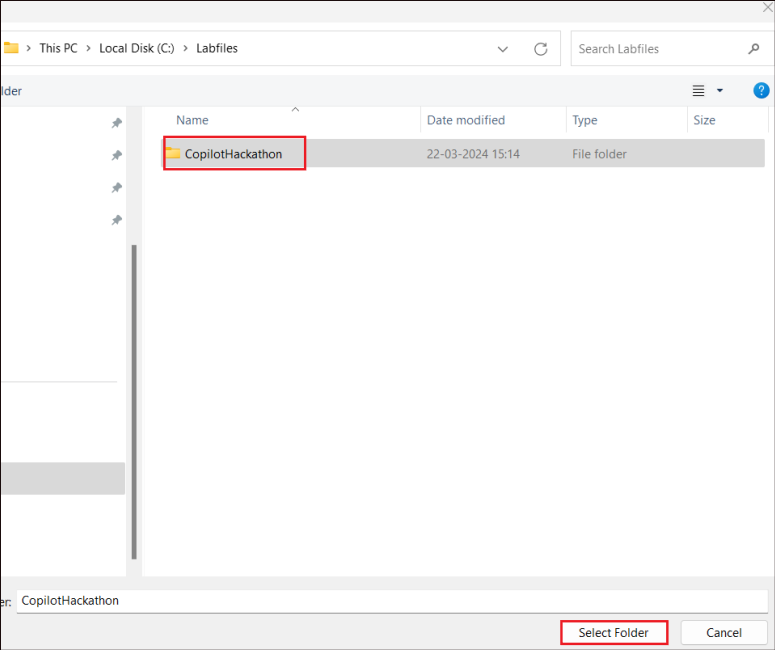

4.  **Yes, I trust the authors**를 클릭하세요.

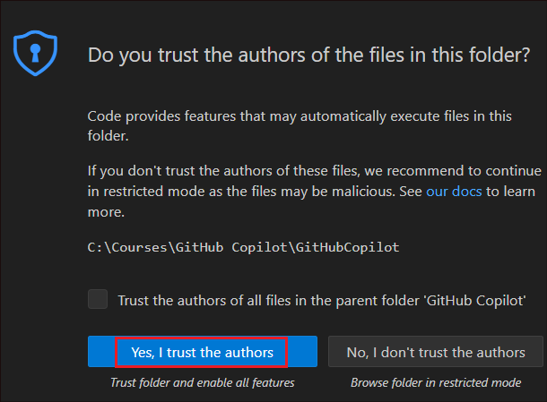

**연습 2: 소개**

**참고:** Copilot에서 생성된 코드는 실행에 따라 다를 수 있습니다. 아래
코드 생성과 관련된 단계에서 Reference code를 제공했습니다. 이를 사용하여
Copilot에서 생성된 코드의 정확성을 교차 확인하거나 오류가 있는 경우
해결하세요.

1.  **dotnet** -\> **MinimalAPI**에서 **Program.cs**를 여세요.

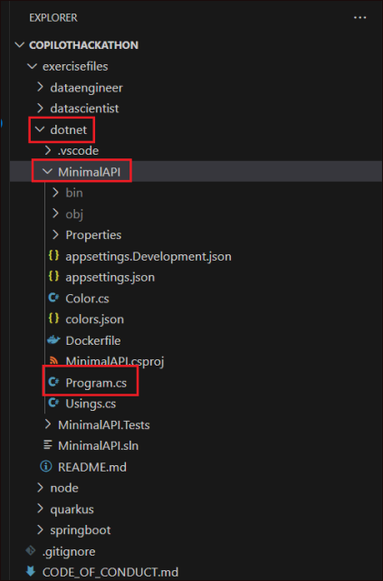

2.  **MinimalAPI\Program.cs**줄 뒤 **//**여기에 **ADD NEW ENDPOINTS
    HERE**(줄 호 19)추가, // Hello World Get endpoint를 입력하고
    **Enter**를 클릭하세요**.** Copilot은 코드를 회색으로 제안합니다.

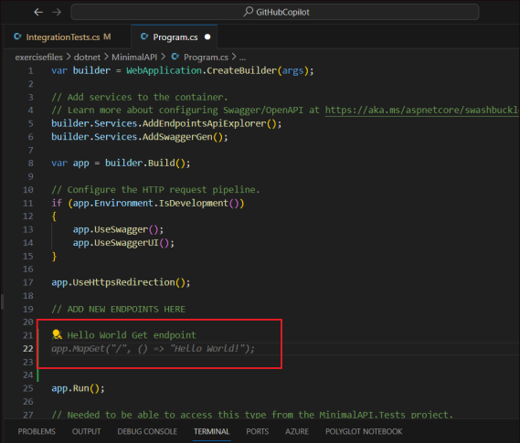

3.  Copilot에서 생성된 코드를 받 으면 **수락**하거나 **폐기**할 수
    있습니다. 수락하려면 **Ctrl** 버튼을 클릭하면 회색 텍스트 위에 옵션
    표시줄이 나타납니다. 또 다른 옵션은 단순히 **Tab** 키를 누르는
    것입니다.

**Reference code :** app.MapGet("/", () =\> "Hello World!");

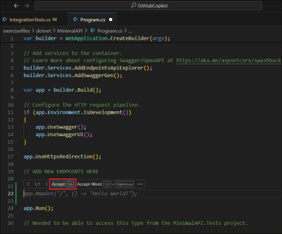

4.  이제 코드는 다음과 같습니다. 파일을 **저장하세요.**

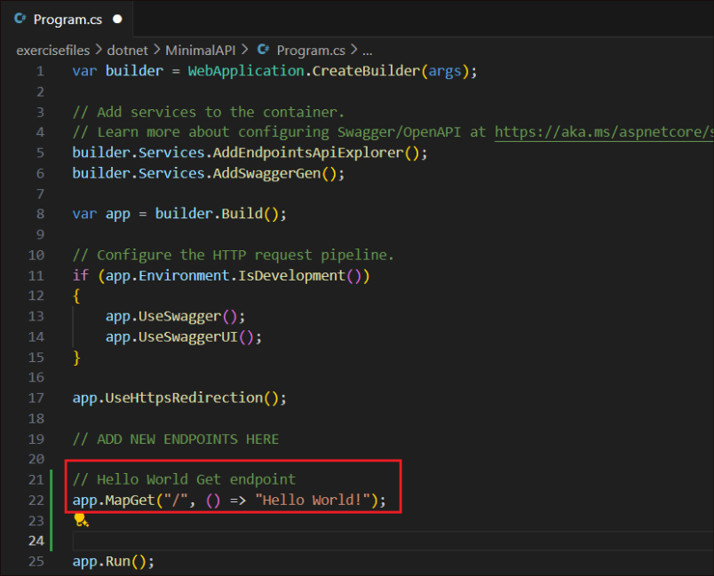

5.  **dotnet** 폴더를 마우스 오른쪽 클릭하고 **Open in Integrated
    Terminal**를 여세요.

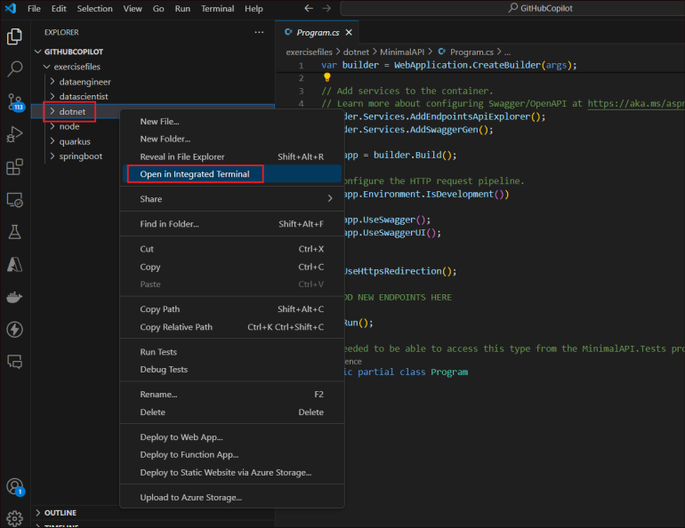

6.  터미널에서 아래 명령을 실행하세요.

dotnet test

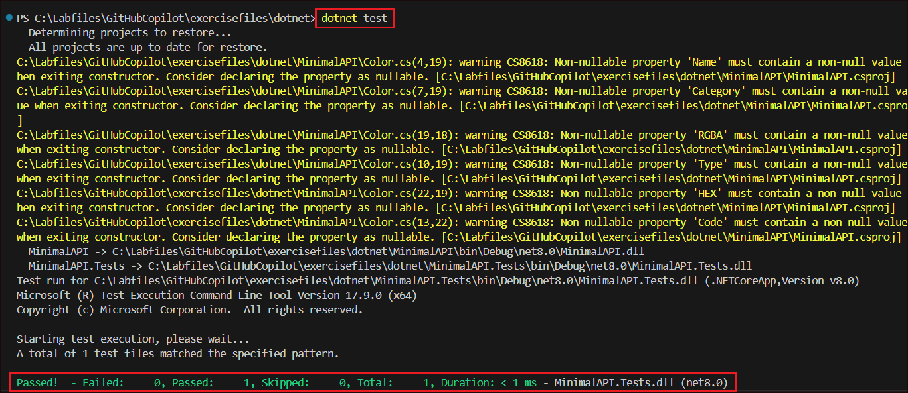

**연습 3: 새 기능을 빌드하기**

1.  Hello World endpoint 옆에 **DaysBetweenDates**를 추가하세요.

2.  Copilot inline을 열려면 **Ctrl+I**를 누르세요.

3.  다음 텍스트를 입력하고 **Send** 버튼을 클릭하세요.

4.  /DaysBetweenDates:

5.  calculate days between two dates

쿼리 문자열로 두 개의 매개 변수 date1 및 date2를 수신하고 해당 두 날짜
사이의 일수를 계산하세요.

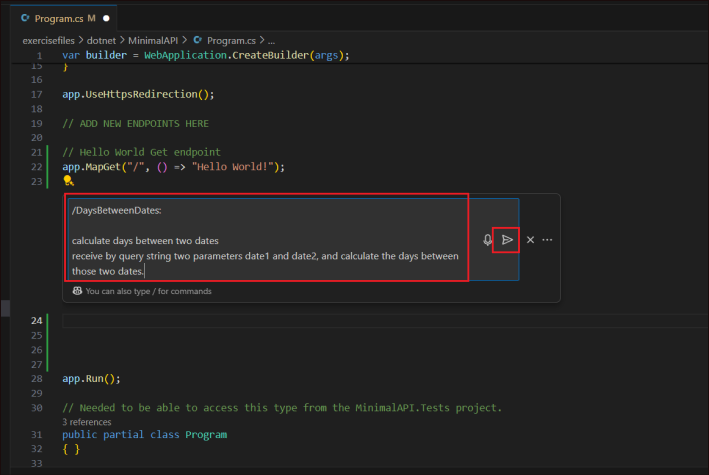

6.  이제 Copilot이 **code**를 생성하여 **Program.cs** 파일에 입력합니다.
    완료되면 **Accept** 또는 **Discard**에 대한 두 가지 옵션이
    표시됩니다. 코드를 **Accept** 하세요.

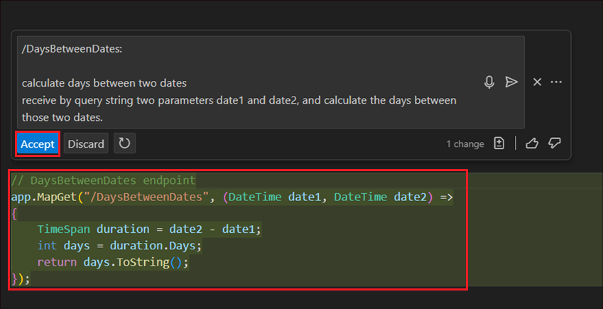

7.  수락되면 생성된 코드를 선택하고 **Ctrl+I**를 누르세요. Enter를
    누르고 이 코드를 한 줄로 변환하고 **Enter** 키를 누르세요. 코드가 한
    줄로 변환되면 Accept를 클릭하세요.

**Reference
code** - app.MapGet("/DaysBetweenDates", (DateTime date1, DateTime date2) =\> (date2 - date1).Days.ToString());

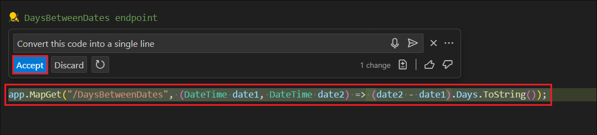

8.  아래 진술(주석 처리)을 입력하고 **Enter**를 클릭하세요.

Accept을 클릭하여 Copilot에서 생성된 코드를 수락하세요.

/\*

/validatephonenumber:

receive by querystring a parameter called phoneNumber

validate phoneNumber with Spanish format, for example +34666777888

if phoneNumber is valid return true

\*/

**Reference code:**

app.MapGet("/validatephonenumber", (string phonenumber) =\> Regex.IsMatch(phonenumber, @"^(\\\[0-9\]{9})\$").ToString());

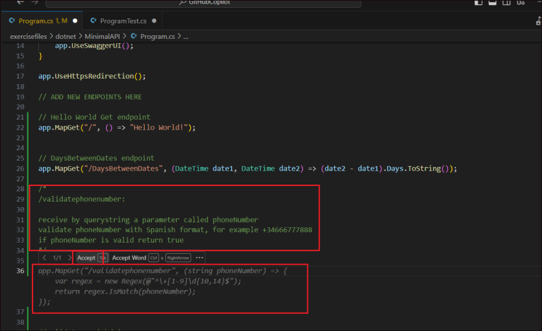

9.  Copilot 인라인 기능에서와 같이 Program.cs 파일에 아래 텍스트를
    추가하고 **Enter** 키를 누르세요.

10. /validatespanishdni:

11. receive by querystring a parameter called dni

12. calculate DNI letter

13. if DNI is valid return "valid"

if DNI is not valid return "invalid"

이 경우 Copilot의 여러 솔루션을 확인하여 문자를 계산하는 방법에 가장
적합한 솔루션을 선택할 수 있습니다. Copilot의 첫 번째 제안 10개를 보려면
ctrl + enter를 누르세요.

GitHub에서 생성된 코드 수락하세요.

**Reference Code:**

app.MapGet("/validatespanishdni", (string dni) =\> {

var valid = false;

if (dni.Length == 9 && int.TryParse(dni.Substring(0, 8), out int
number))

{

var letters = "TRWAGMYFPDXBNJZSQVHLCKE";

var letter = letters\[number % 23\];

valid = dni.EndsWith(letter.ToString());

}

return valid ? "valid" : "invalid";

});

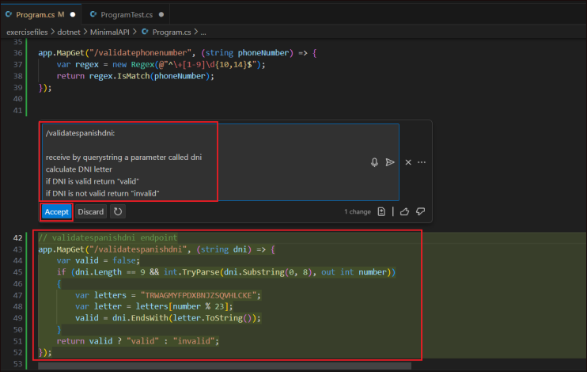

14. 왼쪽 창에서 **Chat**를 선택하세요.

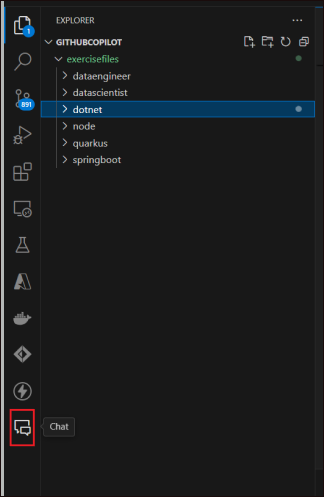

15. 다음 텍스트를 입력하고 **Enter**를 클릭하세요.

16. /returncolorcode:

queryString으로 Color라는 매개 변수를 수신하고 파일을 읽고 RGBA
필드colors.json 반환 QueryString에서 Color var 가져오기 colors.json의 각
색상에 대해 반복하여 색상을 찾기 위해 code.hex 필드를 반환하세요.

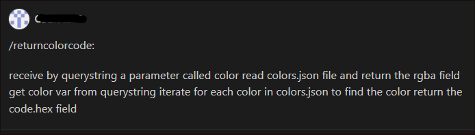

17. Copilot이 자세한 단계를 제공한 후 생성된 **code**를 제공하는지
    확인하세요. Program.cs 파일의 **validatespanishdni** 코드 뒤에
    커서를 놓으세요. **Insert at cursor** 아이콘을 클릭하여 코드를
    파일에 붙여넣으세요.

**Reference Code:**

app.MapGet("/color", (string color) =\>

{

var colors =
JsonSerializer.Deserialize\<Color\[\]\>(File.ReadAllText("colors.json"));

return colors.First(c =\> c.Name == color).Code.HEX;

});

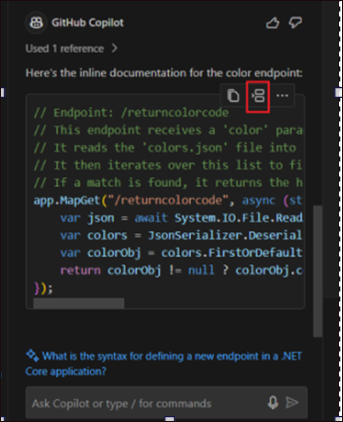

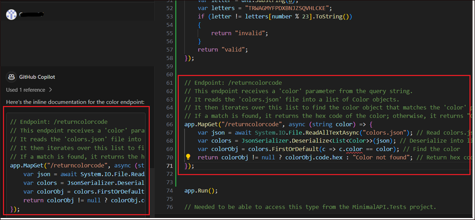

18. 생성된 코드에 오류가 없는지 확인합니다. 오류가 있는 경우 참조 코드를
    참조로 유지하고 코드를 수정하세요.

19. 이 경우 오류가 있습니다, **Color does not contain definition for
    code**.

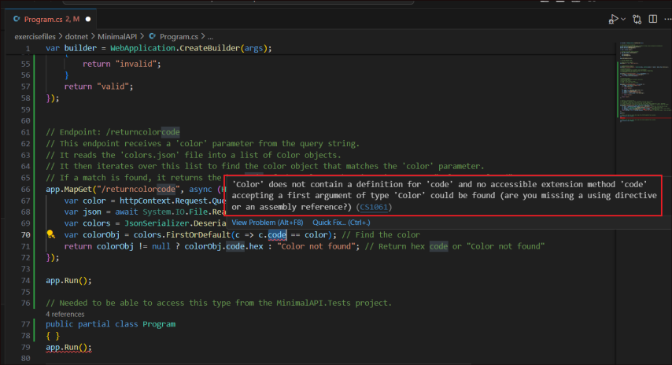

20. 생성된 코드는 오류를 해결하기 위해 아래와 같이 업데이트됩니다..

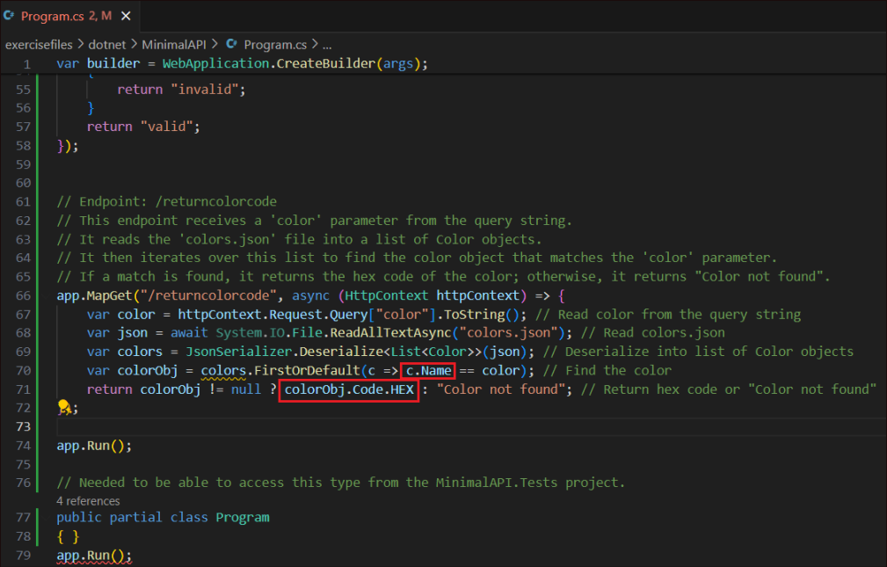

21. 아래 텍스트를 입력하고 Enter 키를 누르고 Copilot 생성 코드를
    검토하고 수락하세요.

22. /\*

23. /tellmeajoke:

24. 농담 API를 호출하고 임의의 농담을 반환하세요.

\*/

**Reference code:**

app.MapGet("/tellmeajoke", async () =\> {

var client = new HttpClient();

var response = await
client.GetAsync("https://official-joke-api.appspot.com/jokes/random");

var joke = await response.Content.ReadAsStringAsync();

return joke;

});

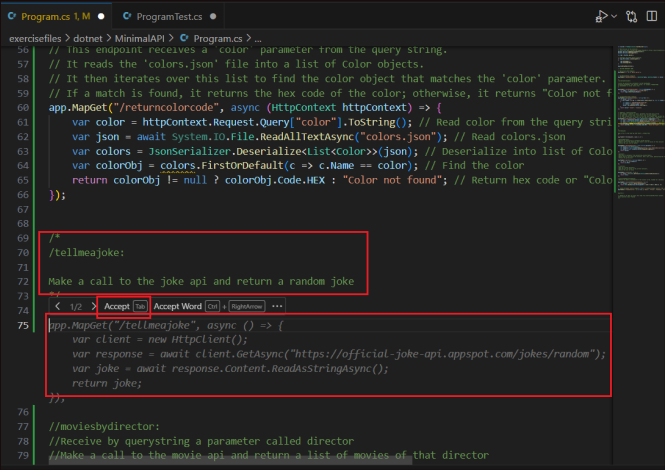

참고: 이것은 Copilot이 모범 사례를 따르는지 확인하기 위해 자신의 지식과
판단을 사용해야 할 수 있는 예입니다. Copilot이 많은 개발자가 하는 일을
모방한다고 해서 항상 올바른 방법이라는 의미는 아닙니다. Copilot에 모범
사례가 무엇인지 알리기 위해 프롬프트에 더욱 구체적으로 설명해야 할 수도
있습니다. 힌트: HttpClient에 주의하세요.

25. Copilot은 새로운 프레임워크를 학습하는 데 도움이 될 수 있습니다.

Copilot 인라인에 아래 텍스트를 입력하고 **Enter** 키를 누르세요.

/parseurl:

Retrieves a parameter from querystring called someurl

Parse the url and return the protocol, host, port, path, querystring and
hash

Return the parsed host

**Reference code:**

app.MapGet("/parseurl", (string someurl) =\> {

var uri = new Uri(someurl);

var host = uri.Host;

var protocol = uri.Scheme;

var port = uri.Port;

var path = uri.AbsolutePath;

var query = uri.Query;

var hash = uri.Fragment;

return host;

});

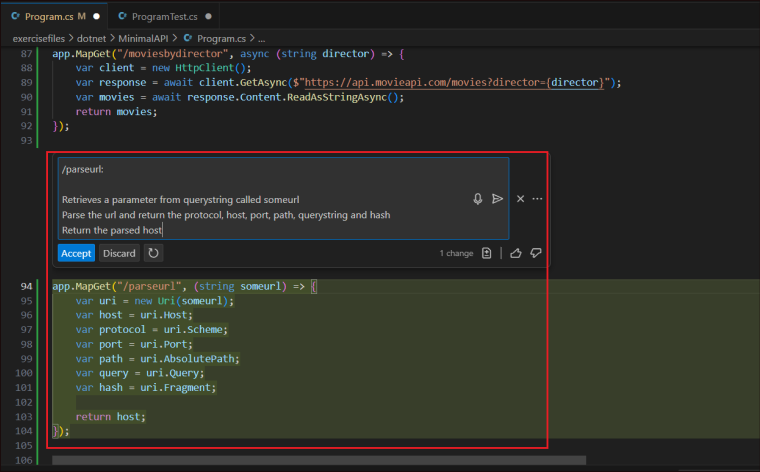

26. Copilot은 로컬에서 이러한 종류의 명령을 도울 수도 있습니다. 이
    기능은 CLI에서 Copilot이라고 합니다. 이 기능에 대한 자세한 내용은
    여기에서 확인할 수 있습니다.

Copilot Inline을 열고 아래 텍스트를 입력한 후 **Enter** 키를 누르세요.

/listfiles:

Get the current directory

Get the list of files in the current directory

Return the list of files

**Reference code:**

app.MapGet("/listfiles", () =\> {

var currentDirectory = Directory.GetCurrentDirectory();

var files = Directory.GetFiles(currentDirectory);

return files;

});

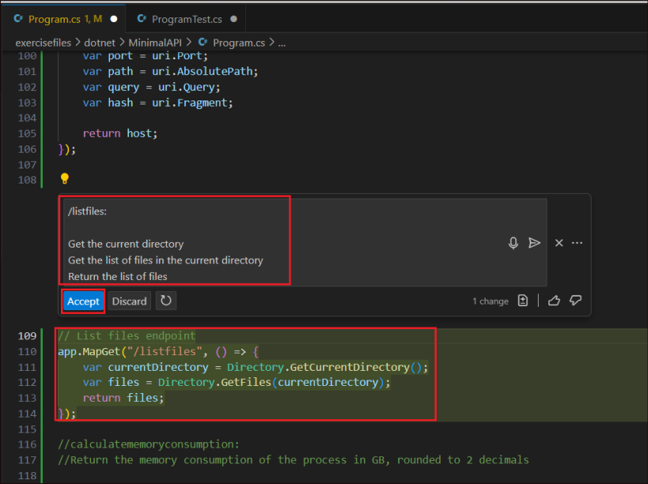

27. 인라인 부조종사에 아래 텍스트를 입력하고 **Enter** 키를 누르세요.

28. /calculatememoryconsumption:

프로세스의 메모리 사용량을 GB 단위로 반환하고 소수점 이하 2자리로
반올림하세요.

**Reference code:**

// Calculate memory consumption endpoint

app.MapGet("/calculatememoryconsumption", () =\>

{

var process = System.Diagnostics.Process.GetCurrentProcess();

var memoryUsage = process.WorkingSet64 / (1024.0 \* 1024 \* 1024); //
Convert to GB

return Math.Round(memoryUsage, 2);

});

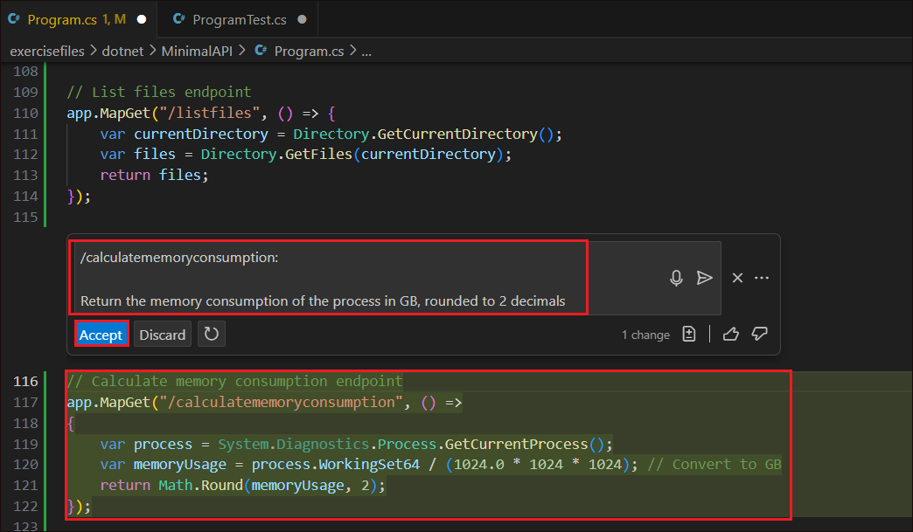

29. Copilot 인라인에 아래 텍스트를 입력하고 **Enter** 키를 누르세요.

30. /randomeuropeancountry:

31. 유럽 국가 배열 및 ISO 코드 생성하세요

32. 배열에서 임의의 국가 반환하세요

국가 및 iso 코드 반환하세요

**Reference code:**

// Random European Country endpoint

app.MapGet("/randomeuropeancountry", () =\>

{

var europeanCountries = new Dictionary\<string, string\>

{

{ "Albania", "AL" },

{ "Andorra", "AD" },

{ "Austria", "AT" },

{ "Belarus", "BY" },

{ "Belgium", "BE" },

{ "Bosnia and Herzegovina", "BA" },

{ "Bulgaria", "BG" },

{ "Croatia", "HR" },

{ "Cyprus", "CY" },

{ "Czech Republic", "CZ" },

{ "Denmark", "DK" },

{ "Estonia", "EE" },

{ "Finland", "FI" },

{ "France", "FR" },

{ "Germany", "DE" },

{ "Greece", "GR" },

{ "Hungary", "HU" },

{ "Iceland", "IS" },

{ "Ireland", "IE" },

{ "Italy", "IT" },

{ "Kosovo", "XK" },

{ "Latvia", "LV" },

{ "Liechtenstein", "LI" },

{ "Lithuania", "LT" },

{ "Luxembourg", "LU" },

{ "Malta", "MT" },

{ "Moldova", "MD" },

{ "Monaco", "MC" },

{ "Montenegro", "ME" },

{ "Netherlands", "NL" },

{ "North Macedonia", "MK" },

{ "Norway", "NO" },

{ "Poland", "PL" },

{ "Portugal", "PT" },

{ "Romania", "RO" },

{ "Russia", "RU" },

{ "San Marino", "SM" },

{ "Serbia", "RS" },

{ "Slovakia", "SK" },

{ "Slovenia", "SI" },

{ "Spain", "ES" },

{ "Sweden", "SE" },

{ "Switzerland", "CH" },

{ "Ukraine", "UA" },

{ "United Kingdom", "GB" },

{ "Vatican City", "VA" }

};

var random = new Random();

var index = random.Next(europeanCountries.Count);

var country = europeanCountries.ElementAt(index);

return \$"{country.Key} ({country.Value})";

});

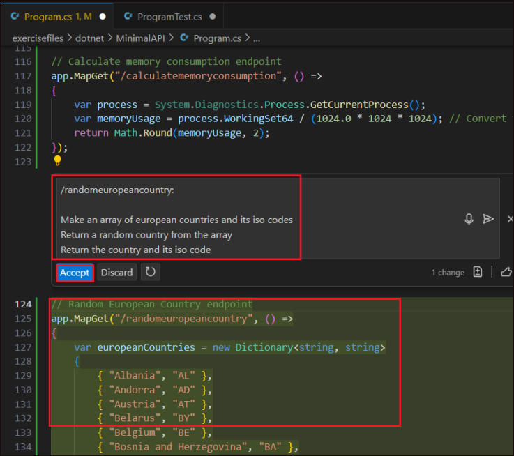

**연습 4: 코드 문서화**

1.  채팅 창을 여세요.

2.  **Document the Program.cs file**를 입력하고 **Send**를 선택하세요.

GitHubCopiot는 **Program.cs** 파일에 대한 간략한 **documentation** 을
생성하세요.

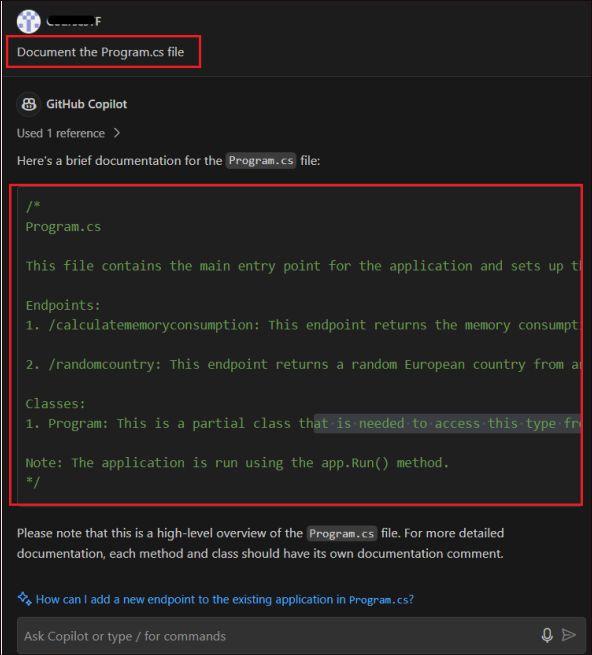

**연습 5: 테스트 빌드하기**

1.  **Program.cs** 파일을 여세요.

2.  **DaysBetweenDates** 엔드포인트를 선택하고 Copilot inline을 열려면
    **Ctrl+I** 를 누르세요.

Copilot inline에서 **/tests**를 입력하고 **Send** 버튼을 클릭하세요.

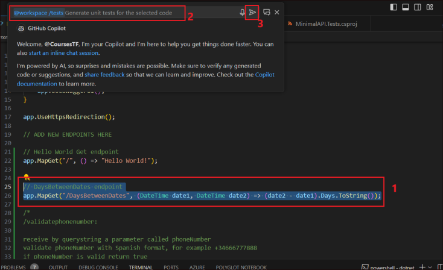

3.  생성된 테스트 복사하세요.

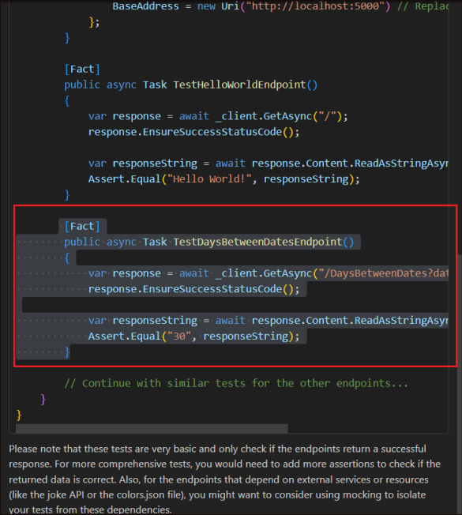

4.  MinimalAPI.Tests에서 IntegrationTests.cs를 여세요.

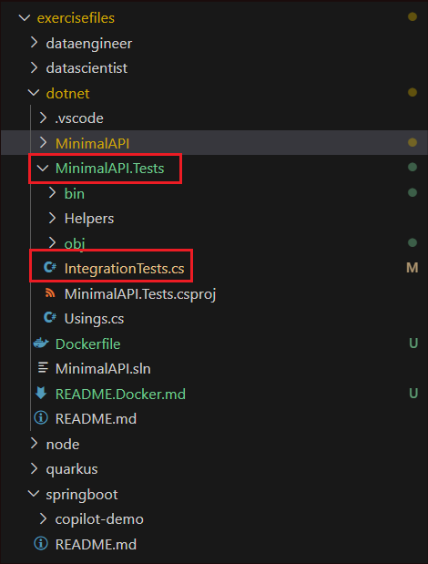

5.  Hello World의 테스트 블록 뒤에 cs 파일에 붙여넣으세요. 발생할 수
    있는 모든 문제 해결하세요.

6.  왼쪽 창에서 Copilot chat을 여세요.

7.  테스트 단위를 만드는 명령인 /tests를 입력하고 **Enter** 키를
    누르세요. Copilot은 테스트 파일을 생성합니다. 내용을 복사하세요.

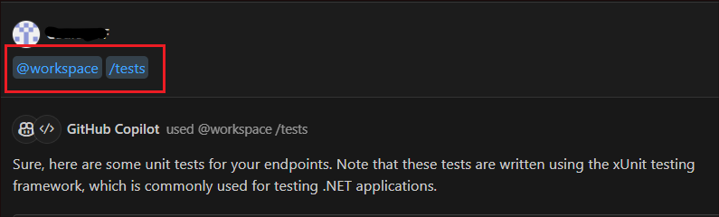

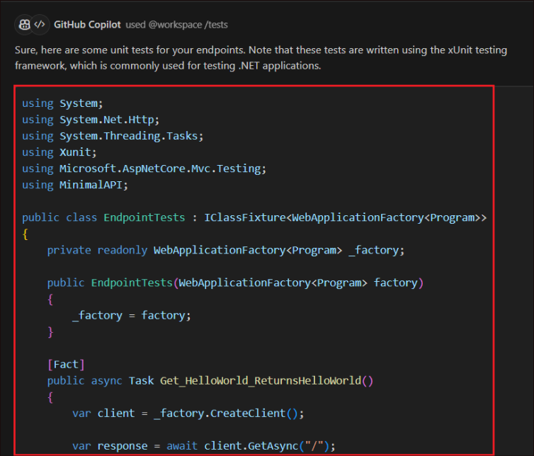

8.  **MinimalAPI.Tests**에서 **IntegrationTests.cs**를 여세요.

9.  파일의 내용을 Copilot에서 생성된 코드로 바꾸고 저장하세요.

**중요:** 오류가 있는지 확인하고 /fix 명령을 사용하거나 수동으로
수정하세요. 아래 참조 코드를 사용하여 문제를 해결하세요..

10. 모든 엔드포인트에 대해 테스트가 생성되지 않은 경우 채팅에서
    엔드포인트 이름을 지정하고 Copilot에게 아래와 같이 테스트를
    생성하도록 요청하세요. 테스트에서 업데이트된 엔드포인트 이름과
    누락된 엔드포인트 이름을 업데이트히세요.

generate test units for moviesbydirector, parseurl, listfiles,
calculatememoryconsumption and randomeuropeancountry

**Reference Code:**

using System;

using System.Net.Http;

using System.Threading.Tasks;

using Microsoft.AspNetCore.Mvc.Testing;

using Xunit;

public class EndpointTests :
IClassFixture\<WebApplicationFactory\Program\>\>

{

private readonly WebApplicationFactory\<Program\> \_factory;

private readonly HttpClient \_client;

public EndpointTests(WebApplicationFactory\<Program\> factory)

{

\_factory = factory;

\_client = \_factory.CreateClient();

}

\[Fact\]

public async Task Get_HelloWorld_ReturnsHelloWorld()

{

var response = await \_client.GetAsync("/");

response.EnsureSuccessStatusCode();

var stringResponse = await response.Content.ReadAsStringAsync();

Assert.Equal("Hello World!", stringResponse);

}

\[Fact\]

public async Task Get_ValidatePhoneNumber_ReturnsInvalid()

{

var response = await
\_client.GetAsync("/validatephonenumber?phonenumber=123456789");

response.EnsureSuccessStatusCode();

var stringResponse = await response.Content.ReadAsStringAsync();

Assert.Equal("False", stringResponse);

}

\[Fact\]

public async Task Get_ValidateSpanishDni_ReturnsValid()

{

var response = await
\_client.GetAsync("/validatespanishdni?dni=12345678Z");

response.EnsureSuccessStatusCode();

var stringResponse = await response.Content.ReadAsStringAsync();

Assert.Equal("valid", stringResponse);

}

\[Fact\]

public async Task Get_Color_ReturnsHexCode()

{

var response = await \_client.GetAsync("/color?color=red");

response.EnsureSuccessStatusCode();

var stringResponse = await response.Content.ReadAsStringAsync();

Assert.Equal("#FF0000", stringResponse); // assuming red color returns
\#FF0000

}

\[Fact\]

public async Task Get_TellMeAJoke_ReturnsJoke()

{

var response = await \_client.GetAsync("/tellmeajoke");

response.EnsureSuccessStatusCode();

var stringResponse = await response.Content.ReadAsStringAsync();

Assert.NotNull(stringResponse); // assuming the joke API always returns
a joke

}

\[Fact\]

public async Task Get_ParseUrl_ReturnsHost()

{

var response = await
\_client.GetAsync("/parseurl?someurl=https://www.example.com");

response.EnsureSuccessStatusCode();

var stringResponse = await response.Content.ReadAsStringAsync();

Assert.Equal("www.example.com", stringResponse);

}

\[Fact\]

public async Task Get_ListFiles_ReturnsFiles()

{

var response = await \_client.GetAsync("/listfiles");

response.EnsureSuccessStatusCode();

var stringResponse = await response.Content.ReadAsStringAsync();

Assert.NotNull(stringResponse); // assuming the API always returns a
list of files

}

\[Fact\]

public async Task Get_CalculateMemoryConsumption_ReturnsMemoryUsage()

{

var response = await \_client.GetAsync("/calculatememoryconsumption");

response.EnsureSuccessStatusCode();

var stringResponse = await response.Content.ReadAsStringAsync();

Assert.NotNull(stringResponse); // assuming the API always returns a
memory usage

}

\[Fact\]

public async Task Get_RandomEuropeanCountry_ReturnsCountry()

{

var response = await \_client.GetAsync("/randomeuropeancountry");

response.EnsureSuccessStatusCode();

var stringResponse = await response.Content.ReadAsStringAsync();

Assert.NotNull(stringResponse); // assuming the API always returns a
country

}

// Add similar tests for the other endpoints

}

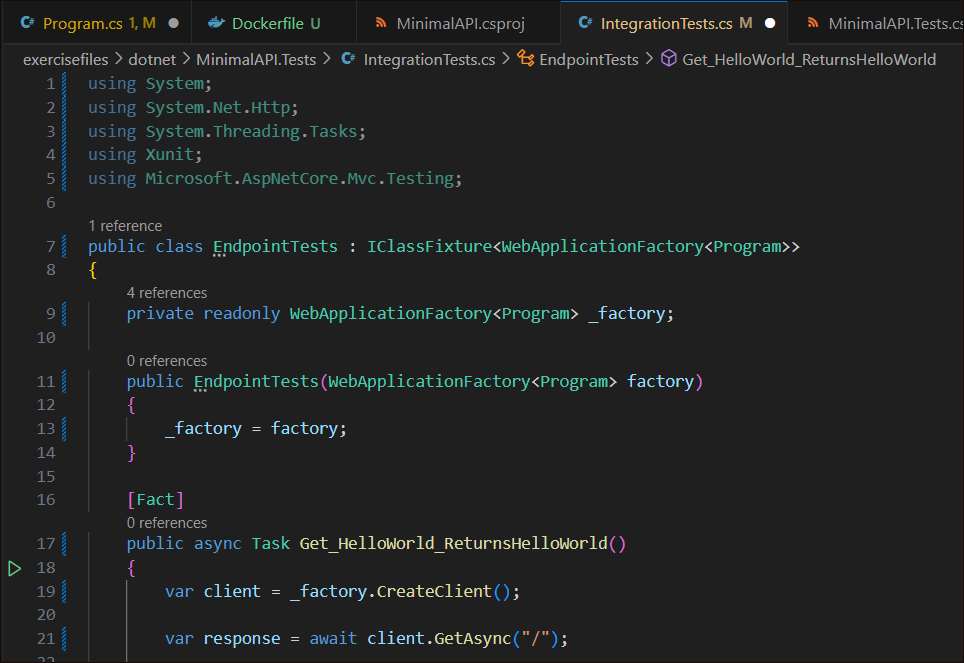

11. 터미널에서 **dotnet test** 명령을 실행하세요.

12. 테스트를 통과하면 아래 스크린샷과 유사한 출력이 표시됩니다.

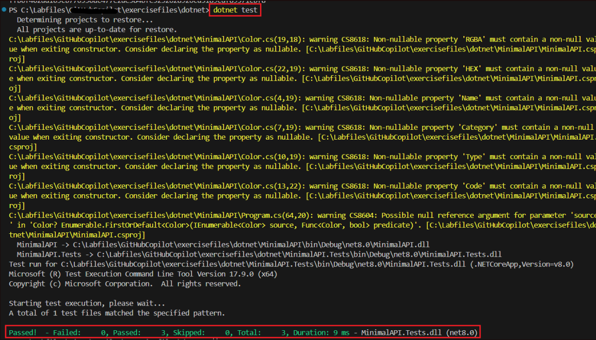

13. 필요한 경우 더 많은 테스트를 추가할 수 있습니다.

**연습 6: Dockerfile 생성하기**

1.  **dotnet** 폴더를 마우스 오른쪽 버튼으로 클릭하고 **New File**을
    선택하고 파일 이름을 **Dockerfile**로 지정하세요.

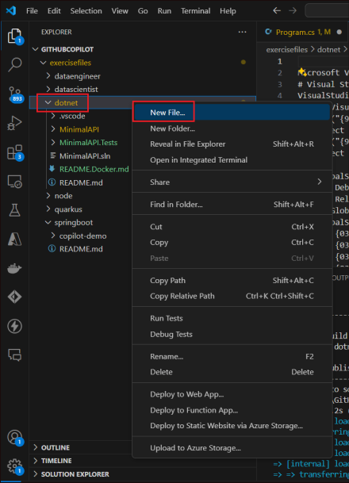

2.  파일을 **Dockerfile**로 입력하세요.

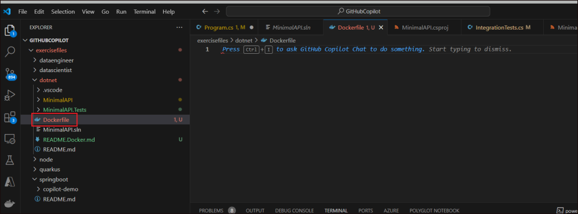

3.  새로 생성된 파일에서 **Ctrl+I**를 누르고 아래 텍스트를 입력한 후
    **Enter** 키를 누르세요.

**Generate content for Dockerfile for .NET 8 Project Name - MinimalAPI**

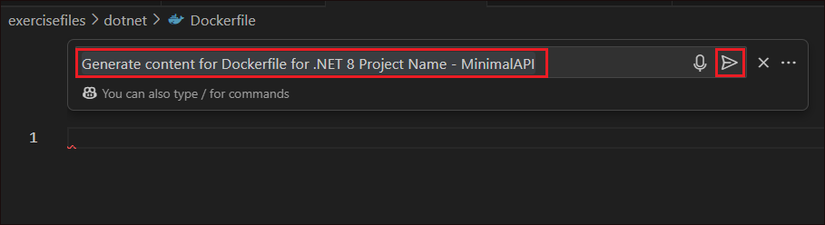

4.  생성된 코드를 수락하세요.

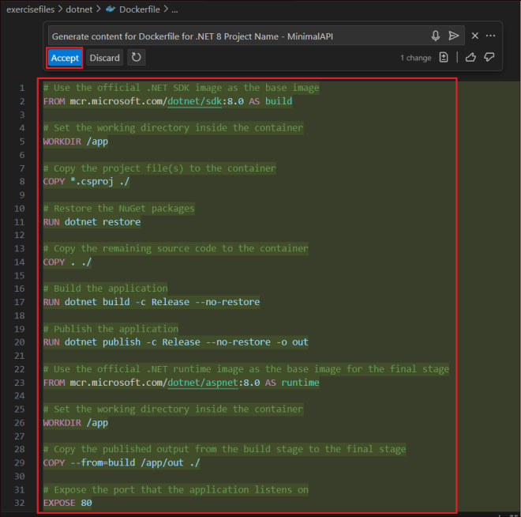

5.  파일을 저장하세요. 터미널에서 아래 명령을 실행하세요.

docker build -t dotnetapp .

참조 코드를 사용하여 오류가 있는 경우 해결하세요.

**Reference Code:**

\# Use the official .NET SDK image as the base image

FROM mcr.microsoft.com/dotnet/sdk:8.0 AS build

\# Set the working directory in the container

WORKDIR /app

\# Copy the project file(s) to the container

COPY \*.csproj ./

\# Copy the remaining source code to the container

COPY . ./

\# Build the application

RUN dotnet build -c Release

\# Publish the application

RUN dotnet publish -c Release --no-build -o out

\# Use the official .NET runtime image as the base image for the final
stage

FROM mcr.microsoft.com/dotnet/runtime:8.0 AS runtime

\# Set the working directory in the container

WORKDIR /app

\# Copy the published output from the build stage to the final stage

COPY --from=build /app/out ./

\# Set the entry point for the container

ENTRYPOINT \["dotnet", "MinimalAPI.dll"\]

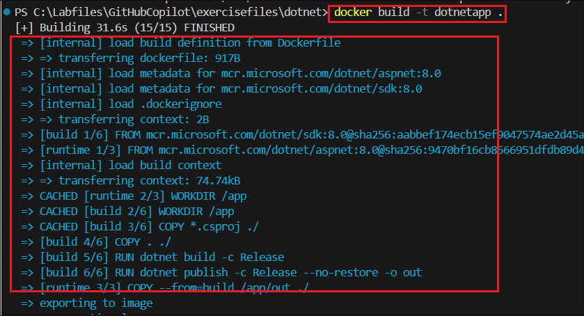

6.  아래 명령을 실행하여 포트 8080에서 앱을 실행하세요.

docker run -d -p 8080:80 --name dotnetapp dotnetapp

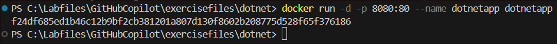

7.  이제 docker에서 dotnet 앱이 실행되고 있습니다.

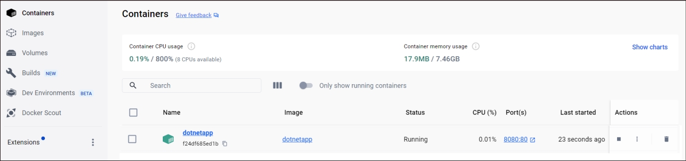
