**Lab 22 - Creare un Notebook utilizzando la chat di Github Copilot e
fornire risposte basate sui dati del test INTRODUZIONE**

Questo set di dati tested_worldwide.csv origine da Kaggle. Questo set di
dati, che contiene il numero di test condotti nel tempo, è importante
per aiutare a dare un senso ai casi segnalati quotidianamente e capire
come il COVID-19 si sta realmente diffondendo in ogni paese.

**ISTRUZIONI**

1.  Aprire Visual Studio Code dal menu Start di Windows e aprire la
    cartella passando a C:\Labfiles\CopilotHackathon

2.  Fare clic sul pulsante **Yes,I Trust the Author**.

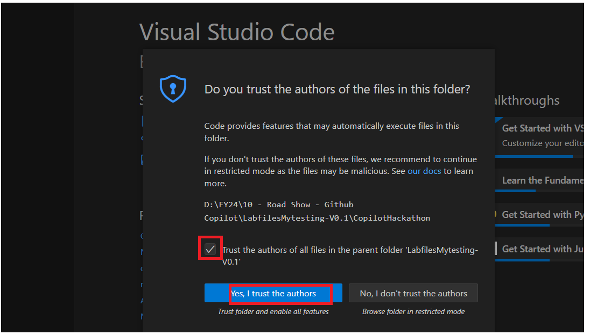

3.  Fare clic sull'icona **Copilot** nell'angolo destro in basso e
    selezionare **Github Copilot Chat.**

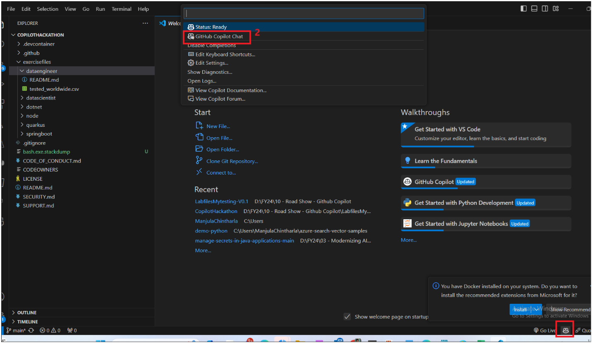

4.  Digitare il prompt per creare un nuovo notebook in un
    progetto. Utilizzare il comando /newnotebook e denominarlo "COVID19
    Worldwide Testing Data"

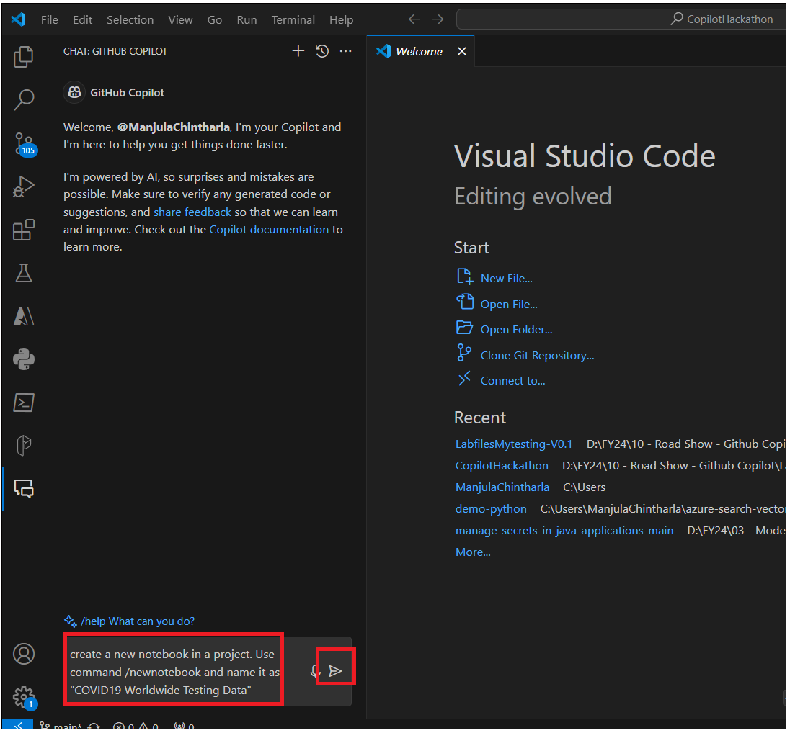

5.  Puoi vedere le istruzioni del Copilot che vi aiutano con le
    istruzioni. Seguire i passaggi e creare il notebook.

    - Aprire il riquadro comandi premendo **Ctrl+Shift+P.**

    - Digitare Jupyter: Creare New Blank Notebook e premere Enter.

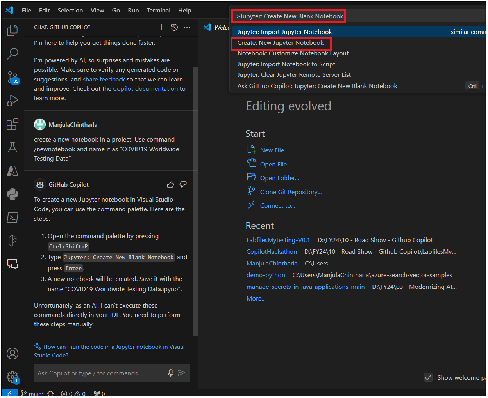

- Verrà creato un nuovo notebook. Salvalo con il nome
  COVID19WorldwideTesting Data.ipynb. Puoi anche chiedere a Copilot come
  salvare un nuovo notebook.

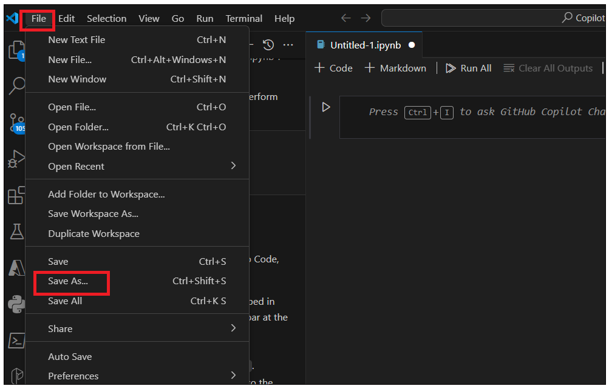

- Andare alla cartella di destinazione - **excercisefiles-?
  dataengineer **inserire il COVID19WorldwideTesting Data.ipynb e
  salvare il file.

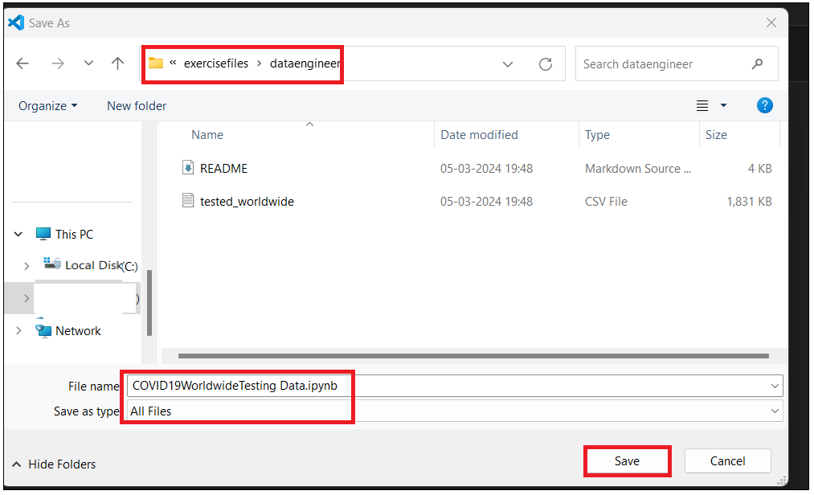

6.  Dovresti vedere che il file è stato creato nella cartella
    **dataengineer**.

7.  Usare Copilot e Copilot Chat per sviluppare l'esercizio e supportare
    il vostro apprendimento.

**ESERCIZIO**

La nostra analisi cerca di fornire una risposta a questa domanda:
**Which countries have reported the highest number of positive cases in
relation to the number of tests conducted?**

**Attività 1: Importazione delle librerie richieste**

1.  Fare clic su Kernel notebook e digitare \#Import Required Libraries,
    Including Pandas e premere Enter

2.  Premere Tab. Vi porterà al capolinea. Premere Enter e premere
    nuovamente Tab per aggiungere tutte le librerie.

\# Import the necessary libraries, including pandas.

\# Import Required Libraries

\# Here we are importing the necessary libraries for our task

import pandas as pd \# pandas is a software library written for the
Python programming language for data manipulation and analysis.

**Attività 2 : Caricare il Dataset**

1.  Usare pandas per caricare il file 'tested_worldwide.csv' dal livello
    principale.

2.  Chiedere a Github Copilot di aiutarti su come caricare i dati.
    Entrare Usa pandas per caricare il file 'tested_worldwide.csv' dal
    livello principale

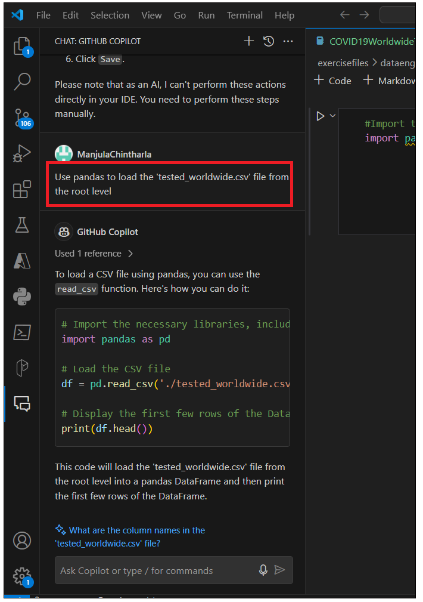

3.  Inserire il codice seguente in un notebook ed eseguilo. Vi chiederà
    di selezionare **Python Environment**. Selezionalo.

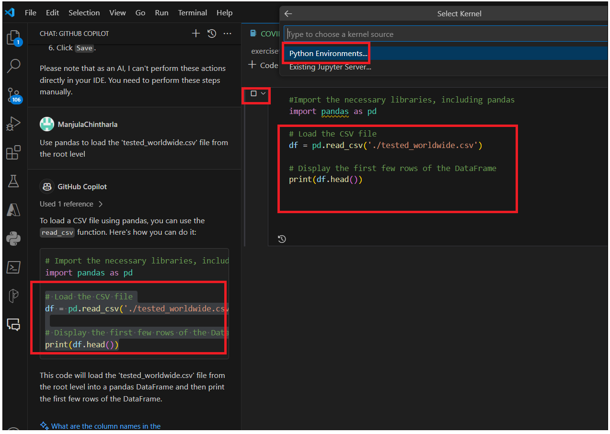

4.  Selezionare l'ambiente consigliato. Lo script viene eseguito e
    fornisce i risultati.

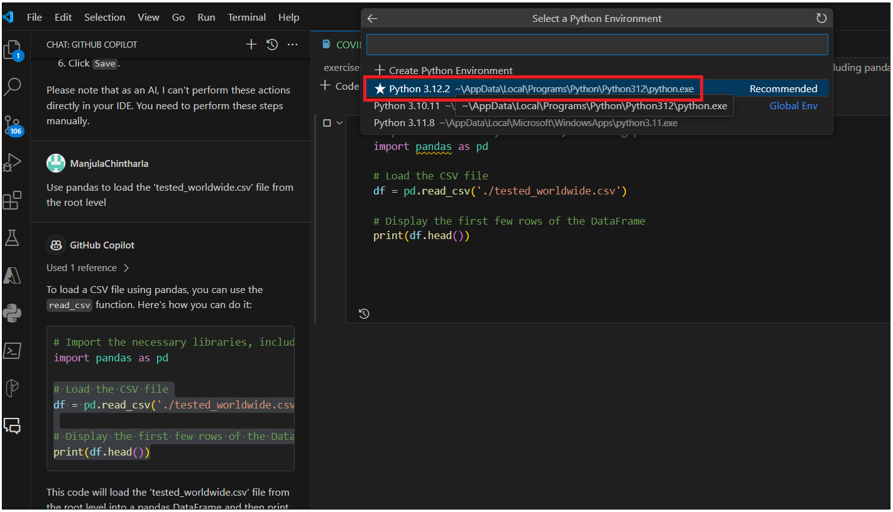

Attività 3 : Comprensione dei dati

1.  Utilizzare la funzione head() per visualizzare le prime 5 righe del
    set di dati

2.  Chiedere al vostro Github Copilot di aiutarti con il codice per
    visualizzare le prime 5 righe del dataset. Visualizzare le prime 5
    righe del dataset

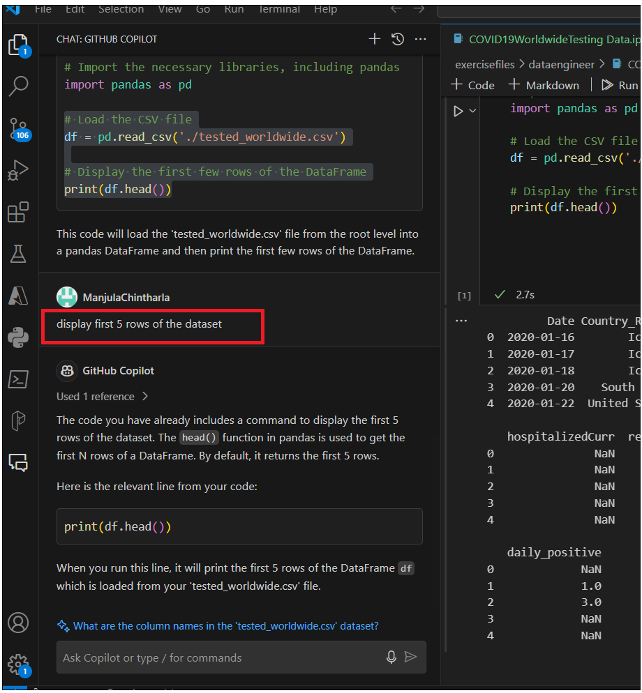

3.  Fare clic su **+ code** per aprire un nuovo kerner. Basta inserire
    \# per visualizzare le prime 5 righe del dataset. Predirà
    automaticamente la vostra domanda. Basta premere tag e quindi
    premere Enter.

4.  **Coiplot** prevede il comando che stai cercando, quindi premere la
    scheda per accettare il codice. Hai sempre la possibilità di
    modificare/scrivere il vostro codice.

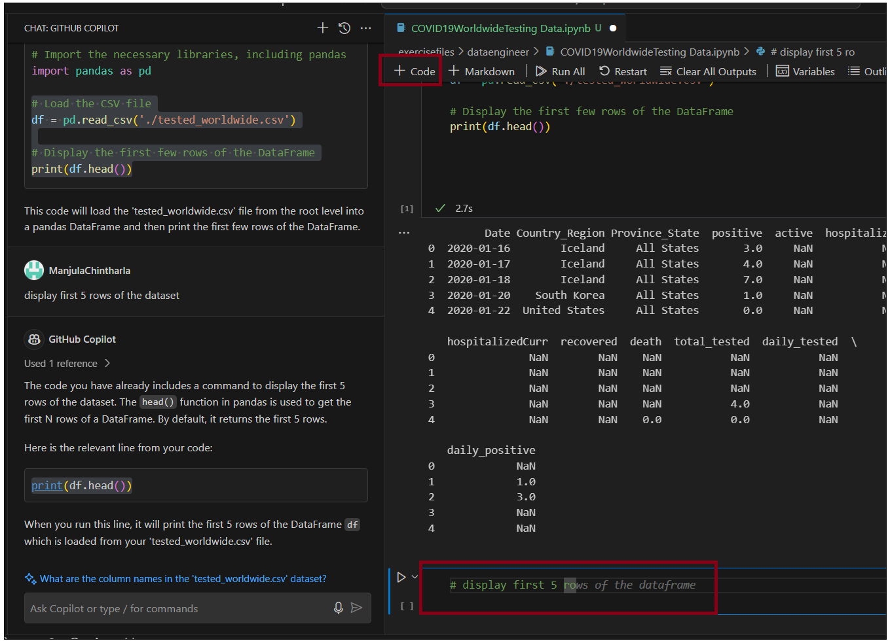

5.  Premere la scheda e accettare il codice. Eseguire il kernel.

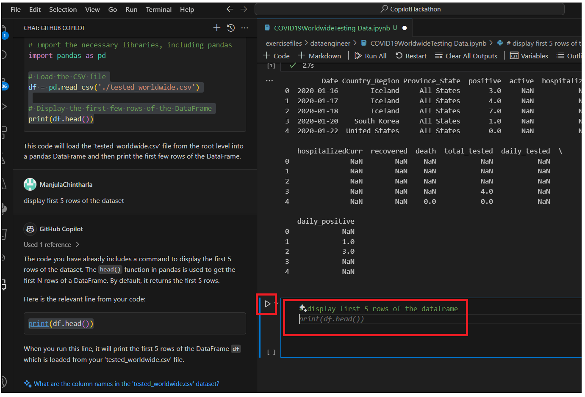

6.  Dovresti vedere i risultati.

7.  Chiedere al vostro copilot di aiutarti a visualizzare il numero di
    righe e colonne nel dataframe. Fare clic su +code .enter il codice e
    quindi eseguire il kernel. Puoi anche utilizzare il codice
    sottostante

8.  num_rows, num_cols = data.shape

9.  print("Number of rows:", num_rows)

print("Number of columns:", num_cols)

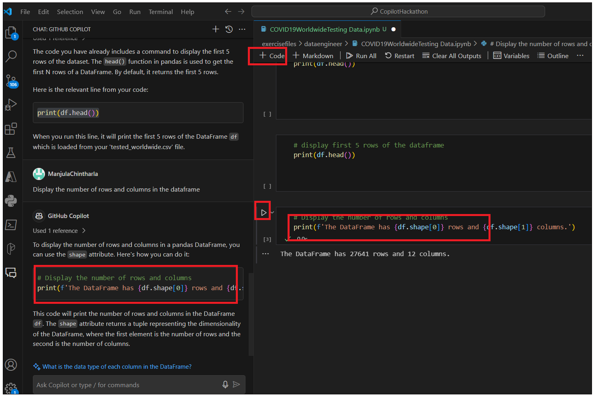

10. Chiedere al vostro Copilot di aiutarti con questo Display i tipi di
    dati di ogni colonna . È inoltre possibile utilizzare data.dttypes

11. Chiedere al vostro GitHub Copilot di fornire il codice per
    Visualizzare il numero di valori mancanti in ogni colonna.

12. Aggiungere un nuovo kernel e aggiungi il codice sottostante ed
    eseguilo. Puoi anche utilizzare il codice suggerito da Copilot e
    controllare

13. missing_values = df.isnull().sum()

print(missing_values)

14. Eseguire il codice seguente nel nuovo kernel per visualizzare il
    numero di valori univoci in ogni colonna. Verificare con il vostro
    copilot il codice e i risultati.

15. unique_values = df.nunique()

print(unique_values)

**Attività 4 : Pulizia dei dati**

1.  Eseguire il codice seguente per eliminare le colonne non necessarie
    per l'analisi. Chiedere al vostro copilot il codice e controllare i
    risultati.

data = df\[\['Country_Region', 'positive', 'total_tested'\]\]

2.  Digitare \#Rename le colonne per renderle più leggibili in un nuovo
    kernel e accettare il codice.

3.  È possibile utilizzare il codice seguente ed eseguirlo.

df.rename(columns={'Country_Region': 'Country', 'positive': 'Positive
Cases', 'total_tested': 'Total Tested'}, inplace=True)

4.  Chiedere al vostro copilot di eliminare le righe con valori mancanti
    ed eseguire il codice in un nuovo kernel o digitare \#Drop le righe
    con valori mancanti nel nuovo kernel premere Enter. Premere la
    scheda e accettare il codice.

5.  Aggiungere un nuovo kernel +Code e digitare \#Convert i tipi di dati
    delle colonne ai tipi appropriati, premere **tag** per accettare il
    codice, di nuovo invio e premere tab. Generare il codice per i casi
    positivi, il totale testato e il paese, quindi eseguilo.

6.  Aggiungere un nuovo kernel +Code e digitare \#Display il numero di
    valori mancanti in ogni colonna E premere Enter. Premere Tab e
    accettare il codice. Puoi anche chiedere nella chat di GitHub
    Copilot

**Attività 5 : Estrarre i primi dieci paesi con il maggior numero di
casi di Covid-19.**

1.  Chiedere alla chat di Copilot di aiutarti con il codice Creare un
    nuovo dataframe che contiene il numero totale di casi positivi per
    ogni paese Oppure aprire un nuovo codice e digitare \#Create un
    nuovo dataframe che contiene il numero totale di casi positivi per
    ogni paese e premere Enter. Premere Tab per accedere al codice.

2.  In un nuovo codice, inserire i prompt sottostanti e inserire dopo
    ogni prompt per accettare il codice ed eseguirlo.

3.  \# Group the data by 'Country' and calculate the sum of 'Positive
    Cases'

4.  total_positive_cases = data.groupby('Country')\['Positive
    Cases'\].sum()

5.  \# Create a new dataframe with the total positive cases for each
    country

6.  df_total_positive_cases = pd.DataFrame({'Country':
    total_positive_cases.index, 'Total Positive Cases':
    total_positive_cases.values})

7.  \# Display the new dataframe

df_total_positive_cases

8.  Chiedere a Copilot di ordinare il dataframe in ordine decrescente
    del numero totale di case positivi Oppure digitare \# Ordina il
    dataframe in ordine decrescente del numero totale di case positivi.
    Nel nuovo kernel Code premere il tag per accettare il codice ed
    eseguirlo.

9.  Chiedere alla vostra chat Github Copilot di aiutarti con
    Visualizzare i primi dieci paesi con il maggior numero di casi
    positivi Oppure digitare \# Visualizzare i primi dieci paesi con il
    maggior numero di casi positivi. Nel nuovo kernel del codice ed
    eseguilo. Ricordare che devi solo visualizzare.

**Attività 6: Identificare il più alto numero di casi positivi rispetto
ai casi testati**

1.  Chiedere al vostro GitHub Copilot Chat di aiutarti in questo. Creare
    un nuovo dataframe che contiene il numero totale di test condotti
    per ogni paese o aprire il nuovo kernel del codice e digitare \#
    Creare un nuovo dataframe che contiene il numero totale di test
    condotti per ogni paese e premere il tasto Tab per accedere al
    codice. Se necessario, è possibile modificare il codice ed
    eseguirlo.

2.  \# Group the data by 'Country' and calculate the sum of 'Total
    Tested'

3.  total_tests = data.groupby('Country')\['Total Tested'\].sum()

4.  

5.  \# Create a new dataframe with the total tests conducted for each
    country

6.  df_total_tests = pd.DataFrame({'Country': total_tests.index, 'Total
    Tests': total_tests.values})

7.  

8.  \# Display the new dataframe

df_total_tests

9.  Chiedere alla chat di Github Copilot Ordinare il dataframe in ordine
    decrescente del numero totale di test condotti Oppure aprire un
    nuovo kernel di codice, digitare \# Ordinare il dataframe in ordine
    decrescente del numero totale di test condotti E premere tab per
    accettare il codice ed eseguirlo.

10. Chiedere alla vostra chat Github Copilot Visualizzare i primi dieci
    paesi con il maggior numero di test condotti Oppure apri un nuovo
    kernel del codice, digitare \# Visualizzare i primi dieci paesi con
    il maggior numero di test condotti E premere il tasto Tab per
    accettare il codice ed eseguirlo.

**Attività 7 : Identificare i primi tre paesi che hanno avuto il maggior
numero di casi positivi rispetto al numero di test effettuati**

1.  Chiedere alla chat di Github Copilot Unire i due dataframe creati
    nei passaggi precedenti Oppure aprire un nuovo kernel di codice e
    digitare \# Visualizzare i primi dieci paesi con il maggior numero
    di test condotti E premere il tasto Tab per accettare il codice ed
    eseguirlo.

2.  Chiedere alla vostra chat Github Copilot Creare una nuova colonna
    che contiene il rapporto tra i casi positivi e il numero di test
    condotti Oppure aprire un nuovo kernel di codice e digitare \#
    Creare una nuova colonna che contiene il rapporto tra casi positivi
    e numero di test condotti E premere tab per accettare il codice ed
    eseguirlo.

3.  Chiedere alla vostra chat Github Copilot Ordinare il dataframe in
    ordine decrescente del rapporto tra casi positivi e numero di test
    condotti Oppure aprire un nuovo kernel di codice e digitare \#
    Ordinare il dataframe in ordine decrescente del rapporto tra casi
    positivi e numero di test condotti E premere la scheda per accettare
    il codice ed eseguirlo.

4.  Chiedere alla chat di Github Copilot Visualizzare i primi tre paesi
    con il più alto rapporto tra casi positivi e numero di test condotti
    Oppure apri un nuovo kernel di codice e digitare \#Display i primi
    tre paesi con il più alto rapporto tra casi positivi e numero di
    test condotti E premere la scheda per accettare il codice ed
    eseguirlo

5.  \#Display the top three countries with the highest ratio of positive
    cases to the number of tests conducted

6.  top_countries = merged_df.nlargest(3, 'Positive Test Rate')

top_countries\[\['Country', 'Positive Test Rate'\]\]

**Attività 8: Visualizzazione dei risultati**

1.  Chiedere al vostro Github Copilot Chat di visualizzare i risultati
    un grafico che mostra i primi tre paesi con il più alto rapporto di
    casi positivi rispetto al numero Oppure apri un nuovo kernel di
    codice e digitare \# Visualizzare i risultati un grafico che mostra
    i primi tre paesi con il più alto rapporto di casi positivi rispetto
    al numero E premere la scheda per accettare il codice ed eseguirlo

2.  \#Display the results a chart that shows the top three countries
    with the highest ratio of positive cases to the number

3.  import matplotlib.pyplot as plt

top_countries.plot(x='Country', y='Positive Test Rate', kind='bar')

4.  Chiedere alla chat di Github Copilot di visualizzare i risultati in
    un grafico che mostra i primi dieci paesi con il maggior numero di
    casi positivi Oppure aprire un nuovo kernel di codice e digitare \#
    Visualizzare i risultati in un grafico che mostra i primi dieci
    paesi con il maggior numero di casi positivi E premere la scheda per
    accettare il codice ed eseguirlo

5.  \#Display the results in a chart that shows the top ten countries
    with the most positive cases

6.  import matplotlib.pyplot as plt

7.  df_total_positive_cases.head(10).plot(x='Country', y='Total Positive
    Cases', kind='bar')

8.  plt.xlabel('Country')

9.  plt.ylabel('Total Positive Cases')

10. plt.title('Top Ten Countries with the Most Positive Cases')

plt.show()

11. Chiedere alla chat di Github Copilot di visualizzare i risultati in
    un grafico che mostra i primi dieci paesi con il maggior numero di
    test condotti Oppure aprire un nuovo kernel di codice e digitare \#
    Visualizzare i risultati in un grafico che mostra i primi dieci
    paesi con il maggior numero di test condotti E premere la scheda per
    accettare il codice ed eseguirlo

**Attività 9: Conclusione**

1.  Quali sono le sue conclusioni?

2.  Quali sono i limiti di questa analisi?

3.  Quali sono i prossimi passi che farebbe per migliorare questa
    analisi?
