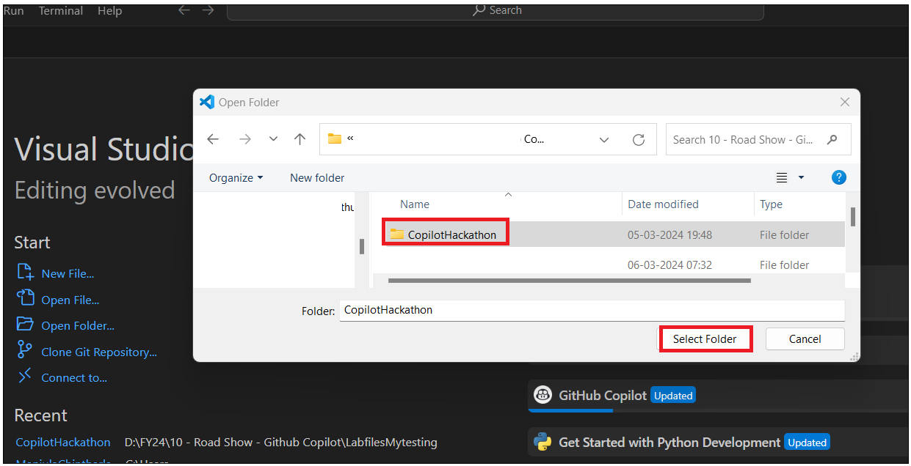
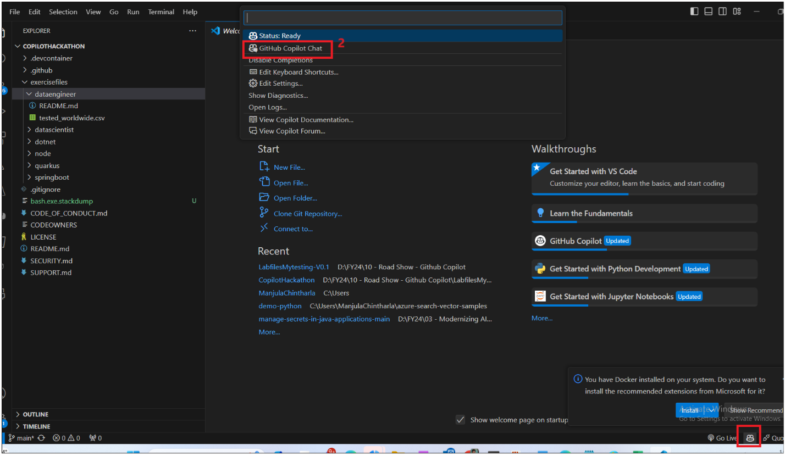
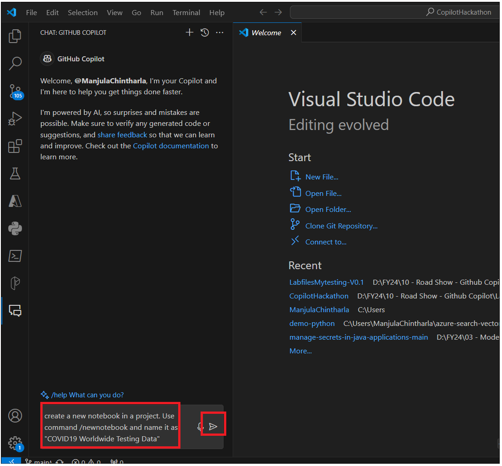
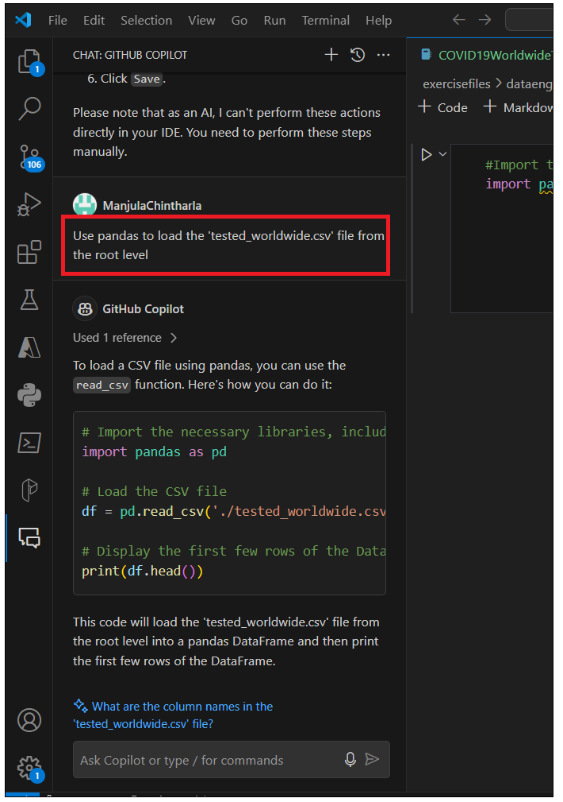
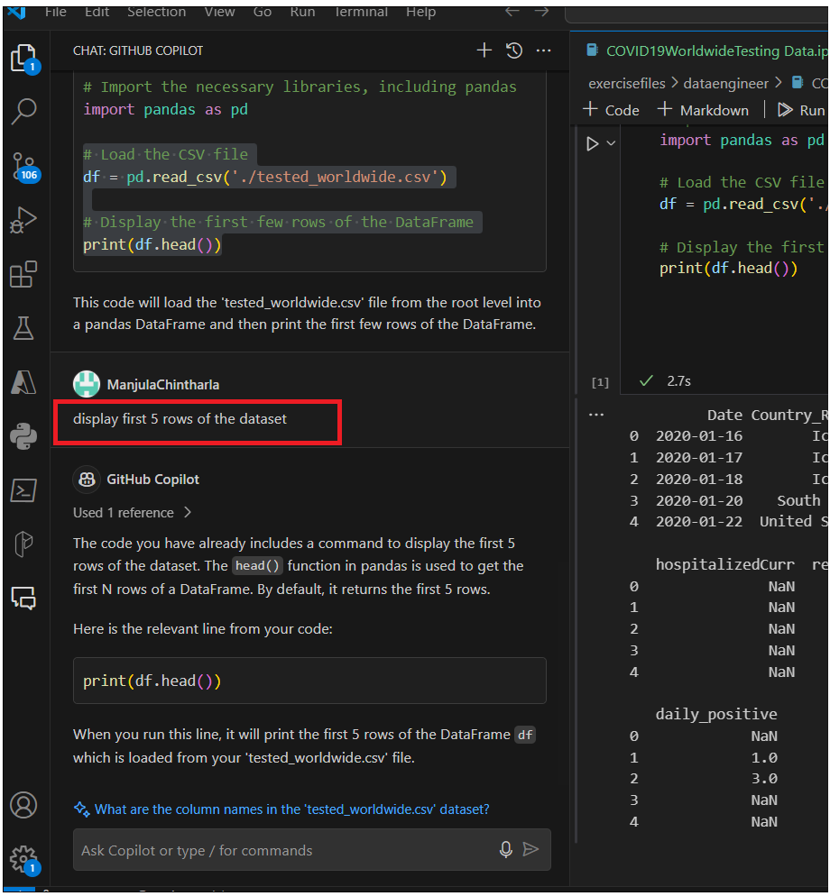
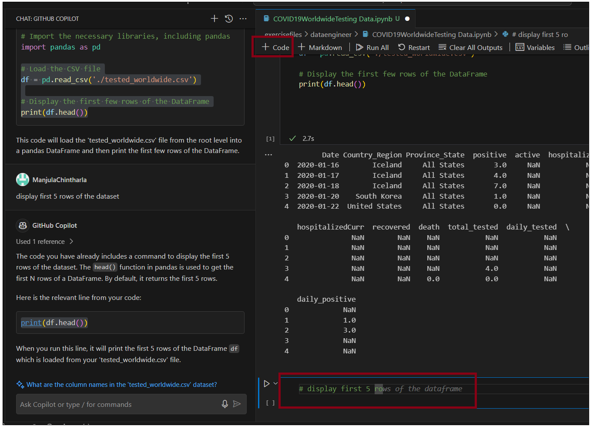
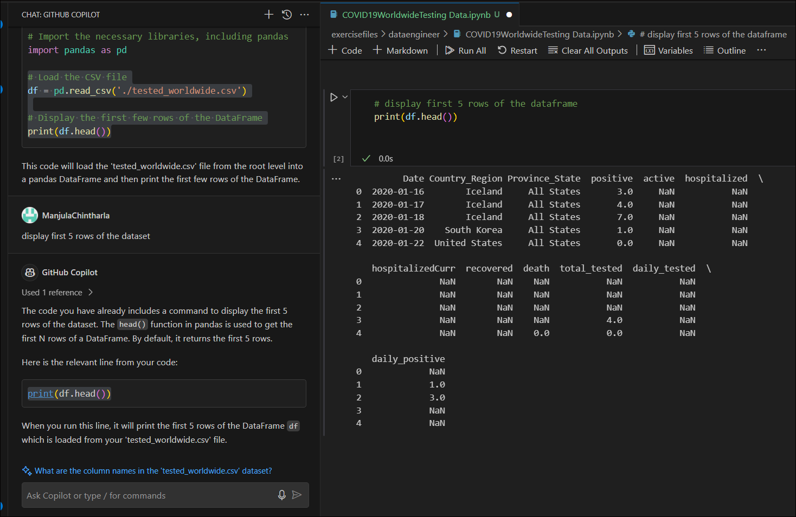
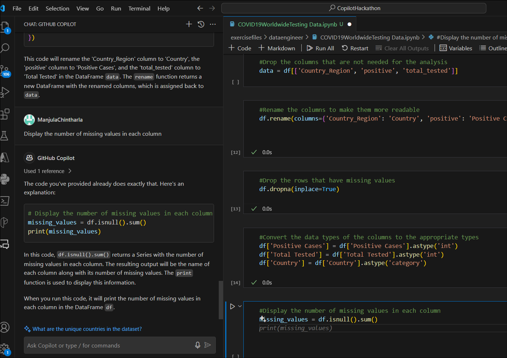
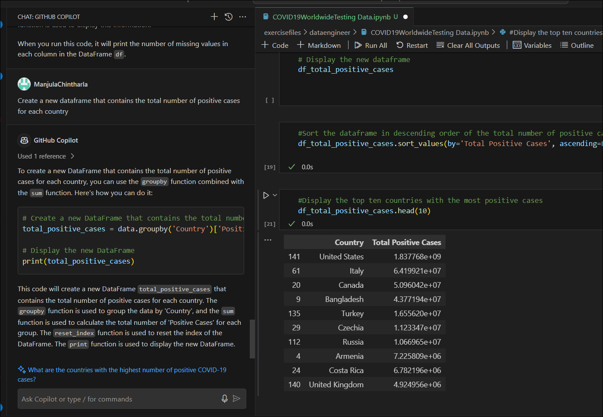
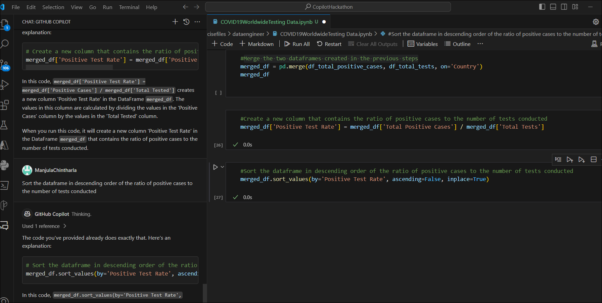

**실습 22 - Github Copilot 채팅을 사용하여 Notebook 만들고 테스트
데이터를 기반으로 답변 제공 소개하기**

이 데이터 세트 tested_worldwide.csv은 Kaggle에서 시작되었습니다. 시간이
지남에 따라 수행된 검사 수가 포함된 이 데이터 세트는 매일 보고되는
사례를 이해하고 각 국가에서 COVID-19가 실제로 어떻게 확산되고 있는지
이해하는 데 중요합니다.

**지시**

1.  Windows 시작 메뉴에서 Visual Studio Code를 열고
    C:\Labfiles\CopilotHackathon으로 이동하는 폴더를 여세요.

2.  **Yes, I Trust the Author** 버튼을 클릭하세요.

3.  오른쪽 아래 모서리에 있는 **Copilot** 아이콘을 클릭하고 **Github
    Copilot Chat**을 선택하세요.

4.  프로젝트에 새 Notebook 생성하라는 프롬프트를
    입력하세요. /newnotebook 명령을 사용하고 이름을 "COVID19 Worldwide
    Testing Data"로 지정하세요.

5.  지침에 도움이 되는 Copilot 지침을 볼 수 있습니다. 단계에 따라
    Notebook 생성하세요.

    - **Ctrl+Shift+P**를 눌러 명령 팔레트를 여세요.

    - Jupyter를 입력: 새 빈 Notebook 생성하기를 클릭하고 Enter 키를
      누르세요.

- 새 Notebook이 생성됩니다. COVID19WorldwideTesting Data.ipynb라는
  이름으로 저장하세요. Copilot에게 새 노트북을 저장하는 방법을 요청할
  수도 있습니다.

- 대상 폴더 - **excercisefiles-? dataengineer**로 이동하여
  COVID19WorldwideTesting Data.ipynb를 입력하고 파일을 저장하세요.

6.  **dataengineer** 폴더 아래에 파일이 생성된 것을 볼 수 있습니다.

7.  Copilot 및 Copilot Chat을 사용하여 연습을 개발하고 학습을
    지원하세요.

**연습**

우리의 분석은 이 질문에 대한 답을 제공하려고 합니다: **Which countries
have reported the highest number of positive cases in relation to the
number of tests conducted?**

**작업 1: 필수 라이브러리 가져오기**

1.  Notebook kernel을 클릭하고 Required Libraries.Including
    Pandas#Import 입력하고 Enter 키를 누르세요.

2.  탭 키를 누릅니다. 줄 끝까지 데려다 줄 것입니다. Enter 키를 누른 후
    다시 Tab 키를 눌러 모든 라이브러리를 추가하세요.

\# Import the necessary libraries, including pandas.

\# Import Required Libraries

\# Here we are importing the necessary libraries for our task

import pandas as pd \# pandas is a software library written for the
Python programming language for data manipulation and analysis.

**작업 2 : Dataset를 로드하기**

1.  pandas를 사용하여 루트 수준에서 'tested_worldwide.csv' 파일을
    로드하세요.

2.  데이터를 로드하는 방법에 대해 도움을 받으려면 Github Copilot에
    요청하세요. 입력 pandas 루트 수준에서 'tested_worldwide.csv' 파일
    로드하세요

3.  Notebook에 아래 코드를 입력하고 실행하세요. **Python Environment**을
    선택하라는 메시지가 표시됩니다. 그것을 선택하세요.

4.  권장 환경을 선택하세요. 스크립트가 실행되고 결과를 제공하세요.

작업 3 : 데이터를 이해하기

1.  head() 함수를 사용하여 데이터 세트의 처음 5개 행을 표시하세요.

2.  Github Copilot에 데이터 세트의 처음 5개 행을 표시하는 코드를
    도와달라고 요청하세요. 데이터 세트의 처음 5개 행 표시하세요.

3.  **+ code** 를 클릭하여 새 kerner를 여세요. \# 데이터 세트의 처음 5개
    행을 표시하면 됩니다. 자동으로 질문을 예측합니다. 태그를 누른 후
    Enter 키를 누르세요.

4.  **Copilot**은 찾고 있는 명령을 예측하므로 탭을 눌러 코드를
    수락하세요. 항상 자신의 코드를 편집/작성할 수 있는 옵션이 있습니다.

5.  탭을 누르고 코드를 수락하세요. Kernel을 실행하세요.

6.  결과가 표시되어야 합니다.

7.  Copilot에게 데이터 프레임의 행 및 열 수 표시에 대한 도움을
    요청하세요. +code를 클릭하세요. 코드를 입력한 후 Kernel을
    실행하세요. 아래 코드를 사용할 수도 있습니다.

8.  num_rows, num_cols = data.shape

9.  print("Number of rows:", num_rows)

print("Number of columns:", num_cols)

10. Copilot에게 도움을 요청하세요. 각 열의 데이터 유형 표시하세요.
    data.dttypes를 사용할 수도 있습니다.

11. GitHub Copilot에 각 열에 누락된 값 수 표시에 대한 코드를 제공하도록
    요청허세요.

12. 새 kernel을 추가하고 아래 코드를 추가하고 실행하세요. Copilot에서
    제안한 코드를 사용하여 확인할 수도 있습니다.

13. missing_values = df.isnull().sum()

print(missing_values)

14. 새 Kernel에서 아래 코드를 실행하여 각 열의 고유 값 수를 표시하세요.
    코드 및 결과에 대해 Copilot에게 확인하세요.

15. unique_values = df.nunique()

print(unique_values)

**작업 4 : 데이터 정리**

1.  아래 코드를 실행하여 분석에 필요하지 않은 열을 삭제하세요.
    Copilot에게 코드를 요청하고 결과를 확인하세요.

data = df\[\['Country_Region', 'positive', 'total_tested'\]\]

2.  열을 더 읽기 쉽게 생성하기 위해 \#Rename 새 Kernel에서 입력하고
    코드를 수락하세요.

3.  아래 코드를 사용하여 실행할 수 있습니다.

df.rename(columns={'Country_Region': 'Country', 'positive': 'Positive
Cases', 'total_tested': 'Total Tested'}, inplace=True)

4.  Copilot에게 누락된 값이 있는 행 삭제 그리고 새 Kernel에서 코드를
    실행하거나 누락된 값이 있는 행#Drop 입력 새 Kernel에서 Enter 키를
    누르세요. 탭을 누르고 코드를 수락하세요.

5.  새 +Code Kernel을 추가하고 열의 데이터 유형을 적절한 유형으로
    입력#Convert 태그를 눌러 코드를 수락한 후 다시 입력하고 탭을
    누르세요. 양성 사례, 총 테스트 및 국가에 대한 코드를 생성한 후
    실행하세요.

6.  새 +code kernel을 추가하고 각 열에 누락된 값의 수를 입력#Display
    Enter 키를 누르세요. Tab 키를 누르고 코드를 수락하세요. GitHub
    Copilot 채팅에서 질문할 수도 있습니다.

**작업 5 : Covid-19 사례가 가장 많은 상위 10개 국가를 추출하기**

1.  Copilot 채팅에 코드 도움을 요청하세요. 각 국가의 총 양성 사례 수가
    포함된 새 데이터 프레임 생성하기 또는 새 코드를 열고 각 국가의 총
    양성 사례 수가 포함된 새 데이터 프레임#Create 입력하고 Enter를
    누르세요. Tab 키를 눌러 코드를 수락하세요.

2.  새 코드에서 아래 프롬프트를 입력하고 각 프롬프트 뒤에 입력하여
    코드를 수락하고 실행하세요.

3.  \# Group the data by 'Country' and calculate the sum of 'Positive
    Cases'

4.  total_positive_cases = data.groupby('Country')\['Positive
    Cases'\].sum()

5.  \# Create a new dataframe with the total positive cases for each
    country

6.  df_total_positive_cases = pd.DataFrame({'Country':
    total_positive_cases.index, 'Total Positive Cases':
    total_positive_cases.values})

7.  \# Display the new dataframe

df_total_positive_cases

8.  Copilot에게 총 양성 사례 수의 내림차순으로 데이터 프레임을
    정렬하도록 요청하거나 \# 새 code kernel에서 태그를 눌러 코드를
    수락하고 실행하도록 요청하세요.

9.  Github Copilot 채팅에 도움을 요청하세요 가장 긍정적인 사례가 있는
    상위 10개 국가 표시 또는 \# 새 code kernel에서 가장 긍정적인 사례가
    있는 상위 10개 국가 표시를 입력하고 실행하세요. 표시하기만 하면
    된다는 것을 기억하세요.

**작업 6 : 테스트된 사례에 대해 가장 높은 양성 반응 식별하기**

1.  GitHub Copilot Chat에 도움을 요청하세요. 각 국가에 대해 수행된 총
    테스트 수가 포함된 새 데이터 프레임을 생성하거나 새 code kernel을
    열고 \# 각 국가에 대해 수행된 총 테스트 수가 포함된 새 데이터
    프레임을 생성하고 Tab 키를 눌러 코드를 수락하세요. 필요한 경우
    코드를 편집하고 실행할 수 있습니다.

2.  \# Group the data by 'Country' and calculate the sum of 'Total
    Tested'

3.  total_tests = data.groupby('Country')\['Total Tested'\].sum()

4.  

5.  \# Create a new dataframe with the total tests conducted for each
    country

6.  df_total_tests = pd.DataFrame({'Country': total_tests.index, 'Total
    Tests': total_tests.values})

7.  

8.  \# Display the new dataframe

df_total_tests

9.  Github Copilot Chat에 문의하세요. 수행된 총 테스트 수의 내림차순으로
    데이터 프레임을 정렬하거나 새 code kernel을 열고 \# 데이터 프레임을
    수행된 총 테스트 수의 내림차순으로 정렬하고 탭 키를 눌러 코드를
    선택하고 실행하세요.

10. Github Copilot 채팅에 물어보세요. 가장 많은 테스트를 수행한 상위
    10개 국가 표시 또는 새 code kernel을 열고 \# 가장 많은 테스트를
    수행한 상위 10개 국가 표시 그리고 탭 키를 눌러 코드를 확인하고
    실행하세요.

**작업 7 : 수행된 검사 수에 대해 양성 사례 수가 가장 많은 상위 3개
국가를 식별하기**

1.  Github Copilot 채팅에 문의하세요. 이전 단계에서 생성된 두 개의
    데이터 프레임을 병합하거나 새 code kernel을 열고 \# 가장 많은
    테스트를 수행한 상위 10개 국가 표시를 입력하고 탭 키를 눌러 코드를
    입력하고 실행하세요.

2.  Github Copilot Chat에 물어보세요 수행된 테스트 수에 대한 양성 사례의
    비율이 포함된 새 열 생성하거나 새 code kernel을 열고 \# 수행된
    테스트 수에 대한 양성 사례의 비율이 포함된 새 열 생성하고 탭 키를
    눌러 코드를 수락하고 실행하세요.

3.  Github Copilot Chat에 물어보세요 수행된 테스트 수에 대한 양성 사례의
    비율의 내림차순으로 데이터 프레임을 정렬하거나 새 code kernel을 열고
    \# 수행된 테스트 수에 대한 양성 사례의 비율의 내림차순으로 데이터
    프레임을 정렬하고 탭을 눌러 코드를 수락하고 실행하세요.

4.  Github Copilot 채팅에 물어보세요. 수행된 검사 수 대비 양성 사례
    비율이 가장 높은 상위 3개 국가 표시 또는 새 code kernel을 열고
    수행된 검사 수 대비 양성 사례 비율이 가장 높은 상위 3개 국가#Display
    입력하고 탭을 눌러 코드를 수락하고 실행하세요.

5.  \#Display the top three countries with the highest ratio of positive
    cases to the number of tests conducted

6.  top_countries = merged_df.nlargest(3, 'Positive Test Rate')

top_countries\[\['Country', 'Positive Test Rate'\]\]

**작업 8 : 결과 표시**

1.  Github Copilot Chat에 결과 표시를 요청하세요. 숫자에 대한 양성
    사례의 비율이 가장 높은 상위 3개 국가를 보여주는 차트 또는 새 code
    kernel을 열고 \# 결과를 표시하세요. 숫자에 대한 양성 사례의 비율이
    가장 높은 상위 3개 국가를 보여주는 차트 그리고 탭을 눌러 코드를
    수락하고 실행하세요

2.  \#Display the results a chart that shows the top three countries
    with the highest ratio of positive cases to the number

3.  import matplotlib.pyplot as plt

top_countries.plot(x='Country', y='Positive Test Rate', kind='bar')

4.  Github Copilot Chat에 가장 양성 사례가 많은 상위 10개 국가를
    보여주는 차트에 결과 표시를 요청하거나 새 code kernel을 열고 \# 가장
    긍정적인 사례가 있는 상위 10개 국가를 보여주는 차트에 결과 표시를
    입력하고 탭을 눌러 코드를 수락하고 실행하세요.

5.  \#Display the results in a chart that shows the top ten countries
    with the most positive cases

6.  import matplotlib.pyplot as plt

7.  df_total_positive_cases.head(10).plot(x='Country', y='Total Positive
    Cases', kind='bar')

8.  plt.xlabel('Country')

9.  plt.ylabel('Total Positive Cases')

10. plt.title('Top Ten Countries with the Most Positive Cases')

plt.show()

11. Github Copilot Chat에 가장 많은 테스트를 수행한 상위 10개 국가를
    보여주는 차트에 결과 표시를 요청하거나 새 code kernel을 열고 \# 가장
    많은 테스트를 수행한 상위 10개 국가를 보여주는 차트에 결과 표시를
    입력하고 탭을 눌러 코드를 수락하고 실행하세요.

**작업 9: 결론**

1.  당신의 결론은 무엇입니까?

2.  이 분석의 한계는 무엇입니까?

3.  이 분석을 개선하기 위해 취할 다음 단계는 무엇입니까?
