**ラボ 23 - Github Copilot Chat を使用して Scikit-learn と Python
に基づいて決定木分類器を構築する**

**紹介**

diabetes.csvはもともと国立糖尿病・消化器・腎臓研究所から提供された

病気です。データセットの目的は、患者が糖尿病を患っているかどうかを診断的に予測することです、

データセットに含まれる特定の診断測定値に基づいています。いくつかの制約が課せられました

より大きなデータベースからこれらのインスタンスを選択する場合。特に、ここの患者は全員女性です

ピマ族インディアンの遺産.2で21歳以上。

diabetes.csvからいくつかの変数を見つけることができ、そのうちのいくつかは独立しています

(複数の医学的予測変数) と 1 つのターゲット従属変数 (結果) のみ。

**タスク 1 : Github Copilot Chat を使用してノートブックを作成する手順**

1.  **Visual Studio Code
    のエクスプローラー**から、**データサイエンティスト**を展開します。

2.  右下隅にある 「**Copilot**」 アイコンをクリックし、「**Github
    Copilot Chat**」 を選択します。

3.  プロンプトを入力します
    プロジェクトに新しいノートブックを作成します。コマンド /newnotebook
    を使用して、「Diabetes Tree Classifier」という名前を付けます。

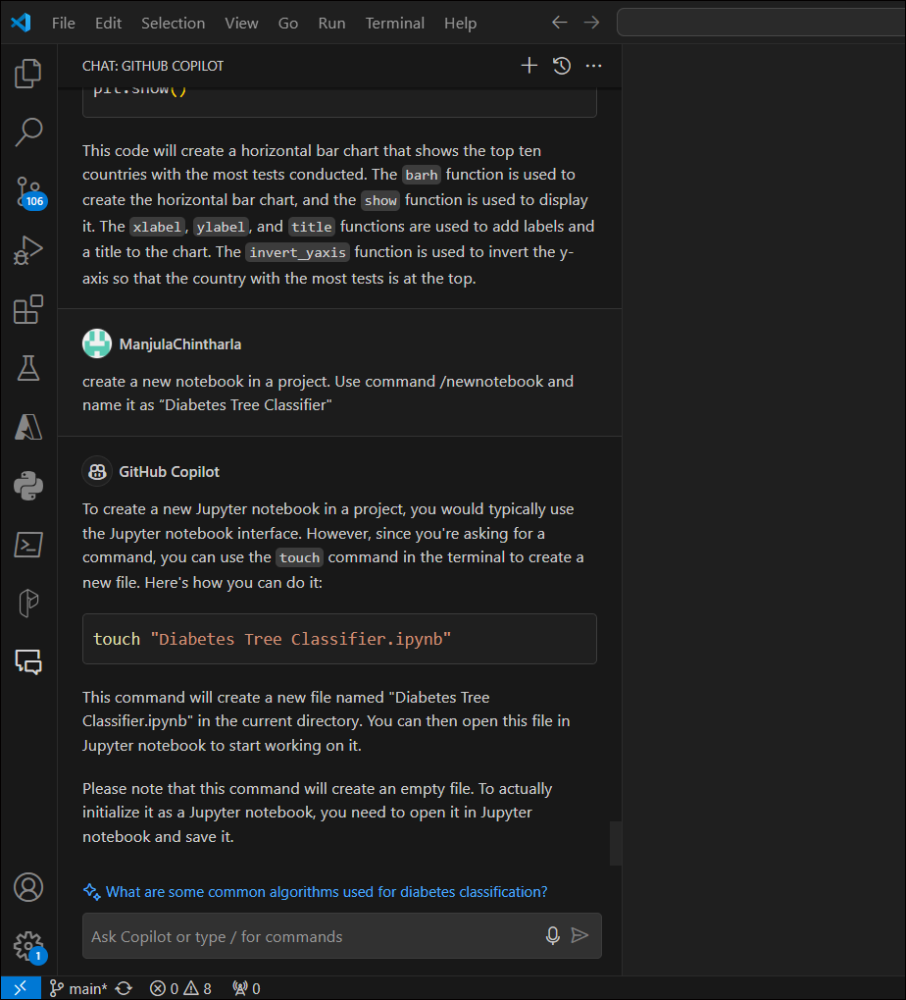

4.  下の画像に示すように、ツールバーから「**Terminal -\> New
    Terminal** 」をクリックします。

5.  ターミナルから**Gitbash**を選択し**、**Copilot が
    **datascientist**ディレクトリで提案したコマンドを実行します。

cd \exercisefiles\datascientist

touch "DiabetesTreeClassifier.ipynb"

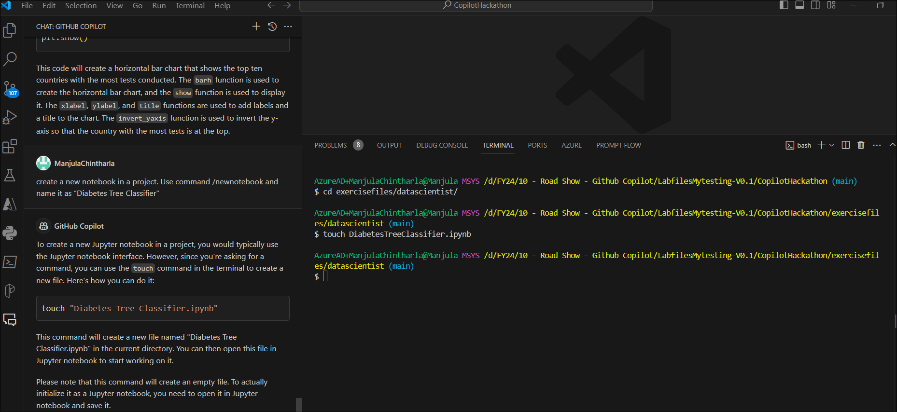

6.  ファイルが **datascientist**
    フォルダーの下に作成されたことがわかります。

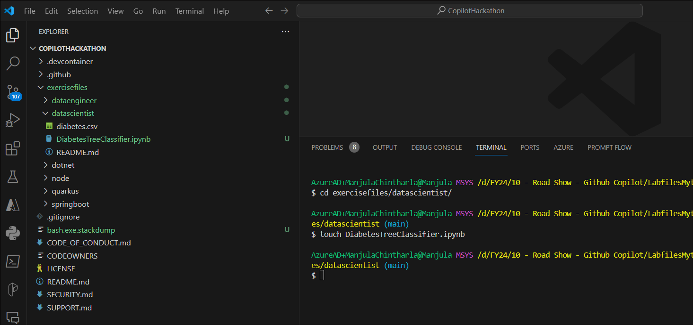

7.  新しく作成したノートブックを選択して、演習を作成します。

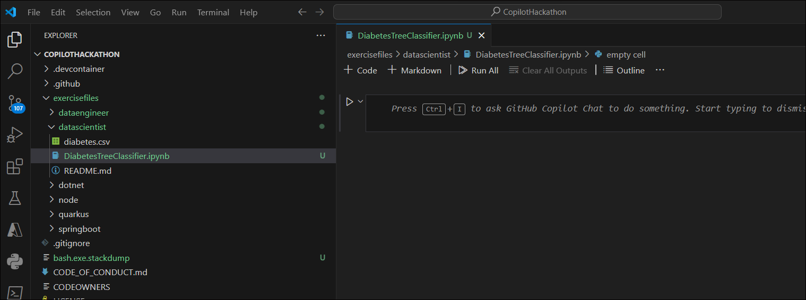

8.  Copilot と Copilot
    チャットを使用して演習を開発し、学習をサポートします。

**運動**

このプロジェクトの目的は、Scikit-learnとPythonに基づく決定木分類器を構築することです。分類器は、患者が糖尿病を患っているかどうかを予測できる必要があります。

データセットに含まれる特定の診断測定値。

**タスク 2 :
デシジョン・ツリー分類子を作成するために必要なライブラリーのインポート**

1.  Notebook kernel をクリックし、「# Import the necessary libraries,
    including pandas, sklearn, etc.」を押して Enter キーを押し、Tab
    キーを押してコードを受け入れます

2.  タブキーを押します。列の最後まで連れて行ってくれます。Enter
    キーを押し、もう一度 Tab
    キーを押して、すべてのライブラリを追加します。

3.  \# pandas for data manipulation and analysis

4.  \# matplotlib for data visualization

5.  \# train_test_split for splitting the data into training and testing
    sets

6.  \# DecisionTreeClassifier for decision tree classification

\# accuracy_score for evaluating the model

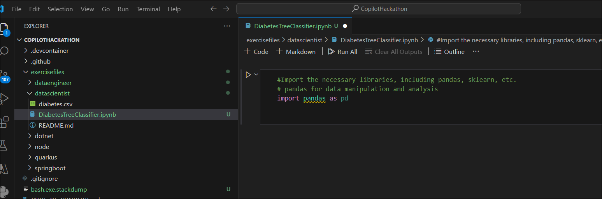

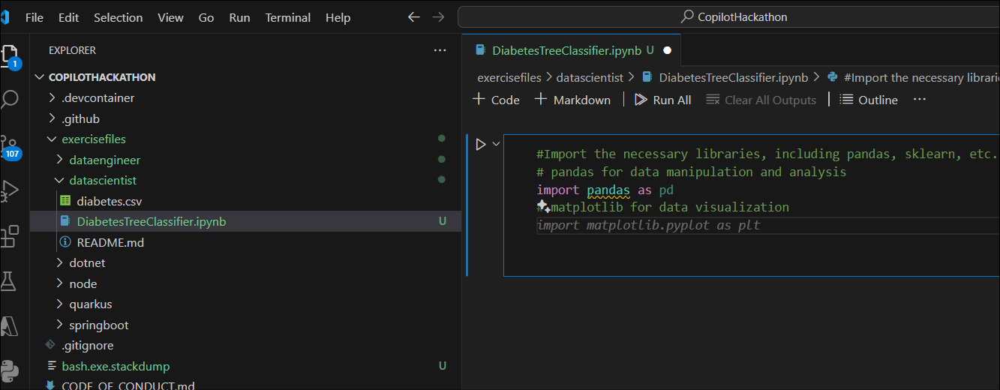

7.  コードを実行すると、Python環境を選択し、それを選択して実行するように求められます。

8.  すべてのライブラリがインポートされるまで待ちます。

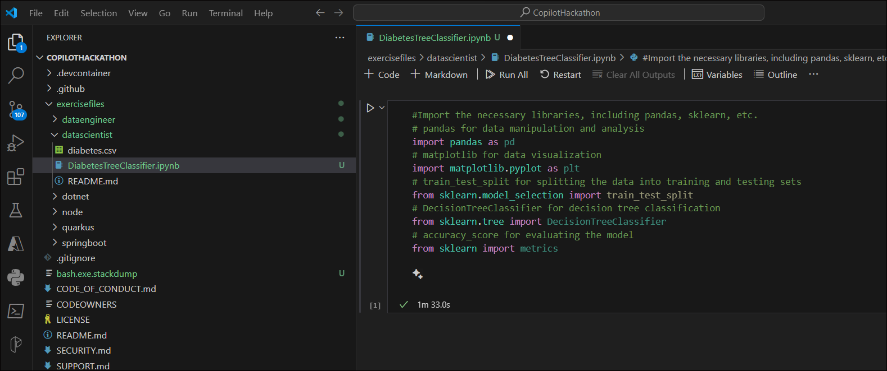

**タスク 3 : データセットのロード**

1.  **diabetes.csv**ファイルを開き、列名を確認します。

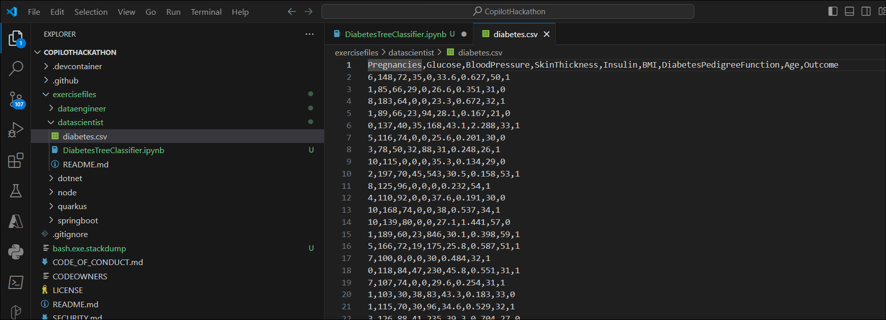

2.  pandasまたはsklearnデータセットから糖尿病データセットをロードします。新しいコードカーネルを開き、「#
    Load the diabetes dataset using pandas or from sklearn
    datasets」と入力し、タブを押してコードを受け入れます

3.  Github Copilot チャットを開き、「to Load the
    diabetes　dataset using pandas or from sklearn
    datasets.」と入力します。コードを提供します
    パンダまたはsklearnデータセットから糖尿病データセットをロードします

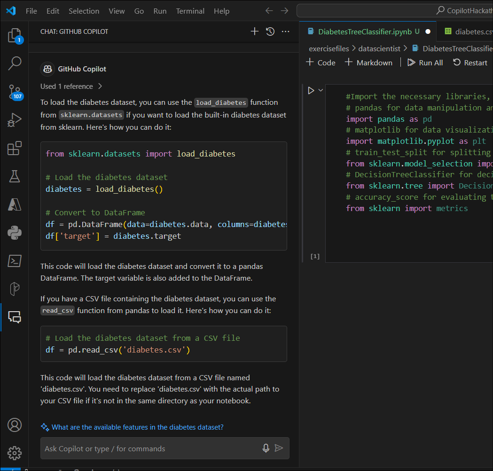

4.  「+コード」 をクリックして新しいカーネルを開き、Copilot
    によって提案されたコードをコピーして実行します。以下のコードを使用してデータを読み込むこともできます。

5.  \# Load the Diabetes Dataset

6.  col_names = \['pregnant', 'glucose', 'bp', 'skin', 'insulin', 'bmi',
    'pedigree', 'age', 'label'\]

7.  \# load dataset

8.  diabetes_df = pd.read_csv("diabetes.csv", header=None,
    names=col_names)

\# Display the first 5 rows of the DataFrame
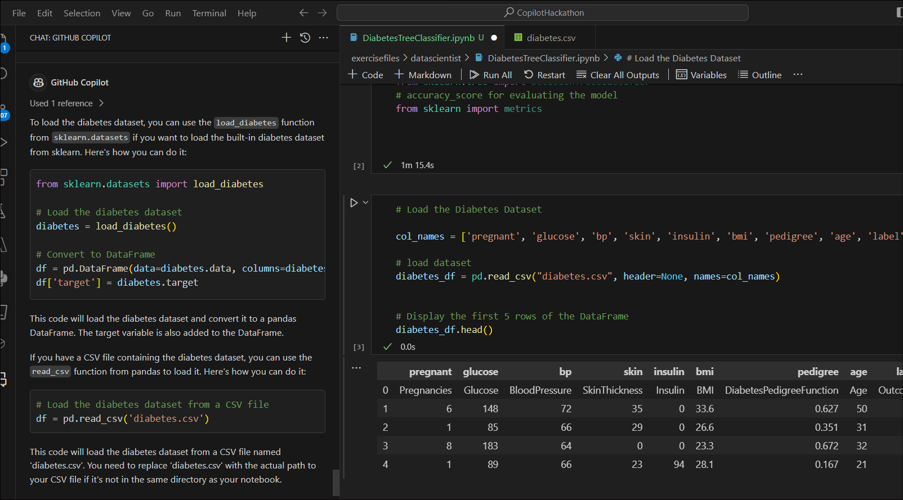

**タスク 4 : 探索的データ分析**

データフレームの行数と列数を表示します。各列のデータ型を表示します。各列の欠損値の数を表示します。各列の一意の値の数を表示します。各列の基本統計を表示します。

1.  新しいコードカーネルを開き、「Open a new Code kernel and
    type「#Display the first 5 rows of the
    dataframe」を入力します。Enter
    キーを押します。タブを押してコードを受け入れます。以下のコードを使用することもできます。

2.  \#Display the first 5 rows of the dataframe

diabetes_df.head()

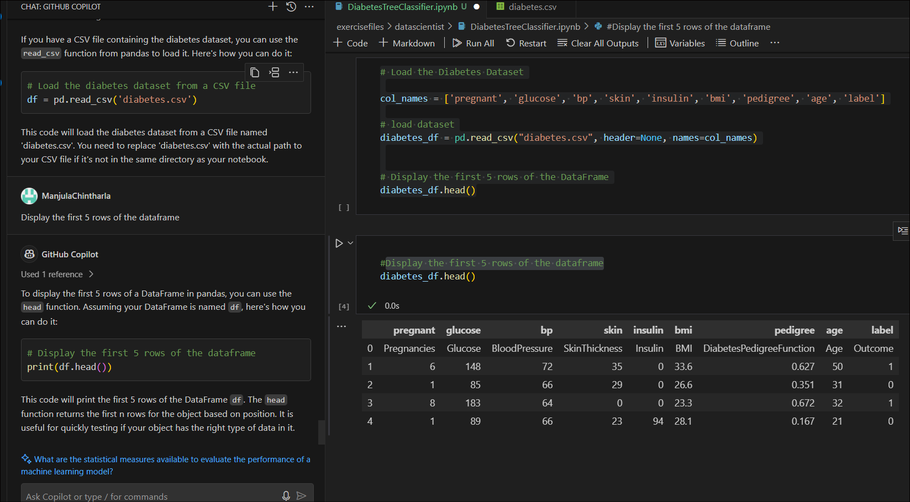

3.  新しいコードカーネルを開き、「#Display the data types of each
    column」を入力します。Enter
    キーを押します。タブを押してコードを受け入れます。

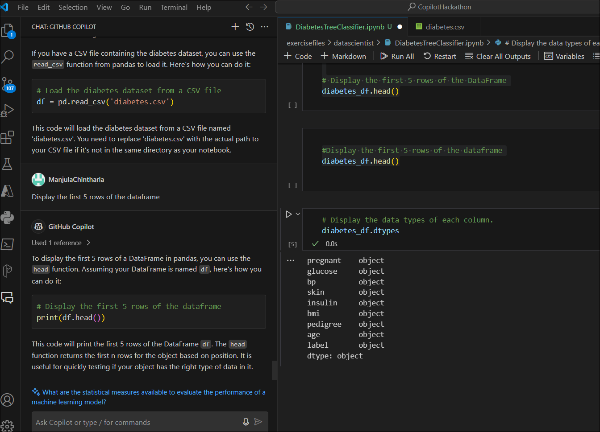

4.  新しいコードカーネルを開き、「#Display the number of missing values
    in each
    column」を入力しキーを押します。タブを押してコードを受け入れます。

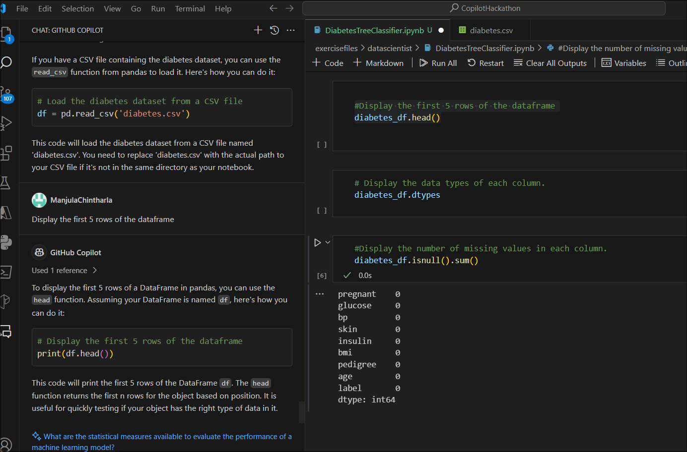

5.  新しいコードカーネルを開き、「#Display the number of unique values
    in each column」を押します。タブを押してコードを受け入れます。

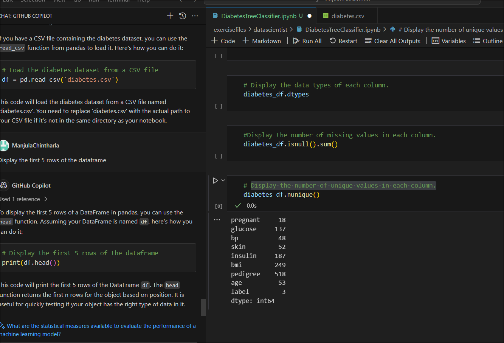

6.  新しいコードカーネルを開き、「#Display the summary statistics of the
    dataframe.」を入力します。Enter
    キーを押します。タブを押してコードを受け入れます。

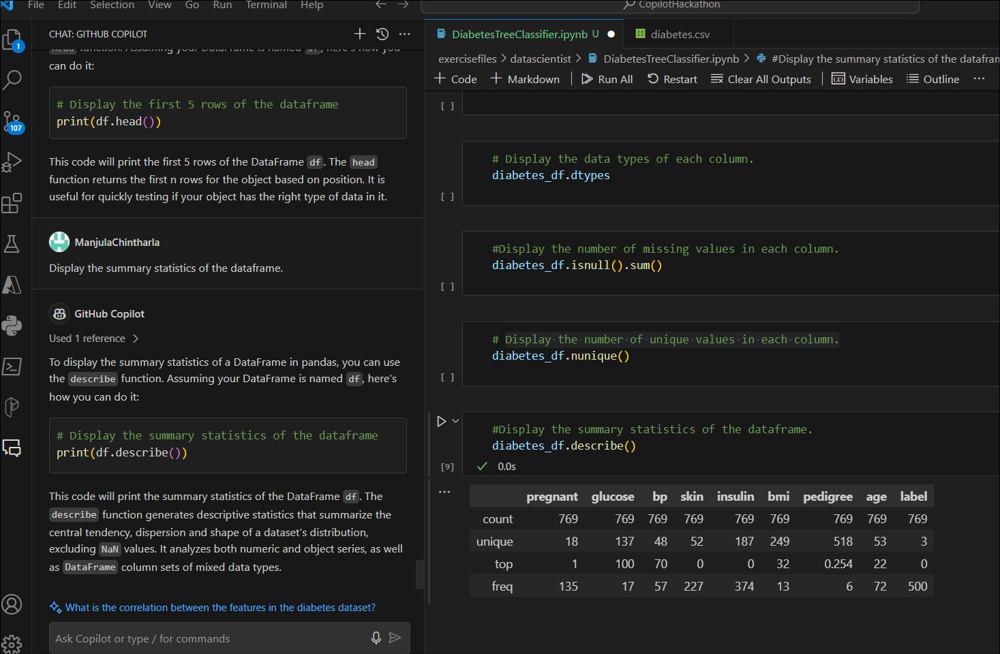

**タスク5 : 機能の選択**

1.  予測に使用する特徴量を選択します。すべてのフィーチャーまたはフィーチャーのサブセットを使用できます。

2.  新しいコードカーネルを開き、「# Split the data into features and
    target variables」と入力します。Enter
    キーを押します。タブを押してコードを受け入れます。Copilot
    チャットに説明を求めることができます。以下のコードを使用して実行することもできます。

3.  \#split dataset in features and target variable

4.  feature_cols = \['pregnant', 'insulin', 'bmi',
    'age','glucose','bp','pedigree'\]

5.  X = diabetes_df\[feature_cols\] \# Features

y = diabetes_df.label \# Target variable

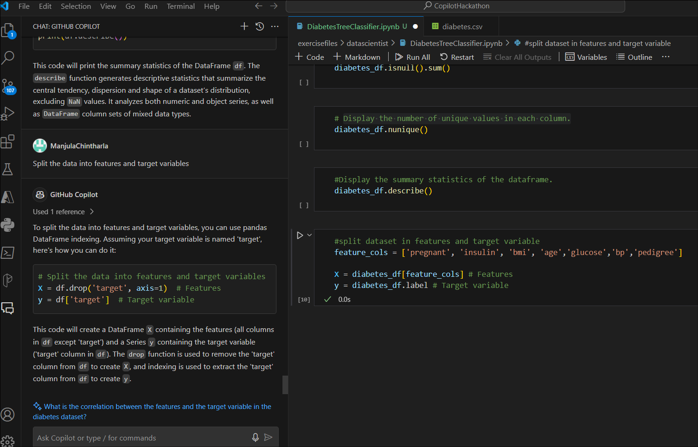

6.  データをトレーニングセットとテストセットに分割します。トレーニング
    セットはモデルのトレーニングに使用され、テスト
    セットはモデルの評価に使用されます。

7.  新しいコードカーネルを開き、「# Split the data into training and
    testing
    sets」と入力します。タブを押してコードを受け入れます。Copilot
    チャットに説明を求めることができます。以下のコードを使用して実行することもできます。

8.  \# Split dataset into training set and test set

X_train, X_test, y_train, y_test = train_test_split(X, y, test_size=0.3,
random_state=1) \# 70% training and 30% test

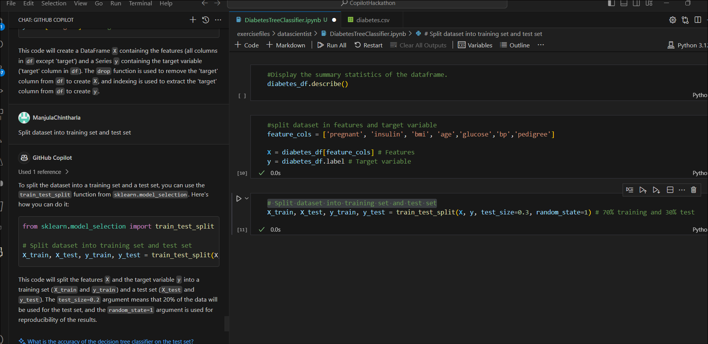

**タスク6 : デシジョン・ツリー・モデルの構築**

1.  トレーニングセットを使用してデシジョンツリーモデルを構築します。

2.  新しいコードカーネルを開き、「# Split the data into training and
    testing
    sets」と入力します。Enterキーを押します。タブを押してコードを受け入れます。Copilot
    チャットに説明を求めることができます。以下のコードを使用して実行することもできます。

3.  \# Building Decision Tree Model

4.  \# Create Decision Tree classifer object

5.  clf = DecisionTreeClassifier()

6.  \# Train Decision Tree Classifer

7.  clf = clf.fit(X_train,y_train)

8.  \#Predict the response for test dataset

y_pred = clf.predict(X_test)

9.  ValueErrorが表示されます。Github Copilot
    に問題の修正を依頼してください。Copilot
    チャットの指示に従って問題を解決します。

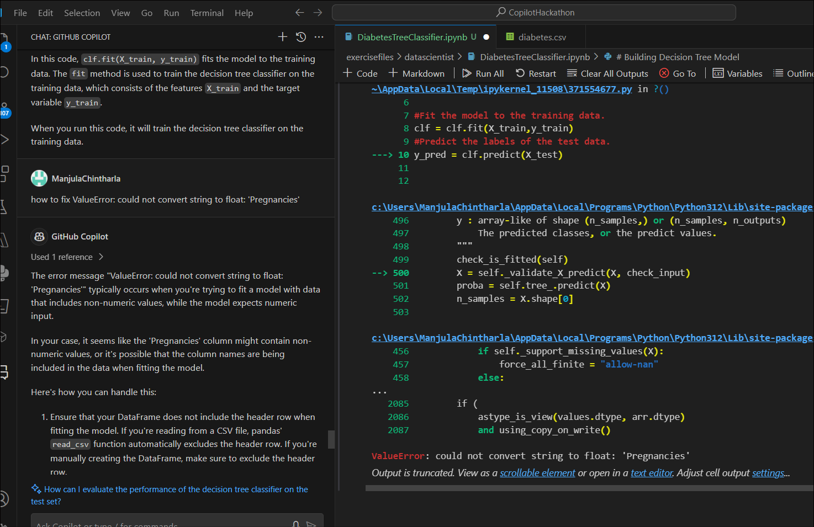

10. 新しいコードカーネルを開き、「# Model Accuracy, how number is the
    classifier correct?」と入力します。Enter
    キーを押します。タブを押してコードを受け入れます。Copilot
    チャットに説明を求めることができます。以下のコードを使用して実行することもできます。

11. \# Evaluating Model

12. \# Model Accuracy, how often is the classifier correct?

print("Accuracy:",metrics.accuracy_score(y_test, y_pred))

13. Evaluate the model using the testing set.

14. \# Evaluating Model

15. \# Model Accuracy, how often is the classifier correct?

print("Accuracy:",metrics.accuracy_score(y_test, y_pred))
