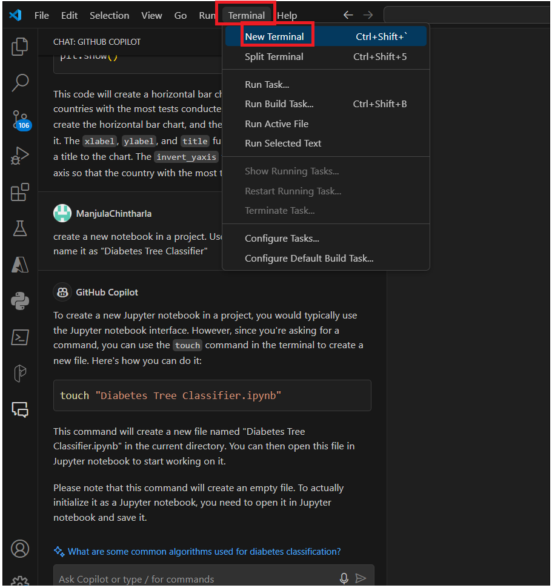
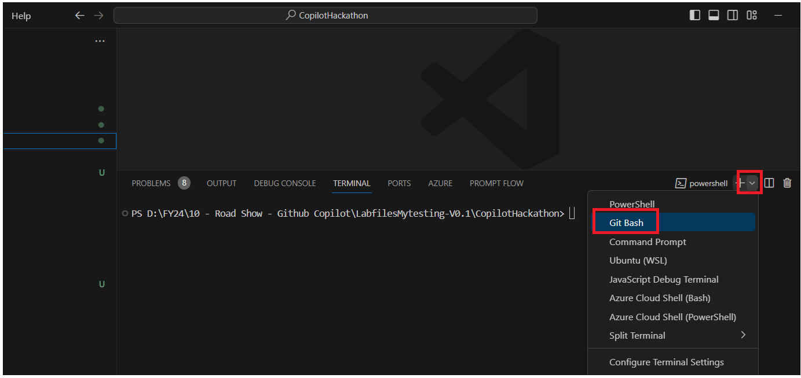
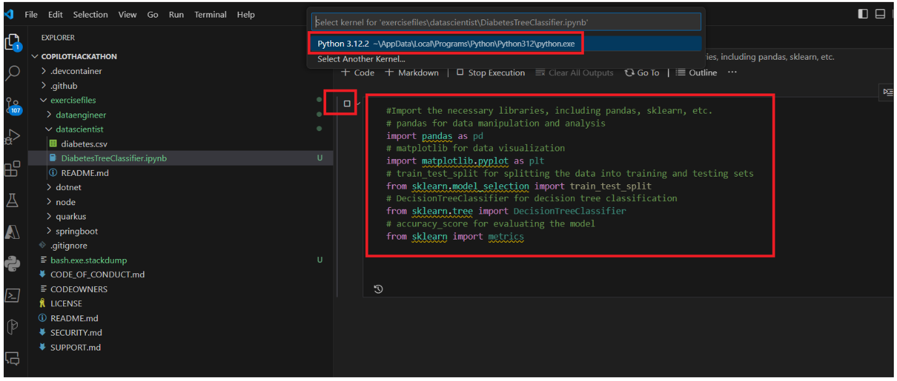

**Laboratoire 23 - Création d'un classifieur d'arbre de décision basé
sur Scikit-learn et Python à l'aide de Github Copilot Chat**

**INTRODUCTION**

diabetes.csv est originaire de l'Institut National du Diabète et du
Digestif et du Rein

Maladies. L'objectif de l'ensemble de données est de prédire
diagnostiquement si un patient est atteint de diabète,

sur la base de certaines mesures diagnostiques incluses dans l'ensemble
de données. Plusieurs contraintes ont été imposées

sur la sélection de ces instances à partir d'une base de données plus
large. En particulier, tous les patients ici sont des femmes

âgé d'au moins 21 ans et d'origine indienne Pima.2

À partir de diabetes.csv vous pouvez trouver plusieurs variables,
certaines d'entre elles sont indépendantes

(plusieurs variables prédictives médicales) et une seule variable
dépendante de la cible (résultat).

**Tâche 1 : INSTRUCTIONS pour créer un notebook à l'aide de Github
Copilot Chat**

1.  À partir de **Explorer in Visual Studio code**, développez
    **datascientist**.

2.  Cliquez sur l'icône **Copilot** dans le coin droit et sélectionnez
    **Github Copilot Chat.**

3.  Tapez votre invite à créer un bloc-notes dans un projet. Utilisez la
    commande /newnotebook et nommez-le « Diabetes Tree Classifier »

4.  Cliquez sur **Terminal -\> New terminal** à partir de la barre
    d'outils, comme indiqué dans l'image ci-dessous.

5.  Sélectionnez **Gitbash** dans le terminal et exécutez la commande
    suggérée par Copilot dans le répertoire **datascientist**.

cd \exercisefiles\datascientist

touch "DiabetesTreeClassifier.ipynb"

6.  Vous devriez voir que le fichier a été créé dans le **dossier
    datascientist**.

7.  Sélectionnez le bloc-notes nouvellement créé pour développer
    l'exercice.

8.  Utilisez Copilot et Copilot Chat pour développer l'exercice et
    soutenir votre apprentissage.

**EXERCICE**

L'objectif de ce projet est de construire un classificateur d'arbre de
décision basé sur Scikit-learn et Python. Le classificateur doit être
capable de prédire si un patient est diabétique ou non en fonction de

certaines mesures diagnostiques incluses dans l'ensemble de données.

**Tâche 2 : Importer les bibliothèques requises pour construire un
classificateur d'arbre de décision**

1.  Cliquez sur Notebook kernel et tapez \# Importez les bibliothèques
    nécessaires, y compris pandas, sklearn, etc. et appuyez sur Entrée
    et appuyez sur tab pour accepter le code

2.  Appuyez sur la touche d'arrêt. Il vous emmènera jusqu'au bout de la
    ligne. Appuyez sur Entrée, puis appuyez à nouveau sur Tab pour
    ajouter toutes les bibliothèques.

3.  \# pandas pour la manipulation et l'analyse des données

4.  \# matplotlib pour la visualisation de données

5.  \# train_test_split pour diviser les données en ensembles
    d'entraînement et de test

6.  \# DecisionTreeClassifier pour la classification de l'arbre de
    décision

\# accuracy_score pour évaluer le modèle

7.  Exécutez le code, il vous demandera de sélectionner l'environnement
    Python, de le sélectionner et de l'exécuter

8.  Attendez que toutes les bibliothèques soient importées.

**Tâche 3 : Chargement du jeu de données**

1.  Ouvrez le **fichier diabetes.csv** et observez les noms des
    colonnes.

2.  Chargez l'ensemble de données sur le diabète à l'aide de pandas ou à
    partir d'ensembles de données sklearn. Ouvrez le nouveau noyau de
    code et tapez \# Chargez l'ensemble de données sur le diabète à
    l'aide de pandas ou à partir d'ensembles de données sklearn Et
    appuyez sur tab pour accepter le code

3.  Ouvrez le chat Github Copilot et demandez à charger l'ensemble de
    données sur le diabète à l'aide de pandas ou à partir d'ensembles de
    données sklearn. . Il vous donne le code Chargez le jeu de données
    sur le diabète à l'aide de pandas ou à partir de jeux de données
    sklearn

4.  Cliquez sur +code pour ouvrir un nouveau noyau, copiez le code
    suggéré par Copilot et lancez-vous. Vous pouvez également utiliser
    le code ci-dessous pour charger des données.

5.  \# Load the Diabetes Dataset

6.  col_names = \['pregnant', 'glucose', 'bp', 'skin', 'insulin', 'bmi',
    'pedigree', 'age', 'label'\]

7.  \# load dataset

8.  diabetes_df = pd.read_csv("diabetes.csv", header=None,
    names=col_names)

\# Display the first 5 rows of the DataFrame 

**Tâche 4 : Analyse exploratoire des données**

Affichez le nombre de lignes et de colonnes dans le dataframe. Affichez
les types de données de chaque colonne. Affichez le nombre de valeurs
manquantes dans chaque colonne. Affichez le nombre de valeurs uniques
dans chaque colonne. Affichez les statistiques de base de chaque
colonne.

1.  Ouvrez un nouveau noyau de code et tapez \#Display les 5 premières
    lignes de la trame de données Appuyez sur Entrée. Appuyez sur la
    touche de tabulation pour accepter le code. Vous pouvez également
    utiliser le code ci-dessous.

2.  \#Display les 5 premières lignes de la trame de données

diabetes_df.head()

3.  Ouvrez un nouveau noyau de code et tapez \#Display les types de
    données de chaque colonne. Appuyez sur Entrée. Appuyez sur l'onglet
    pour accepter le code.

4.  Ouvrez un nouveau noyau de code et tapez \#Display le nombre de
    valeurs manquantes dans chaque colonne. Appuyez sur Entrée. Appuyez
    sur la touche pour accepter le code.

5.  Ouvrez un nouveau noyau de code et tapez \#Display le nombre de
    valeurs uniques dans chaque colonne Appuyez sur Entrée. Appuyez sur
    la touche de tabulation pour accepter le code.

6.  Ouvrez un nouveau noyau de code et tapez \#Display les statistiques
    récapitulatives de la trame de données. Appuyez sur Entrée. Appuyez
    sur l'onglet pour accepter le code.

**Tâche 5 : Sélection des fonctionnalités**

1.  Sélectionnez les fonctionnalités que vous souhaitez utiliser pour la
    prédiction. Vous pouvez utiliser toutes les fonctionnalités ou un
    sous-ensemble de fonctionnalités.

2.  Ouvrez un nouveau noyau de code et tapez \# Diviser les données en
    fonctionnalités et variables cibles. Appuyez sur Entrée. Appuyez sur
    l'onglet pour accepter le code. Vous pouvez demander une explication
    au chat Copilot. Vous pouvez également utiliser le code ci-dessous
    et l'exécuter.

3.  \#split dataset in features and target variable

4.  feature_cols = \['pregnant', 'insulin', 'bmi',
    'age','glucose','bp','pedigree'\]

5.  X = diabetes_df\[feature_cols\] \# Features

y = diabetes_df.label \# Target variable

6.  Divisez les données en ensembles d'entraînement et de test. Le jeu
    d'entraînement sera utilisé pour entraîner le modèle et le jeu de
    test sera utilisé pour évaluer le modèle.

7.  Ouvrez un nouveau noyau de code et tapez \# Diviser les données en
    ensembles d'entraînement et de test Appuyez sur Entrée. Appuyez sur
    l'onglet pour accepter le code. Vous pouvez demander une explication
    au chat Copilot. Vous pouvez également utiliser le code ci-dessous
    et l'exécuter.

8.  \# Diviser l'ensemble de données en ensemble d'entraînement et
    ensemble de test

X_train, X_test, y_train, y_test = train_test_split(X, y, test_size=0.3,
random_state=1) \# 70% training and 30% test

**Tâche 6 : Construire un modèle d'arbre de décision**

1.  Créez un modèle d'arbre de décision à l'aide de l'ensemble
    d'apprentissage.

2.  Ouvrez un nouveau code kernel et tapez \# Diviser les données en
    ensembles d'entraînement et de test Appuyez sur Entrée. Appuyez sur
    l'onglet pour accepter le code. Vous pouvez demander une explication
    au chat Copilot. Vous pouvez également utiliser le code ci-dessous
    et l'exécuter.

3.  \# Building Decision Tree Model

4.  \# Create Decision Tree classifer object

5.  clf = DecisionTreeClassifier()

6.  \# Train Decision Tree Classifer

7.  clf = clf.fit(X_train,y_train)

8.  \#Predict the response for test dataset

y_pred = clf.predict(X_test)

9.  Vous pouvez voir ValueError. Demandez à Github Copilot de résoudre
    le problème. Suivez les instructions de chat Copilot et corrigez le
    problème.

10. Ouvrez un nouveau noyau de code et tapez \# Model Accuracy, à quelle
    fréquence le classificateur est-il correct ? Appuyez sur Entrée.
    Appuyez sur l'onglet pour accepter le code. Vous pouvez demander une
    explication au chat Copilot. Vous pouvez également utiliser le code
    ci-dessous et l'exécuter.

11. \# Evaluating Model

12. \# Model Accuracy, how often is the classifier correct?

print("Accuracy:",metrics.accuracy_score(y_test, y_pred))

13. Evaluate the model using the testing set.

14. \# Evaluating Model

15. \# Model Accuracy, how often is the classifier correct?

print("Accuracy:",metrics.accuracy_score(y_test, y_pred))
