**실습 23 - Github Copilot Chat을 사용하여 Scikit-learn 및 Python을
기반으로 의사 결정 트리 분류기 빌드하기**

**소개**

diabetes.csv 원래 국립 당뇨병 및 소화기 및 신장 연구소에서 왔습니다

질병. 데이터 세트의 목적은 환자가 당뇨병에 걸렸는지 여부를 진단적으로
예측하는 것입니다.

데이터 세트에 포함된 특정 진단 측정을 기반으로 합니다. 몇 가지 제약
조건이 적용되었습니다

더 큰 데이터베이스에서 이러한 인스턴스를 선택하는 경우. 특히 이곳의
환자는 모두 여성입니다

21세 이상의 피마 인디언 유산 2.

diabetes.csv에서 여러 변수를 찾을 수 있으며 그 중 일부는 독립적입니다

(여러 의학적 예측 변수) 및 하나의 목표 종속 변수(결과)만 있습니다.

**작업 1 : Github Copilot Chat을 사용하여 노트북을 생성하는 지침**

1.  **Explorer in Visual Studio code**에서 **datascientist**를
    확장하세요.

2.  오른쪽 아래 모서리에 있는 **Copilot** 아이콘을 클릭하고 **Github
    Copilot Chat**을 선택하세요**.**

3.  프로젝트에 새 Notebook 생성하고 프롬프트를 입력하세요. /newnotebook
    명령을 사용하고 이름을 "Diabetes Tree Classifier"로 지정하세요.

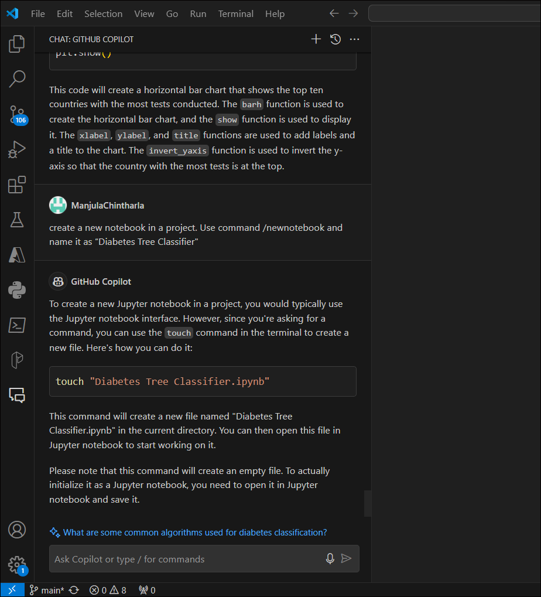

4.  아래 이미지와 같이 도구 모음에서 **Terminal -\> New Terminal**을
    클릭하세요.

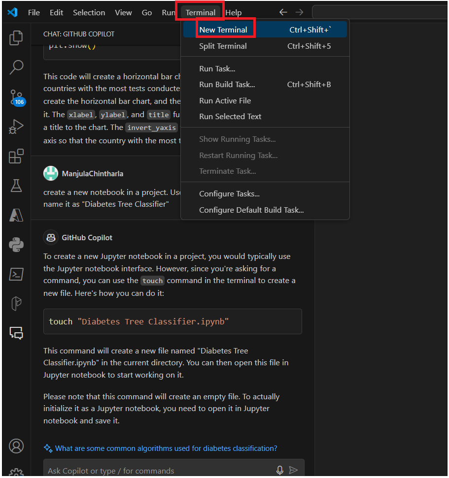

5.  터미널에서 **Gitbash**를 선택하고 Copilot이
    **datascientist** 디렉터리에서 제안한 명령을 실행하세요.

cd \exercisefiles\datascientist

touch "DiabetesTreeClassifier.ipynb"

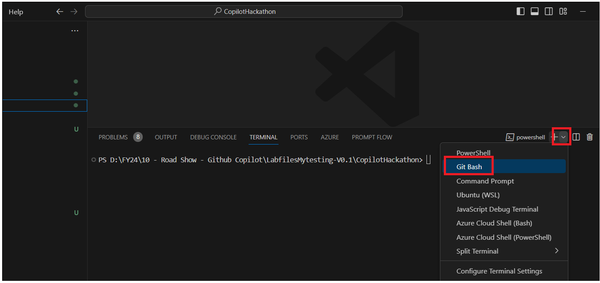

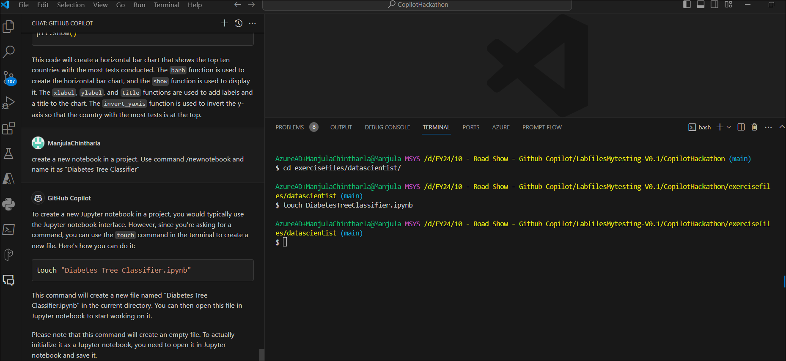

6.  **datascientist** 폴더 아래에 파일이 생성된 것을 볼 수 있습니다.

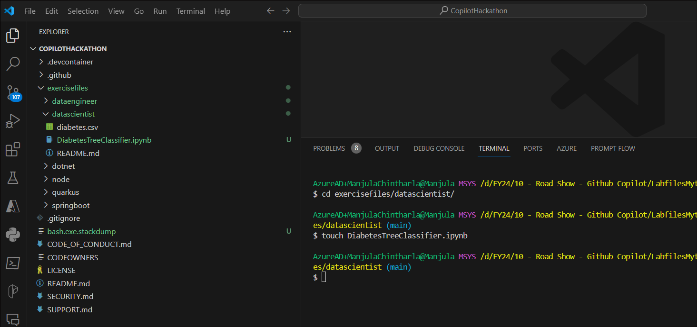

7.  새로 생성한 notebook을 선택하여 연습을 개발하세요.

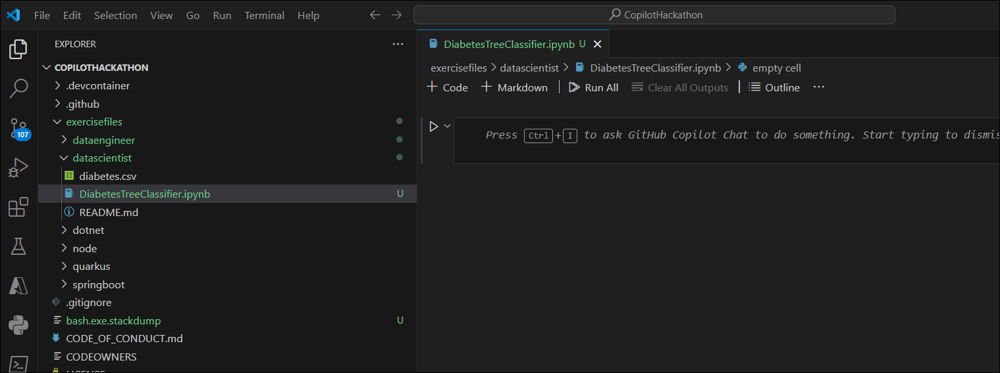

8.  연습을 개발하고 학습을 지원하려면 Copilot 및 Copilot Chat을
    사용하세요.

**연습**

이 프로젝트의 목적은 Scikit-learn과 Python을 기반으로 의사 결정 트리
분류기를 구축하는 것입니다. 분류기는 다음을 기반으로 환자가 당뇨병에
걸렸는지 여부를 예측할 수 있어야 합니다.

데이터 세트에 포함된 특정 진단 측정합니다.

**작업 2 : 의사결정 트리 분류자를 빌드하는 데 필요한 라이브러리
가져오기**

1.  Notebook kernel을 클릭하고 \# pandas, sklearn 등을 포함한 필요한
    라이브러리 가져오기를 입력하고 Enter 키를 누른 후 Tab 키를 눌러
    코드를 수락하세요.

2.  탭 키를 누르세요. 줄 끝까지 데려다 줄 것입니다. Enter 키를 누르고
    다시 Tab 키를 눌러 모든 라이브러리를 추가하세요.

3.  \# pandas for data manipulation and analysis

4.  \# matplotlib for data visualization

5.  \# train_test_split for splitting the data into training and testing
    sets

6.  \# DecisionTreeClassifier for decision tree classification

\# accuracy_score for evaluating the model

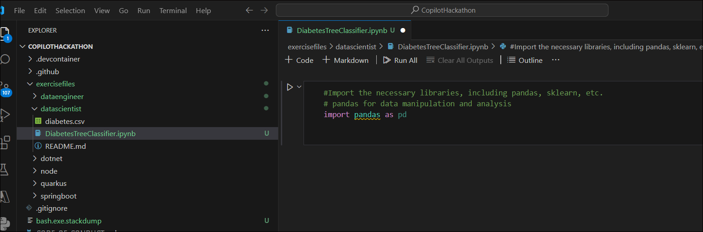

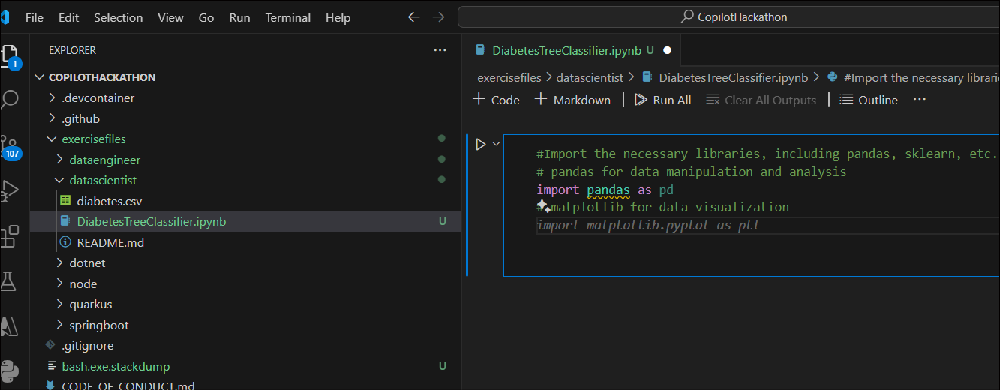

7.  코드를 실행하면 Python 환경을 선택하고 선택하고 실행하라는 메시지가
    표시됩니다.

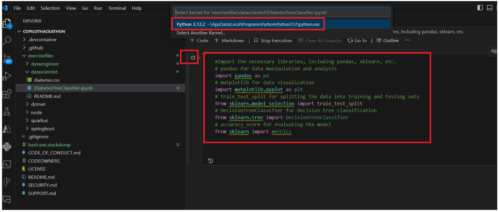

8.  모든 라이브러리를 가져올 때까지 기다리세요.

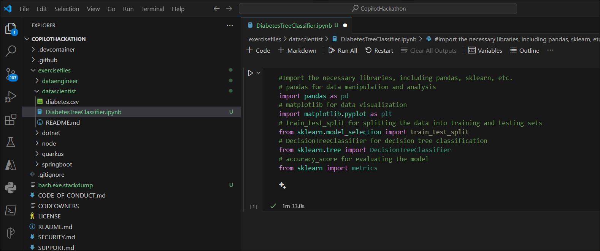

**작업 3 : 데이터세트 로드하기**

1.  열 이름을 관찰하려면 **diabetes.csv** 파일을 여세요.

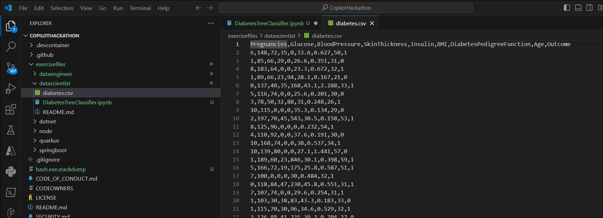

2.  pandas를 사용하거나 sklearn 데이터 세트에서 당뇨병 데이터 세트를
    로드합니다. 새 code kernel을 열고 \# pandas를 사용하여 또는 sklearn
    데이터 세트에서 당뇨병 데이터 세트 로드하고 탭을 눌러 코드를
    수락하세요.

3.  Github Copilot 채팅을 열고 pandas를 사용하거나 sklearn 데이터
    세트에서 당뇨병 데이터 세트를 로드하도록 요청하세요. pandas 또는
    sklearn 데이터 세트에서 당뇨병 데이터 세트로드 코드를 제공합니다.

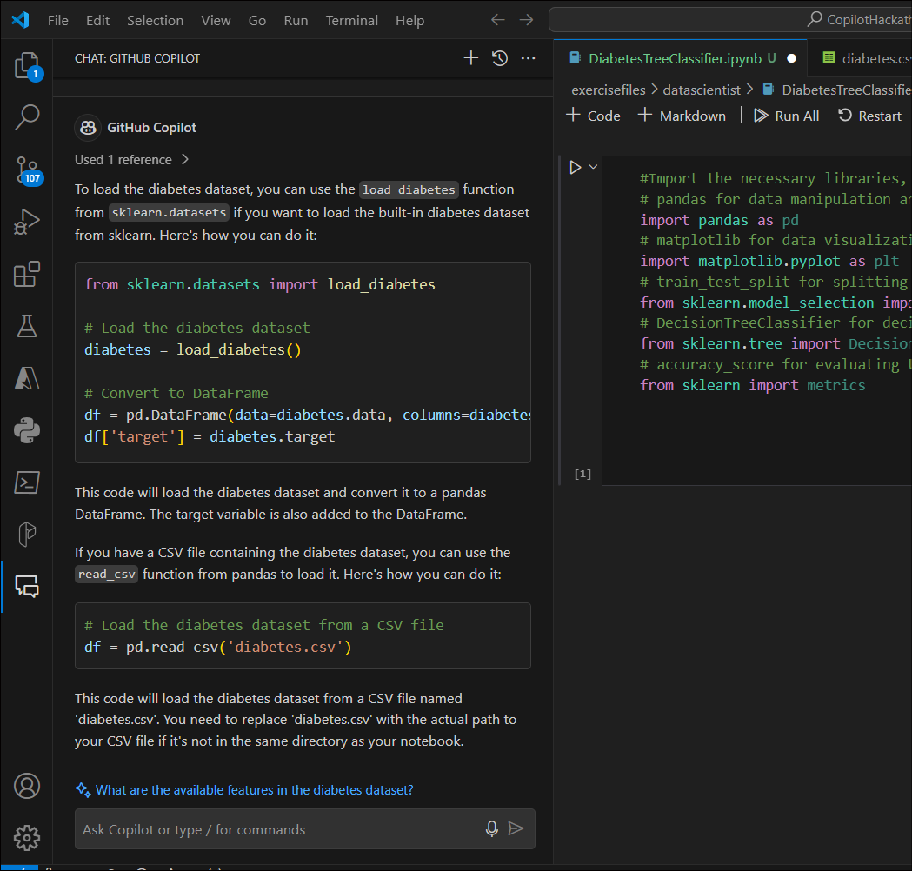

4.  +코드를 클릭하여 새 kernel을 열고 Copilot에서 제안한 코드를 복사한
    후 실행하세요. 아래 코드를 사용하여 데이터를 로드할 수도 있습니다.

5.  \# Load the Diabetes Dataset

6.  col_names = \['pregnant', 'glucose', 'bp', 'skin', 'insulin', 'bmi',
    'pedigree', 'age', 'label'\]

7.  \# load dataset

8.  diabetes_df = pd.read_csv("diabetes.csv", header=None,
    names=col_names)

\# Display the first 5 rows of the DataFrame

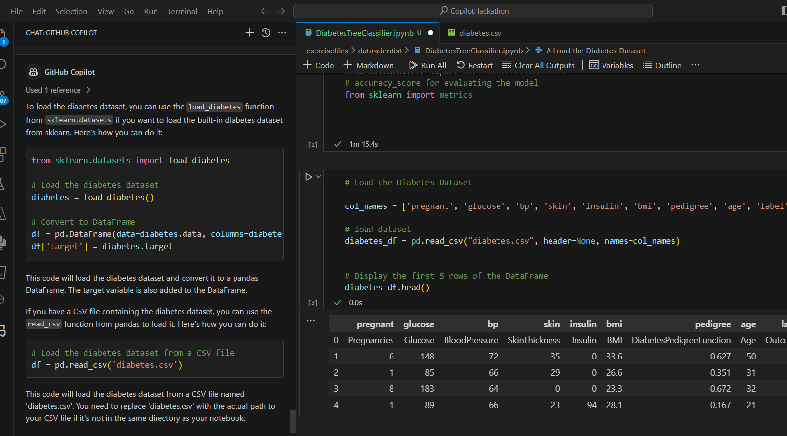

**작업 4 : 탐색적 데이터 분석**

데이터 프레임의 행과 열 수를 표시하세요. 각 열의 데이터 유형을
표시하세요. 각 열에 누락된 값의 수를 표시하세요. 각 열에 고유한 값의
수를 표시하세요. 각 열의 기본 통계를 표시하세요.

1.  새 code kernel을 열고 데이터 프레임의 처음 5개 행#Display
    입력하세요. Enter 키를 누르세요다. 탭을 눌러 코드를 수락하세요. 아래
    코드를 사용할 수도 있습니다.

2.  \#Display the first 5 rows of the dataframe

diabetes_df.head()

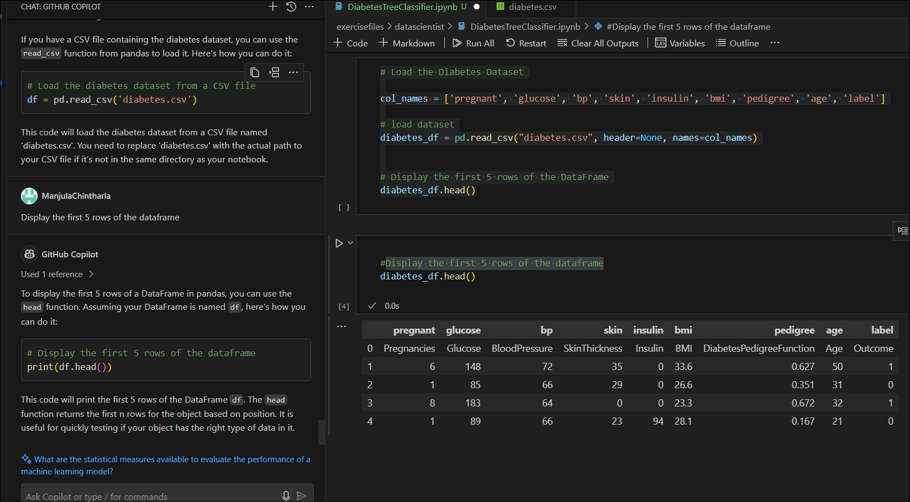

3.  새 code kernel을 열고 각 열의 데이터 유형을 \#Display
    입력하세요. Enter 키를 누르세요. 탭을 눌러 코드를 수락하세요.

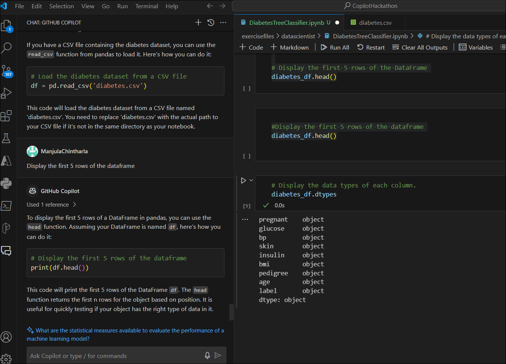

4.  새 code kernel을 열고 각 열에 누락된 값의 수를 입력#Display Enter
    키를 누르세요. 탭을 눌러 코드를 수락하세요.

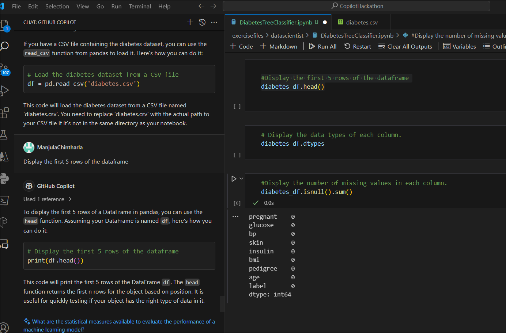

5.  새 code kernel을 열고 각 열에 고유한 값의 수를 입력#Display Enter
    키를 누르세요. 탭을 눌러 코드를 수락하세요.

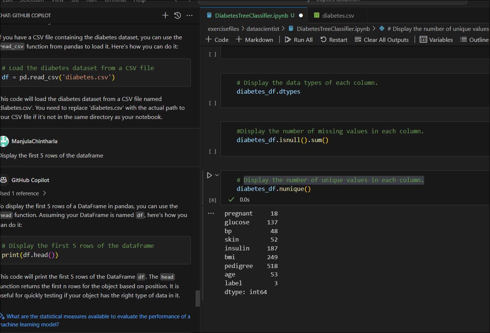

6.  새 code kernel을 열고 데이터 프레임의 요약 통계#Display
    입력하세요. Enter 키를 누르세요. 탭을 눌러 코드를 수락하세요.

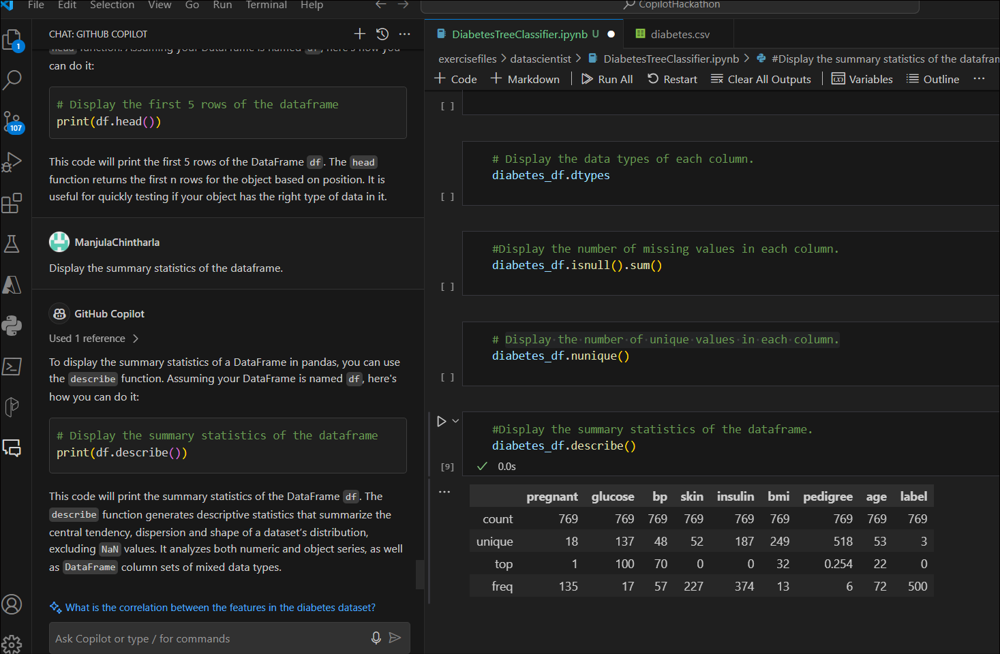**작업**
**5 : 기능 선택하기**

1.  예측에 사용할 기능을 선택하세요. 모든 기능 또는 기능의 하위 집합을
    사용할 수 있습니다.

2.  새 code kernel을 열고 \# Split the data into features and target
    variables를 입력하세요. Enter 키를 누르세요. 탭을 눌러 코드를
    수락하세요. Copilot 채팅에 설명을 요청할 수 있습니다. 아래 코드를
    사용하여 실행할 수도 있습니다.

3.  \#split dataset in features and target variable

4.  feature_cols = \['pregnant', 'insulin', 'bmi',
    'age','glucose','bp','pedigree'\]

5.  X = diabetes_df\[feature_cols\] \# Features

y = diabetes_df.label \# Target variable

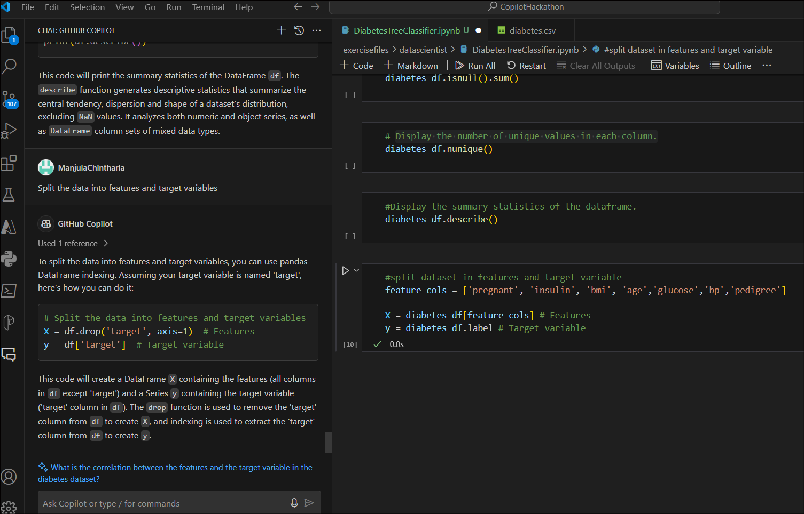

6.  데이터를 훈련 세트와 테스트 세트로 나누세요. 훈련 세트는 모델을
    훈련하는 데 사용되며 테스트 세트는 모델을 평가하는 데 사용됩니다.

7.  새 code kernel을 열고 \# Split the data into training and testing
    sets를 입력하고 Enter 키를 누르세요. 탭을 눌러 코드를 수락하세요.
    Copilot 채팅에 설명을 요청할 수 있습니다. 아래 코드를 사용하여
    실행할 수도 있습니다.

8.  \# Split dataset into training set and test set

X_train, X_test, y_train, y_test = train_test_split(X, y, test_size=0.3,
random_state=1) \# 70% training and 30% test

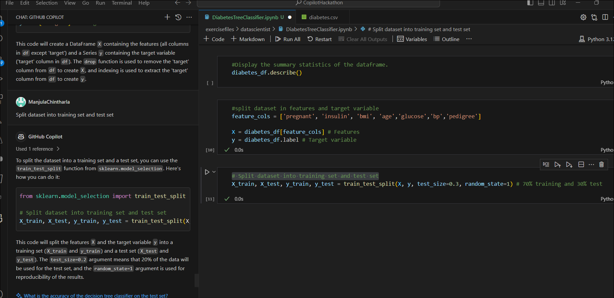

**작업 6 : 의사 결정 트리 모델 구축**

1.  훈련 집합을 사용하여 의사 결정 트리 모델을 빌드하세요.

2.  새 code kernel을 열고 \# Split the data into training and testing
    sets를 입력하고 Enter 키를 누르세요. 탭을 눌러 코드를 수락하세요.
    Copilot 채팅에 설명을 요청할 수 있습니다. 아래 코드를 사용하여
    실행할 수도 있습니다.

3.  \# Building Decision Tree Model

4.  \# Create Decision Tree classifer object

5.  clf = DecisionTreeClassifier()

6.  \# Train Decision Tree Classifer

7.  clf = clf.fit(X_train,y_train)

8.  \#Predict the response for test dataset

y_pred = clf.predict(X_test)

9.  ValueError를 볼 수 있습니다. Github Copilot에 문제 해결을
    요청하세요. Copilot 채팅 지침을 따르고 문제를 해결하세요.

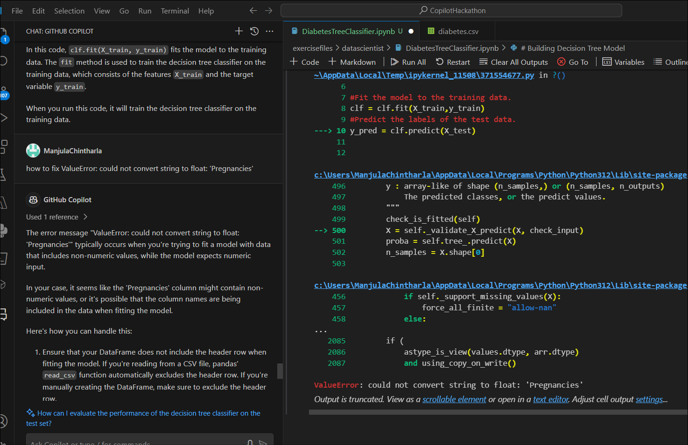

10. 새 code kernel을 열고 \# Model Accuracy, the classifier is how often
    correct 를 입력하세요. Enter 키를 누르세요. 탭을 눌러 코드를
    수락하세요. Copilot 채팅에 설명을 요청할 수 있습니다. 아래 코드를
    사용하여 실행할 수도 있습니다.

11. \# Evaluating Model

12. \# Model Accuracy, how often is the classifier correct?

print("Accuracy:",metrics.accuracy_score(y_test, y_pred))

13. Evaluate the model using the testing set.

14. \# Evaluating Model

15. \# Model Accuracy, how often is the classifier correct?

print("Accuracy:",metrics.accuracy_score(y_test, y_pred))
